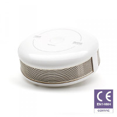
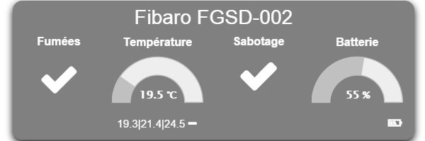
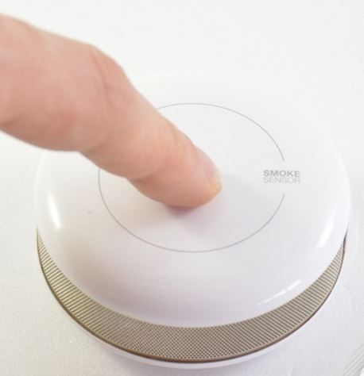
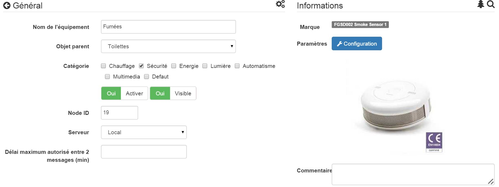
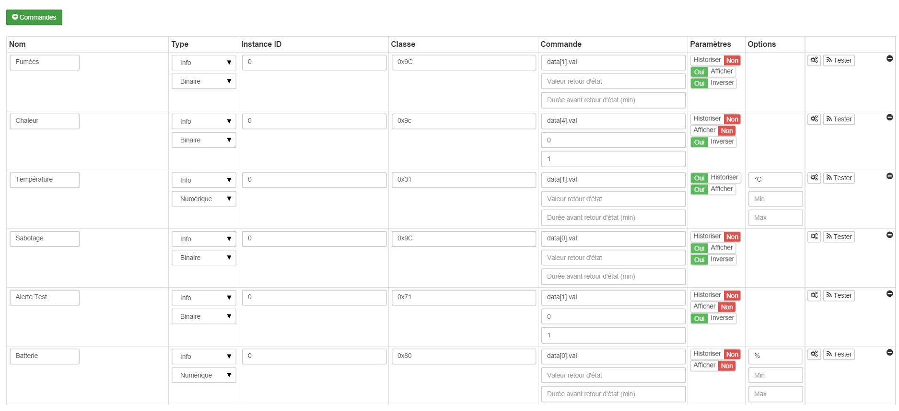
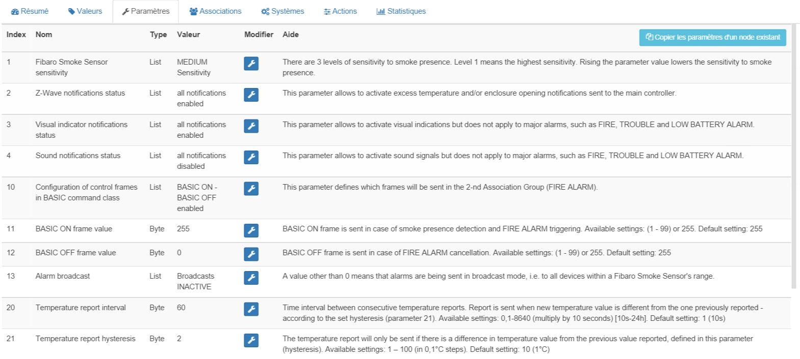
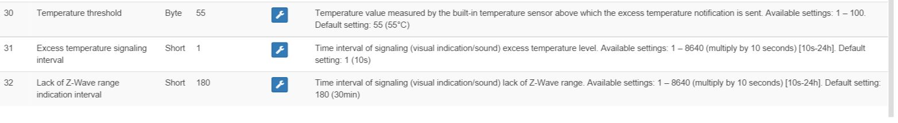
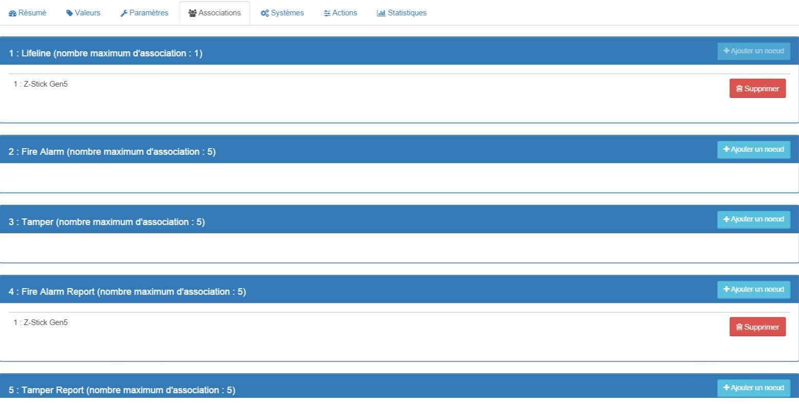

# Fibaro FGSD-002 "Smoke Sensor 2"

**The module**

**The Jeedom visual**

## Summary

With its smooth lines, polished surface, and compact size, this smoke detector will alert you to a threat with multi-color RGB LEDs and a built-in siren. The large grid format allows for the detection of even the smallest amount of smoke, enabling a rapid response. It will therefore easily find its place in your home to ensure the safety of the whole family.

The Fibaro FGSD-002 smoke detector is a standalone smoke alarm (DAAF) compliant with the EN 14604 standard:2005. Although autonomous, it is also communicative thanks to Z-Wave Plus technology.

Some materials burn without smoking. That's why Fibaro engineers decided to include additional protection in their smoke detector in the form of a temperature sensor. Even if the amount of smoke is insufficient to trigger the alarm, the device will still be able to detect a threat by sensing a rapid temperature change caused by the fire. A rapid change in temperature or an increase up to 54°C is enough for the smoke detector to detect a threat and alert the occupants of the house. Only this type of smoke detector offers high efficiency, regardless of what is burning.

## Fonctions

-   Z-Wave Smoke Detector
-   Battery powered
-   Adjustable sensor sensitivity (3 levels))
-   Protection against sabotage
-   Alarm signaled by sound, an LED light and a Z-Wave signal
-   Fire detection by measuring air temperature
-   Automatic efficiency test, performed every 5 seconds
-   Integrated Z-Wave network coverage tester
-   Compliant with EN 14604 standard:2005
-   Z-Wave Plus compatible
-   Very simple installation - just install it in a place where there is a risk of fire

## Technical specifications

-   Module type : Z-Wave Transmitter
-   Food : 3V CR123A Lithium Battery
-   Battery life : 3 years
-   Frequency : 868.42 MHz
-   Transmission distance : 50m open field, 30m indoors
-   Dimensions : 65 x 28 mm (diameter x height))
-   Operating temperature : 0-55°C
-   Operating humidity : 0% - 93%
-   Temperature measurement range : -20 to 100°C
-   Sensitivity to smoke : Level 1 - 1.20 +/- 0.5% obs/m; Level 2 - 1.80 +/- 0.5% obs/m; Level 3 - 2.80 +/- 0.5% obs/m
-   Noise level: 85 dB at 3m
-   Measurement accuracy : 0.5°C (within a range of 0 to 55°C))
-   Standards : EMC 2004/108/EC and R&TTE 199/5/WE
-   Certifications : EN 14604:2005

## Module data

-   Brand : Fibar Group
-   Name : Fibaro Smoke Sensor FGSD-002
-   Manufacturer ID : 271
-   Product Type : 3074
-   Product ID : 4098

## Configuration

To configure the OpenZwave plugin and learn how to include Jeedom, refer to this [documentation](https://doc.jeedom.com/en_US/plugins/automation%20protocol/openzwave/).

> **Important**
>
> To put this module into inclusion mode, press the central inclusion button 3 times, as per its printed documentation.

Once included, you should get this :

### Commandes

Once the module is recognized, the commands associated with the module will be available.

Here is the list of commands :

-   Smoke : This is the module's alert command (for smoke, heat, etc.))
-   Temperature : This is the temperature measurement control
-   Sabotage : This is the sabotage command. It signals the opening of the case
-   Test Alert : This is the command that will report that the module is in test mode
-   Heat alert : This is the control that will send a heat alert (not yet reliable))
-   Battery : This is the battery control

### Module configuration

> **Important**
>
> During the initial inclusion, always wake up the module immediately after inclusion.

Next, you need to configure the module according to your installation. To do this, you need to use the "Configuration" button in the Jeedom OpenZwave plugin.

You will arrive at this page (after clicking on the Settings tab))

Parameter details :

-   Wakeup : This is the module's wake-up interval (recommended value 21600))
-   1: allows you to adjust the sensitivity of the smoke detection
-   2: allows you to choose which notifications will be sent to Jeedom (tip) : toutes)
-   3: allows you to choose which notifications will be accompanied by a visual indicator
-   4: allows you to choose which notifications will be accompanied by a sound (in all cases, heat and fire detections will make the module sound))
-   10: Do not change this setting unless you know what you are doing
-   11: idem
-   12: idem
-   13: This allows you to notify other Z-Wave modules (disable it unless you know why you are enabling it))
-   20: duration between two temperature reports
-   21: temperature difference from which, even if the duration of the above is not reached, the temperature will be sent to Jeedom
-   30: Heat alarm trigger temperature
-   31: 
-   32: 

### Groupes

. :

## Good to know

### Specifics

## Wakeup

## Important note

> **Important**
>
> The module needs to be woken up : 
