# "

**The module**

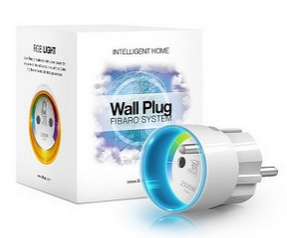

**The Jeedom visual**

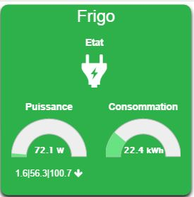

## Summary

. . . 

## Fonctions

-   .
-   .
-   : .
-   .

## Technical specifications

-   Module type : Z-Wave Receiver
-   Food : 
-   Electricity consumption : 
-   Maximum load : 
-   Frequency : 
-   Transmission distance : 50m open field, 30m indoors
-   Dimensions: 17 x 42 x 37 mm
-   Operating temperature : 0-40°C
-   Limit temperature : 105°C
-   Standards : )

## Module data

-   Brand : Fibar Group
-   Name : 
-   Manufacturer ID : 271
-   Product Type : 1536
-   Product ID : 4096

## Configuration

To configure the OpenZwave plugin and learn how to include Jeedom, refer to this [documentation](https://doc.jeedom.com/en_US/plugins/automation%20protocol/openzwave/).

> **Important**
>
> To put this module into inclusion mode, press the inclusion button 3 times, as per its printed documentation.

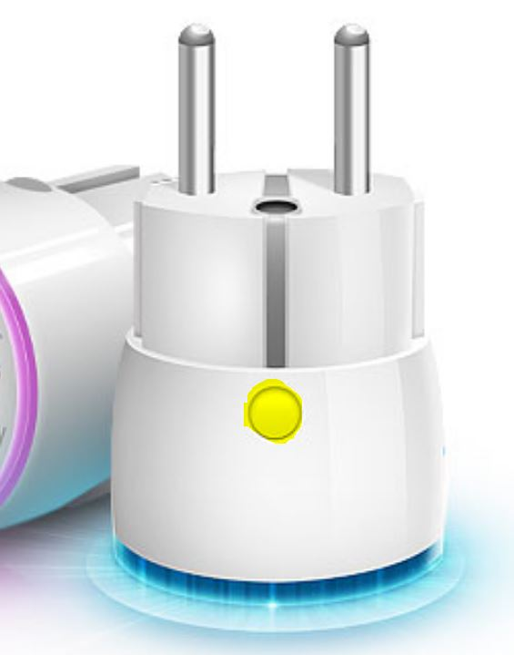

Once included, you should get this :

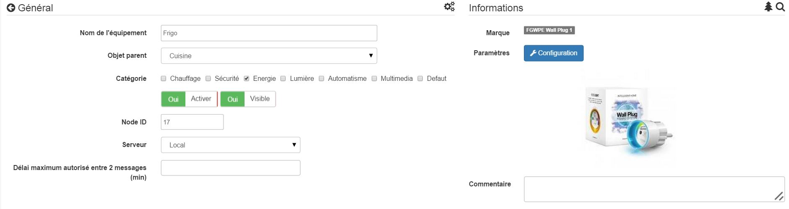

### Commandes

Once the module is recognized, the commands associated with the module will be available.

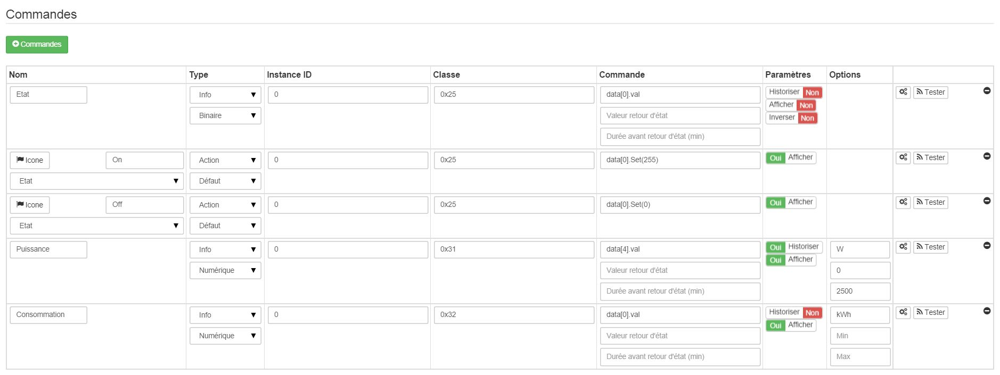

Here is the list of commands :

-   State : 
-   On : 
-   Off : 
-   Power : 
-    : 

.

### Module configuration

Next, if you want to configure the module according to your installation, you must use the "Configuration" button in the Jeedom OpenZwave plugin.

You will arrive at this page (after clicking on the settings tab))

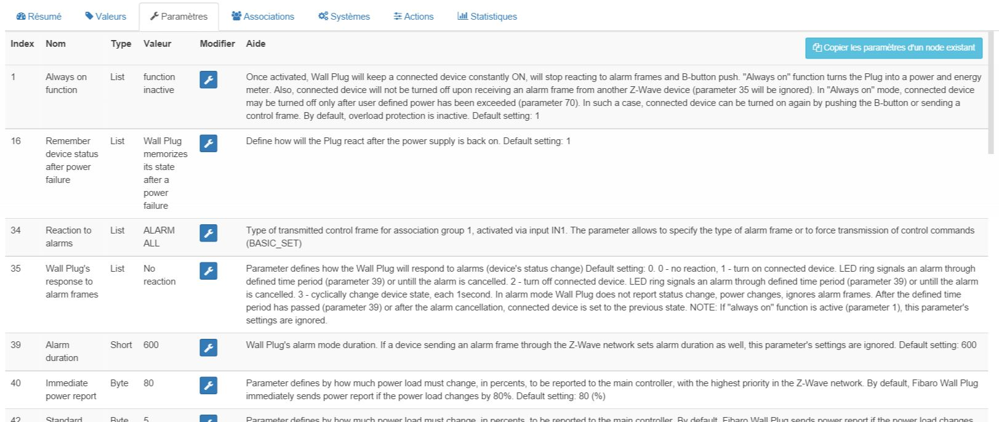

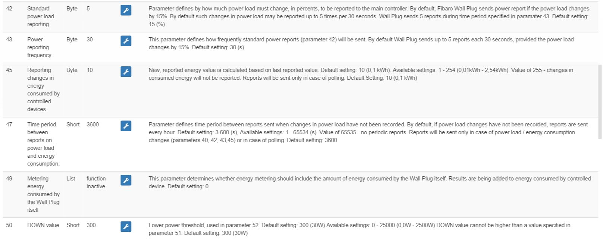

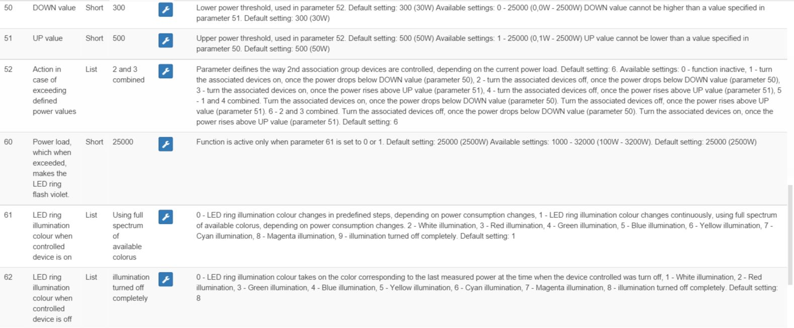

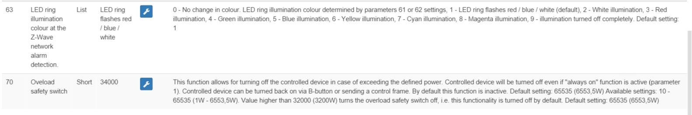

Parameter details :

-   1: 
-   16: 
-   34: 
-   35: 
-   39: 
-   40: )
-   42: )
-   43: 
-   45: )
-   47: 
-   49: 
-   50: 
-   51: 
-   52: 
-   60: 
-   61: 
-   62: 
-   63: 
-   70: )

### Groupes

This module has 3 association groups, only the third one is essential.

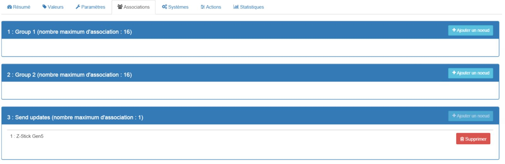

## Good to know

### Reset

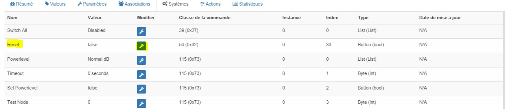

You can reset your consumption counter by clicking on this button available in the System tab. .

## Wakeup

There is no concept of wakeup on this module.
