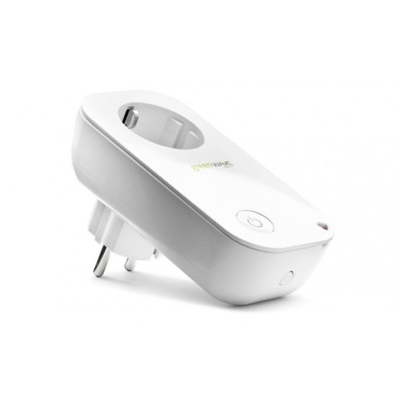
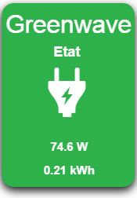
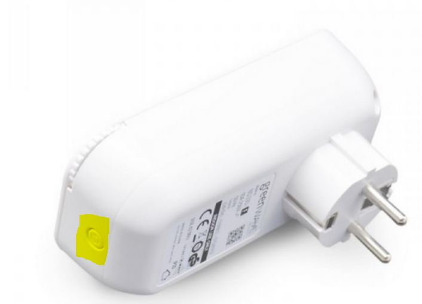
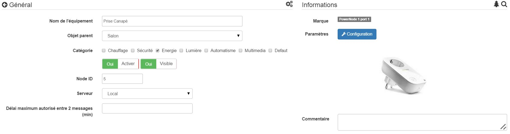
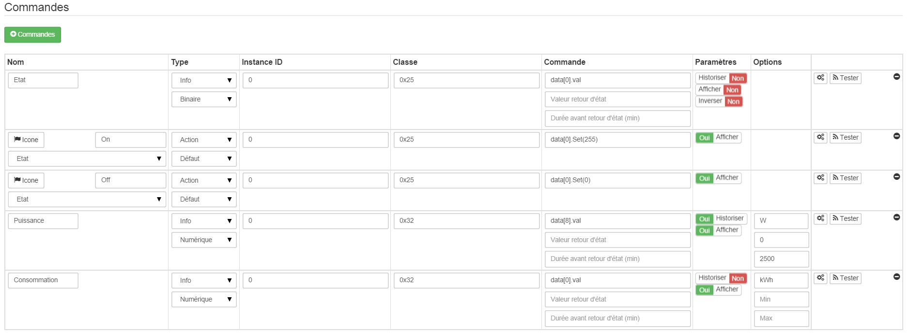
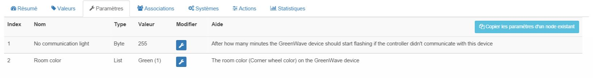
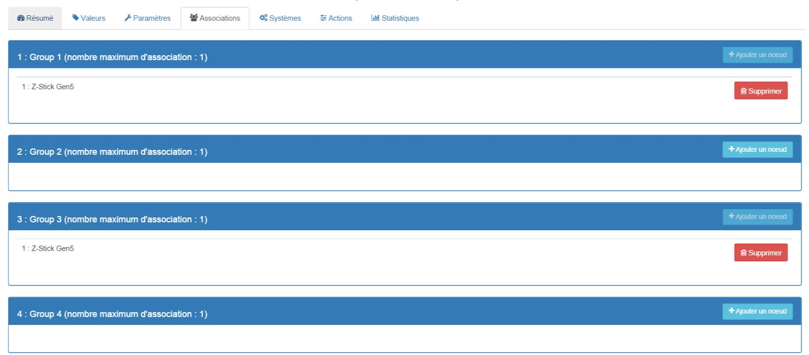
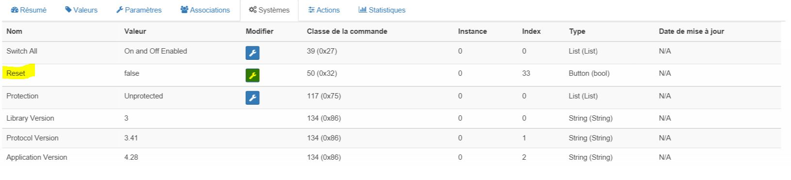

# 

**The module**

**The Jeedom visual**

## Summary

.

.

. .

.  ". . . .

 : .

. . .

## Fonctions

-   
-   
-   
-   
-   
-   
-   
-   

## Technical specifications

-   Food : 
-    : 10A
-    : )
-    : 
-    : 
-    : 
-    : )
-    : 
-    : 30m
-   Operating temperature : 
-    : -
-    : 
-   ) : IP20

## Module data

-   Brand : GreenWave
-   Name : ]
-   Manufacturer ID : 153
-   Product Type : 2
-   Product ID : 2

## Configuration

To configure the OpenZwave plugin and learn how to include Jeedom, refer to this [documentation](https://doc.jeedom.com/en_US/plugins/automation%20protocol/openzwave/).

> **Important**
>
> .

Once included, you should get this :

### Commandes

Once the module is recognized, the commands associated with the module will be available.

Here is the list of commands :

-   State : 
-   On : 
-   Off : 
-   Power : 
-    : 

.

### Module configuration

You can configure the module according to your installation. To do this, you need to use the "Configuration" button in the Jeedom OpenZwave plugin.

You will arrive at this page (after clicking on the Settings tab))

.

Parameter details :

-   1 :  : )
-   2 : )

### Groupes

.

## Good to know

.

### Reset

You can reset your consumption counter by clicking on this button available in the System tab. .

### Specifics

## Wakeup

There is no concept of wakeup on this module.
