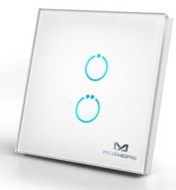
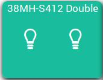
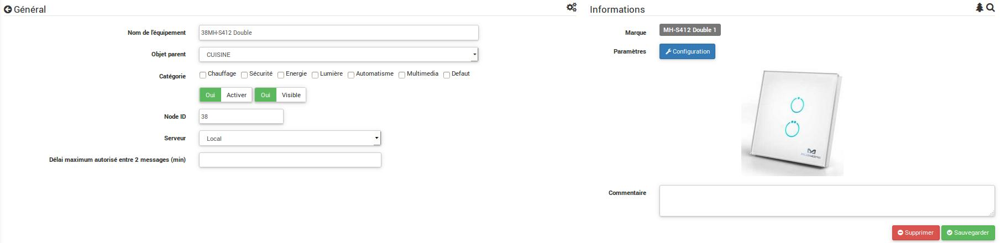
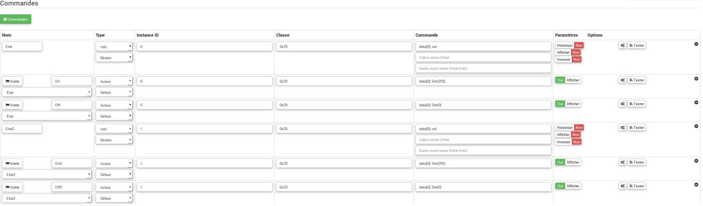
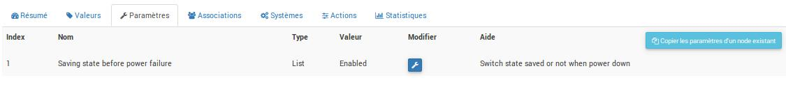
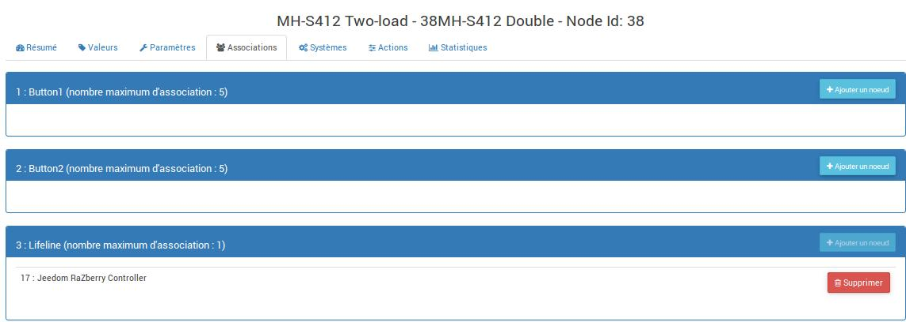

# 

**The module**

**The Jeedom visual**

## Summary

.

.

.

.

## Fonctions

-   
-   )
-   
-   )
-   
-   
-   
-   

## Technical specifications

-   Module type : Z-Wave Receiver
-   Color : Blanc
-   Food : 
-   Wiring : 3 wires, neutral required
-    : 
-   Frequency : 868.42 MHz
-    : 
-   Dimensions : 
-   Affichage: 

## Module data

-   Brand : 
-   Name : 
-   Manufacturer ID : 351
-   Product Type : 16642
-   Product ID : 514

## Configuration

To configure the OpenZwave plugin and learn how to include Jeedom, refer to this [documentation](https://doc.jeedom.com/en_US/plugins/automation%20protocol/openzwave/).

> **Important**
>
> .

Once included, you should get this :

### Commandes

Once the module is recognized, the commands associated with the module will be available.

Next, if you want to configure the module according to your installation, you must use the "Configuration" button in the Jeedom OpenZwave plugin.

You will arrive at this page (after clicking on the settings tab))

Parameter details :

-   1:  :  )

### Groupes

. .

## Good to know

### Specifics

- 
- 
- 
- )

## Wakeup

## .

.

.
