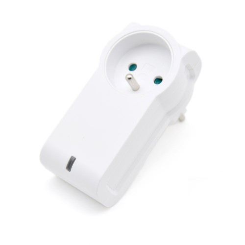
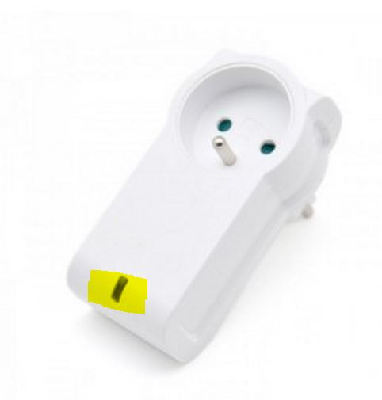

Nodon Smart Plug - Smartplug 
====================================

\

-   **The module**

\

\

-   **The Jeedom visual**

\

\

Summary 
------

\

The NodWe® remote-controlled socket can be controlled via a home automation system
Z-Wave® or Z-Wave Plus® compatible or directly via other
Z-Wave® or Z-Wave Plus® controllers such as the Soft Remote,
the wall switch or the Octan Remote NodWe®. German standard
(Schuko) or French (Type E), the plug can be connected in 2
sense, head up or head down. Associated with its fine design, these 2
features allow easy integration without clogging up
neighboring barrels on a power strip. Learning to take with sound
controller requires only a few seconds. A local button allows
turn the plug on or off directly.

\

Functions 
---------

\

-   Line current loss detection

-   Ergonomic: Possibility of plugging the head up / head plug
    Low

-   Intelligent alarm management

-   Improved radio range

-   Maximum amperage: 16A

\

Technical characteristics 
---------------------------

\

-   Food : 230V AC +/- 10% - 50Hz

-   Maximum power : 3000W continuous / 3500W cyclic
    (Resistive load) Intrinsic consumption : &lt;1W

-   Operating temperature : 0 ° C to 40 ° C - Altitude : 2000m

-   Z-Wave® radio protocol : 868.4MHz - 500 Series - Z-Wave compatible
    Plus® SDK 06.51.01

-   Scope: 40m indoor / 80m outdoor

-   Dimensions: 104 \ * 51 \ * 36mm

-   2 years warranty

-   EU type

\

Module data 
-----------------

\

-   Mark : Nodon

-   Name : Smartplug

-   Manufacturer ID : 357

-   Product Type : 1

-   Product ID : 1

\

Setup 
-------------

\

To configure the OpenZwave plugin and know how to put Jeedom in
inclusion refer to this
[documentation](https://jeedom.fr/doc/documentation/plugins/openzwave/en_US/openzwave.html).

\

> **IMPORTANT**
>
> To put this module in inclusion mode, press the button
> until the light turns red, according to its documentation
> paper.

\

\

Wece included you should get this :

\

\

### Commands 

\

Wece the module has been recognized, the commands associated with the module will be
available.

\

\

Here is the list of commands :

\

-   State : It is the command which allows to know the status of the
    socket (We / Off)

-   We : This is the command that turns on the outlet

-   Off : It is the command which makes it possible to extinguish the catch

-   Status : Used to find out whether the outlet is powered or not
    (Power failure / disconnection detection)

\

Note that on the dashboard, the status information, ON / OFF can be found on
the same icon.

\

### Setup of the module 

\

You can configure the module according to your
installation. This requires going through the "Setup" button of the
Jeedom Zwave plugin.

\

\

You will arrive on this page (after clicking on the tab
settings)

\

\

Parameter details :

\

-   1 : This parameter defines the state (ON / OFF) of the Smart Plug after a
    power failure or after connection

-   2 : This setting allows you to configure the reporting reports of
    power cut / return, as well as the associated groups (Groups
    4, 5, 6, 7, 8). Several combinations are possible (refer to
    paper documentation or help bubble in jeedom). It is
    recommended to set this parameter to 1.

-   3 : This parameter enables groups 2 and 3 to be activated or deactivated.

-   4 : Le paramètre force l'état de la Smart Plug à « ON » (Smart
    Plug activated). When the setting is enabled, it is not
    possible to switch off the Smart Plug (local or radio)

-   Parameters 5 to 20 : Through the configuration parameters \ # 5 to
    \ # 20, it is possible to configure up to 8 different alarms.
    In order to properly configure your alarms, the online form:
    www.nodon.fr/support/asp3/alarm will guide you

### Groups 

\

This module has 8 association groups.

\

\

-   Group 1 - Lifeline : This group is generally used for
    transfer information from the Smart Plug to the main controller
    of the network.

-   Group 2 - Monitoring the status of the Smart Plug When the Smart Plug
    is activated (respectively deactivated) via the local button,
    this sends an activation command
    (respectively deactivation) to the associated devices. Any
    command is not sent if the change of state of the Smart Plug has
    been caused by a radio command

-   Group 3 - Follow-up of the complementary status When the Smart Plug
    is activated (respectively deactivated) via the local button,
    this sends a deactivation command
    (respectively activation) to the associated devices. Any
    command is not sent if the change of state of the Smart Plug has
    been caused by a radio command.

-   Group 4 - Notification of power failure When the Smart Plug
    detects a power failure or a return of power, a report
    notification is sent to paired devices. The report sent
    est un « Notification Report : Power Management - AC disconnected
    / Re-connected).

-   Group 5 - Activation on power failure When the Smart Plug
    detects a power failure, it activates the associated devices.

-   Group 6 - Deactivation on power failure When the Smart
    Plug detects a power failure, it deactivates devices
    associates

-   Group 7 - Activation on current return When the Smart Plug
    detects a return of current, it activates the associated devices.

-   Group 8 - Deactivation on current return When the Smart Plug
    detects a return of current, it deactivates the associated devices

\

> **IMPORTANT**
>
> At a minimum Jeedom should be found in groups 1 and 4 \

Good to know 
------------

\

### Specificities 

\

-   There is no point in having fun plugging / unplugging the plug for
    observe the alarm. This will only work about 3 times. At
    beyond the socket must remain powered for a while to recharge
    the internal battery.

\

Wakeup 
------

\

No notion of wakeup on this module.

\

Faq. 
------

\

You should not have the option to download auto widgets
activated. You can retrieve the mobile and dashboard widgets on the
Market : alarm \ _back.

\

Have you set parameter 2 correctly? ? Do you have Jeedom well at least
in groups 1 and 4 ? Do you allow time for the battery to
load ?

\

**@sarakha63**
