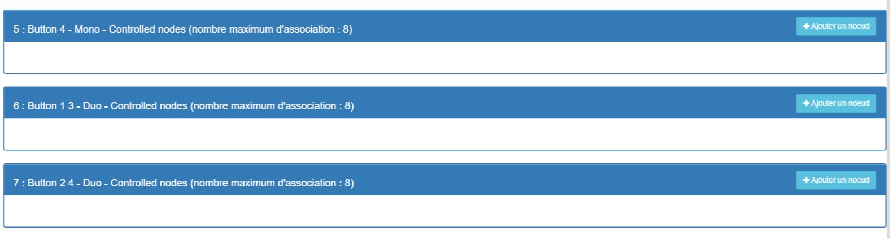

Nodon Switch - Wall Switch
================================

-   **The module**

-   **The Jeedom visual**

Summary
------

The NodOn® wall switch can directly control any
Z-Wave® or Z-Wave Plus® compatible device such as plug
NodOn® smart or trigger scenes via a central
compatible home automation.

The switch has a mounting plate for easy mounting
in the House: using the screws of a recessed pot, by
screwing to the wall, or simply by sticking it with adhesives
double-sided on the back of the plate.

Fonctions
---------

-   Control alone or with a home automation system

-   Easy to assemble and disassemble

-   Pleasant feeling of support

-   Wireless

-   2 years of battery

Technical characteristics
---------------------------

-   Food : CR2032 battery - Autonomy 1,5 - 2 years

-   4 buttons

-   Wall mounting by double-sided adhesive (included) or screws (not included)

-   Operating temperature : 0 ° C to 40 ° C

-   Altitude : 2000m

-   Z-Wave® radio protocol : 868.4MHz - 500 Series - Z-Wave compatible
    Plus® SDK 06.51.06

-   Scope : 40m indoors / 70m outdoors

-   Dimensions : 80 \*80 \*15mm

-   2 years warranty

-   EN 60950-1:2006 + A11:2009 + A1:2010 + A12:2011 + A2:2013

-   EN 300 220-2 V2.4.1

-   EN301 489-1 V1.9.2

-   EN301 489-3 V1.6.1

-   EN 62479:2010

Module data
-----------------

-   Mark : Nodon

-   Name : CWS-3-1-01 Wall Switch

-   Manufacturer ID : 357

-   Product Type : 2

-   Product ID : 3

Configuration
-------------

To configure the OpenZwave plugin and know how to put Jeedom in
inclusion refer to this
[Documentation](https://doc.jeedom.com/en_US/plugins/automation%20protocol/openzwave/).

> **IMPORTANT**
>
> To put this module in inclusion mode, press the two
> button (1 and 2) until the light turns pink then press
> button 1, according to its paper documentation.

Once included you should get this :

### Commandes

Once the module has been recognized, the commands associated with the modules will be
disponibles.

Here is the list of commands :

-   Buttons : it is the command which will push the button up

+ ---------------- + ---------------- + --------------- - + ---------------- + ---------------- +
| Buttons        | Support          | Long press     | Relaxation    | Double support   |
+ ================ + ================ + ================ = + ================ + ================= +
| **1**          | 10             | 12             | 11             | 13             |
+ ---------------- + ---------------- + --------------- - + ---------------- + ---------------- +
| **2**          | 20             | 22             | 21             | 23             |
+ ---------------- + ---------------- + --------------- - + ---------------- + ---------------- +
| **3**          | 30             | 32             | 31             | 33             |
+ ---------------- + ---------------- + --------------- - + ---------------- + ---------------- +
| **4**          | 40             | 42             | 41             | 43             |
+ ---------------- + ---------------- + --------------- - + ---------------- + ---------------- +

### Configuration of the module

> **IMPORTANT**
>
> During a first inclusion always wake up the module just after
> inclusion.

Then if you want to configure the module according to
of your installation, you have to go through the button
"Configuration "of Jeedom's OpenZwave plugin.

You will arrive on this page (after clicking on the tab
settings)

Parameter details :

-   1-2 : Allows you to choose the profile of the buttons when used in
    central (not necessary for use in Jeedom)

-   3 : Important parameter to say if the switch should work
    in Scene or Central Scene mode (Absolutely set Scene)

-   4-7 : Choose the button operating mode (in case
    group associations)

-   8 : Allows you to choose the operating mode of the LED

### Groupes

This module has 7 association groups.

-   Group 1 - Lifeline : This group is generally used for
    transfer information from the Smart Plug to the main controller
    of the network.

-   Group 2 to 5 - The devices in these groups are controlled by the
    corresponding button according to MONO profile

-   Group 6 to 7 - The devices in these groups are controlled by the
    corresponding button according to DUO profile

> **IMPORTANT**
>
> At least Jeedom should end up in group 1

Good to know
------------

### Specificities

-   This module can be finicky on inclusion. Do not hesitate to
    wake up 1 or 2 times after inclusion. And check the
    association group.

Wakeup
------

To wake up this module just press one of these buttons

Faq.
------

This module is a battery module, the new configuration will not be
take into account that if you wake up the remote control.

Important note
---------------

> **IMPORTANT**
>
> You have to wake up the module : after its inclusion, after a change
> of the configuration, after a change of wakeup, after a
> change of association groups

**@sarakha63**
