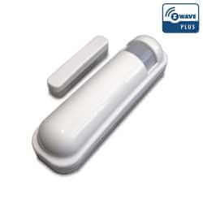
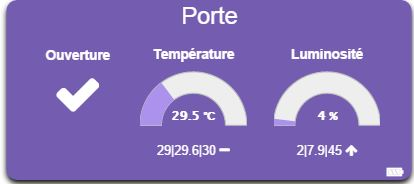
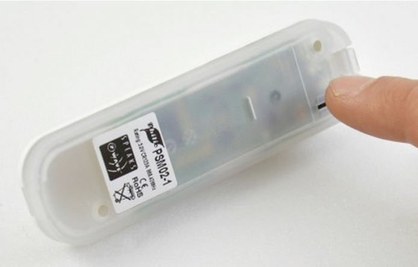
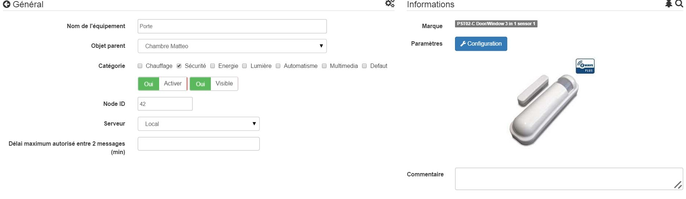
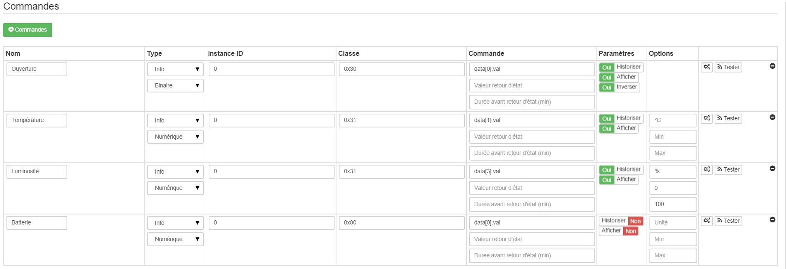
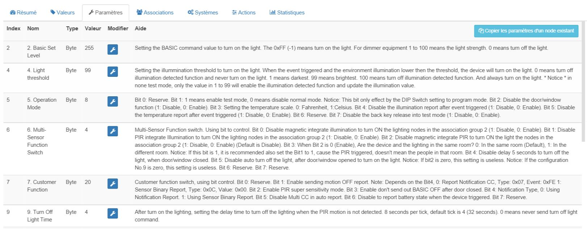
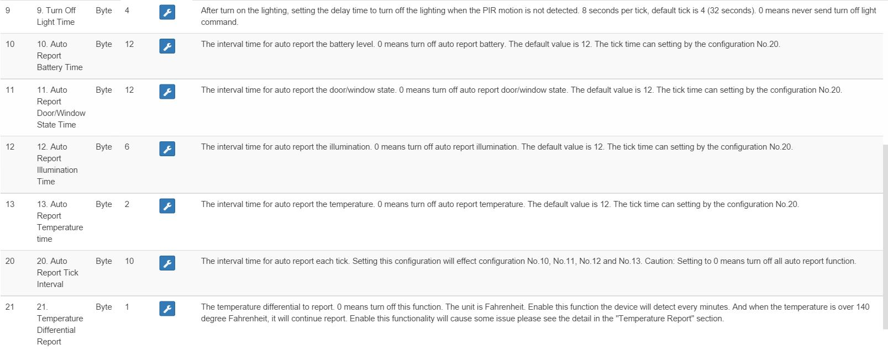
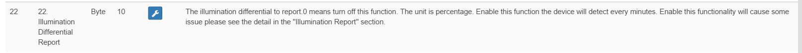

# 

**The module**

**The Jeedom visual**

## Summary

 : .  : . .

). . .

.

.

## Fonctions

-   : 
-   )
-   
-   
-   
-   
-   Autoprotection
-   
-   Small, discreet and aesthetically pleasing
-   Ease of use and installation

## Technical specifications

-   Module type : Z-Wave Transmitter
-   Food : 
-    : )
-   Frequency : 868.
-   Transmission distance : 
-    : -
-    : 
-   Dimensions :
  -    : 
  -    : 
-    : 52g
-   Operating temperature : -
-   Operating humidity : 
-    : 
-    : 

## Module data

-   Brand : 
-   Name : 
-   Manufacturer ID : 316
-   Product Type : 2
-   Product ID : 14

## Configuration

To configure the OpenZwave plugin and learn how to include Jeedom, refer to this [documentation](https://doc.jeedom.com/en_US/plugins/automation%20protocol/openzwave/).

> **Important**
>
> To put this module into inclusion mode, press the inclusion button 3 times, as per its printed documentation.

Once included, you should get this :

### Commandes

Once the module is recognized, the commands associated with the module will be available.

Here is the list of commands :

-    : 
-   Temperature : 
-    : 
-   Battery : This is the battery control

### Module configuration

> **Important**
>
> During the initial inclusion, always wake up the module immediately after inclusion.

Next, if you want to configure the module according to your installation, you must use the "Configuration" button in the Jeedom OpenZwave plugin.

You will arrive at this page (after clicking on the settings tab))

Parameter details :

-   2: 
-   4: 
-   5:  : 8
-   6:  : 4
-   7:  : )
-   9: 
-   10: )
-   11: )
-   12:  : 3
-   13:  : 2
-   20:  : 10
-   21: 
-   22:  : 10

### Groupes

.

## Wakeup

 :

-   

## Important note

> **Important**
>
> The module needs to be woken up : 
