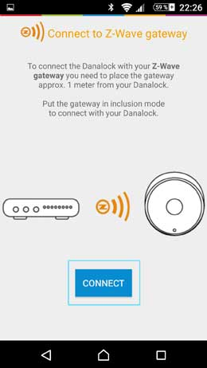

Danalock  BTZE 
================

\

-   **The module**

\

\

-   **The Jeedom visual**

\

\

Summary 
------

 

**
 !**

 ! 
.

. 
.

. 
. 
. 
. 
.. 

.

****

.

****

.

****

. ,

.

****

. 

. .

.

****

. 
. 

.

****

,
. 

.

****

. .
\

Functions 
---------

\

-   

-   

-   

-   

-   

-   ,
    

-   

-   

-    : 
    

-   

-   

-   

-   
    .

\

Technical characteristics 
---------------------------

\

-   Food : 

-    : 

-    : 

-   Communication : 

-   Dimensions : 

-   Weight : 

\

Module data 
-----------------

\

-   Mark : 

-   Name : Danalock  BTZE

-   Manufacturer ID : 

-   Product Type : 1

-   Product ID : 1

\

Setup 
-------------

\

To configure the OpenZwave plugin and know how to put Jeedom in
inclusion refer to this
[documentation](https://jeedom.fr/doc/documentation/plugins/openzwave/en_US/openzwave.html).

\

> **IMPORTANT**
>
> ..

\

 : 
"

".

Once included you should get this :

\

\

### Commands 

\

Once the module has been recognized, the commands associated with the module will be
available.

\

\

Here is the list of commands :

\

-   Status : 
    

-   Open : 

-   To close : 

-   Drums : it's the battery command

\

### Setup of the module 

\

> **Warning**
>
> .
> 
> 
> .

\

Jeedom OpenZwave plugin.

\

\

You will arrive on this page (after clicking on the tab
settings)

\

\

Parameter details :

\

-   1 :  : 
    
    

-   2 : 
    

-   3 : 
    

-   4 : 

-   5 : 
    
    . .

-   6 : 
    

-   7 : Battery type : 
    .

-   8 :  : 
    
    .

-   9 : 
    
    .

-   10 : . 
    
    . 
    . .

-   11 : 
    
    
    .

-   12 : 

\

### Groups 

\

.

\

\

Good to know 
------------

\

### Specificities 

\

> **Tip**
>
> .
> 
> 
> .

\

> **Tip**
>
> 
> 

### Alternative visual 

\

\

Wakeup 
------

\

.

\

Faq. 
------

\

.

\

**@noumea**
