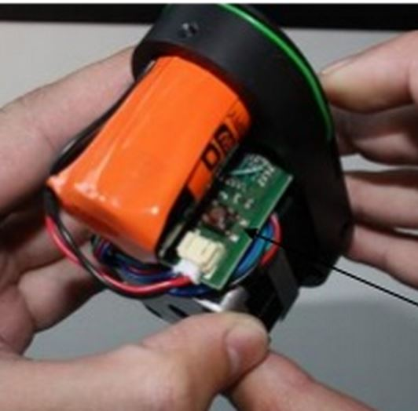
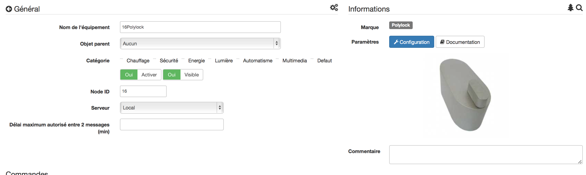

PolyLock 
========

-   **The module**

-   **The Jeedom visual**

Summary 
------

 

Secure your home using the Z-Wave electronic lock from
Poly-Control !

The Poly-Lock electronic lock is designed to adapt to almost
all the doors in the world. It mounts very easily in 5
minutes, you just have to change the cylinder of your door.

Once paired with your Z-Wave controller (such as Vera's systems
VeraControl), you can have complete control of your lock
from any computer or smartphone, no matter where you are
be in the world. It is also possible to use the lock
with the Poly-Pad wireless keyboard to open or lock the door.

It is therefore possible to lock your house in a similar way
to lock your car - with a remote control, by pressing
just a button and your home is secure. The lock
Poly-Control can also work with other Z-Wave scenes, where
the lights come on, and the alarm system is deactivated when
unlocked via your remote control.

The Poly-Control system can be used in an environment
domestic or work. The Poly-Lock is powered by
battery, and has been tested to operate for 1 year, without
battery replacement.

Functions 
---------

-   Control your front door remotely

-   Fits most doors

-   Can be integrated into Z-Wave scenes, for example for a system
    d'alarme

-   Suitable for home or business use

-   Wheel for manual closing

-   Easy installation

Technical characteristics 
---------------------------

-   Food : 3.6V Lithium-Chloride battery

-   Frequency : 868.42 Mhz

-   Scope : up to 100 m outdoors, up to 30 m in
    buildings

-   Dimensions : 120 x 52 x 60 mm (L x W x H)

-   Weight : 370g

Module data 
-----------------

-   Mark : Poly-Control

-   Name : Polylock

-   Manufacturer ID : 270

-   Product Type : 1

-   Product ID : 1

Setup 
-------------

To configure the OpenZwave plugin and know how to put Jeedom in
inclusion refer to this
[Documentation](https://doc.jeedom.com/en_US/plugins/automation%20protocol/openzwave/).

> **IMPORTANT**
>
> To put this module in inclusion mode, press the button 1 time
> inclusion button, according to its paper documentation.

Once included you should get this :

### Commands 

Once the module has been recognized, the commands associated with the module will be
disponibles.

Here is the list of commands :

-   Status : it is the command which will go up the last action
    executed (open / close)

-   Open : it is the command which opens the lock

-   To close : it is the command which makes it possible to close the lock

-   Drums : it's the battery command

### Configuration of the module 

> **Warning**
>
> Although this module is on battery it uses Flirs technology.
> This means that he has no concept of wake up and awakening. he
> will recover any configuration changes in near real time
> as a sector module.

If you want to configure the module according to your
installation, you have to go through the "Configuration" button of the
Jeedom OpenZwave plugin.

You will arrive on this page (after clicking on the tab
settings)

Parameter details :

-   0: allows to change the direction of rotation for the commands
    open close

-   1: allows you to define how long the lock will turn for
    open (0 to 15 s)

-   2: allows you to define how long the lock will turn for
    close (0 to 15 s)

-   3: used to define the speed of rotation of the lock (0 to 15,
    15 being the slowest)

-   4: allows you to choose from different operating modes
    (torque, force, power etc…)

### Groups 

This module has only one association group.

Examples of use 
----------------------

The trigger is the event command of a zipato keyboard
(it can be anything else). If the value is 6 (home) on
lock the door. We have just returned so we can close
the key door. Otherwise (necessarily 5) the door is opened with a key and 2 minutes
after we close it. Indeed, we want to go out, the door opens and
will close soon after.

Good to know 
------------

### Specificities 

> **Tip**
>
> Although this module is on battery it uses Flirs technology.
> This means that he has no concept of wake up and awakening. he
> will recover any configuration changes in near real time
> as a sector module.

> **Tip**
>
> This module does not return its state, if you operate the lock at the
> hand the state will remain the same. 

### Alternative visual 

Wake up 
-------

There is no concept of wake up for this module.

Faq. 
------

No concept of wake up on this module, read the specifics paragraph.

**@sarakha63**
