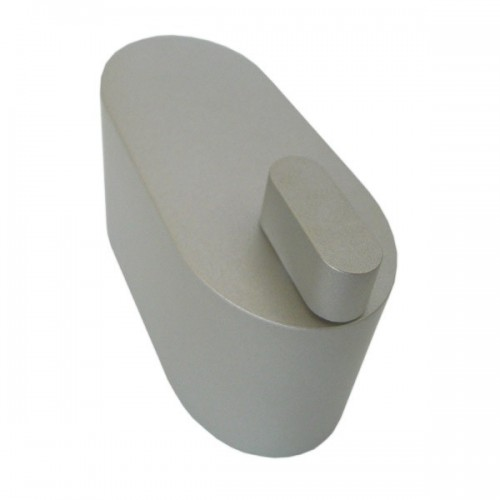
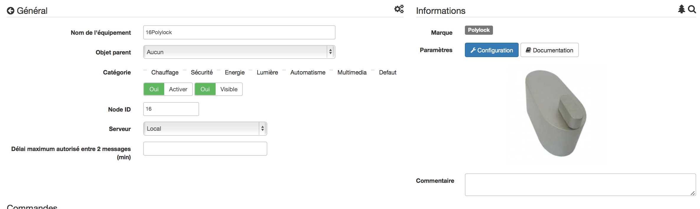
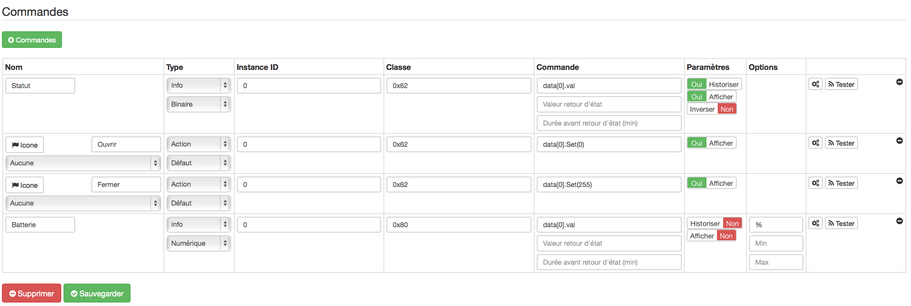
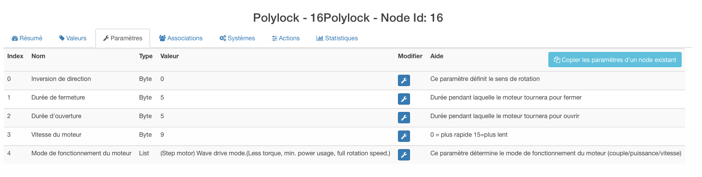
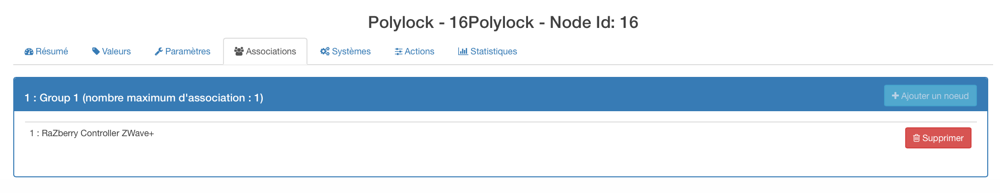
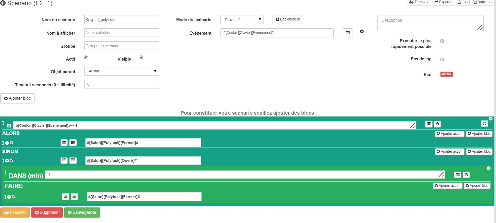

# PolyLock

**The module**

**The Jeedom visual**

## Summary

 !

. .

. .

. .

. .

## Fonctions

-   
-   
-   
-   
-   
-   

## Technical specifications

-   Food : 
-   Frequency : 868.42 MHz
-    : 
-   Dimensions : )
-    : 370g

## Module data

-   Brand : Poly-Control
-   Name : Polylock
-   Manufacturer ID : 270
-   Product Type : 1
-   Product ID : 1

## Configuration

To configure the OpenZwave plugin and learn how to include Jeedom, refer to this [documentation](https://doc.jeedom.com/en_US/plugins/automation%20protocol/openzwave/).

> **Important**
>
> .

Once included, you should get this :

### Commandes

Once the module is recognized, the commands associated with the module will be available.

Here is the list of commands :

-    : )
-    : 
-    : 
-   Battery : This is the battery control

### Module configuration

> ****
>
> . . .

.

You will arrive at this page (after clicking on the settings tab))

Parameter details :

-   0: 
-   1: )
-   2: )
-   3: )
-   4: )

### Groupes

.

## Examples of use

). . . . .

## Good to know

### Specifics

> ****
>
> . . .

> ****
>
> .

## 

.
