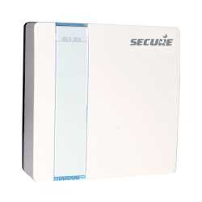
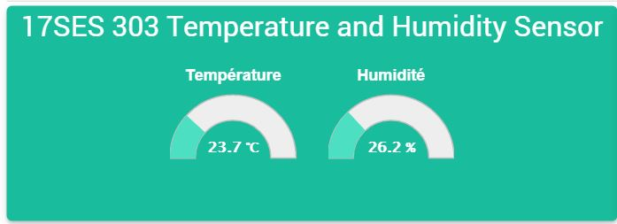
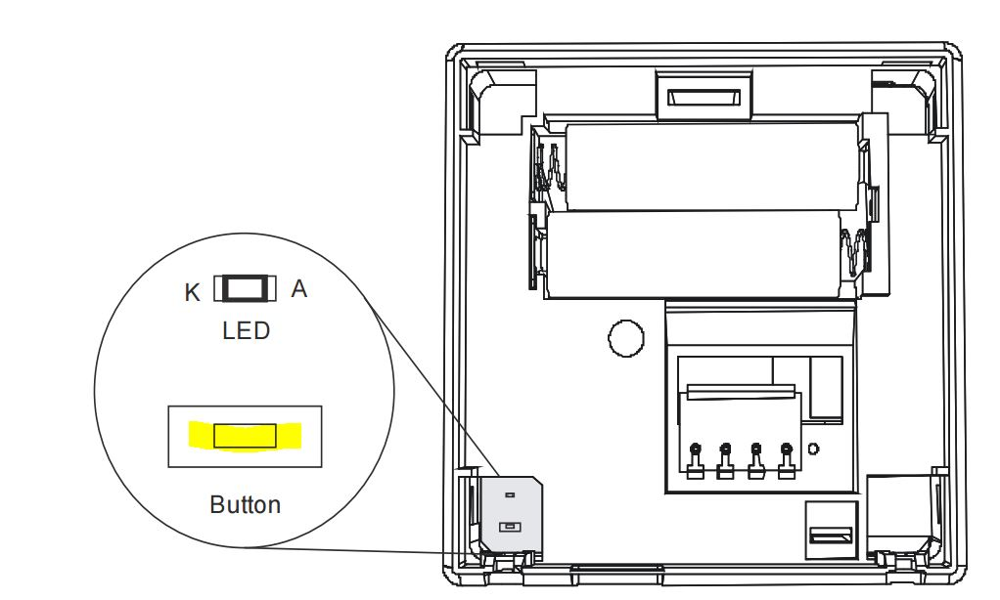
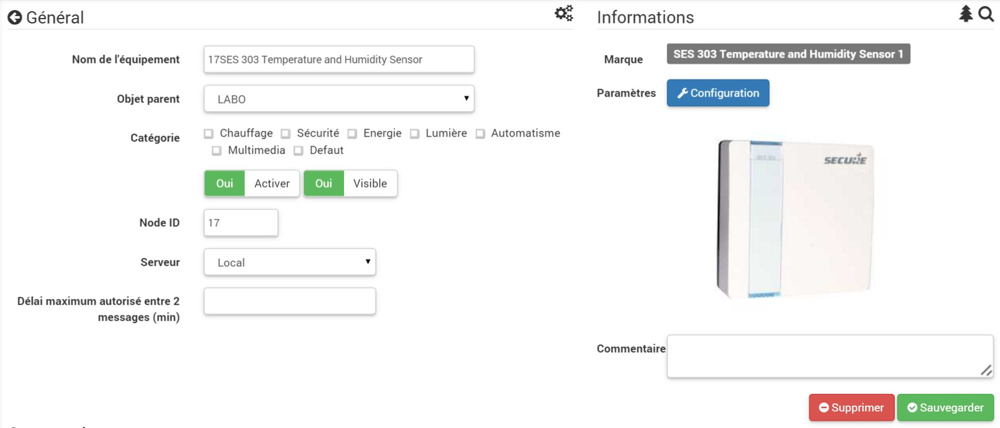
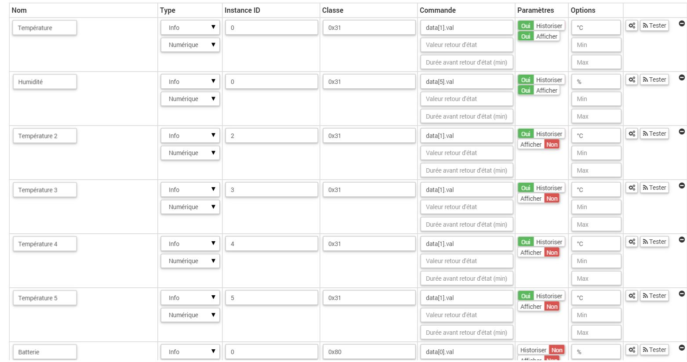
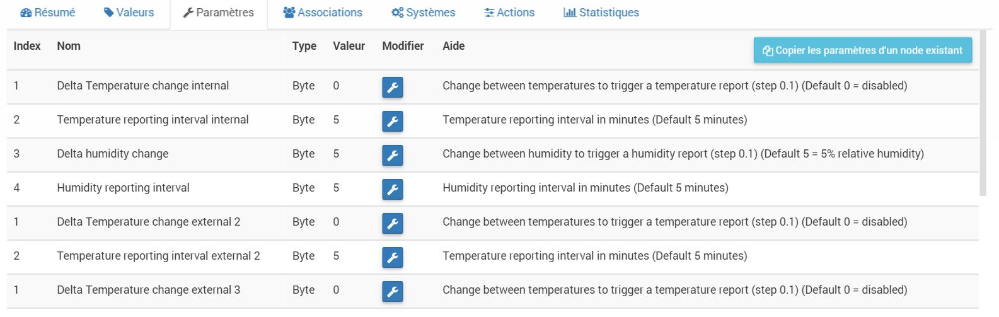
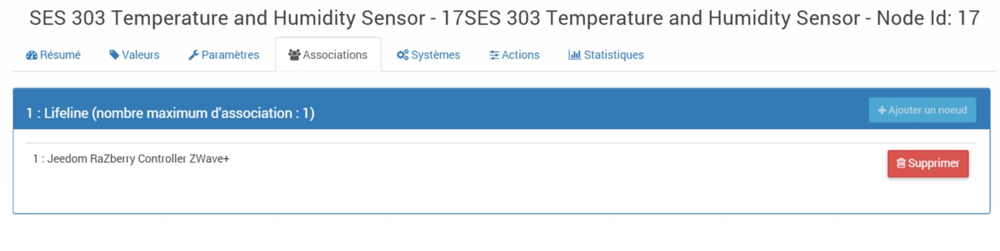

# "

**The module**

**The Jeedom visual**

## Summary

. . :

-   )
-   
-   

. . .

## Fonctions

-   
-   
-   
-   
-   
-   

## Technical specifications

-   Type: 
-   : .
-   
-   Frequency : 868.42 MHz
-   Alimentation: )
-    : 
-    : IP30
-   Dimensions : 

## Module data

-   Brand : Horstmann
-   Name : 
-   Manufacturer ID : 89
-   Product Type : 13
-   Product ID : 3

## Configuration

To configure the OpenZwave plugin and learn how to include Jeedom, refer to this [documentation](https://doc.jeedom.com/en_US/plugins/automation%20protocol/openzwave/).

> **Important**
>
> .

Once included, you should get this :

### Commandes

Once the module is recognized, the commands associated with the module will be available.

Here is the list of commands :

-   Temperature : This is the temperature measurement control
-    : 
-   Battery : This is the battery control

### Module configuration

> **Important**
>
> During the initial inclusion, always wake up the module immediately after inclusion.

Next, you need to configure the module according to your installation. To do this, you need to use the "Configuration" button in the Jeedom OpenZwave plugin.

You will arrive at this page (after clicking on the settings tab))

Parameter details :

-   1: )
-   2: )
-   3: )
-   4: )

### Groupes

## Wakeup

Important note
---------------

> **Important**
>
> The module needs to be woken up : after its inclusion, after a configuration change, after a wake-up change, after a change in association groups
