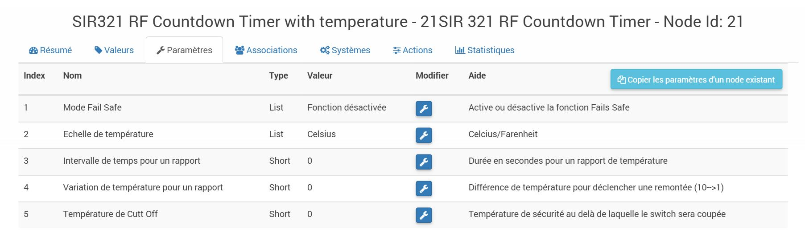

Secure SIR 321 "Timer" 
======================

-   **The module**

-   **The jeedom visual**

Summary 
------

The SIR321 digital timer is a simple switch to
push button that remembers turning off your devices for you
electric. Big energy savings are possible by adding
this simple device on any high power electrical device,
with loads up to 3kW (resistive).

These units are perfect for use on panels
heaters, immersion heaters, towel warmers and oil coolers. The
boost ranges from 30 to 120 minutes.

SIR 321 supports SES001 external temperature sensors,
SES002 and SES003.

Functions 
---------

-   Booster for immersion heater, panel radiator, heated towel rail,
    oil bath radiator

-   Boiler timer

-   Forced ventilation in conference rooms

-   Floor heating temperature measurement (with optional sensors)

-   Simple to use and reliable

-   Save energy

Technical characteristics 
---------------------------

-   Type: Electronic timer

-   Relais: 13 (3) A, 230V AC, suitable for loads up to
    3kW

-   Alimentation: 230V AC, 50Hz

-   Dimensions 85x85x44mm

-   Protection sign : IP30

-   Operating temperature: 0 ° C to 35 ° C

Module data 
-----------------

-   Mark : Horstmann

-   Name : SIR 321 RF Countdown Timer

-   Manufacturer ID : 89

-   Product Type : 1/2 (depending on whether it is included with a probe
    or not)

Setup 
-------------

To configure the OpenZwave plugin and know how to put Jeedom in
inclusion refer to this
[Documentation](https://doc.jeedom.com/en_US/plugins/automation%20protocol/openzwave/).

> **IMPORTANT**
>
> To put this module in inclusion mode, press 1 second on
> the button (until rapid flashing) and release, in accordance with
> paper documentation.

Once included you should get this :

### Commands 

Once the module has been recognized, the commands associated with the module will be
disponibles.

Here is the list of commands :

-   We : this is the command to turn on the relay

-   Off : it is the command to switch off the relay

-   Temperature : this is the temperature measurement command if a
    external probe is present

### Configuration of the module 

If you want to configure the module you have to go through the button
"Configuration "of Jeedom's OpenZwave plugin.

You will arrive on this page (after clicking on the tab
settings)

Parameter details :

-   1: Allows you to activate or not the fail safe timer function (refer to
    module documentation)

-   2: Adjusts the temperature unit

-   3: Allows you to set the temperature sending time interval
    at Jeedom (in seconds)

-   4: Adjusts how much the temperature must vary for
    the module sends it to Jeedom (in steps of 0.1 10- → 0.1)

-   5: Allows you to set a cut off temperature above which
    the module will cut off the relay

### Groups 

This module has two association groups. If the first is
essential, the second is active and is essential if a probe
of temperature is related.

Faq. 
------

**@sarakha63**
