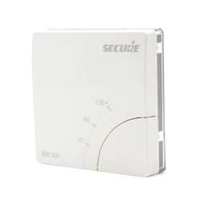
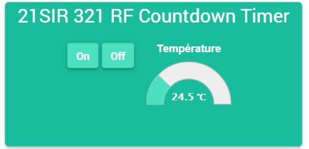
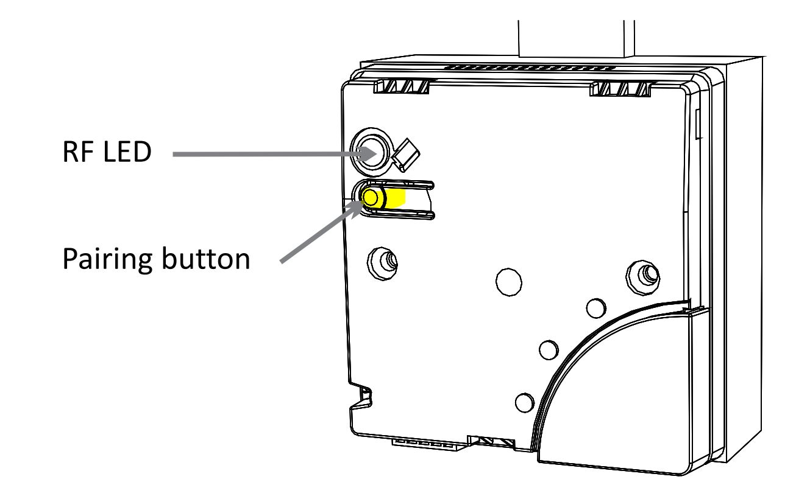
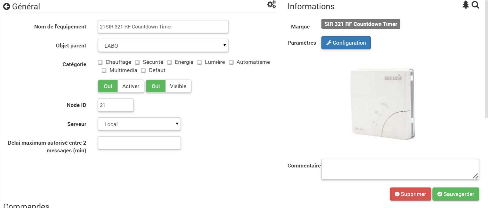
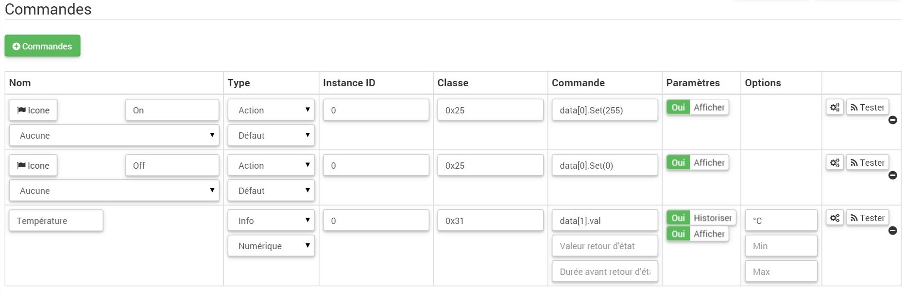
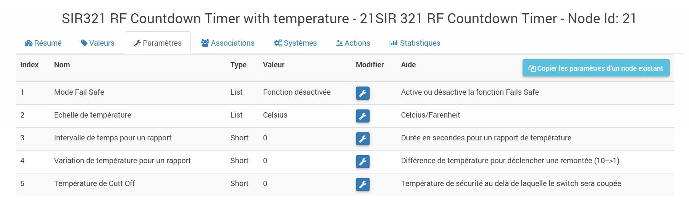
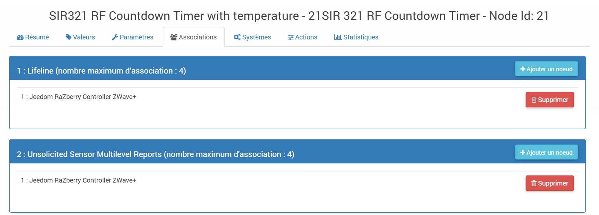

# "

**The module**

**The Jeedom visual**

## Summary

. ).

. .

.

## Fonctions

-   
-   
-   
-   )
-   
-   

## 

-   Type: 
-   Relais: 
-   Alimentation: 
-   
-    : IP30
-   Operating temperature: 

## Module data

-   Brand : Horstmann
-   Name : 
-   Manufacturer ID : 89
-   Product Type : )

## Configuration

To configure the OpenZwave plugin and learn how to include Jeedom, refer to this [documentation](https://doc.jeedom.com/en_US/plugins/automation%20protocol/openzwave/).
> **Important**
>
> .

Once included, you should get this :

### Commandes

Once the module is recognized, the commands associated with the module will be available.

Here is the list of commands :

-   On : 
-   Off : 
-   Temperature : 

### Module configuration

.

You will arrive at this page (after clicking on the settings tab))

Parameter details :

-   1: )
-   2: 
-   3: )
-   4: .)
-   5: 

### Groupes

. .

