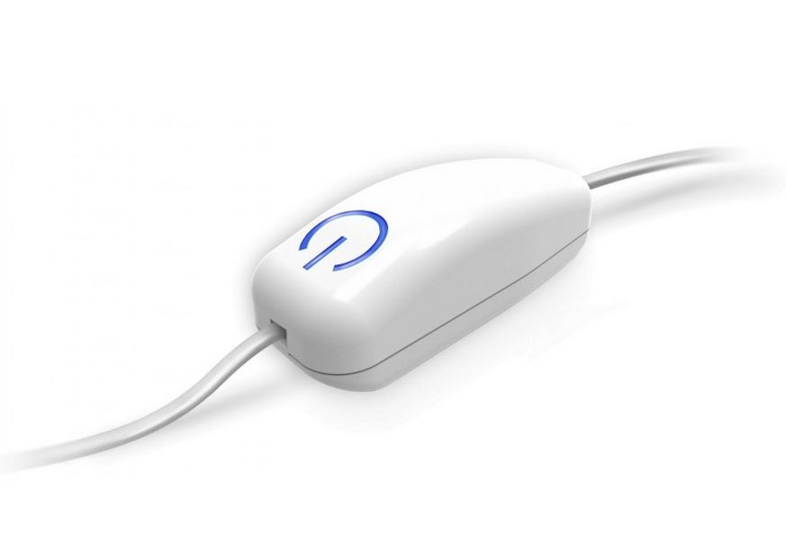
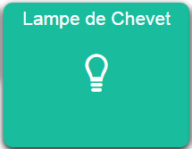
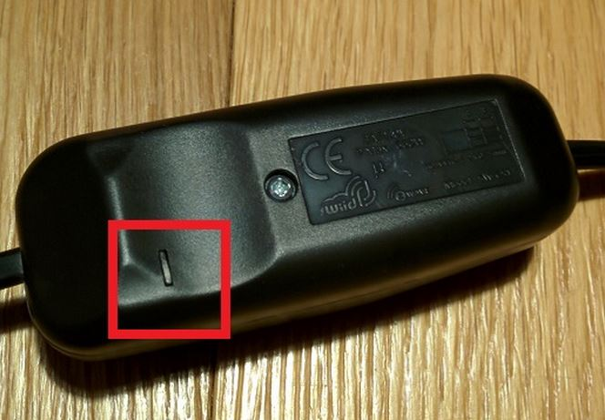
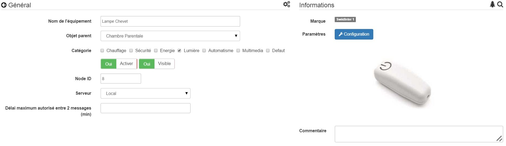
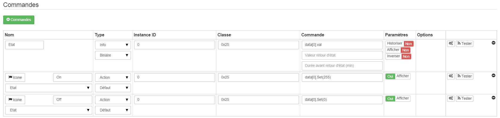
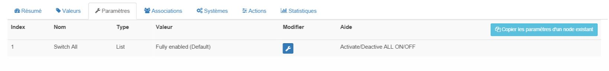
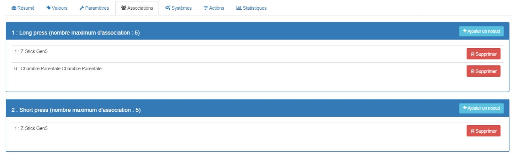

# 

**The module**

**The Jeedom visual**

## Summary

.

.

. .  : .

 : . .

## Fonctions

-   )
-   
-   
-   )
-   
-   
-   

## Technical specifications

-   Module type : Z-Wave Receiver
-   Color : noire
-   Alimentation: 
-    : 660W
-   Consumption : &lt; 0,08W
-   : IP20
-   Radio protocol: )
-    : )
-   . transmission: )
-   .  : 
-    : 
-   Dimensions : 
-    : :

## Module data

-   Brand : Swiid
-   Name : Swiidinter
-   Manufacturer ID : 358
-   Product Type : 256
-   Product ID : 256

## Configuration

To configure the OpenZwave plugin and learn how to include Jeedom, refer to this [documentation](https://doc.jeedom.com/en_US/plugins/automation%20protocol/openzwave/).

> **Important**
>
> 

Once included, you should get this :

### Commandes

Once the module is recognized, the commands associated with the module will be available.

Here is the list of commands :

-   State : 
-    : 
-    : 

Note that on the dashboard, all the information is displayed under the same icon

### Module configuration

You can configure the module according to your installation. To do this, you need to use the "Configuration" button in the Jeedom OpenZwave plugin.

You will arrive at this page (after clicking on the settings tab))

 :

)

-    : 
-    : 
-    : 
-   ) : 

### Groupes

.

> **Important**
>
> . .

## 

.

## 

.
