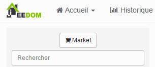

Installation of the Z-wave plugin
=============================

If you don't have one yet, you will need to install the plugin
Z-Wave, don't worry, it only takes a few seconds. For this
faire, il suffit de se rendre dans le menu « Général », puis « Plugins »

Enfin, cliquez sur le bouton « Market » situé en haut à gauche.

Once on the Market, in the search bar at the top right,
type the word Z-wave and confirm with the enter key. Select the
plugin and install it. Then, just activate it by clicking on
le bouton « activer » qui apparait.

Once the plugin is activated, you have access to its configuration. If you
use an official Jeedom box (Mini, Mini +) please do not touch
configuration, however you can enter a name in the field
« Serveur Z-wave nom » (ici Jeebox), même chose si vous êtes sur une
DIY installation but without remote mode. Otherwise, the
configuration will have to be adapted according to your type of installation
(Remote mode, Openzwave, etc…

