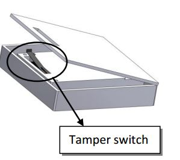
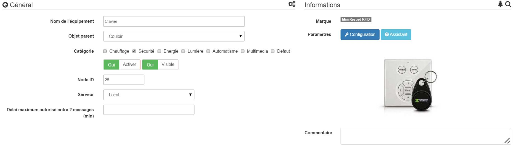
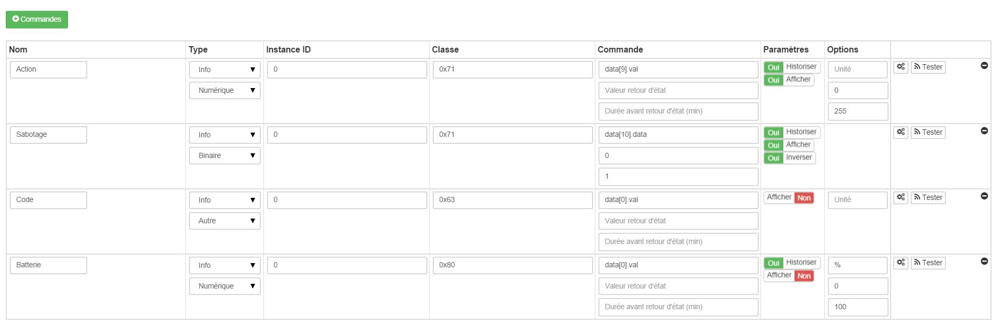
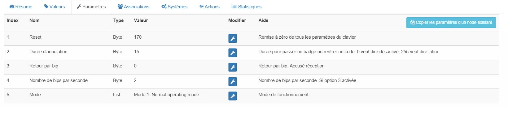
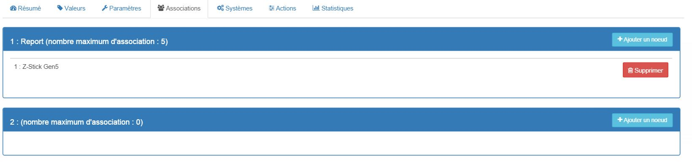
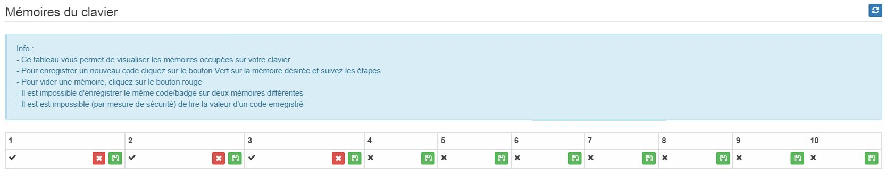
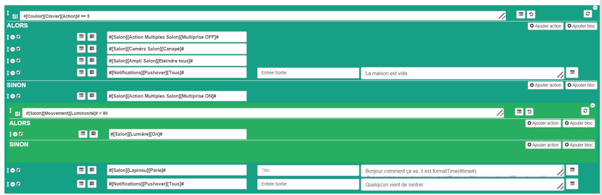

# 

**The module**

**The Jeedom visual**

## Summary

 !

. . . . .

## Fonctions

-   
-   
-   
-   
-   
-   
-   
-   

## Technical specifications

-    : 
-   Food : 
-   Frequency : 868.
-    : 
-    : 
-    : 
-    : -
-    : 
-   Operating temperature : 
-    : 
-   Dimensions : 
-   Certifications :  :  : 

## Module data

-   Brand : Zipato
-   Name : 
-   Manufacturer ID : 151
-   Product Type : 24881
-   Product ID : 17665

## Configuration

To configure the OpenZwave plugin and learn how to include Jeedom, refer to this [documentation](https://doc.jeedom.com/en_US/plugins/automation%20protocol/openzwave/).

> **Important**
>
> .

Once included, you should get this :

### Commandes

Once the module is recognized, the commands associated with the module will be available.

Here is the list of commands :

-    : )
-   Sabotage : )
-    : 
-   Battery : This is the battery control

### Module configuration

> **Important**
>
> During the initial inclusion, always wake up the module immediately after inclusion.

.

You will arrive at this page (after clicking on the Settings tab))

Parameter details :

-   1: )
-   2: )
-   3:  : 
-   4: )
-   5:  : )

### Groupes

.

> **Important**
>
> . .

### 

.

. .

-   
-   To save a new code, click the green button on the desired memory location and follow the steps
-   To delete a code, simply click on the red button.
-   It is impossible to save the same code/badge on two different memories
-   It is impossible (for security reasons) to read the value of a recorded code

> **Important**
>
> Remember to wake up the module after adding a code or badge.

## Examples of use

The triggering element is the event command; indeed, it is only updated when a valid code/badge has been presented. If the value is 6 (home), the alarm is deactivated (for example), or the power strip is turned on, the light is turned on according to the brightness, a notification is sent to signal that someone has arrived home, a voice synthesis is launched to give a weather report, for example. Otherwise (definitely option 5) we activate the alarm, we unplug the power strip, we send a notification to signal that the house is empty.

## Good to know

### Specifics

The keypad reads codes/badges in two ways :

-   When you press the home/away button within the first 1 to 2 seconds, if you start typing a code, it will read that code
-   If nothing is done within the first 1 to 2 seconds, it will enter RFID badge reading mode (red light on)). At that point he can read a badge, not before.

## Wakeup

To wake up this module there are two ways to proceed :

-   Press the tamper button and then release it after 1 to 2 seconds
-   Press Home, a random number, and Enter

## Important note

> **Important**
>
> The module needs to be woken up : after its inclusion, after a configuration change, after a wake-up change, after a change in association groups
