# Compatibilidad de la cámara

# Alcatel

|Image|Marque|Nom|Type|Remarque|Lien|
|---|---|---|---|---|---|
||Alcatel|Unidad de videoportero IP_Linkcom / Alcatel||||

# Android

|Image|Marque|Nom|Type|Remarque|Lien|
|---|---|---|---|---|---|
||Android|Cámara web IP Android||||

# Axis

|Image|Marque|Nom|Type|Remarque|Lien|
|---|---|---|---|---|---|
|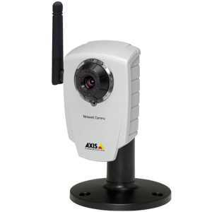|Axis|Axis||||
|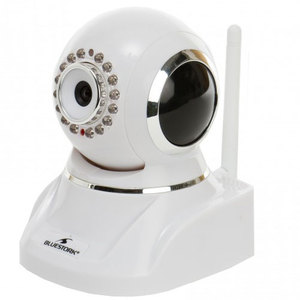|Axis|Bluestork||||

# D-link

|Image|Marque|Nom|Type|Remarque|Lien|
|---|---|---|---|---|---|
||D-link|D-Link DCS-5300G||||
|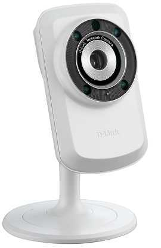|D-link|D-Link DCS||||
||D-link|D-Link DCS||||
||D-link|D-Link DCS PTZ||||
||D-link|D-Link DSC-5020L && DCS-935L||||
||D-link|Monitor de bebé D-Link EyeOn||||

# Dahua

|Image|Marque|Nom|Type|Remarque|Lien|
|---|---|---|---|---|---|
||Dahua|Dahua SD22204T-GN-W||||

# Dericam

|Image|Marque|Nom|Type|Remarque|Lien|
|---|---|---|---|---|---|
||Dericam|Dericam H502W||||

# Doorbird

|Image|Marque|Nom|Type|Remarque|Lien|
|---|---|---|---|---|---|
||Doorbird|Doorbird||||

# Ebode

|Image|Marque|Nom|Type|Remarque|Lien|
|---|---|---|---|---|---|
||Ebode|Ebode al aire libre||||
||Ebode|Ebode HD motorizado||||
||Ebode|||||

# Foscam

|Image|Marque|Nom|Type|Remarque|Lien|
|---|---|---|---|---|---|
||Foscam|Foscam FI9803EP|||[Comprar](https://www.domadoo.fr/fr/cameras/4978-foscam-camera-ip-wifi-exterieur-motorisee-2mp-6954836003299.html)|
|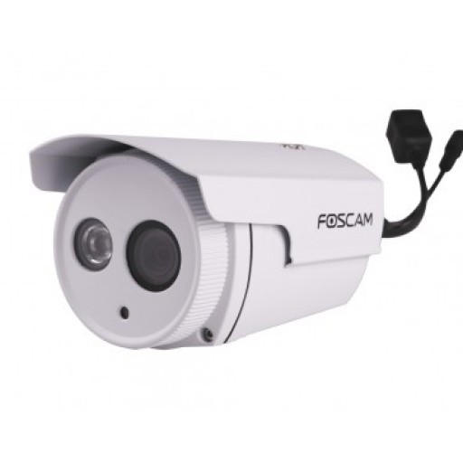|Foscam|Foscam FI9803P|||[Comprar](https://www.domadoo.fr/fr/cameras/4978-foscam-camera-ip-wifi-exterieur-motorisee-2mp-6954836003299.html)|
||Foscam|Foscam R2|||[Comprar](https://www.domadoo.fr/fr/cameras/4976-foscam-camera-ip-wifi-interieure-motorisee-2mp-6954836001486.html)|
||Foscam|Foscam HD||Soporte para la mayoría de las cámaras Foscam HD|[Comprar](https://www.domadoo.fr/fr/cameras/4975-foscam-camera-ip-wifi-interieure-2mp-6954836069547.html)|
||Foscam|Foscam HD motorizado||Soporte para la mayoría de las cámaras motorizadas Foscam HD|[Comprar](https://www.domadoo.fr/fr/cameras/4978-foscam-camera-ip-wifi-exterieur-motorisee-2mp-6954836003299.html)|
||Foscam|Foscam motorizado||Soporte para la mayoría de las cámaras Foscam motorizadas|[Comprar](https://www.domadoo.fr/fr/cameras/4978-foscam-camera-ip-wifi-exterieur-motorisee-2mp-6954836003299.html)|

# Hedden

|Image|Marque|Nom|Type|Remarque|Lien|
|---|---|---|---|---|---|
||Hedden|Heden CAMHED05IPWN (V5.5), VISIONCAM22||||
||Hedden|Heden VisionCam HD CAMHD08MD0||||
||Hedden|Heden VisionCam CAMHED04IPWN||||

# Hikivision

|Image|Marque|Nom|Type|Remarque|Lien|
|---|---|---|---|---|---|
||Hikivision|Hikvision DS-7216HWI-SH / A (XXX = 101 para el canal 1 / XXX = 202 para el canal 2)||||
||Hikivision|Hikvision DS-2CD2132-I, DS-2CD3332-I, DS-2CD2232-I5, DS-2CD2732F-IS||||

# Karotz

|Image|Marque|Nom|Type|Remarque|Lien|
|---|---|---|---|---|---|
||Karotz|Karotz||||
|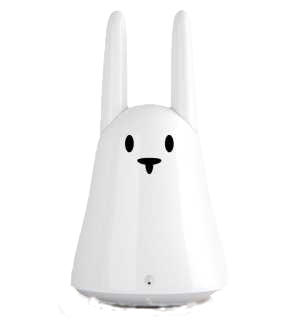|Karotz|Cámara Openkarotz||||

# Konx

|Image|Marque|Nom|Type|Remarque|Lien|
|---|---|---|---|---|---|
|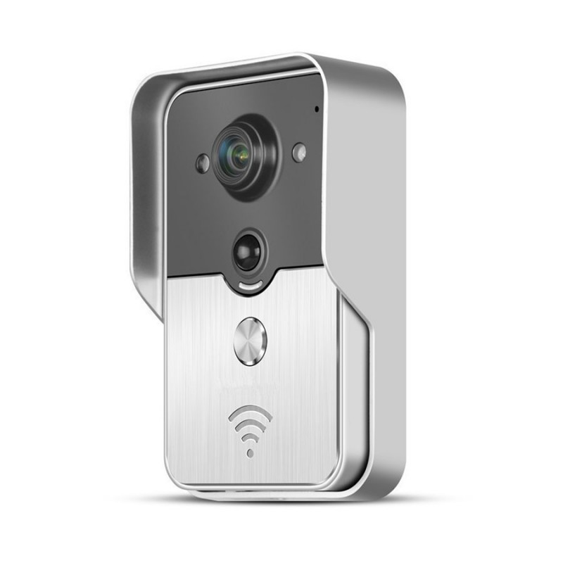|Konx|Videoportero Konx||||

# Mustcam

|Image|Marque|Nom|Type|Remarque|Lien|
|---|---|---|---|---|---|
||Mustcam|Mustcam HD motorizado||||

# Netatmo

|Image|Marque|Nom|Type|Remarque|Lien|
|---|---|---|---|---|---|
||Netatmo|Presencia Netatmo||Requiere absolutamente el complemento de seguridad de Netatmo (pago)|[Comprar](https://www.domadoo.fr/fr/objets-communicants/3855-netatmo-camera-exterieure-de-securite-presence-3700730501866.html)|
||Netatmo|Netatmo Welcome||Requiere absolutamente el complemento de seguridad de Netatmo (pago)|[Comprar](https://www.domadoo.fr/fr/objets-communicants/3064-netatmo-camera-a-reconnaissance-faciale-welcome-3700730500623.html)|

# Onvif

|Image|Marque|Nom|Type|Remarque|Lien|
|---|---|---|---|---|---|
||Onvif|Onvif||Descubrimiento de cámaras Onvif (la atención no siempre funciona, no hay garantía posible)||

# Panasonic

|Image|Marque|Nom|Type|Remarque|Lien|
|---|---|---|---|---|---|
|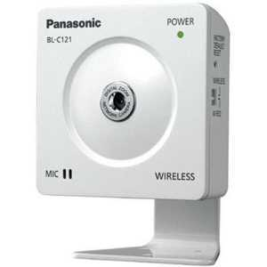|Panasonic|Panasonic BL-C121||||

# Rpi

|Image|Marque|Nom|Type|Remarque|Lien|
|---|---|---|---|---|---|
||Rpi|RPI Cam||||

# Tenvis

|Image|Marque|Nom|Type|Remarque|Lien|
|---|---|---|---|---|---|
||Tenvis|Tenvis||||

# Trendnet

|Image|Marque|Nom|Type|Remarque|Lien|
|---|---|---|---|---|---|
||Trendnet|TrendNet TV-IP310PI||||
||Trendnet|TrendNet TV-IP672WI||||

# Vistacam

|Image|Marque|Nom|Type|Remarque|Lien|
|---|---|---|---|---|---|
||Vistacam|Vera Vista cam 700 / Secomm / Homelive||||
||Vistacam|Vera Vista cam SD||||

# Vivotek

|Image|Marque|Nom|Type|Remarque|Lien|
|---|---|---|---|---|---|
|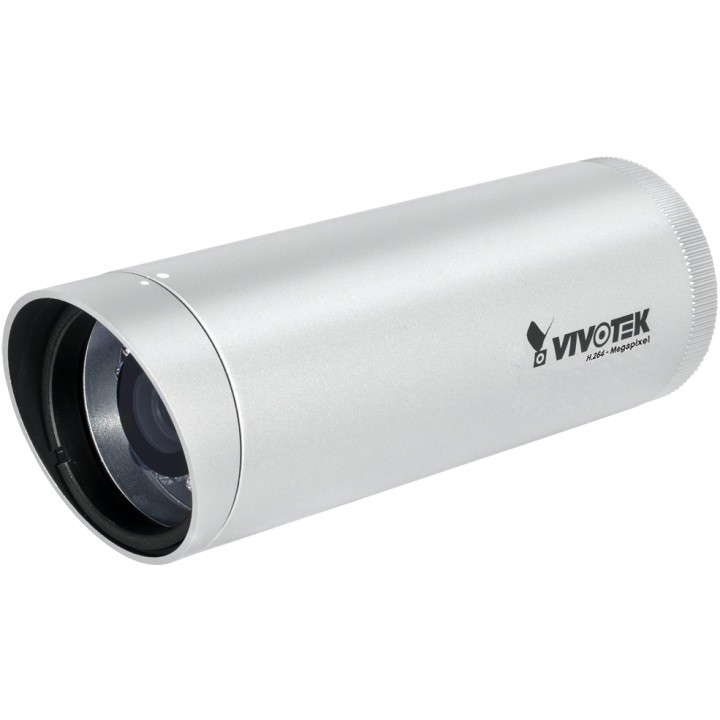|Vivotek|Vivotek 8xxx y 7xxx||||

# Wanscam

|Image|Marque|Nom|Type|Remarque|Lien|
|---|---|---|---|---|---|
||Wanscam|Wanscam HW0021||||
||Wanscam|Wanscam HW0026||||
||Wanscam|Wanscam HW0036||||
||Wanscam|||||
||Wanscam|Wanscam HW0043||||
||Wanscam|Wanscam HW0045||||
|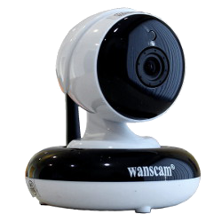|Wanscam|Wanscam HW0049||||
||Wanscam|Wanscam HW00XX||||
|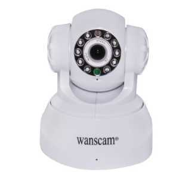|Wanscam|Wanscam motorizada||||
||Wanscam|Wanscam q3 (s)||||

# Ycam

|Image|Marque|Nom|Type|Remarque|Lien|
|---|---|---|---|---|---|
|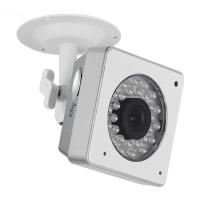|Ycam|Y-Cam||||

# Zavio

|Image|Marque|Nom|Type|Remarque|Lien|
|---|---|---|---|---|---|
||Zavio|Zavio F3115||||

Esta lista se basa en los comentarios de los usuarios, por lo que el equipo de Jeedom no puede garantizar que todos los módulos de esta lista sean 100% funcionales
