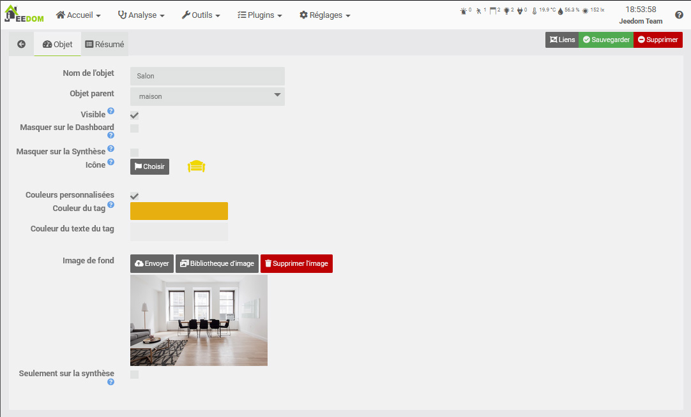
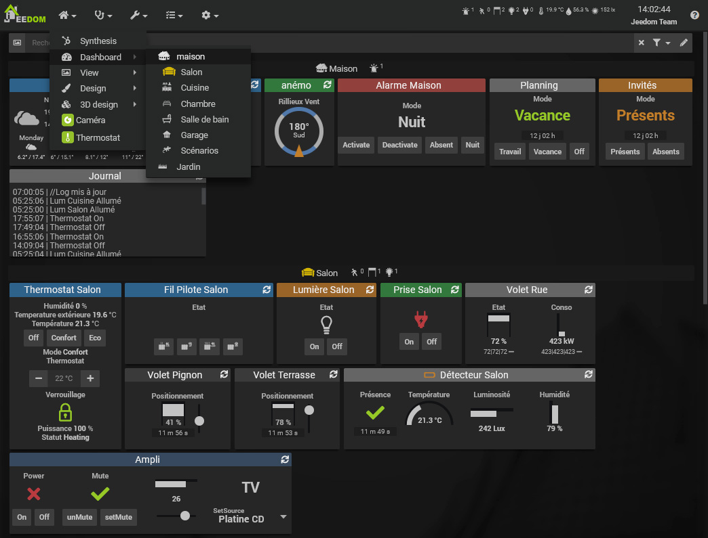
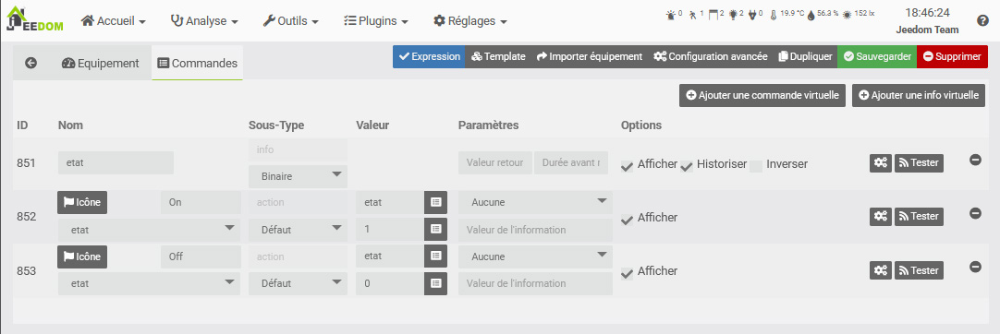

# Concept

Aquí están los principales conceptos básicos de Jeedom. Esta documentación sigue siendo voluntariamente simple para ayudarlo a tomar el control de su domótica.

Las posibilidades de Jeedom son casi infinitas, ya que puedes crear muchas cosas con unos pocos scripts en php, python u otros, pero ese no es el tema aquí.

> Tip
>
> Los enlaces siguientes apuntan a Core v4.5. Una vez en la página de documentación (manual de usuario o configuración) puede cambiar la versión en el menú en la parte superior izquierda para cambiar a la versión correspondiente al núcleo que desee.

## Affichage

Jeedom permite interconectar muchos dispositivos, ya sea basándose en protocolos Z-Wave, Enocean, Zigbee, etc., en API mediante complementos o directamente en forma de scripts. Puedes mirar en el [Mercado](https://market.jeedom.com/) para obtener una descripción general de los dispositivos compatibles.

Puede ver estos dispositivos de varias maneras :

- Sobre [Salpicadero](/es_ES/core/4.5/dashboard)
- En la [Síntesis](/es_ES/core/4.5/overview) (v4.5)
- Sobre una [Vista](/es_ES/core/4.5/view)
- Sobre un [Diseño](/es_ES/core/4.5/design)
- Sobre un [Diseño 3D](/es_ES/core/4.5/design3d)


Estos se pueden visualizar en un navegador en una computadora de escritorio, en un teléfono inteligente con la WebApp o la aplicación móvil : [Versión móvil](/es_ES/mobile/index)

## Los objetos

Para organizar sus dispositivos, puede crear [Objetos](/es_ES/core/4.5/object).

Estos objetos pueden representar partes de la casa (sala de estar, dormitorio, taller)). Cada objeto puede tener un objeto padre. Esta jerarquía se usará para mostrar en el Panel de control. Por ejemplo, puedes tener un objeto **Casa**, entonces objetos **Sala de estar** y **Habitación** niños objeto **Casa**. Una vez en el Tablero, el objeto **Casa** también mostrará, a continuación, sus objetos secundarios.



> **Consejo**
>
> DENTRO **Configuración → Preferencias**, puede definir a qué objeto desea llegar en el Tablero. [Preferencias](/es_ES/core/4.5/profils)



## Equipamiento y sus controles

### Commandes

Para interactuar con nuestra automatización del hogar, necesita comandos ! Estos son de dos tipos :

> Note
>
> Tenga la seguridad de que los pedidos normalmente se crean automáticamente ! Estas explicaciones son para una mejor comprensión.

- Las órdenes *Información* :
Estos comandos almacenan información de los sensores. Por ejemplo la temperatura de una sonda, el movimiento de un sensor de presencia, etc.
Estos comandos se pueden registrar para mantener esta información a lo largo del tiempo en forma de curva : [Historial](/es_ES/core/4.5/history)

Estos comandos también se pueden usar para activar [Escenarios](/es_ES/core/4.5/scenario) para automatizar acciones basadas en la información enviada por sus sensores. Por ejemplo, un sensor de movimiento detecta una presencia, lo que desencadenará un escenario que encenderá la luz.

- Las órdenes *Acción* :
Estos comandos le permiten controlar sus actuadores. Por ejemplo, comandos ````on```` y ````off```` de un tomacorriente controlado le permitirá encenderlo y apagarlo.

Los comandos de acción generalmente están vinculados a comandos de información. Aquí nuestra toma tiene dos acciones ````on```` y ````off````, generalmente relacionado con la información **Estado**.



Estos dos tipos de comandos se adjuntan en forma de equipo. Por lo tanto, el equipo tiene comandos de información y / o acción, y es este equipo el que tendrá un Objeto como padre, lo que le permitirá mostrarlo donde desee.

Cada comando también puede tener lo que se llama un tipo genérico, permitiendo a Jeedom y algunos complementos conocer el tipo de comando (Estado de un enchufe, botón de una luz, etc). [**Herramientas → Tipos de equipos**](/es_ES/core/4.5/types).

### Équipement

- Physiquement: Tengo un enchufe con un botón de encendido / apagado y un led de estado, en la sala de estar.
- En Jeedom: Tengo equipo con dos acciones de encendido y apagado y una información de estado, en el objeto Salon.

Estos equipos son creados por complementos. Por ejemplo, el complemento Z-Wave te permitirá incluir tu enchufe Z-Waze, lo que creará un equipo con sus controles al que podrás nombrar y vincular a un Objeto.

En términos de visualización, cada pedido se muestra mediante un widget. The Core ofrece los widgets principales, así como una herramienta para crearlos (V4) : [Reproductores](/es_ES/core/4.5/widgets).

Estos comandos están agrupados en un mosaico correspondiente a su equipo. Y este mosaico, por lo tanto, se mostrará en el Panel de control en el Objeto que le haya asignado.


Cualquiera que sea su dispositivo, se creará en forma de dispositivo, a partir de un [Plugin](/es_ES/core/4.5/plugin).

Este dispositivo tendrá sus propios comandos *Información* o *Acción*. Estos comandos se mostrarán como widgets que forman el mosaico del equipo, en su objeto principal.

Luego verás que cada Objeto, Equipo o Comando tiene numerosas opciones, en términos de funcionalidad o visualización. Pero todo a su tiempo, ahora deberías haber entendido los conceptos básicos de Jeedom y así poder empezar a organizar tu domótica sabiendo dónde buscar.

## Mi primer escenario

La ventaja de la automatización del hogar, más allá del control centralizado y remoto de nuestros periféricos, reside sobre todo en la automatización. El objetivo no es pasar horas frente a su Tablero o Diseño, sino que, por el contrario, su alojamiento se adapta a sus hábitos y lo hace olvidar. No más persianas para abrir y cerrar todos los días, no más luces para encender y apagar, estar avisado cuando tirar la basura a la calle, cuando hay correo en el buzón, la calefacción que se adapta según el estaciones y condiciones climáticas. Las posibilidades son infinitas y dependen del estilo de vida. Los escenarios están ahí para eso !

Un escenario es una serie de acciones definidas que se ejecutarán en determinados momentos del día. La ejecución puede ser programada (todos los lunes a una hora determinada) o causada por un evento. Como se vio anteriormente, este evento puede ser, por ejemplo, nuestro comando de información *Presencia* un detector de movimiento, después de una detección.

El objetivo aquí no es ser exhaustivo, sino descubrir los escenarios a través de ejemplos simples. los [documentación del manual de usuario](/es_ES/core/4.5/scenario) es mucho más completo.


### Detección de luz en movimiento.

Supongamos que tenemos una luz controlada y un detector de movimiento en la habitación.


- Ir a **Herramientas → Escenarios**
- Haga clic en *Añadir* luego dale un nombre al nuevo escenario.
- Derecha, en la seccion *Liberación*, compruebe que el modo está en *Provocado* luego haga clic en *+ Disparador*.
- Usando el botón *Elija una orden* a la derecha del campo *Evento*, seleccione el objeto, luego el equipo y su orden.

El *Disparador* es lo que desencadenará la ejecución de este escenario. Aquí, queremos activarlo cuando nuestro detector detecta una presencia, por lo que utilizaremos el comando `#[Habitación][Détecteur Habitación][Presencia]# == 1`.

El `#` indica un comando, luego encontramos `[el nombre de su objeto padre]` luego `[el nombre del equipo]` y finalmente `[el nombre del comando]`. Aquí, agregamos ` == 1` porque queremos que el escenario se active solo al detectar una presencia. Sin embargo, en un detector de presencia, esta detección vuelve a 0 unos segundos después. Por lo tanto, este cambio a 0 no activará nuestro escenario nuevamente.

- Click en la pestaña *Escenario* entonces el botón en la parte superior *Agregar bloque*. Elige un bloque *Acción* entonces en este, *Agregar* Una *Acción*. Esta acción será nuestro comando de cambio de luz. De acuerdo con el mismo principio : ``#[Habitación][Lumière Habitación][On]#``.

- Guarde y su script estará listo !

Aquí sólo hemos tocado las posibilidades de los escenarios. Puedes agregar condiciones (bloquear *Si/Entonces/Sino*), acciones de retraso (bloqueo *DENTRO*), programarlos (bloquear *A las*) e incluso usar directamente el código php (bloque *CODIGO*).

Aquí usamos el modo de disparo *Provocado* con un pedido. Pero también puedes usar (y combinar) el modo *Programado* ejecutar un escenario cada mañana o cada hora, etc.


### Programa del día.

Un tema recurrente para principiantes en Jeedom, la programación de eventos diarios como :

- Encienda la cafetera a las 7 a.m. de lunes a viernes.
- Abre las persianas al amanecer.
- Cierra las persianas al atardecer, si no estoy allí.

Para este tipo de escenario, aquí hay una muy buena introducción : [Programa del día](https://kiboost.github.io/jeedom_docs/jeedomV4Tips/Tutos/ProgDuJour/es_ES/)

