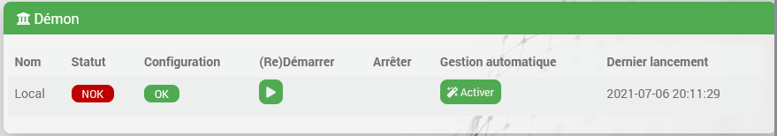

# Demonios y adicciones

## Introduction

En el [tutorial](/es_ES/dev/tutorial_plugin) y el [documentación](/es_ES/dev/plugin_template) Aprendiste a codificar tu primer complemento con acciones relativamente simples activadas por el usuario mediante un comando de acción o mediante una tarea programada por el núcleo (crons)).
El complemento es entonces capaz de recuperar información ocasionalmente (por ejemplo, a través de una solicitud http) o realizar todo tipo de operaciones, siempre que pueda codificarse en PHP.

Puede que necesites más que eso, algunos ejemplos sin ser exhaustivos:

- utilizar recursos del sistema, por ejemplo, una llave USB u otro hardware (bluetooth...)
- mantener una conexión con un sistema remoto (en una red local o en Internet, pero no jeedom)
- mantener los procesos activos en segundo plano, lo cual no es el caso del código PHP que sólo "vive" durante la ejecución de la solicitud http
- hacer procesamiento en tiempo real

Para esto, la mayoría de las veces utilizamos un "daemon".
Que no cunda el pánico, ya todo está planeado en el centro de Jeedom para ayudarnos a poner a este demonio en su lugar y lo detallaremos aquí.

## Estructura de archivos demonio

El código y/o ejecutable de su demonio obviamente debe estar en el árbol de su complemento y, por lo tanto, debe incluirse y entregarse con el archivo al instalar un complemento.
No existe una regla estricta sobre la ubicación exacta de su demonio, sin embargo, la convención dicta que lo coloque en el subdirectorio `./recursos/` del complemento.

En el complemento de plantilla encontrará los conceptos básicos para implementar un demonio en Python y este es el ejemplo que usaremos en esta documentación; sin embargo, usted es libre de desarrollar su demonio en el lenguaje de su elección siempre que pueda ejecutarse en el [plataformas soportadas por Jeedom](/es_ES/compatibility/).
La mayoría de los demonios del complemento Jeedom están en python o nodeJs, pero también hay algunos en .netCore y ciertamente otras tecnologías.

También encontrará algunos métodos útiles para un demonio nodeJs que quizás se detallarán en una versión futura de esta documentación. Por ahora te invito a consultar la comunidad dev para alinearte con otros desarrolladores en todo lo relacionado con NodeJs, principalmente en la versión a usar.

Estructura del directorio de plantillas:


### el demonio pitón

En el complemento de plantilla, el directorio del demonio se llamaba "demond" y el demonio en sí se llamaba "demond.py".
Estos nombres son arbitrarios, eres libre de cambiarlos.
La convención es tomar el ID del complemento seguido de la letra 'd'. Lo que da por ejemplo para el complemento `blea` el directorio `./resources/blead/` que contiene, entre otras cosas, el archivo `blead.py`, siendo este archivo el punto de partida del demonio.

> **CONSEJO**
>
> No dudes en inspirarte en los complementos oficiales con daemon para comprender los detalles, como blea, openzwave o sms.

### el paquete jeedom para un demonio de Python

Jeedom proporciona con el complemento de plantilla un paquete de Python que ofrece clases y métodos básicos útiles para administrar el demonio y la comunicación entre el demonio y el código php de su complemento.
Estas clases están ubicadas en el directorio `./resources/demond/jeedom/jeedom.py` (visible en la captura de pantalla anterior).
Para comenzar no necesitas conocer los detalles de implementación de estas clases y métodos, así que aquí solo tendrás un resumen de lo que permiten.

#### clase jeedom_utils()

Esta clase es un conjunto de métodos estáticos útiles como `convert_log_level` para convertir el nivel de registro recibido de jeedom en un nivel de registro de la clase de Python `logging` o `find_tty_usb` para devolver una lista de dispositivos en el sistema.
No vamos a detallarlos todos aquí, el nombre de cada método es bastante explícito, los descubrirás sumergiéndote en el código.

#### clase jeedom_serial()

Esta clase encapsula la lectura y escritura en un dispositivo.
Nuevamente no vamos a detallar la clase, los métodos hablan por sí solos, solo debes saber que existe si lo necesitas.

> **Atención**
>
> Si su demonio no necesita realizar este tipo de acción, debería considerar no usar ni importar esta clase porque el paquete Python `serial` no está instalado de forma predeterminada y en este caso su demonio no se iniciará (problema visto varias veces en la comunidad). Volveremos a esto en la gestión de dependencias.

#### clase jeedom_socket() y jeedom_socket_handler()

No usarás la clase `jeedom_socket_handler()` directamente, solo se usa para `jeedom_socket()`.
El propósito de `jeedom_socket()` es asegurar la comunicación descendente (desde su código php hasta el demonio).
Cuando su complemento necesite enviar una instrucción a su demonio, puede hacerlo a través de este socket; verá un ejemplo más adelante en esta documentación.

Entonces la clase abre un socket tcp y escucha. Cuando se recibe un mensaje, se coloca en una cola que luego será leída por su demonio, volveremos a eso.

Nuevamente, no está obligado a utilizar este mecanismo, es libre de crear otra cosa (servidor http, por ejemplo), pero esto es lo que proporciona Jeedom, es liviano y funciona muy bien.

#### clase jeedom_com()

Esto garantiza la comunicación ascendente, desde el demonio hasta su código php.
Básicamente, utilizará `send_change_immediate()` al principio, lo que le permite enviar una carga útil json a Jeedom a través de una solicitud http. Es muy sencillo y efectivo, veremos un ejemplo más adelante.

### Esqueleto del demonio pitón

Ahora que conocemos el entorno, podemos fijarnos en la parte que más nos interesa: el demonio y lo que tendremos que codificar.

Por lo tanto, veremos en detalle el esqueleto de un demonio propuesto por Jeedom, abra el archivo `demond.py` y comenzaremos con las últimas líneas que de hecho son el inicio del programa:

```python
_log_level = "error"
_socket_port = 55009 # para modificar
_socket_host = 'localhost'
_dispositivo = 'automático'
_pidfile = '/tmp/demond.pid'
_apikey = ''
_llamar de vuelta = ''

para arg en sys.argv:
    si arg.startswith("--loglevel="):
        temperatura, _log_level = arg.split("=")
    elif arg.startswith("--socketport="):
        temperatura, _socket_port = arg.split("=")
    elif arg.startswith("--sockethost="):
        temperatura, _socket_host = arg.split("=")
    elif arg.startswith("--pidfile="):
        temperatura, _pidfile = arg.split("=")
    elif arg.startswith("--apikey="):
        temperatura, _apikey = arg.split("=")
    elif arg.startswith("--dispositivo="):
        temperatura, _dispositivo = arg.split("=")

_socket_port = int(_socket_port)

jeedom_utils.set_log_level(_log_level)

logging.info('Iniciar demonio')
logging.info('Nivel de registro : '+cadena(_nivel_registro))
logging.info('Puerto de socket : '+cadena(_socket_port))
logging.info('Host de socket : '+cadena(_socket_host))
logging.info('archivo PID : '+cadena(_pidfile))
logging.info('Apikey : '+cadena(_apikey))
logging.info('Dispositivo : '+cadena(_dispositivo))

señal.señal(señal.SIGINT, controlador)
señal.señal(señal.SIGTERM, controlador)

try:
    jeedom_utils.write_pid(str(_pidfile))
    jeedom_com = jeedom_com(apikey = _apikey,url = _callback,cycle=_cycle)
    si no jeedom_com.test():
        logging.error('Problemas de comunicación de red. Por favor corrija la configuración de su red Jeedom.')
        shutdown()
    jeedom_socket = jeedom_socket(puerto=_socket_port, dirección=_socket_host)
    listen()
excepto excepción como e:
    logging.error('Error fatal : '+cadena(e)))
    shutdown()
```

Algunas inicializaciones de variables:

```python
_log_level = "error" # el nivel de registro predeterminado, en formato de texto enviado por Jeedom
_socket_port = 55009 # el puerto que su demonio usará por defecto para abrir el socket de escucha Jeedom, para modificar.
_socket_host = 'localhost' # la interfaz en la que abrir el socket, a priori no cambia.
_device = 'auto' # es inútil si no estás usando un dispositivo de hardware
_pidfile = '/tmp/demond.pid' # emplacement par défaut du pidfile, ce fichier est utiliser par Jeedom pour savoir si votre démon est démarrer ou pas; nom du démon à modifier comme expliqué ci-dessus;
_apikey = '' # apikey para autenticar la comunicación entre Jeedom y tu demonio
_llamar de vuelta = '' ## la URL de devolución de llamada para enviar notificaciones a Jeedom (y a su código php)
```

> **Atención**
>
> Tienes que tener cuidado al elegir el puerto que vas a utilizar para tu socket, este es un posible punto de mejora bajo pena, porque no existe ningún mecanismo para evitar colisiones: Entonces, si otro complemento usa el mismo puerto que tú, esto obviamente planteará un problema. Por el momento, el único método para hacer su elección es buscar entre los complementos existentes los puertos ya utilizados y alinearse entre dev y community (ya hay temas abiertos sobre este tema)). Además, es importante dejar esto configurable por el usuario en la configuración de su complemento para que el número de puerto pueda modificarse si ocurriera tal conflicto.

Luego recuperamos los argumentos recibidos en la línea de comando, esta línea de comando será generada por su código php, volveremos a ella.
Depende de usted eliminar lo que no es útil (como el argumento del dispositivo) o agregar otros como usuario/pswd si su demonio debe conectarse a un sistema remoto.

```python
para arg en sys.argv:
    si arg.startswith("--loglevel="):
        temperatura, _log_level = arg.split("=")
    elif arg.startswith("--socketport="):
        temperatura, _socket_port = arg.split("=")
    elif arg.startswith("--sockethost="):
        temperatura, _socket_host = arg.split("=")
    elif arg.startswith("--pidfile="):
        temperatura, _pidfile = arg.split("=")
    elif arg.startswith("--apikey="):
        temperatura, _apikey = arg.split("=")
    elif arg.startswith("--dispositivo="):
        temperatura, _dispositivo = arg.split("=")
```

Luego hay algunas líneas de registro y estas dos líneas, clásicas en Python, que simplemente registran el método que se llamará en el caso de que se reciban estas dos señales de interrupción, lo que permitirá detener el demonio:

```python
señal.señal(señal.SIGINT, controlador)
señal.señal(señal.SIGTERM, controlador)
```

y el método `handler` que está definido un poco más arriba en el demonio:

```python
def controlador(signum=Ninguno, marco=Ninguno):
    logging.debug("Señal % que capté, saliendo..." % int(signum))
    shutdown()
```

que solo agrega un registro y llama al método `shutdown()` definido justo debajo:

```python
apagado definitivo():
    logging.debug("Apagar")
    logging.debug("Eliminando el archivo PID " + str(_pidfile))
    try:
        os.remove(_pidfile)
    except:
        pass
    try:
        jeedom_socket.cerrar()
    except:
        pass
    try:
        jeedom_serial.cerrar()
    except:
        pass
    logging.debug("Salir 0")
    sys.stdout.flush()
    sistema operativo._exit(0)
```

Es en este método que debes escribir el código a ejecutar en caso de que se apague el demonio, por ejemplo cerrar sesión en el sistema remoto y cerrar correctamente las conexiones abiertas.

> **Atención**
>
> debes adaptar este método y eliminar el código que no es necesario en tu caso, en particular el try/except en `jeedom_serial.close()` si no usas esta clase.

Si volvemos a iniciar el demonio, aquí tenéis el resto comentado:

```python
try:
    jeedom_utils.write_pid(str(_pidfile)) # escribe el archivo pid que el núcleo jeedom monitoreará para determinar si el demonio está iniciado
    jeedom_com = jeedom_com(apikey = _apikey,url = _callback,cycle=_cycle) # creación del objeto jeedom_com
    si no jeedom_com.test(): #primera prueba para verificar que la URL de devolución de llamada sea correcta
        logging.error('Problemas de comunicación de red. Por favor corrija la configuración de su red Jeedom.')
        shutdown()
    jeedom_socket = jeedom_socket(port=_socket_port, dirección=_socket_host) # declaramos el socket para recibir órdenes de jeedom
    escucha() # y escuchamos
excepto excepción como e:
    logging.error('Error fatal : '+cadena(e)))
    shutdown()
```

El método `listen()` definido al principio del archivo:

```python
Definitivamente escucha():
    jeedom_socket.abierto()
    try:
        mientras 1:
            tiempo.dormir(0.5)
            conector_lectura()
    excepto interrupción del teclado:
        shutdown()
```

Aquí no hay nada que modificar, podemos ver que el socket está abierto y luego un bucle infinito para leer el socket cada medio segundo

El método `read_socket()`

```python
def read_socket():
    JEEDOM_SOCKET_MESSAGE global
    si no es JEEDOM_SOCKET_MESSAGE.empty():
        logging.debug("Mensaje recibido en el socket JEEDOM_SOCKET_MESSAGE")
        mensaje = json.loads(jeedom_utils.stripped(JEEDOM_SOCKET_MESSAGE.get()))
        si mensaje['apikey'] != _apikey:
            logging.error("Apikey no válido del socket : " + cadena(mensaje))
            return
        try:
            imprimir 'leer'
        excepto excepción, e:
            logging.error('Error al enviar comando al demonio : '+cadena(e)))
```

La variable `JEEDOM_SOCKET_MESSAGE` es una `queue()` de Python impulsada por la clase `jeedom_socket()` como se vio anteriormente.

Si la cola no está vacía cargamos el json y comprobamos que la clave api recibida con el mensaje corresponde a la recibida al iniciar el daemon (`_apikey`) entonces podemos leer el mensaje y realizar nuestras acciones en el try/except:

```python
        try:
            imprimir 'leer'
        excepto excepción, e:
            logging.error('Error al enviar comando al demonio : '+cadena(e)))
```

Entonces, en lugar de `imprimir 'leer'`, depende de usted leer los elementos relevantes del mensaje que su complemento habrá enviado y activar las acciones o llamar a sus clases o métodos específicos de su complemento.

Desde aquí tienes un demonio que se puede ejecutar incluso si aún no hace nada (ese es tu trabajo)).

## Adaptando el código php del complemento

Tener un demonio y comprender su estructura es muy bueno, pero faltan algunos elementos clave para que su complemento (código php) pueda controlar este demonio y para que el núcleo también esté informado de que existe.

### plugin_info/info.json

En el archivo de información.json de tu plugin, debes agregar la propiedad `hasOwnDeamon` y asignarle el valor `true`, ejemplo:

```json
{
    "id" : "pluginID",
    "name" : "pluginName",
    ...
    "hasDependency" : true,
    "hasOwnDeamon" : true,
    "maxDependancyInstallTime" : 10,
    ...
}
```

Veremos el uso de `hasDependency` y `maxDependancyInstallTime` más adelante.

### Administrar el demonio en su clase eqLogic

En la clase eqLogic de su complemento existen algunos métodos a implementar para la gestión adecuada del demonio.

#### Función demon_info()

El núcleo llamará a la función `deamon_info()` cuando se muestre el siguiente marco en la página de configuración de su complemento, debe existir:



Normalmente se verá así: la matriz devuelta y las claves utilizadas en esta matriz son obviamente importantes.
Puede copiar/pegar el código siguiente tal cual y adaptar el código al final de la función para verificar la configuración necesaria para su complemento.

```php
    función estática pública deamon_info() {
        $devolver = array();
        $return['log'] = __CLASS__;
        $return['state'] = 'nok';
        $pid_file = jeedom::getTmpFolder(__CLASS__) . '/deamon.pid';
        si (archivo_existe ($pid_archivo)) {
            si (@posix_getsid(trim(file_get_contents($pid_file)))) {
                $return['state'] = 'ok';
            } demás {
                shell_exec(sistema::getCmdSudo() . 'rm-rf ' . $pid_file . ' 2>&1 > /dev/null');
            }
        }
        $return['launchable'] = 'ok';
        $user = config::byKey('user', __CLASS__); // exemple si votre démon à besoin de la config user,
        $pswd = config::byKey('password', __CLASS__); // password,
        $clientId = config::byKey('clientId', __CLASS__); // et clientId
        si ($usuario == '') {
            $return['launchable'] = 'nok';
            $return['launchable_message'] = __('Le nom d\'utilisateur n\'est pas configuré', __FILE__);
        } elseif ($pswd == '') {
            $return['launchable'] = 'nok';
            $return['launchable_message'] = __('Le mot de passe n\'est pas configuré', __FILE__);
        } elseif ($identificador de cliente) == '') {
            $return['launchable'] = 'nok';
            $return['launchable_message'] = __('La clé d\'application n\'est pas configurée', __FILE__);
        }
        devolver $regresar;
    }
```

> **Atención**
>
> No hay ningún error tipográfico en el ejemplo, el método se llama `deamon_info()` y no `daemon_info`, el error está en el núcleo.

La clave `state` obviamente corresponde al estado mostrado en la pantalla, podemos leer arriba que probamos la presencia de nuestro "pid_file" para saber si el demonio se está ejecutando o no.

La clave `launchable` corresponde a la columna "Configuración" del marco y por tanto podemos comprobar si la configuración está completa y es correcta para poder iniciar el demonio. `launchable_message` le permite mostrar un mensaje al usuario en caso de "NOK"

#### Función demon_start()

La función `deamon_start()` es, como su nombre indica, el método que será llamado por el núcleo para iniciar tu demonio.
Puede copiar/pegar el código siguiente tal cual y modificar las líneas indicadas.

```php
    función estática pública deamon_start() {
        self::demonio_parada();
        $deamon_info = self::deamon_info();
        si ($deamon_info['launchable'] != 'ok') {
            throw new Exception(__('Compruebe la configuración', __FILE__));
        }

        $path = realpath(dirname(__FILE__) . '/../../resources/demond'); // répertoire du démon à modifier
        $cmd = system::getCmdPython3(__CLASS__) . " {$path}/demond.py"; // nom du démon à modifier
        $cmd .= ' --loglevel ' . log::convertLogLevel(log::getLogLevel(__CLASS__));
        $cmd .= ' --socketport ' . config::byKey('socketport', __CLASS__, '55009'); // port par défaut à modifier
        $cmd .= ' --callback ' . network::getNetworkAccess('internal', 'http:127.0.0.1:port:comp') . '/plugins/template/core/php/jeeTemplate.php'; // chemin de la callback url à modifier (voir ci-dessous)
        $cmd .= ' --user "' . trim(str_replace('"', '\"', config::byKey('user', __CLASS__))) . '"'; // on rajoute les paramètres utiles à votre démon, ici user
        $cmd .= ' --pswd "' . trim(str_replace('"', '\"', config::byKey('password', __CLASS__))) . '"'; // et password
        $cmd .= ' --apikey ' . jeedom::getApiKey(__CLASS__); // l'apikey pour authentifier les échanges suivants
        $cmd .= ' --pidentificación ' . jeedom::getTmpFolder(__CLASS__) . '/deamon.pid'; // et on précise le chemin vers le pidentificación file (ne pas modifier)
        log::add(__CLASS__, 'información', 'lanzamiento del demonio');
        $result = exec($cmd . ' >> ' . log::getPathToLog('template_daemon') . ' 2>&1 &'); // 'template_daemon' est le nom du registro pour votre démon, vous devez nommer votre registro en commençant par le pluginidentificación pour que le fichier apparaisse dans la page de config
        $i = 0;
        mientras ($i < 20) {
            $deamon_info = self::deamon_info();
            si ($deamon_info['estado'] == 'ok') {
                break;
            }
            sleep(1);
            $i++;
        }
        si ($i >= 30) {
            log::add(__CLASS__, 'error', __('No se puede iniciar el demonio, verifique el registro', __FILE__), 'unableStartDeamon');
            devolver falso;
        }
        message::removeAll(__CLASS__, 'unableStartDeamon');
        devolver verdadero;
    }
```

Modifique sólo las líneas con un comentario, el resto debe permanecer sin cambios.

Tenga en cuenta que comenzamos deteniendo el demonio, esto es para gestionar el reinicio.
Luego comprobamos si el demonio realmente se puede iniciar con el método `deamon_info()` y generamos la línea de comando en la variable `$cmd` para iniciar nuestro demonio, aquí con python3. Tenga en cuenta el uso de la `función del sistema::getCmdPython3(__CLASS__)` que devolverá la ruta a python3 para usar esto para que sea compatible con Debian 12 si sus dependencias están instaladas por núcleo.

#### Función demon_stop()

Este método se utilizará para detener el demonio: Recuperamos el pid del demonio, que fue escrito en el "pid_file" y enviamos la eliminación del sistema al proceso.

```php
    función estática pública deamon_stop() {
        $pid_file = jeedom::getTmpFolder(__CLASS__) . '/deamon.pid'; // ne pas modifier
        si (archivo_existe ($pid_archivo)) {
            $pidentificación = intval(trim(file_get_contents($pid_file)));
            system::matar($pid);
        }
        system::matar('template.py'); // nombre del demonio a modificar
        sleep(1);
    }
```

Llegado aquí declaraste al demonio en la información.json e implementé los 3 métodos necesarios para que el núcleo Jeedom pueda iniciar y detener su demonio, así como mostrar su estado. Los requisitos previos están en su lugar.

### Comunicación entre demonio y código PHP

Queda por gestionar la comunicación hacia y desde el demonio. En el código Python ya hemos visto cómo se gestiona esto: como recordatorio, los métodos `listen()` y `read_socket()` que escuchan en un socket y el método `send_change_immediate()` para enviar una carga útil json al código php.

Por tanto, es necesario gestionar el equivalente en el lado PHP.

#### Envía un mensaje al demonio

Esta función no existe en el núcleo y no es estándar para todos los complementos de Jeedom, tampoco es obligatoria.
Esta es la función que uso (@Mips) en cada uno de mis complementos que tienen un demonio, la pongo aquí y puedes hacer con ella lo que quieras;-)

Por lo tanto, recibe una matriz de valores como parámetro y se encarga de enviarla al socket del demonio que, por lo tanto, puede leer esta matriz en el método `read_socket()` que vimos anteriormente.

```php
    función estática pública sendToDaemon($params) {
        $deamon_info = self::deamon_info();
        si ($deamon_info['estado'] != 'ok') {
            lanzar una nueva excepción ("El demonio no se ha iniciado");
        }
        $params['apikey'] = jeedom::getApiKey(__CLASS__);
        $payLoad = json_encode($params);
        $socket = socket_create(AF_INET, SOCK_STREAM, 0);
        socket_connect($socket, '127.0.0.1', configuración::byKey('socketport', __CLASS__, '55009')); //puerto predeterminado de tu complemento para modificar
        socket_write($socket, $payLoad, strlen($payLoad));
        socket_close($socket);
    }
```

Lo que hay en la matriz `$params` y cómo usa esos datos en su demonio depende de usted, depende de lo que haga su complemento.

Como recordatorio, esta matriz se recuperará en el método `read_socket()`; fragmento de código Python:

```python
        si mensaje['apikey'] != _apikey:
            logging.error("Apikey no válido del socket : " + cadena(mensaje))
            return
        try:
            imprimir 'leer'
        excepto excepción, e:
            logging.error('Error al enviar comando al demonio : '+cadena(e)))
```

Podemos ver claramente la clave "apikey" agregada por el código php que será leída por el código Python en la tabla "mensaje""

#### Recibe un mensaje del demonio

Para hacer esto debemos agregar un archivo a nuestro complemento en la carpeta `./core/php/`. Por convención, llamaremos a este archivo `jee[pluginId].php`. `/plugins/[ID del complemento]/core/php/jee[ID del complemento]].Por lo tanto, php` será la ruta a utilizar como URL de devolución de llamada en el método `deamon_start()`

Aquí está el contenido básico que puede copiar/pegar en este archivo:

```php
<?php

intentar {
    require_once nombredir(__FILE__) . "/../../../../core/php/core.inc.php";

    si (!jeedom::apiAccess(init('apikey'), 'template')) { //reemplace la plantilla con la identificación de su complemento
        echo __('No estás autorizado a realizar esta acción', __FILE__);
        die();
    }
    si (init('prueba') != '') {
        hacer eco 'OK';
        die();
    }
    $result = json_decode(file_get_contents("php://input"), true);
    si (!is_array($resultado)) {
        die();
    }

    si (isset($resultado['clave1'])) {
        // hacer algo
    } elseif (isset($resultado['clave2'])) {
        // hacer algo más
    } demás {
        log::add('plantilla', 'error', 'mensaje desconocido recibido del demonio'); //reemplaza la plantilla con la identificación de tu complemento
    }
} captura (Excepción $e) {
    log::add('plantilla', 'error', displayException($e)); //reemplaza la plantilla con la identificación de tu complemento
}
```

El código comienza validando que el apikey sea correcto:

```php
    si (!jeedom::apiAccess(init('apikey'), 'template')) { //reemplace la plantilla con la identificación de su complemento
        echo __('No estás autorizado a realizar esta acción', __FILE__);
        die();
    }
```

La primera prueba sirve como método de prueba al iniciar el demonio (consulte llamar a `jeedom_com.test()` en código demonio):

```php
    si (init('prueba') != '') {
        hacer eco 'OK';
        die();
    }
```

y finalmente cargamos la carga útil que decodificamos en la tabla `$result`:

```php
    $result = json_decode(file_get_contents("php://input"), true);
    si (!is_array($resultado)) {
        die();
    }
```

Luego depende de usted leer la tabla y realizar las acciones en su complemento en consecuencia, ejemplo:

```php
    si (isset($resultado['clave1'])) {
        // hacer algo
    } elseif (isset($resultado['clave2'])) {
        // hacer algo más
    } demás {
        log::add('plantilla', 'error', 'mensaje desconocido recibido del demonio'); //reemplaza la plantilla con la identificación de tu complemento
    }
```

El código Python para enviar el mensaje se verá así:

```python
jeedom_com.send_change_immediate({'clave1' : 'valor1', 'clave2' : 'value2' })
```

Listo, tienes un demonio completamente funcional y puedes comunicarte en ambas direcciones entre tu demonio y tu código php. La parte más difícil aún está por hacer: lógica del demonio de código.

## Dependencias

Cuando escribimos un demonio, muy a menudo necesitaremos bibliotecas externas además de nuestras propias clases.

En Debian, normalmente usaremos las herramientas apt para instalar los paquetes necesarios y para python3, usaremos pip3.

Y para gestionar esto, una vez más, todo está planeado en el núcleo de Jeedom para ayudarnos a través de dos métodos distintos:

1. El método procesal.
   Este método era el único método posible con las versiones jeedom anteriores a la 4.2
1. El método del archivo json de configuración.
   Este método apareció con la versión 4.2 desde el núcleo de Jeedom.

Ambos métodos se pueden implementar en el mismo complemento.

- Si ambos métodos se implementan en un complemento:
  - Núcleos antes de 4.2 utilizará el método procesal.
  - Núcleo 4.2 y posteriores utilizarán el método del archivo de configuración json.
- Si solo el método del procedimiento se implementa en un complemento:
  - Todos los núcleos utilizarán este método.
- Si solo se implementa el método del archivo de configuración json en un complemento.
  - El complemento no será compatible con versiones principales anteriores a la 4.2

Ambos métodos tienen sus ventajas y desventajas. Depende de usted elegir según su situación.

### Declaración en plugin_info/info.json

En ambos casos, debes adaptar tu archivo `info.json`.
Mismo ejemplo que para la declaración del demonio, debes agregar la propiedad `hasDependency` y asignar el valor `true`:

```json
{
    "id" : "pluginID",
    "name" : "pluginName",
    ...
    "hasDependency" : true,
    "hasOwnDeamon" : true,
    "maxDependancyInstallTime" : 30,
    ...
}
```

La propiedad `maxDependancyInstallTime` es el tiempo en minutos después del cual el núcleo considerará que la instalación no fue exitosa.
 En este caso, el modo automático del demonio se desactivará y se publicará un mensaje en el centro de notificaciones.
 Si esta propiedad no está definida, el retraso predeterminado será de 30 minutos.

> **CONSEJO**
>
> El script de instalación no se interrumpirá, por lo que eventualmente podrá completarse exitosamente. Este es solo el tiempo después del cual el núcleo ya no espera y ya no muestra el progreso.

### El método del archivo de configuración json

#### Creación de los archivos plugin_info/packages.json

La sintaxis de este archivo se describe aquí. Ver también
[el artículo de lanzamiento en el blog](https://blog.jeedom.com/6170-introduction-jeedom-4-2-installation-de-dependance/).

Este archivo puede contener cualquiera de las siguientes secciones:

##### pre-install: la ruta a un script para ejecutar antes de la instalación

Ejemplo :

```json
{
  "pre-install" : {
    "script" : "complementos/[pluginID]/resources/post-install.sh"
  }
```

##### post-install

Esta puede ser la ruta a un script que se ejecutará después de la instalación o la acción de reiniciar Apache.
Ejemplo :

```json
{
  "post-install" : {
    "reiniciar_apache" : true,
    "script" : "complementos/[pluginID]/resources/post-install.sh"
  }
```

##### apt: dependencias de debian

Exemple

```json
{
  "apt" : {
    "libav-tools" : {"alternative" : ["ffmpeg"]},
    "ffmpeg" : {"alternative" : ["libav-herramientas"]},
    "python-pil" : {},
    "php-gd" : {}
  }
}
```

Para cada paquete, podemos especificar "versión" para establecer una versión, "alternativa" si está disponible,
 `opcional` si es opcional, `reinstalar` para forzar la reinstalación del paquete, `comentario` para agregar un comentario gratuito.

##### pip3: Dependencias de Python3

Exemple:

```json
{
  "apt" : {
    "python3-pyudev" : {},
    "solicitudes de python3" : {},
    "python3-dev" : {}
  },
  "pip3" : {
    "wheel" : {},
    "pyserial" : {},
    "tornado" : {},
    "zigpy" : {"reinstall" : true},
    "zha-quirks" : {"reinstall" : true},
    "zigpy-znp" : {"reinstall" : true},
    "zigpy-xbee" : {"reinstall" : true},
    "zigpy-deconz" : {"reinstall" : true},
    "zigpy-zigate" : {"reinstall" : true},
    "zigpy-cc" : {"reinstall" : true},
    "bellows" : {"reinstall" : true}
  }
}
```

> *Pista*
>
> Desde Jeedom versión 4.4.9, el núcleo puede manejar la instalación de dependencias de python3 en Debian 12. Las dependencias se instalarán en un *friv* (entorno virtual)
> Debe adaptar su complemento en consecuencia y ya no codificar la ruta a `python3` sino usar `system::getCmdPython3(__CLASS__)` en su lugar.
> Exemple: `$cmd = sistema::getCmdPython3(__CLASS__) . " {$path}/demond.py";`

##### npm: dependencias para NodeJS

Para NodeJS las dependencias están en otro archivo de 'paquetes'.json` en su propio formato,
colocado en el directorio `/resources` por ejemplo, es este archivo el que se indicará en el de Jeedom:

```json
{
  "apt" : {
    "nodejs" : {}
  },
  "npm" : {
    "complementos/dyson/recursos/dysond"  : {}
  }
}
```

##### composer: para instalar otra dependencia de PHP

no hay ningún ejemplo a la mano; la sintaxis es similar a la de otros paquetes, con la palabra clave `compose`.

##### Dependencias de otro complemento

Si un complemento requiere la instalación de otro complemento, esto también es posible con la siguiente sintaxis;
el complemento debe ser gratuito o ya comprado :

```json
{
    "plugin":{
        "mqtt2": {}
    }
}
```

### El método procesal

Hay 2 requisitos previos que detallaremos enseguida.

#### Instalando dependencias

En tu clase eqLogic debes agregar esta función si no existe. Puedes copiar/pegar este tal cual sin cambiar nada

```php
    función estática pública dependency_install() {
        log::eliminar(__CLASS__. '_actualizar');
        return array('script' => dirname(__FILE__) . '/../../resources/install_#stype#.sh ' . jeedom::getTmpFolder(__CLASS__) . '/dependencia', 'registro' => registro::getPathToLog(__CLASS__. '_update'));
    }
```

Esta función comienza eliminando el registro de la instalación anterior, si existía, y luego devolverá al núcleo el comando del script a ejecutar y la ubicación del registro.

Tenga en cuenta que el archivo de script devuelto se denomina `install_#stype#.sh`. De hecho, `#stype#`será reemplazado dinámicamente por el núcleo con la herramienta de administración de paquetes que se utilizará según el sistema en el que esté instalado Jeedom. Entonces `#stype#`será reemplazado por `apt` en un sistema Debian.
Esto hace posible ofrecer scripts de instalación de dependencias para varios sistemas y, por lo tanto, admitir algo distinto de Debian/apt, que es el mínimo imprescindible y el único que gestionaremos aquí.

El primer argumento: `jeedom::getTmpFolder(__CLASS__) . '/dependence'` es el archivo utilizado para monitorear el progreso de la instalación (el porcentaje que aparece en la pantalla durante la instalación).

Eso es todo por la parte de php, ahora tienes que crear el script en `./resources/install_apt.sh` y obviamente el contenido del script dependerá de tu complemento y de los paquetes que quieras instalar.

Aquí hay un ejemplo de un script bastante simple de uno de mis complementos, pero puedes hacerlo mucho más completo y avanzado:

> **Atención**
>
> A partir de Debian 12, es obligatorio instalar los paquetes de Python en un entorno virtual; por lo tanto, este script de ejemplo ya no funcionará tal cual, depende de usted adaptarlo en consecuencia.
>
> Je vous invite également à consulter cette documentación qui offre une alternative: <https://github.com/Mips2648/dependance.lib/blob/master/pyenv.md>

```bash
PROGRESS_FILE=/tmp/jeedom/template/dependence #reemplace la plantilla con su ID de complemento

si [ ! -z $1 ]; entonces
    PROGRESS_FILE=$1
fi
toque ${PROGRESS_FILE}
eco 0 > ${PROGRESS_FILE}
eco "*************************************"
eco "*   Iniciar instalación de dependencias  *"
eco "*************************************"
eco $(fecha)
eco 5 > ${PROGRESS_FILE}
apto-limpiarse
eco 10 > ${PROGRESS_FILE}
apt-obtener actualización
eco 20 > ${PROGRESS_FILE}

eco "*****************************"
echo "Instalar módulos usando apt-get"
eco "*****************************"
apt-get install -y python3 python3-solicitudes python3-pip python3-voluptuoso python3-bs4
eco 60 > ${PROGRESS_FILE}

eco "*************************************"
echo "Instalar las bibliotecas de Python necesarias"
eco "*************************************"
python3 -m pip instalar "aiohttp"
eco 80 > ${PROGRESS_FILE}

eco 100 > ${PROGRESS_FILE}
eco $(fecha)
eco "***************************"
eco "*      Instalación finalizada      *"
eco "***************************"
habitación ${PROGRESS_FILE}
```

Detallaremos unas líneas:

Empezamos definiendo la ubicación por defecto del archivo de progreso en caso de que no hayamos realizado correctamente el paso anterior...
Y usamos el primer argumento recibido como ubicación porque hicimos correctamente el paso anterior;-).

```bash
PROGRESS_FILE=/tmp/jeedom/template/dependence #reemplace la plantilla con su ID de complemento

si [ ! -z $1 ]; entonces
    PROGRESS_FILE=$1
fi
```

Líneas como `echo 60 > ${PROGRESS_FILE}` obviamente se usan para devolver el progreso: Para tranquilizar al usuario, lo agregamos regularmente hasta llegar a 100 (normalmente se estresan cuando supera 100, por lo que evitamos).

Algunos consejos:

- No hagas "apt-get Upgrade"! No sabes qué hay en la máquina y no es tu trabajo actualizarlo todo.
- No uses `apt` sino `apt-get`. `apt` está hecho para uso interactivo y generará una advertencia.
- Agregue el indicador "-y" cuando sea necesario para confirmar las indicaciones; de lo contrario, el script se detendrá con una solicitud como "¿Quieres continuar [s/n]" y el usuario será bloqueado?.
- Prefiera la sintaxis `python3 -m pip install...` en lugar de `pip3 install...` para instalar paquetes de Python porque este último causará problemas si `pip3` (o `pip` si está usando python v2) no lo hace. no está relacionado con la misma versión que python3: si por ejemplo python3 apunta a la versión 3.7 y pip3 puntos a 3.9 o peor 2.7; No sabe lo que se hizo en el sistema y no es inmune a un problema de este tipo en la máquina del usuario; hay docenas de casos enumerados en la comunidad.

> **Atención**
>
> Es muy importante instalar todos los paquetes necesarios y prestar especial atención a aquellos que muchas veces ya están instalados...pero no siempre. Hay problemas frecuentes con los paquetes `python3-requests`, `python3-pip` y/o `serial`. Estos no están preinstalados en un Debian básico, pero muy a menudo ya están instalados mediante otro complemento... a menos que su complemento sea el primero y en este caso su demonio no se iniciará. Sucede con más frecuencia de lo que piensas.

#### Conocer el estado


Por lo tanto, es nuestra función php `dependancy_install()` la que será llamada por el núcleo y la que lanzará nuestro script `./resources/install_apt.sh` cuando el usuario hace clic en el botón "Reiniciar" o automáticamente por el núcleo cuando detecta que las dependencias no están instaladas o no están actualizadas.

Pero, ¿cómo sabe el núcleo el estado y cómo lo muestra en el cuadro anterior?? Gracias a la función `dependancy_info()` que debemos agregar en nuestra clase eqLogic.

Aquí tienes un ejemplo del que puedes tomar la mayoría:

```php
    función estática pública dependency_info() {
        $devolver = array();
        $return['log'] = log::getPathToLog(__CLASS__ . '_update');
        $return['progress_file'] = jeedom::getTmpFolder(__CLASS__) . '/dependance';
        si (file_exists(jeedom::getTmpFolder(__CLASS__) . '/dependance')) {
            $return['state'] = 'in_progress';
        } demás {
            si (ejecutivo (sistema::getCmdSudo() . system::obtener('cmd_check') . '-Ec "python3\-solicitudes|python3\-voluptuoso|python3\-bs4"') < 3) { // adapta la lista de paquetes y el total
                $return['state'] = 'nok';
            } elseif (exec(sistema::getCmdSudo() . 'lista pip3 | grep -Ewc "aiohttp"') < 1) { // adapta la lista de paquetes y el total
                $return['state'] = 'nok';
            } demás {
                $return['state'] = 'ok';
            }
        }
        devolver $regresar;
    }
```

En este ejemplo probamos la presencia de paquetes apt: `system::getCmdSudo() . system::obtener('cmd_check') . '-Ec "python3\-solicitudes|python3\-voluptuoso|python3\-bs4"'`. Aquí queremos `python3-requests`, `python3-voluptuous` y `python3-bs4` y por lo tanto el comando debe devolver 3, de ahí la comparación: `<3`.

Lo mismo para los paquetes de Python: `lista pip3 | grep -Ewc "aiohttp"''. La presencia de `aiohttp` está validada, solo un paquete por lo que comparamos: `<1`;

> **Atención**
>
> A partir de Debian 12, es obligatorio instalar los paquetes de Python en un entorno virtual, por lo que este comando ya no funcionará tal cual, depende de usted adaptarlo en consecuencia.

Entonces es muy simple: la lista de paquetes y el total son los únicos elementos que debes modificar si solo tienes este tipo de verificación de lo contrario será fácil agregar las otras pruebas relevantes en tu caso.
