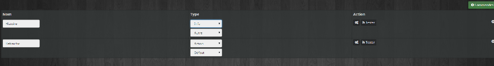

# Para empezar

> **IMPORTANTE**
>
> Este tutorial fue escrito por ZygOm4t1k a quien agradecemos mucho. Puedes encontrar el original [aquí](https://forum.jeedom.com/viewtopic.php?f=27&t=37630#p621495)

Aquí tienes un pequeño trabajo práctico para explicar cómo crear un complemento. Para el ejemplo, crearemos un complemento que devuelva una oración del sitio viedemerde.es .(El complemento será escalable)

No reemplaza en modo alguno el [documentación oficial](https://doc.jeedom.com/es_ES/dev/)

# Crear la base de complementos

Para comenzar debes determinar un nombre y un id (que no debe existir)

Nombre : Vida de mierda
IDENTIFICACIÓN : vdm

Descargue el complemento de plantilla para tener el [base](https://github.com/jeedom/plugin-template/archive/master.zip)

Descomprimir el archivo. Vous obtiendrez un dossier « plugin-template-master » contenant des dossiers 3rparty, core, desktop…

Aquí vamos.

> **IMPORTANTE**
>
>Hay un asistente de configuración disponible para ayudarle a personalizar rápidamente su complemento.
>Esta herramienta interactiva le permite configurar fácilmente el nombre del complemento, indicar si se requiere un demonio y admite la modificación automática de todos los archivos necesarios.
>Su uso simplifica el proceso de configuración y le ahorra un tiempo valioso en el desarrollo de su complemento.

👉 Para iniciar el asistente, abra una terminal en el directorio del complemento de plantilla y ejecute el siguiente comando :

```
php plugin_info/helperConfiguration.php
```

Si no desea utilizar este script, puede seguir los siguientes pasos para cambiar el nombre de los archivos.


Renommez le dossier « plugin-template-master » en « vdm » (l'id) du plugin.

1/ Abra el archivo plugin_info/info.json y editarlo.

```json
{
  "id" : "vdm",
  "name" : "Vida de mierda",
  "description" : "Complemento para recuperar el último vdm",
  "licence" : "AGPL",
  "author" : "Zyg0m4t1k",
  "require" : "3.3.39",
  "category" : "monitoring",
  "changelog" : "",
  "documentation" : "",
  "language" : "",
  "compatibility" : ""
}
```

Copia y pega el código de arriba.

Cambié la identificación *(vdm)*, el nombre, agregó una descripción, autor y categoría.

requerir : versión mínima de jeedom para tener acceso al complemento en el mercado.

Registro de cambios, documentación, idioma, compatibilidad nula por el momento. Volveré a ello más tarde

2/ Cambiaremos el nombre de los archivos necesarios para que Jeedom reconozca el complemento

- Cambie el nombre del archivo core/ajax/template.ajax.php a vdm.ajax.php

- Cambie el nombre del archivo core/class/template.class.php a vdm.clase.php y ábrelo para editarlo.

Remplacez

```php
plantilla de clase extiende eqLogic
```

par

```php
la clase vdm extiende eqLogic
```

------------------------

```php
plantilla de claseCmd extiende cmd
```

par

```php
clase vdmCmd extiende cmd
```

- Cambie el nombre del archivo core/php/template.inc.php en core/php/vdm.inc.php
- Cambie el nombre del archivo escritorio/php/plantilla.php al escritorio /php/vdm.php y ábrelo

Reemplazar :

```php
$plugin = plugin::byId('template');
```

Par

```php
$plugin = plugin::byId('vdm');
```

------------------------

```html
<legend><i class="fas fa-table"></i> {{Mes templates}}</legend>
```

Par

```html
<legend><i class="fas fa-table"></i> {{Mes équipements}}</legend>
```

------------------------

```php
<?php include_file('desktop', 'template', 'js', 'template');?>
```

Par

```php
<?php include_file('desktop', 'vdm', 'js', 'vdm');?>
```

Y nada mas , **no cambies la linea** ``<?php include_file('core', 'plugin.template', 'js');?>``.

- Cambie el nombre del archivo escritorio/modal/modal.template.php en escritorio/modal/modal.vdm.php

- Cambie el nombre del archivo escritorio/js/template.js al escritorio/js/vdm.js

- Abra el archivo plugin_info/install.php y cambie el nombre de las funciones de la siguiente manera

```php
función vdm_install() {
}

función vdm_update() {
}

función vdm_remove() {
}
```

Aquí el plugin está listo pero queda la personalización y el icono para actualizar : [Documentación para desarrolladores: icono de complemento](https://doc.jeedom.com/es_ES/dev/Icone_de_plugin)

Agregue el ícono a la carpeta plugin_info con el nombre vdm_icon.png

en mi caso


Ahora podemos copiar la carpeta vdm en la carpeta del complemento Jeedom e ir a la administración de complementos. Encontramos el complemento.


Lo activamos y luego plugins/Monitoring/Vie de Merde

Aquí la base está lista. Deberías tener el plugin activo pero de momento no hace nada.

# Órdenes

El objetivo del complemento será recuperar un vdm aleatorio y mostrarlo en el tablero.

Por lo tanto, debe crear un comando de tipo información para almacenar esta información. Elle sera de sous-amable « string » car c'est une chaîne de caractère.

Para el ejemplo agregaremos un comando que actualiza la información. Será por tanto un comando de tipo acción y subtipo otro

-Créez un équipement « vdm1 » en cliquant sur le +. Actívalo y hazlo visible. Elija un artículo y el equipo debería aparecer en el tablero (dependiendo del artículo).

En este momento, no aparecen comandos en la pestaña de comandos ni en el widget.

Abra el archivo core/class/vdm.class.php y busque la función postSave() (lea el documento del complemento de plantilla si aún no lo ha hecho))

Creamos los 2 pedidos

```php
publicación de función públicaGuardar() {
  $información = $this->getCmd(null, 'story');
  si (!is_object($información)) {
    $información = new vdmCmd();
    $info->setName(__('Histoire', __FILE__));
  }
  $info->setLogicalId('story');
  $info->setEqLogic_id($this->getId());
  $info->setType('info');
  $info->setSubType('string');
  $info->save();

  $refresh = $this->getCmd(null, 'refresh');
  si (!is_object($actualizar)) {
    $refresh = new vdmCmd();
    $refresh->setName(__('Rafraichir', __FILE__));
  }
  $refresh->setEqLogic_id($this->getId());
  $refresh->setLogicalId('refresh');
  $refresh->setType('action');
  $refresh->setSubType('other');
  $refresh->save();
}
```

- Créez un autre équipement « vdm2 » en cliquant sur le +. En la pestaña de pedidos, aparecieron los pedidos. Actívalo y hazlo visible. Elija un objeto principal y vea cómo se ve en el panel.

- Enregistrez le premier équipement « vdm1 » pour créer les commandes. Vea también la representación en el widget.

En la pestaña Pedidos deberías ver.



Abrir escritorio/php/vdm.php para encontrar el código html de esta tabla.

```html

<!-- Onglet des commandes de l'équipement -->
<div role="tabpanel" class="tab-pane" id="commandtab">
<a class="btn btn-default btn-sm pull-right cmdAction" data-action="add" style="margin-top:5px;"><i class="fas fa-plus-circle"></i> {{Ajouter une commande}}</a>
<br/><br/>
<div class="table-responsive">
<table id="table_cmd" class="table table-bordered table-condensed">
<thead>
<tr>
<th>{{Id}}</th>
<th>{{Nom}}</th>
<th>{{Type}}</th>
<th>{{Paramètres}}</th>
<th>{{Options}}</th>
<th>{{Action}}</th>
</tr>
</thead>
<tbody>
</tbody>
</table>
</div>
</div><!-- /.tabpanel #commandtab-->

```

En el momento de la visualización, es el script desktop/js/vdm.js que se llama y lanza la función addCmdToTable.

```html

/* Función que permite la visualización de comandos en el equipo */
función agregarCmdToTable(_cmd) {
  si (!isset(_cmd)) {
    var _cmd = {configuración: {} };
  }
  si (!isset(_cmd.configuración)) {
    _cmd.configuración = {};
  }
  vartr='.identificación) + '">';
  tr+=':60px;">';
  tr+='<span class="cmdAttr" data-l1key="id"></span> ';
  tr+= '</td> ';
  tr+= ':300px;ancho:350px;">';
  tr+='<div class="row"> ';
  tr+='<div class="col-xs-7"> ';
  tr+='<input class="cmdAttr form-control input-sm" data-l1key="name" placeholder="{{Nom de la commande}}">';
  tr+= ' : ninguno; margen superior : 5px;" title="{{Información relacionada con el pedido}}">';
  tr+= '<option value=""> {{Ninguno}}</option> ';
  tr+='</select> ';
  tr+= '</div> ';
  tr+='<div class="col-xs-5"> ';
  tr+= ' <a class="cmdAction btn btn-default btn-sm" data-l1key="chooseIcon"><i class="fas fa-flag"></i>{{Icono}}</a> ';
  tr+=' : 10px;"> ';
  tr+= '</div> ';
  tr+= '</div> ';
  tr+= '</td> ';
  tr+='<td> ';
  tr+= '.tipo) + '">' + jeedom.cmd.tipo disponible() + ' ';
  tr+= '.subtipo) + '"> ';
  tr+= '</td> ';
  tr+= ':150px;ancho:350px;">';
  tr+= '.}}" título="{{Mín.}}" estilo = "ancho:30%;display:bloque en línea;"/> ';
  tr+='.}}" título="{{Máx.}}" estilo = "ancho:30%;display:bloque en línea;"/> ';
  tr+=':30%;display:bloque en línea;"/>';
  tr+= '</td> ';
  tr+= ':80px;ancho:350px;">';
  tr+=' <label class="checkbox-inline"><input type="checkbox" class="cmdAttr" data-l1key="isVisible" checked/>{{Mostrar}}</label> ';
  tr+=' <label class="checkbox-inline"><input type="checkbox" class="cmdAttr" data-l1key="isHistorized" checked/>{{Historia}}</label> ';
  tr+= ' <label class="checkbox-inline"><input type="checkbox" class="cmdAttr" data-l1key="display" data-l2key="invertBinary"/>{{Contrarrestar}}</label> ';
  tr+= '</td> ';
  tr+= ':80px;ancho:200px;">';
  si (is_numeric(_cmd.id)) {
    tr+='<a class="btn btn-default btn-xs cmdAction" data-action="configure"><i class="fas fa-cogs"></i></a> ';
    tr+=' <a class="btn btn-default btn-xs cmdAction" data-action="test"><i class="fas fa-rss"></i>Prueba</a> ';
  }
  tr+='<i class="fas fa-minus-circle pull-right cmdAction cursor" data-action="remove"></i></td> ';
  tr+='</tr> ';
  $('#table_cmd tbody').append(tr);
  var tr = $('#table_cmd tbody tr').last();
  jeedom.eqLogic.builSelectCmd({
    id: $('.eqLogicAttr[data-l1key=id]').value(),
    filter: { type: 'info' },
    error: función (error) {
      $('#div_alert').showAlert({ message: error.message, level: 'danger' });
    },
    success: función (resultado) {
      tr.find('.cmdAttr[data-l1key=value]').append(resultado);
      tr.setValues(_cmd, '.cmdAttr');
      jeedom.cmd.changeType(tr, init(_cmd.subType));
    }
  });
}

```

Esto se hace automáticamente.

Eso es todo, sólo queda recuperar un vdm aleatorio y usar los comandos.

# Recuperación de información

Para recuperar un vdm aleatoriamente.

```php
$url = "http://www.viedemerde.fr/aleatoire";
$data = file_get_contents($url);
@$dom = new DOMDocument();
libxml_use_internal_errors(falso);
$dom->loadHTML('<?xml encoding="UTF-8">' .$data);
libxml_use_internal_errors(verdadero);
$xpath = new DOMXPath($dom);
$divs = $xpath->query('//article[@class="art-panel col-xs-12"]//div[@class="panel-content"]//p//a');
devolver $divs[0]->nodeValue;
```

Abra el archivo core/class/vdm.class.php y para la clase vdm que hereda los métodos egLogic, creo una función randomVdm

```php
función pública aleatoriaVdm() {
  $url = "http://www.viedemerde.fr/aleatoire";
  $data = file_get_contents($url);
  @$dom = new DOMDocument();
  libxml_use_internal_errors(verdadero);
  $dom->loadHTML($data);
  libxml_use_internal_errors(falso);
  $xpath = new DOMXPath($dom);
  $divs = $xpath->query('//article[@class="art-panel col-xs-12"]//div[@class="panel-content"]//p//a');
  devolver $divs[0]->nodeValue;
}
```

Ahora actualizaremos el comando info(story) con esta información iniciando el comando action(refresh)).
Todavía en core/class/vdm.class.php para la clase vdmCmd usaremos el método de ejecución

```php
función pública ejecutar ($_options = matriz()) {
}
```

C'est aquí qu'on va définir ce qu'il va se passer quand on actionne la commande « Rafraîchir ». La clase vdmCmd ha heredado todos los métodos de la clase cmd (Core jeedom)

On vérifie le logicalIDENTIFICACIÓN de la commande lancée et si « refresh » on lance les actions

```php
cambiar ($this->getLogicalId()) {
  caso 'actualizar'': //LogicalId del comando de actualización que creamos en el método Postsave de la clase vdm .
  //código para actualizar mi pedido
  break;
}
```

Ahora queda ejecutar la función randomVdm(). Para ello recuperamos el eqLogic (equipo) del comando y ejecutamos la función.

```php
$eqlogic = $this->getEqLogic(); //Récupération de l'eqlogic
$información = $eqlogic->randomVdm() ; //Lance la fonction et stocke le résultat dans la variable $info
```

On met à jour la commande « story » avec la variable $info. Usaremos el método checkAndUpdateCmd de la clase eqlogic

```php
$eqlogic->checkAndUpdateCmd('story', $info);
```

Lo que finalmente da

```php
función pública ejecutar ($_options = matriz()) {
  $eqlogic = $this->getEqLogic(); //récupère l'éqlogic de la commande $this
  switch ($this->getLogicalId()) { //comprueba el ID lógico del comando
    caso 'actualizar'': // LogicalId del comando de actualización que creamos en el método Postsave de la clase vdm .
    $información = $eqlogic->randomVdm(); //On lance la fonction randomVdm() pour récupérer une vdm et on la stocke dans la variable $info
    $eqlogic->checkAndUpdateCmd('story', $info); //on met à jour la commande avec le LogicalIDENTIFICACIÓN "story"  de l'eqlogic
    break;
  }
}
```

Ahora vaya a un equipo creado y ejecute el comando Actualizar. Puis la commande « Histoire » qui doit être à jour.

En el Dashboard aparece la información. Haga clic en el icono de actualización para cambiar la información.

Luego definiremos el tamaño del widget y lo personalizaremos un poco y luego automatizaremos la actualización.

# Actualizar información (cron)

El complemento es funcional pero por el momento no hace mucho. Si vous cliquez sur la commande « refresh » , la commande « story » se met à jour mais sinon rien.

Tenga en cuenta que para el comando lo nombro por logicId. Y es importante. Tener un ID lógico único por dispositivo (eqLogic) simplifica las cosas.

Ahora veremos cómo actualizar el comando usando las funciones principales nativas : Los crones

Hay varios :

- cron : actualizar cada minuto
- cron5 : actualizar cada 5 minutos
- cron15 : actualizar cada 15 minutos
- cron30 : actualizar cada 30 minutos
- cronPor hora : cada hora
- cronDaily : 1/jour

Dado el complemento, realizaremos una actualización cada hora (seamos locos). Por tanto utilizaremos la función cronHourly().

Por tanto abriremos el archivo vdm.class.php y buscar

```php
/*
* Función ejecutada automáticamente cada hora por Jeedom
función estática pública cronHourly() {
}
*/
```

Descomentar el código

```php
función estática pública cronHourly() {
}
```

Nuestra función está operativa

Ahora necesitamos recuperar todo el equipo activo de nuestro complemento,

```php
self::byType('vdm', true) //matriz que contiene todo el equipo del complemento, el segundo argumento, un booleano, le permite recuperar solo el equipo activo si es verdadero o todo el equipo si es falso (valor predeterminado)
```

y repasalos 1 por 1

```php
para cada uno (yo)::byType('vdm', verdadero) como $vdm) {
}
```

Voila maintenant on recherche la commande « refresh » de l'équipement (eqLogic)

```php
$cmd = $vdm->getCmd(null, 'refresh');
```

Si no existe continuamos el bucle (foreach) en caso contrario lo ejecutamos

```php
si (!es_objeto($cmd)) {
  continue;
}
$cmd->execCmd();
```

Lo que finalmente da

```php
función estática pública cronHourly () {
  para cada uno (yo)::byType('vdm', true) as $vdm) { //explora todos los dispositivos activos del complemento vdm
    $cmd = $vdm->getCmd(null, 'refresh'); //retourne la commande "refresh" si elle existe
    si (!is_object($cmd)) { //Si el comando no existe
    continúa; continúa; //continuamos el ciclo
  }
  $cmd->execCmd(); //la commande existe on la lance
}
}
```

Pour tester, dans jeedom, allez dans configuration/moteur de tâches et lancer le cron de class « plugin » fonction « cronPor hora »
Actualizaciones de información.

Es bueno pero no me queda bien. A la création de l'équipement, la commande « story » ne se met pas à jour.

Entonces mejoramos el código.

Para la creación de pedidos utilizamos el método postSave(). Usaremos el método postUpdate() para actualizar la información.

La forma más sencilla ya que solo hay un comando y se crea en postSave

```php
publicación de función públicaActualización() {
  $cmd = $this->getCmd(null, 'refresh'); //On recherche la commande refresh de l'équipement
  if (is_object($cmd)) { //existe y lanzamos el comando
    $cmd->execCmd();
  }
}
```

Tienes que probarlo, funciona?

Pero he aquí una alternativa que puede resultar más útil en casos más complejos

En la función postUpdate() lanzamos la función cronHourly() con el id del equipo

```php
publicación de función públicaActualización() {
  self::cronHourly($this->getId()); //inicia la función cronHourly con el id de eqLogic
}
```

Pero en este caso cambiamos la función cronHourly()

```php
función estática pública cronHourly($_eqLogic_id = null) {
  if ($_eqLogic_id == null) { //La función no tiene argumentos por lo que buscamos todo el equipo del complemento
    $eqLogics = self::byType('vdm', true);
    } else { //La función tiene el argumento id(único) de un dispositivo(eqLogic)
      $eqLogics = array(self::byId($_eqLogic_id));
    }

    foreach ($eqLogics como $vdm) {
      $cmd = $vdm->getCmd(null, 'refresh'); //retourne la commande "refresh si elle existe
      si (!is_object($cmd)) { //Si el comando no existe
      continúa; continúa; //continuamos el ciclo
    }
    $cmd->execCmd(); //la commande existe on la lance
  }
}
```

Luego podrás cambiar la frecuencia del cron dependiendo de la importancia de tu información a recuperar.

Sólo me queda invitarte a que te tomes el tiempo de ir a esta página para saber más ==> [aquí](https://doc.jeedom.com/dev/phpdoc/4.1/)

Y aún mejor ir al núcleo de github ==> [AQUÍ](https://github.com/jeedom/core)

Métete la nariz para dominar aún más .

El complemento es funcional tal como está.

Me tomaré el tiempo para agregar cómo configurar un cron personalizado según el equipo .

# El widget

El widget no es una tarea fácil, pero por el momento nos quedaremos con el widget predeterminado.

Si no has tocado nada, equipo activado y visible, el widget ocupa todo el ancho de la pantalla. Así que vamos a cambiarlo.

La commande qui apparaît est la commande «story» de amable info, sous-amable string.

Mi placer es levantarme por la mañana y leer un vdm al despertar. Me permite ver que hay gente peor que yo :D

Pero no tengo mis gafas y actualmente el renderizado en el widget no me permite leerlo

Donc on va changer le style en affectant un template à la commande « story»

Nada podría ser más simple.

Voy a ver ==> [AQUÍ](https://github.com/jeedom/core/tree/alpha/core/template/dashboard)

Estoy buscando una plantilla para cmd.info.cadena (nuestro comando es de tipo cadena de subtipo de información) .No es difícil, solo hay dos (predeterminado o mosaico))

J'applique le template « cmd.info.string.tile.html » à ma commande.

Para hacer esto abro el archivo vdm.class.php , fonction postSave() et j'ajoute le template « tile » pour la commande « story » en appliquant la méthode setTemplate()

```php
$información = $this->getCmd(null, 'story');
si (!is_object($información)) {
  $información = new vdmCmd();
  $info->setName(__('Histoire', __FILE__));
}
$info->setLogicalId('story');
$info->setEqLogic_id($this->getId());
$info->setType('info');
$info->setTemplate('dashboard','tile');//template pour le dashboard
$info->setSubType('string');
$info->save();
```

Actualizar el panel.

Es mejor, pero el widget aún ocupa el ancho del tablero. Por lo tanto corregiremos. Por défaut la largeur du widget de l'équipement(eqLogic) et la hauteur sont à « auto ».

Por lo tanto cambiaremos el ancho del widget (equipment => eqLogic) usando el método setDisplay() heredado de la clase eqLogic .Dejamos la altura en auto.

Para hacer esto, simplemente agregue

```php
$this->setDisplay("width","800px");
```

Si, pero !! Porque hay un pero. Intente agregar eso a la función postsave() o postUpdate() y no tiene en cuenta el cambio. Para qué ? Bueno, tienes que leer el documento del complemento de plantilla ==>AQUÍ

Ahora que has leído correctamente sabes que debes utilizar el método preSave()

```php
función pública preGuardar() {
  $this->setDisplay("width","800px");
}
```

Registrar equipo y actualizar el tablero.

# Ajustes. Las opciones

> **IMPORTANTE**
>
> Este es un capítulo importante y es necesario comprenderlo antes de continuar.

Por el momento, hemos utilizado 3 clases del núcleo de jeedom : EqLogic, cmd, cron. Vaya a obtener información, agregamos un cuarto con la clase de complemento en el archivo vdm.php que abres y dejas abierto porque lo vamos a editar.

```php
$plugin = plugin::byId('vdm'); // appelle la classe plugin du core
```

Debemos entender que se hace todo lo posible para facilitar nuestra tarea.

Para un parámetro/opción interna del complemento, usaremos uno de los métodos de la clase principal eqLogic: setConfiguration() agregando los parámetros que desee. Por ejemplo:

```php
$this->setConfiguration("type","mon_type"); // si on veut définir un paramètre amable de valeur mon_type. Comme on a défini la largeur du widget via la méthode setDisplay()
```

Para dejar la elección al usuario volvemos al archivo del escritorio.php que dejaste abierto porque estás siguiendo esta práctica literalmente :D

Cherchez

```html
<input type="text" class="eqLogicAttr form-control" data-l1key="configuration" data-l2key="city" placeholder="param1"/>
```

Y reemplazar con

```html
<input type="text" class="eqLogicAttr form-control" data-l1key="configuration" data-l2key="type" placeholder="option"/> //Importante de laisser la classe eqLogicAttr
```

Guarde y vaya a un equipo de complemento que ya haya creado siguiendo este TP (Actualice si es necesario)).

Dans le champs «Paramètre» d'un équipement, tapez «aléatoire» et sauvegardez.

Perfecto, la configuración se guarda.


Es simple no? . C'est pourquoi il ne faut surtout pas toucher à cette ligne de code comme indiqué dans le premier menu « test ». El es quien hace todo el trabajo

```php
<?php include_file('core', 'plugin.template', 'js');?> //Chargement du fichier core/js/plugin.template.js (en partant de la racine du site)
```

Si miras más de cerca el archivo del escritorio.hace php

```html
<input type="text" class="eqLogicAttr form-control" data-l1key="id" style="display:none;" /> // retourne l'id(unique) de l'eqLogic(équipement) que l'on va pouvoir récupérer via $this->getId() ;
```

```html
<input type="text" class="eqLogicAttr form-control" data-l1key="name" placeholder="{{Nombre de l'équipement}}"/>// retourne le nom de l'eqLogic(équipement) que l'on va pouvoir récupérer via $this->getName();
```

Etc…

Si habéis asimilado todo esto, podremos seguir adelante. Pero primero vamos a cambiar el archivo desktop.php

```html
<label class="col-sm-3 control-label">{{Paramètre}}</label>
```

Par

```html
<label class="col-sm-3 control-label">{{Type de vdm}}</label>
```

Importante : El texto entre llaves corresponde al texto que se traducirá si lanza el complemento al mercado.

Por lo demás evolucionaremos el plugin eligiendo un tipo de vdm (random o picante o tops) que queramos así como un cron personalizado para cada equipo.

# Usando opciones/configuraciones

Para ir más allá y comprender completamente el capítulo anterior, permitiremos al usuario elegir un tipo de vdm (aleatorio o picante o tops)

On pourrait le laisser taper dans l'input « Type de vdm » : aleatorio o picante o superior, pero haremos lo contrario permitiéndole elegir a través de una etiqueta de selección

Si seguiste todo, deberías tenerlo en el archivo desktop.php

```html

<div class="form-group">
  <label class="col-sm-3 control-label">{{Type de vdm}}</label>
  <div class="col-sm-3">
    <input type="text" class="eqLogicAttr form-control" data-l1key="configuration" data-l2key="type" placeholder="option"/>
  </div>
</div>

```

Que reemplazaremos con

```html

<div class="form-group">
  <label class="col-sm-3 control-label" >{{ Type de vdm }}</label>
  <div class="col-sm-3">
    <select class="form-control eqLogicAttr" data-l1key="configuration" data-l2key="amable ">
      <option value="aleatoire">{{Aleatoire}}</option>
      <option value="epicees">{{Coquin}}</option>
      <option value="tops">{{Best}}</option>
    </select>
  </div>
</div>

```

Ici le paramètre «type» prendra la valeur du select choisi soit aleatoire ou epicees ou tops.

Ahora tomaremos en cuenta nuestro parámetro en la función randomVdm() en el archivo vdm.class.php

Cherchez

```php
$url = "http://www.viedemerde.fr/aleatoire";
```

Y reemplazar con

```php
$amable = $this->getConfiguration("type", "aleatoire"); //si le paramètre est vide ou n'existe pas, on prends le amable aleatoire
$url = "http://www.viedemerde.fr/{$type}";
```

Ahora cambie el valor seleccionado en una pieza de equipo, guárdelo y vaya al tablero para ver qué ofrece.
