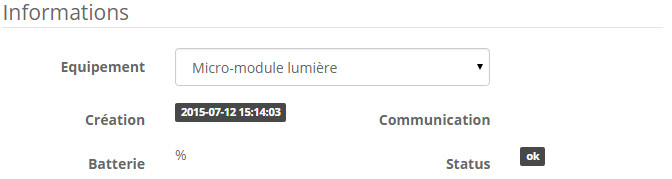

-   **El módulo**

-   **El visual de Jeedom**

Resumen 
======

El micromódulo EMV-400 le permitirá administrar un motor
equipos bidireccionales o eléctricos. Permite el control
2 salidas Start / Stop o un obturador Open / Stop / Close.

Además, la interacción con otros protocolos es posible, es
controlable por interruptores de marca y / o controles remotos
Edisio, directamente de Jeedom, pero también por cualquier
Transmisor Z-Wave en su red.

Cada módulo Edisio en la red eléctrica, con la posibilidad de
funciona como un repetidor inalámbrico con los otros módulos, por lo que
Asegure la cobertura total de su hogar.

Finalmente, cada módulo se puede usar en modo remoto, es muy
práctico porque permite asociar un transmisor sin tener que acceder al
receptor.

> **Importante**
>
> Neutral solo es necesario para el modo "Obturador""

Funciones 
=========

-   2 salidas de relé suministradas

-   Se instala en una caja empotrada de 55 mm o directamente en
    las cajas de apertura

-   Modo de uso: Encendido / Apagado, Abrir / Parar / Cerrar

-   Compatible con finales de carrera electrónicos y
    mecánico

-   Modo remoto

-   Función de temporizador: Modo de encendido / apagado: 30 min o 60 min

-   Réplica de señal (repetidor)

-   Micromódulo bidireccional

-   Nivel bajo de batería del transmisor

-   Pequeño, discreto y estético

-   Facilidad de uso e instalación

Características técnicas 
===========================

-   Tipo de módulo: Receptor Edisio

-   Suministro: 230VAC, 50Hz

-   Cableado: 4 cables, 2 para controles y 2 para alimentación

-   Frecuencia: 868.3 MHz

-   Salidas alimentadas: 2 relés

-   Potencia máxima: 2A por salida

-   Carga resistiva: 460W

-   Otros cargos: 100W

-   Temperatura de funcionamiento: -10 ° C + 45 ° C

-   Dimensiones: 48x46x26mm

-   Grado de protección: IP20

Datos del módulo 
=================

-   Hacer : Edisio Smart Home

-   Nombre : EMV-400

Configuración general 
======================

Para configurar el complemento Edisio y asociar un módulo con Jeedom,
referirse a esto
[Documentación](https://www.jeedom.fr/doc/Documentación/plugins/edisio/es_ES/edisio.html).

> **Importante**
>
> Para que Jeedom cree automáticamente sus módulos transmisores, recuerde
> no active la opción en la configuración del complemento.

> **Importante**
>
> Por el contrario, los receptores Edisio deben crearse manualmente en
> Jeedom.

Interruptor DIP y botón "R" : 
--------------------------

-   El interruptor DIP le permitirá ajustar los parámetros
    (Modo repetidor / obturador / iluminación / temporizador) del módulo:

> **Nota**
>
> Para evitar redundancias innecesarias, nunca active el modo
> "Repetidor "en todos los receptores, máximo 5 receptores por
> Instalación.

-   El botón "R", permitirá asociar un transmisor al receptor,
    activar o desactivar la función del temporizador y activar el modo
    deportado :

> **Nota**
>
> Al presionar R 3x se activa el modo remoto.

Diagrama de funciones 
---------------------------

A continuación, si su transmisor está configurado en "1 tecla" o "modo 2
teclas ", así es como funciona el módulo:

> **Nota**
>
> Consulte la documentación del fabricante para poder
> configura tu transmisor.

Función de temporizador 
------------------

La función de temporizador apaga automáticamente los relés al final
30 o 60 minutos.

-   Activar : Presione 4x "R" en el receptor, confirmación con un simple
    pitido continuo

-   Desactivar: Presione 5x "R" en el receptor, confirmación por 3 simples
    pitido.

-   Temporizador de 30 minutos: Interruptor DIP 3 arriba

-   Temporizador de 60 minutos: Interruptor DIP 3 abajo

Modo "Iluminación"" 
===================

El modo "Iluminación" le permite controlar 2 dispositivos eléctricos para
distancia.

> **Importante**
>
> Neutral no es necesario

Configuracion electrica y conexiones : 
--------------------------------------------

> **Importante**
>
> Para que el módulo esté en modo "Iluminación", el interruptor DIP 2 debe estar
> en alto

> **Importante**
>
> NUNCA CONECTE BAJO VOLTAJE

Creación del módulo en Jeedom 
------------------------------

Para asociar un módulo receptor Edisio con Jeedom, debe crear
equipo de forma manual.

Una vez que se crea su equipo, debe obtener esto :

> **Nota**
>
> Recuerde activar su nuevo equipo.

En la lista de equipos, a la derecha, seleccione "Micro-módulo
Iluminación" :

Comandos 
---------

Una vez que guarde su equipo, debe recibir los pedidos
asociado con el módulo :

Aquí está la lista de comandos :

-   Uno : Es el comando que activa el relé 1

-   Apagado : Es el comando que permite desactivar el relé 1

-   Nosotros 2 : Es el comando que activa el relé 2

-   Apagado 2: Es el comando que desactiva el relé 2

-   E : Este es el comando que te permite usar el modo remoto

> **Importante**
>
> La retroalimentación de estado es simulada por Jeedom. Por lo tanto si
> use otro transmisor, Jeedom no podrá actualizar el estado
> del receptor.

Información 
------------

Una vez que su equipo esté asociado con Jeedom, se le dará diversa información
disponible :

-   Creación : Indica la fecha en que se creó el equipo

-   Comunicación : Indica la última comunicación registrada entre
    Jeedom y el micro módulo

-   Batería : Indica el estado de la batería para los módulos de batería

-   Estado : Devuelve el estado del módulo

Asociación del micromódulo con Jeedom 
===================================

Para que pueda interactuar con Jeedom, como si fuera un
Transmisor Edisio.

> **Nota**
>
> Una de las grandes ventajas de Edisio es que un receptor puede tener
> varios emisores asociados

Método estándar 
----------------

Cada salida debe estar asociada con un comando Jeedom:

-   Salida asociada 1 :

    -   Presione 1x en la "R" del receptor, un pitido (corto
        en repetición) señala la programación de la salida 1 activada.

    -   Dentro de 10 segundos, presione "Prueba" en el comando "Abrir""
        en Jeedom, un pitido continuo señala la asociación de
        salida 1 en Jeedom.

    -   Dentro de 10 segundos, presione "R" nuevamente en el receptor, para
        confirmar la asociación, el pitido se detiene.

-   Salida asociada 2 :

    -   Presione 2x en la "R" del receptor, doble pitido (corto
        en repetición) señala la programación de la salida 2 activada.

    -   Dentro de 10 segundos, presione "Prueba" en el comando "Cerrar""
        en Jeedom, un pitido continuo señala la asociación de
        salida 2 en Jeedom.

    -   Dentro de 10 segundos, presione "R" nuevamente en el receptor, para
        confirmar la asociación, el pitido se detiene.

Método remoto 
----------------

Hablamos sobre esto al comienzo de esta documentación. En el caso de
módulos ya integrados, en falsos techos o incluso áticos.
Este método permite agregar un nuevo transmisor sin acceder a la "R" del
receptor.

-   Asociar el botón "R" :

    -   Presione 3x en "R" en el receptor, pitido triple (corto
        en repetición) indica el modo de programación activa.

    -   Dentro de 10 segundos, presione "Prueba" en el comando "E" en
        Jeedom, un pitido continuo señala la asociación con Jeedom.

    -   Dentro de 10 segundos, presione "E" nuevamente en el receptor, para
        confirmar la asociación, el pitido se detiene.

Ya está hecho, su Jeedom ahora está asociado y su comando "E"
ahora reemplaza el botón "R" en el receptor.

-   Asociar un nuevo transmisor con un receptor con Jeedom ya asociado
    :

    -   Salida 1 :

        -   Presione 1x en "Probar" el comando "E" en Jeedom, simple
            pitido (breve en repetición) señala la programación de
            salida 1 activada.

        -   Dentro de 10 segundos, presione una de las teclas "C" en el nuevo
            transmisor para asociar, un pitido continuo señala
            la asociación de salida 1.

        -   Dentro de 10 segundos, presione "Probar" nuevamente en el
            comando "E" en Jeedom, para validar la asociación, el pitido
            el sonido se detiene.

    -   Salida 2 :

        -   Presione 2x en "Prueba" del comando "E" en Jeedom,
            doble pitido (breve en repetición) señala el
            programación de la salida 2 activada.

        -   Dentro de 10 segundos, presione una de las teclas "C" en el nuevo
            transmisor para asociar, un pitido continuo señala
            la asociación de la salida 2.

        -   Dentro de 10 segundos, presione "Probar" nuevamente en el
            comando "E" en Jeedom, para validar la asociación, el pitido
            el sonido se detiene.

> **Nota**
>
> Puede comenzar de nuevo tantas veces como quiera asociar
> de transmisores a receptor

Visual alternativo 
=================

Faq. 
======

Cómo borrar la memoria del receptor ?

:   Mantenga presionada la "R" durante 10 segundos, hasta que suene un pitido continuo.

Cómo controlar el receptor a través de un transmisor Z-Wave?

:   Con el complemento Jeedom Scenario.

¿Cómo puedo tener el mismo visual? ?

:   Con el complemento Jeedom Widgets.

**@Jamsta**
