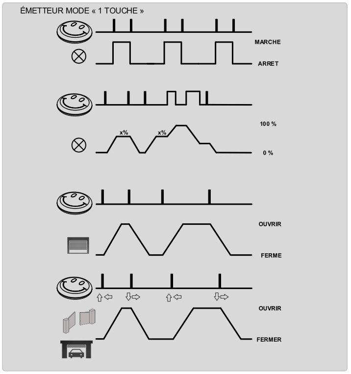
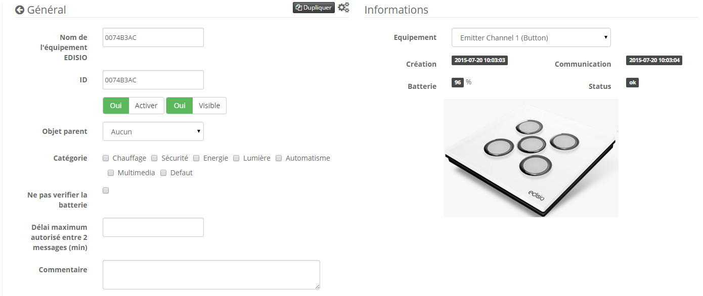

-   **El módulo**

-   **El visual de Jeedom**

Resumen 
======

Les Control remotos “Smile” ont un canal, elles sont idéales pour la table
mesita de noche, baño y especialmente para niños, porque estos son
muy robusto gracias al material utilizado. Ultra simple y al mismo tiempo
“fun” elles ont pour but d'être pratiques dans l'habitat. Existen
en tres colores diferentes.

Se conectan fácilmente a diferentes receptores y, por lo tanto, pueden
controlar las luces de encendido / apagado, luces variables,
persianas, portones, puertas de garaje. Disponible en 3 colores.

Además, la interacción con otros protocolos es posible, puede
interactuar con los receptores de la marca Edisio, con Jeedom, pero
también por cualquier receptor Z-Wave en su red.

Funciones 
=========

-   Modo de uso : Iluminación, dimmer

-   Pequeño, discreto y estético

-   Facilidad de uso e instalación

Características técnicas 
===========================

-   Tipo de módulo : Transmisor Edisio

-   Suministro : 3VDC (batería de litio CR2032)

-   Canales : 1

-   Protocolo de radio : 868.3 MHz

-   Rango en campo libre : 100 millones

-   Temperatura de funcionamiento : -10 ° C + 50 ° C

-   Dimensiones : 65x18mm

-   Grado de protección : IP64

Datos del módulo 
=================

-   Hacer : Edisio Smart Home

-   Nombre : ETC1

-   Referencia : P01 / Y01 / L01

Configuración general 
======================

Para configurar el complemento Edisio y asociar un módulo con Jeedom,
referirse a esto
[Documentación](https://www.jeedom.fr/doc/documentation/plugins/edisio/es_ES/edisio.html).

> **Importante**
>
> Para que Jeedom cree automáticamente sus módulos transmisores, recuerde
> no active la opción en la configuración del complemento.

Diagrama de funciones 
---------------------------

Así es como funciona el control remoto :

Reemplazo de la batería 
-----------------------

Para reemplazar la batería de su control remoto, este es el procedimiento a seguir
:

Asociación del control remoto con Jeedom 
=======================================

La asociación de un transmisor Edisio es simple y
automáticamente Simplemente presione el botón en su
Control remoto.

Una vez, su equipo asociado, debería obtener esto :

Comandos 
---------

Una vez que haya creado su equipo, debe recibir los pedidos
asociado con el módulo :

Aquí está la lista de comandos :

-   bt01 : Es el comando que te permite interactuar con el botón 1

-   Batería : Indica el estado de la batería

Información 
------------

Una vez que su equipo esté asociado con Jeedom, se le dará diversa información
disponible :

-   Creación : Indica la fecha en que se creó el equipo

-   Comunicación : Indica la última comunicación registrada entre
    Jeedom y el micro módulo

-   Batería : Indica el estado de la batería de los módulos de batería

-   Estado : Devuelve el estado del módulo

Uso 
-----------

Una vez que su control remoto está configurado, puede hacerlo con
Plugin Jeedom Scenario, interactúa con tu control remoto en Jeedom
y su equipamiento.

> **Nota**
>
> El control remoto con retroalimentación de estado binario.

**@Jamsta**
