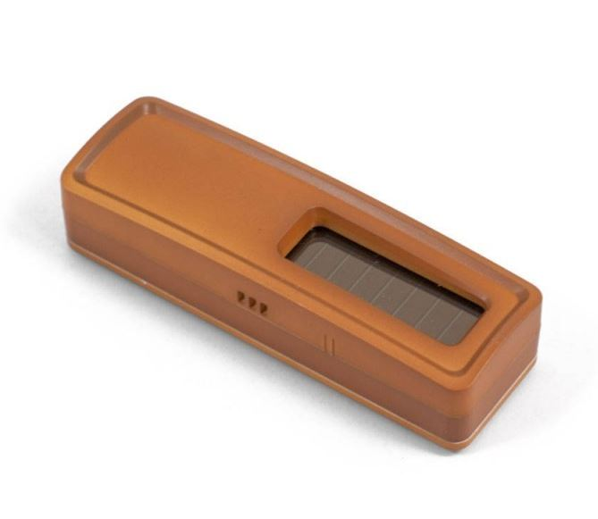
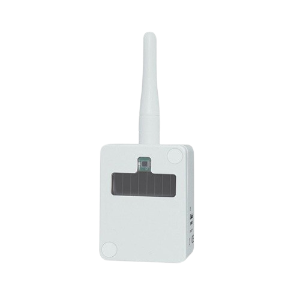
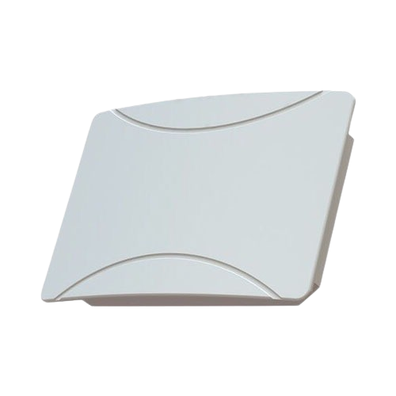
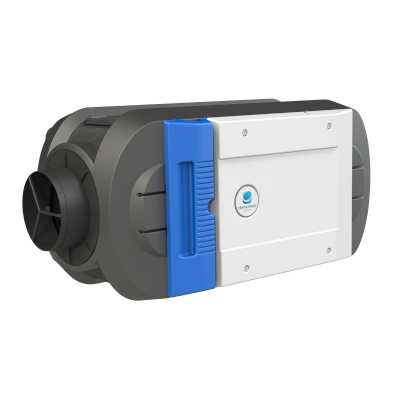
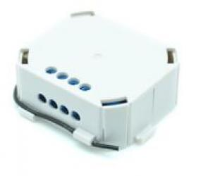
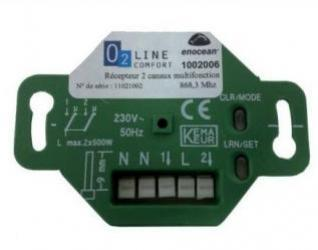

# Compatibilidad de los equipos EnOcean

# A5-02

|Image|Marque|Nom|Type|Remarque|Lien|
|---|---|---|---|---|---|
||Nodon|Sensor de temperatura blanco|Temperatura|Disponible en varios colores|[Comprar](http://www.domadoo.fr/fr/peripheriques/2627-nodon-capteur-de-temperature-sans-fils-et-sans-piles-blanc-3700313920183.html)|
||Nodon|Sensor de temperatura negro|Temperatura|Disponible en varios colores|[Comprar](http://www.domadoo.fr/fr/peripheriques/2637-nodon-capteur-de-temperature-enocean-black-3700313920169.html)|
||Nodon|Sensor de temperatura de aluminio|Temperatura|Disponible en varios colores|[Comprar](http://www.domadoo.fr/fr/peripheriques/2634-nodon-capteur-de-temperature-enocean-alu-3700313920176.html)|
||Nodon|Sensor de temperatura de madera|Temperatura|Disponible en varios colores|[Comprar](http://www.domadoo.fr/fr/peripheriques/2635-nodon-capteur-de-temperature-enocean-wood-3700313920145.html)|
||Nodon|Sensor de temperatura de barniz|Temperatura|Disponible en varios colores|[Comprar](http://www.domadoo.fr/fr/peripheriques/2636-nodon-capteur-de-temperature-enocean-varnish-3700313920152.html)|
||Thermokon|Sensor de temperatura de la tubería|Temperatura|||

# A5-04

|Image|Marque|Nom|Type|Remarque|Lien|
|---|---|---|---|---|---|
||A5-04|||||
||Nodon|Sensor de temperatura y humedad Enocean Blanco|Temperatura, Humedad|||
||Trio2sys|Sonda de radio de humedad y temperatura para montaje en interiores|Temperatura, Humedad|||
||Nexelec|Insafe + Pilot Sonda de humedad y temperatura|Temperatura, Humedad|||
||Eltako|Sonda de radio de humedad y temperatura para montaje en exteriores - FAFT60|Temperatura||[Comprar](http://www.domadoo.fr/fr/peripheriques/1931-eltako-sonde-radio-humidite-et-temperature-montage-exterieur-faft60-4010312310120.html)|

# A5-05

|Image|Marque|Nom|Type|Remarque|Lien|
|---|---|---|---|---|---|
||A5-05|||||

# A5-06

|Image|Marque|Nom|Type|Remarque|Lien|
|---|---|---|---|---|---|
||Eltako|Sensor de luz exterior FAH60|Luminosité||[Comprar](http://www.domadoo.fr/fr/peripheriques/3084-eltako-sonde-de-luminosite-exterieure-4010312305218.html)|

# A5-07

|Image|Marque|Nom|Type|Remarque|Lien|
|---|---|---|---|---|---|
||Eosca|Detector de movimiento EnOcean (posición de techo)|Mouvement|||
||Pressac|Detector de movimiento debajo del escritorio (debajo del escritorio)|Mouvement|||
||Easyfit|Detector de movimiento de techo|Mouvement|||
||Easyfit|Detector de movimiento debajo del escritorio|Mouvement|||
||Nodon|Detector de movimiento y luz EnOcean|Mouvement|||
||Avidsen|Detector de movimiento|Mouvement|||

# A5-09

|Image|Marque|Nom|Type|Remarque|Lien|
|---|---|---|---|---|---|
||A5-09|||||
||Nanosense|Sensor de calidad del aire CO2 E4000|CO2, calidad del aire|||
||PressacSensing|Sensor de humedad de temperatura de CO2|CO2, Temperatura, Humedad|||
||Thermokon|Sensor de temperatura y humedad de Co2|CO2, Temperatura, Humedad|||
||Nexelec|Temperatura de humedad de la sonda Insafe + Carbon Co2|CO2, Temperatura, Humedad|||
||Nanosense|Sensor de calidad del aire E4000|Calidad del aire|||
||Nanosense|Sonda de partículas finas P4000|Partículas finas|||
||Nanosense|Sensor de calidad del aire E4000NG|Calidad del aire|||

# A5-10

|Image|Marque|Nom|Type|Remarque|Lien|
|---|---|---|---|---|---|
||Eltako|Controlador de temperatura con funciones día / noche / apagado|Regulador||[Comprar](http://www.domadoo.fr/fr/peripheriques/3128-eltako-regulateur-de-temperature-avec-fonctions-journuitoff-4010312315859.html)|
||Avidsen|Sonda de temperatura y humedad con pantalla digital|Regulador|||

# A5-11

|Image|Marque|Nom|Type|Remarque|Lien|
|---|---|---|---|---|---|
||Altecon|Controlador de aire acondicionado / calefacción|Regulador|||

# A5-12

|Image|Marque|Nom|Type|Remarque|Lien|
|---|---|---|---|---|---|
||Avidsen|Módulo de pinza de corriente|Compteur|||
||Thermokon|Medidor de energía|Compteur|||
||Eltako|Módulo de medición de energía 65A|Compteur||[Comprar](http://www.domadoo.fr/fr/peripheriques/2837-eltako-module-de-comptage-d-energie-65a-4010312311059.html)|
||Eltako|Módulo de medición de energía 16A|Compteur||[Comprar](http://www.domadoo.fr/fr/peripheriques/2836-eltako-module-de-comptage-d-energie-16a-4010312303184.html)|
||Avidsen|Módulo de Teleinfo|Compteur|||
||Ewattch|Subcontador eléctrico SQUID EnOcean - 12 entradas|Compteur||[Comprar](http://www.domadoo.fr/fr/peripheriques/2859-ewattch-squid-sous-compteur-electrique-enocean-12-entrees-3770002148045.html)|

# A5-13

|Image|Marque|Nom|Type|Remarque|Lien|
|---|---|---|---|---|---|
||A5-13|||||

# A5-14

|Image|Marque|Nom|Type|Remarque|Lien|
|---|---|---|---|---|---|
||Avidsen|Sensor de lluvia|Detector|||
||Avidsen|Detector de ruido|Detector|||

# A5-20

|Image|Marque|Nom|Type|Remarque|Lien|
|---|---|---|---|---|---|
||Micropelt|Válvula termostática EnOcean sin batería|Vanne|Asegúrese de que la válvula parpadee una vez en respuesta a la inclusión|[Comprar](http://www.domadoo.fr/fr/peripheriques/3259-micropelt-vanne-thermostatique-enocean-4260413370022.html)|
||Thermokon|SAB + airconfig|Vanne|Asegúrese de que la válvula parpadee una vez en respuesta a la inclusión||

# A5-3f

|Image|Marque|Nom|Type|Remarque|Lien|
|---|---|---|---|---|---|
||Thermokon|SR65 3AI|Módulos de entrada|||

# D1079-00

|Image|Marque|Nom|Type|Remarque|Lien|
|---|---|---|---|---|---|
||Ventilairsec|Assistant|Control remoto|||

# D1079-01

|Image|Marque|Nom|Type|Remarque|Lien|
|---|---|---|---|---|---|
||Ventilairsec|VMI|Ventilation|||

# D2-01

|Image|Marque|Nom|Type|Remarque|Lien|
|---|---|---|---|---|---|
||Trio2sys|Indicador de consumo modular|Consommation|Asegúrese de que el enchufe se desconecte después de la inclusión. De lo contrario, proceda a una exclusión antes||
||Avidsen|Módulo de caldera|Contacteur|Asegúrese de que el enchufe se desconecte después de la inclusión. De lo contrario, proceda a una exclusión antes||
||Flextron|Zócalo intermedio ALADIN Pro|Prise|Asegúrese de que el enchufe se desconecte después de la inclusión. De lo contrario, proceda a una exclusión antes||
||UbiWizz|EnOcean Smart Plug|Prise|Asegúrese de que el enchufe se desconecte después de la inclusión. De lo contrario, proceda a una exclusión antes|[Comprar](http://www.domadoo.fr/fr/peripheriques/2667-ubiwizz-smart-plug-enocean-schuko.html)|
||Nodon|EnOcean Smart Plug|Prise|Asegúrese de que el enchufe se desconecte después de la inclusión. De lo contrario, proceda a una exclusión antes|[Comprar](http://www.domadoo.fr/fr/peripheriques/2631-nodon-prise-intelligente-enocean-type-eu-3700313920008.html)|
||Nodon|Enchufe inteligente + medición|Prise|Asegúrese de que el enchufe se desconecte después de la inclusión. De lo contrario, proceda a una exclusión antes|[Comprar](http://www.domadoo.fr/fr/peripheriques/2633-nodon-prise-intelligente-metering-enocean-type-eu-3700313920022.html)|
||Avidsen|Módulo de cable piloto|Cable piloto|Asegúrese de que el enchufe se desconecte después de la inclusión. De lo contrario, proceda a una exclusión antes||
||Nodon|Módulo de cable piloto|Cable piloto|Asegúrese de que el enchufe se desconecte después de la inclusión. De lo contrario, proceda a una exclusión antes|[Comprar](http://www.domadoo.fr/fr/peripheriques/5134-nodon-module-chauffage-fil-pilote-enocean-3700313924693.html)|
||Nodon|Micro enchufe inteligente|Prise|Asegúrese de que el enchufe se desconecte después de la inclusión. De lo contrario, proceda a una exclusión antes|[Comprar](http://www.domadoo.fr/fr/peripheriques/4309-nodon-micro-smart-plug-enocean-prise-fr-3700313921401.html)|
||Nodon|Micromódulo de interruptor único EnOcean|Micromodule|Asegúrese de que el micromódulo abandone el aprendizaje después de la inclusión. De lo contrario, proceda a una exclusión antes||
||Avidsen|Micromódulo de interruptor único EnOcean|Micromodule|Asegúrese de que el micromódulo abandone el aprendizaje después de la inclusión. De lo contrario, proceda a una exclusión antes||
||Nodon|Micromódulo de doble interruptor EnOcean|Micromodule|Asegúrese de que el micromódulo abandone el aprendizaje después de la inclusión. De lo contrario, proceda a una exclusión antes|[Comprar](http://www.domadoo.fr/fr/peripheriques/3341-nodon-micromodule-commutateur-double-enocean-3700313920374.html)|
||Avidsen|Micromódulo de doble interruptor EnOcean|Micromodule|Asegúrese de que el micromódulo abandone el aprendizaje después de la inclusión. De lo contrario, proceda a una exclusión antes||

# D2-03

|Image|Marque|Nom|Type|Remarque|Lien|
|---|---|---|---|---|---|
||Nodon|Botón suave|Bouton|5 prensas rápidas en modo de inclusión||

# D2-04

|Image|Marque|Nom|Type|Remarque|Lien|
|---|---|---|---|---|---|
||Nanosense|E4000-NG|Sensor de CO2|||

# D2-05

|Image|Marque|Nom|Type|Remarque|Lien|
|---|---|---|---|---|---|
||Nodon|Micromódulo de persiana enrollable EnOcean|Micromodule|Asegúrese de que el micromódulo abandone el aprendizaje después de la inclusión. De lo contrario, proceda a una exclusión antes||
||Avidsen|Micromódulo de persiana enrollable EnOcean|Micromodule|Asegúrese de que el micromódulo abandone el aprendizaje después de la inclusión. De lo contrario, proceda a una exclusión antes||

# D2-06

|Image|Marque|Nom|Type|Remarque|Lien|
|---|---|---|---|---|---|
||Soda|Asa inteligente EnOcean|Manejar|Asegúrese de que el mango emita un pitido después de la inclusión. De lo contrario, proceda a una exclusión antes|[Comprar](http://www.domadoo.fr/fr/peripheriques/2.html)|

# D2-14

|Image|Marque|Nom|Type|Remarque|Lien|
|---|---|---|---|---|---|
||Nexelec|Insafe|Humo|||
||Enocean|STM550|Temperatura, Humedad, Brillo, Aceleración|||

# D2-15

|Image|Marque|Nom|Type|Remarque|Lien|
|---|---|---|---|---|---|
||EasyFit|EPAC|Presencia|||

# D2-32

|Image|Marque|Nom|Type|Remarque|Lien|
|---|---|---|---|---|---|
||PressacSensing|Abrazadera de corriente Enocean|Courant|||
||PressacSensing|Pinza de corriente Enocean de 3 vías|Courant|||

# D5-00

|Image|Marque|Nom|Type|Remarque|Lien|
|---|---|---|---|---|---|
||Nodon|Sensor de apertura blanco|Ouverture|Disponible en varios colores|[Comprar](http://www.domadoo.fr/fr/peripheriques/2626-nodon-detecteur-d-ouverture-sans-fils-et-sans-piles-blanc-3700313920138.html)|
||Nodon|Sensor de apertura negro|Ouverture|Disponible en varios colores|[Comprar](http://www.domadoo.fr/fr/peripheriques/2640-nodon-detecteur-d-ouverture-enocean-black-3700313920114.html)|
||Nodon|Sensor de apertura de aluminio|Ouverture|Disponible en varios colores|[Comprar](http://www.domadoo.fr/fr/peripheriques/2641-nodon-detecteur-d-ouverture-enocean-alu-3700313920121.html)|
||Nodon|Sensor de apertura de madera|Ouverture|Disponible en varios colores|[Comprar](http://www.domadoo.fr/fr/peripheriques/2638-nodon-detecteur-d-ouverture-enocean-wood-3700313920091.html)|
||Nodon|Sensor de apertura de barniz|Ouverture|Disponible en varios colores|[Comprar](http://www.domadoo.fr/fr/peripheriques/2639-nodon-detecteur-d-ouverture-enocean-varnish-3700313920107.html)|
||Eltako|Contacto de puerta / ventana - blanco - FTK-RW|Ouverture|Disponible en varios colores|[Comprar](http://www.domadoo.fr/fr/peripheriques/3122-eltako-contact-de-portefenetre-blanc-4010312305010.html)|
||Eltako|Contacto de puerta / ventana - plata - FTK-SI|Ouverture|Disponible en varios colores|[Comprar](http://www.domadoo.fr/fr/peripheriques/3123-eltako-contat-de-portefenetre-argente-4010312305171.html)|
||Eltako|Contacto de puerta / ventana - antracita - FTK-AN|Ouverture|Disponible en varios colores|[Comprar](http://www.domadoo.fr/fr/peripheriques/3121-eltako-contact-de-portefenetre-anthracite-4010312305164.html)|
||Avidsen|Contacto de puerta / ventana|Ouverture|||

# F6-02

|Image|Marque|Nom|Type|Remarque|Lien|
|---|---|---|---|---|---|
||F6-02|||||
||F6-02|||||
||Nodon|Soft Remote blue tech|Control remoto|Disponible en varios colores. Dos modos de funcionamiento posibles en Jeedom (activar / desactivar con dos botones o alternar con 4 botones). Se gestionan múltiples soportes.|[Comprar](http://www.domadoo.fr/fr/peripheriques/2624-nodon-soft-remote-enocean-tech-blue-3700313920053.html)|
||Nodon|Control remoto suave y acogedor gris|Control remoto|Disponible en varios colores. Dos modos de funcionamiento posibles en Jeedom (activar / desactivar con dos botones o alternar con 4 botones). Se gestionan múltiples soportes.|[Comprar](http://www.domadoo.fr/fr/peripheriques/2625-nodon-soft-remote-enocean-cozy-grey-3700313920060.html)|
||Nodon|Laguna azul suave y remota|Control remoto|Disponible en varios colores. Dos modos de funcionamiento posibles en Jeedom (activar / desactivar con dos botones o alternar con 4 botones). Se gestionan múltiples soportes.|[Comprar](http://www.domadoo.fr/fr/peripheriques/2898-nodon-soft-remote-enocean-lagoon-3700313920312.html)|
||Nodon|Softberry remoto suave|Control remoto|Disponible en varios colores. Dos modos de funcionamiento posibles en Jeedom (activar / desactivar con dos botones o alternar con 4 botones). Se gestionan múltiples soportes.|[Comprar](http://www.domadoo.fr/fr/peripheriques/2900-nodon-soft-remote-enocean-softberry-3700313920305.html)|
||Nodon|Soft wasabi remoto|Control remoto|Disponible en varios colores. Dos modos de funcionamiento posibles en Jeedom (activar / desactivar con dos botones o alternar con 4 botones). Se gestionan múltiples soportes.|[Comprar](http://www.domadoo.fr/fr/peripheriques/2899-nodon-soft-remote-enocean-wasabi-3700313920299.html)|
||Nodon|Soft Remote white|Control remoto|Disponible en varios colores. Dos modos de funcionamiento posibles en Jeedom (activar / desactivar con dos botones o alternar con 4 botones). Se gestionan múltiples soportes.|[Comprar](http://www.domadoo.fr/fr/peripheriques/2648-ubiwizz-telecommande-ubi-remote-blanc-3553740015966.html)|
||Nodon|Interruptor de pared Z-Wave plus - Cozi White|Interrupteur|Disponible en varios colores. Dos modos de funcionamiento posibles en Jeedom (activar / desactivar con dos botones o alternar con 4 botones). Se gestionan múltiples soportes.|[Comprar](http://www.domadoo.fr/fr/peripheriques/2995-nodon-interrupteur-mural-z-wave-plus-cozi-white-3700313920268.html)|
||Nodon|Interruptor de pared EnOcean - Cozi Gray|Interrupteur|Disponible en varios colores. Dos modos de funcionamiento posibles en Jeedom (activar / desactivar con dos botones o alternar con 4 botones). Se gestionan múltiples soportes.|[Comprar](http://www.domadoo.fr/fr/peripheriques/2628-nodon-interrupteur-mural-enocean-cozi-grey-3700313920084.html)|
||Eltako|Convertidor infrarrojo / EnOcean con puerto USB para control remoto Harmony Logitech - FIW-USB|Infrarouge|Cree tantos dispositivos como familia de botones disponibles en la documentación del módulo (cada familia debe estar incluida)|[Comprar](http://www.domadoo.fr/fr/peripheriques/3263-eltako-convertisseur-infrarougeenocean-avec-port-usb-4010312311158.html)|
||F6-02|||||
||Eltako|Contacto de puerta / ventana con palanca - blanco - FTKE-RW|Ouverture|Elegir el perfil correcto después de la inclusión|[Comprar](http://www.domadoo.fr/fr/peripheriques/3125-eltako-contact-de-portefenetre-blanc-4010312315231.html)|
||Nodon|Soft Remote blue tech|Control remoto|Disponible en varios colores. Dos modos de funcionamiento posibles en Jeedom (activar / desactivar con dos botones o alternar con 4 botones). Se gestionan múltiples soportes.|[Comprar](http://www.domadoo.fr/fr/peripheriques/2624-nodon-soft-remote-enocean-tech-blue-3700313920053.html)|
||Nodon|Control remoto suave y acogedor gris|Control remoto|Disponible en varios colores. Dos modos de funcionamiento posibles en Jeedom (activar / desactivar con dos botones o alternar con 4 botones). Se gestionan múltiples soportes.|[Comprar](http://www.domadoo.fr/fr/peripheriques/2625-nodon-soft-remote-enocean-cozy-grey-3700313920060.html)|
||Nodon|Laguna azul suave y remota|Control remoto|Disponible en varios colores. Dos modos de funcionamiento posibles en Jeedom (activar / desactivar con dos botones o alternar con 4 botones). Se gestionan múltiples soportes.|[Comprar](http://www.domadoo.fr/fr/peripheriques/2898-nodon-soft-remote-enocean-lagoon-3700313920312.html)|
||Nodon|Softberry remoto suave|Control remoto|Disponible en varios colores. Dos modos de funcionamiento posibles en Jeedom (activar / desactivar con dos botones o alternar con 4 botones). Se gestionan múltiples soportes.|[Comprar](http://www.domadoo.fr/fr/peripheriques/2900-nodon-soft-remote-enocean-softberry-3700313920305.html)|
||Nodon|Soft wasabi remoto|Control remoto|Disponible en varios colores. Dos modos de funcionamiento posibles en Jeedom (activar / desactivar con dos botones o alternar con 4 botones). Se gestionan múltiples soportes.|[Comprar](http://www.domadoo.fr/fr/peripheriques/2899-nodon-soft-remote-enocean-wasabi-3700313920299.html)|
||Nodon|Soft Remote white|Control remoto|Disponible en varios colores. Dos modos de funcionamiento posibles en Jeedom (activar / desactivar con dos botones o alternar con 4 botones). Se gestionan múltiples soportes.|[Comprar](http://www.domadoo.fr/fr/peripheriques/2648-ubiwizz-telecommande-ubi-remote-blanc-3553740015966.html)|
||Nodon|Interruptor de pared Z-Wave plus - Cozi White|Interrupteur|Disponible en varios colores. Dos modos de funcionamiento posibles en Jeedom (activar / desactivar con dos botones o alternar con 4 botones). Se gestionan múltiples soportes.|[Comprar](http://www.domadoo.fr/fr/peripheriques/2995-nodon-interrupteur-mural-z-wave-plus-cozi-white-3700313920268.html)|
||Nodon|Interruptor de pared EnOcean - Cozi Gray|Interrupteur|Disponible en varios colores. Dos modos de funcionamiento posibles en Jeedom (activar / desactivar con dos botones o alternar con 4 botones). Se gestionan múltiples soportes.|[Comprar](http://www.domadoo.fr/fr/peripheriques/2628-nodon-interrupteur-mural-enocean-cozi-grey-3700313920084.html)|
||Eltako|Convertidor infrarrojo / EnOcean con puerto USB para control remoto Harmony Logitech - FIW-USB|Infrarouge|Cree tantos dispositivos como familia de botones disponibles en la documentación del módulo (cada familia debe estar incluida)|[Comprar](http://www.domadoo.fr/fr/peripheriques/3263-eltako-convertisseur-infrarougeenocean-avec-port-usb-4010312311158.html)|
||Eltako|Detector de humo óptico EnOcean - FRW-WS|Humo|Elegir el perfil correcto después de la inclusión|[Comprar](http://www.domadoo.fr/fr/peripheriques/2835-eltako-detecteur-de-fumee-optique-enocean-4010312312308.html)|

# F6-03

|Image|Marque|Nom|Type|Remarque|Lien|
|---|---|---|---|---|---|
||Eltako|Módulo F8S12-12VDC|Impulsion|Elegir el perfil correcto después de la inclusión y crear equipos para cada canal||
||F6-03|||||

# F6-04

|Image|Marque|Nom|Type|Remarque|Lien|
|---|---|---|---|---|---|
||Nodon|Interruptor de tarjeta EnOcean|Interrupteur|Elegir el perfil correcto después de la inclusión|[Comprar](http://www.domadoo.fr/fr/peripheriques/3066-nodon-interrupteur-a-carte-enocean-3700313920329.html)|

# F6-05

|Image|Marque|Nom|Type|Remarque|Lien|
|---|---|---|---|---|---|
||Eltako|Detector de inundaciones Enocean FWS81|Fuite|Elegir el perfil correcto después de la inclusión|[Comprar](http://www.domadoo.fr/fr/peripheriques/3132-eltako-detecteur-d-inondation-enocean-4010312316061.html)|

# F6-10

|Image|Marque|Nom|Type|Remarque|Lien|
|---|---|---|---|---|---|
||El DS Crossroads|Manilla para ventana D-Sign|Manejar|Elegir el perfil correcto después de la inclusión||
||El DS Crossroads|Manija de ventana de helio|Manejar|Elegir el perfil correcto después de la inclusión||
||Hoppe|Manilla para ventana Sécusignal Atlanta Aluminio|Manejar|Elegir el perfil correcto después de la inclusión|[Comprar](http://www.domadoo.fr/fr/peripheriques/1062-hoppe-poignee-fenetre-secusignal-atlanta-alu-4012789023428.html)|
||Hoppe|Manilla para ventana Sécusignal Atlanta White|Manejar|Elegir el perfil correcto después de la inclusión|[Comprar](http://www.domadoo.fr/fr/peripheriques/1063-hoppe-poignee-fenetre-secusignal-atlanta-blanc-4012789104158.html)|

# Recepteur

|Image|Marque|Nom|Type|Remarque|Lien|
|---|---|---|---|---|---|
||Trio2sys|Receptor O2line de 1 canal|Micromodule|El módulo receptor solo no está incluido pero está emparejado||
||Vitec|Receptor Vitec de 1 canal|Micromodule|El módulo receptor solo no está incluido pero está emparejado||
||Trio2sys|O2line receptor de 2 canales|Micromodule|El módulo receptor solo no está incluido pero está emparejado||
||Eltako|Actuador de radio universal sin neutro - FUD61NP-230V|Micromodule|Active los comentarios de estado en el módulo de acuerdo con la documentación del fabricante. El módulo envía su estado 1 segundo después del final del cambio|[Comprar](http://www.domadoo.fr/fr/peripheriques/2424-eltako-actionneur-radio-variateur-rlc-encastrable-sans-neutre-4010312300183.html)|
||Eltako|Atenuador para balastos electrónicos de 1-10V|Ballast|Active los comentarios de estado en el módulo de acuerdo con la documentación del fabricante. El módulo envía su estado 1 segundo después del final del cambio|[Comprar](http://www.domadoo.fr/fr/peripheriques/3208-eltako-variateur-pour-ballasts-electroniques-1-10v-4010312316283.html)|
||Eltako|Actuador de radio, dimmer universal, incorporado - FUD61NPN-230V|Micromodule|Active los comentarios de estado en el módulo de acuerdo con la documentación del fabricante. El módulo envía su estado 1 segundo después del final del cambio|[Comprar](http://www.domadoo.fr/fr/peripheriques/1936-eltako-actionneur-radio-variateur-rlcesl-et-led-encastrable-4010312300299.html)|
||Eltako|Toma de atenuador - FSUD-230V|Prise|Active los comentarios de estado en el módulo de acuerdo con la documentación del fabricante. El módulo envía su estado 1 segundo después del final del cambio||
||Eltako|Atenuador de lastre - FUD71-230V|Ballast|Active los comentarios de estado en el módulo de acuerdo con la documentación del fabricante. El módulo envía su estado 1 segundo después del final del cambio||
||Eltako|Enocean actuador de control remoto - FSR61NP-230V|Micromodule|Active los comentarios de estado en el módulo de acuerdo con la documentación del fabricante|[Comprar](http://www.domadoo.fr/fr/peripheriques/3112-eltako-actionneur-enocean-telerupteur-4010312300190.html)|
||Eltako|Actuador de control remoto EnOcean - FSR61-230V|Micromodule|Active los comentarios de estado en el módulo de acuerdo con la documentación del fabricante|[Comprar](http://www.domadoo.fr/fr/peripheriques/3109-eltako-actionneur-telerupteur-enocean-4010312301531.html)|
||Eltako|Interruptor de control remoto del actuador EnOcean con fuente de alimentación UC de 8 a 24V - FSR61 / 8-24V|Micromodule|Active los comentarios de estado en el módulo de acuerdo con la documentación del fabricante|[Comprar](http://www.domadoo.fr/fr/peripheriques/3110-eltako-actionneur-enocean-telerupteur-a-alimentation-en-8-a-24v-uc-4010312301357.html)|
||Eltako|Enocean actuador de control remoto - FSR61LN-230V|Micromodule|Active los comentarios de estado en el módulo de acuerdo con la documentación del fabricante||
||Eltako|Actuador temporizador de escalera EnOcean - FTN61NP-230V|Micromodule|Active los comentarios de estado en el módulo de acuerdo con la documentación del fabricante|[Comprar](http://www.domadoo.fr/fr/peripheriques/3126-eltako-actionneur-enocean-minuterie-d-escalier-4010312300206.html)|
||Eltako|Actuador de control de luz EnOcean - FLC61NP-230V|Micromodule|Active los comentarios de estado en el módulo de acuerdo con la documentación del fabricante|[Comprar](http://www.domadoo.fr/fr/peripheriques/3099-eltako-actionneur-enocean-commande-de-lumiere-4010312312032.html)|
||Eltako|Zócalo del actuador - FSSA-230V|Prise|Active los comentarios de estado en el módulo de acuerdo con la documentación del fabricante||
||Eltako|Actuador de radio, control de persianas y cortinas enrollables, FSB61NP-230V incorporado|Micromodule|Módulo que no está incluido pero se llama. Si el módulo está en movimiento, una presión en la dirección lo detendrá. Active la retroalimentación de estado de acuerdo con la documentación del fabricante|[Comprar](http://www.domadoo.fr/fr/peripheriques/1935-eltako-actionneur-radio-commande-de-stores-et-rideaux-a-rouleaux-4010312300213.html)|

Esta lista se basa en los comentarios de los usuarios, por lo que el equipo de Jeedom no puede garantizar que todos los módulos de esta lista sean 100% funcionales

2023-11-15 01:17:05
