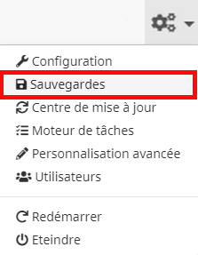
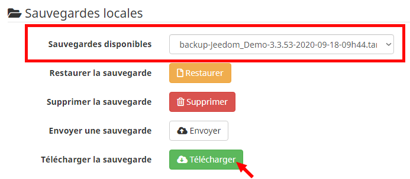
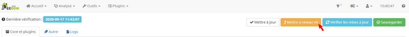
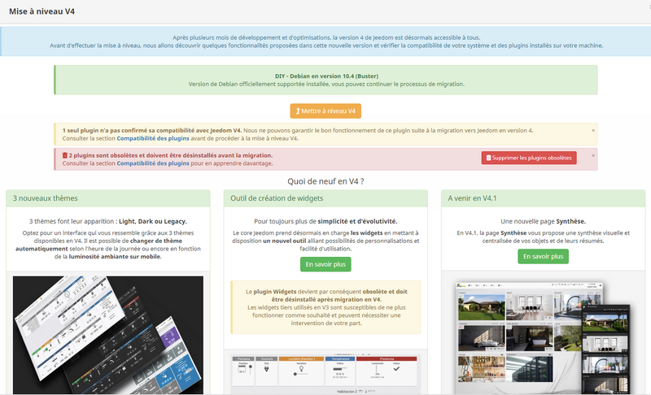

# Migrar desde la versión (V3 → V4)

Descubramos juntos las principales acciones a implementar para migrar desde la versión de Jeedom en las mejores condiciones. Este tutorial se basa en el caso concreto de una migración de V3 a V4.

## Copia de seguridad de Jeedom

Antes de cualquier actualización de Jeedom, es importante asegurarse de haber tomado las precauciones necesarias para poder recuperar rápidamente un sistema domótico funcional en caso de dificultades.

### Creación de respaldo

Primero generaremos el archivo de respaldo de su instalación actual.

Vamos a la **menú de engranajes**, presente en la parte superior de la barra de navegación, a la izquierda del reloj, luego haga clic en el submenú **Copias de seguridad** para acceder al [componente que gestiona las copias de seguridad](https://doc.jeedom.com/es_ES/core/3.3/backup):    

Para crear la copia de seguridad, daremos clic en el botón verde **Lanzar** en la sección titulada **Copias de seguridad** :    

Confirme el mensaje solicitando la confirmación de su deseo de proceder con una copia de seguridad de Jeedom haciendo clic en el botón **Correcto** :    

Comienza el proceso de respaldo. Puede llevar algún tiempo, puede seguir el progreso en la ventana nombrada **Información** :    

Si todo va con normalidad, el final del proceso se indica mediante el mensaje :      
``***************Fin de la sauvegarde de Jeedom*************** [END BACKUP SUCCESS]``

El archivo de respaldo se generó correctamente en Jeedom.

### Descarga de respaldo

En el estado actual, la copia de seguridad generada anteriormente solo es accesible desde Jeedom. Sin embargo, en caso de dificultades durante una actualización, es posible que Jeedom o la máquina que la aloja ya no sean accesibles. Entonces veremos cómo recuperar el archivo de respaldo en una computadora fuera de Jeedom.

En el juego **Copias de seguridad locales**, asegúrese de que la copia de seguridad creada en el párrafo anterior se ingrese correctamente en la línea **Copias de seguridad disponibles** confirmando con la fecha y hora que aparecen en el nombre del archivo. Si este es el caso, ahora podemos hacer clic en el botón verde **Descargar** :    

El archivo de respaldo se descarga a su computadora, consérvelo precisamente porque contiene una copia de su Jeedom completo en el momento de la copia de respaldo.

## Herramienta de migración sencilla

Ahora que hemos asegurado la copia de seguridad de nuestro Jeedom, podemos continuar con la actualización serenamente.

Desde V3.3.54, se implementó una herramienta de migración sencilla en **Centro de actualizaciones**. Para acceder a él, debes dirigirte a la **menú de engranajes**, presente en la parte superior de la barra de navegación, a la izquierda del reloj, luego haga clic en el submenú **Centro de actualizaciones**.

Una vez en el centro de actualización, haga clic en el botón naranja titulado **Actualice a V4** para abrir la ventana modal de migración :    

### Requisitos previos

La ventana de actualización analizará el sistema y todos los complementos instalados en su máquina del mercado Jeedom para verificar la compatibilidad anunciada con V4. Se divide en 2 partes :

- La parte superior presenta algunas novedades por descubrir en la V4 con un banner que resume generalmente la compatibilidad de los plugins instalados :    

>**Importante**
>
>No será posible migrar a una instalación con un entorno anterior a ``Debian Stretch 9.X`` *(``Debian 8.X Jessie`` o bajo)*. También se le pedirá que elimine los complementos identificados como obsoletos.

- La parte inferior consta de una tabla que detalla todos los plugins instalados así como su compatibilidad confirmada o no con esta nueva versión :    

> **Importante**    
>
>Esta nueva versión de Jeedom trae cambios importantes. Como resultado, es posible que los widgets de terceros y algunas personalizaciones de diseño utilizadas en V3 ya no se muestren o reaccionen como se desea y es posible que requieran su intervención luego del cambio a V4.

### Potenciar

Ahora que hemos leído toda la información importante que debe conocer antes de actualizar nuestro Jeedom, podemos iniciar la migración haciendo clic en el botón naranja **Actualice a V4** en la parte superior derecha de la ventana modal.

> **A saber**   
>
>El botón **Actualice a V4** solo se puede hacer clic una vez que se ha visto toda la ventana. Por lo tanto, debe asegurarse de desplazarse hasta el final de la página.

Se abre una ventana emergente que nos dice que se realizará una copia de seguridad completa automáticamente antes de la migración para que podamos volver rápida y fácilmente a la V3 si es necesario.
Para iniciar el proceso de migración, haga clic en **Correcto** :    

Luego, cambiará a la página que contiene los registros de migración, que comenzará guardando la instalación actual antes de actualizar los complementos y el núcleo.

> **Importante**    
>
>Según el hardware en el que esté instalado Jeedom, esta operación puede tardar varios minutos. Es fundamental dejar correr el proceso de migración hasta el final.

Una vez que se completa la operación de migración, se muestra un banner verde en la parte superior de la pantalla con el mensaje ***La operación es exitosa. Haga `F5` para conocer las últimas noticias*** :    

Así que todo lo que tienes que hacer es presionar el botón `F5` en el teclado *(o actualiza la página)* para ver la transición real a V4. Es posible que algunos complementos deban actualizarse nuevamente después de la migración, no dude en actualizarlos de inmediato.
