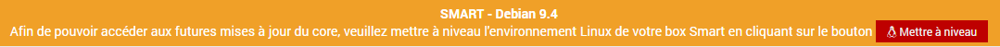
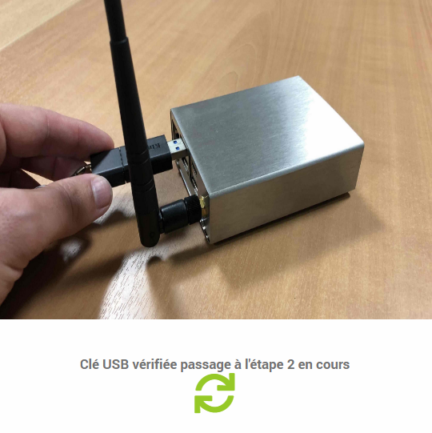
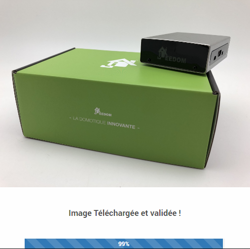

# Actualice el entorno Debian de un Smart

Detallaremos el procedimiento de **migración del entorno Debian de la caja inteligente** para que pueda tener una visión general de los diferentes pasos antes de la práctica. Tenga en cuenta que todos los pasos también se explican en la pantalla a medida que avanza la migración.

## Prerrequisitos

La migración del entorno Debian y el kernel inteligente es un proceso largo y complejo, por lo que se deben tener en cuenta varios requisitos previos antes de iniciar la operación.

Es necesario en particular :

- poder **permanecer en la página de migración** durante todo el proceso *(tarda alrededor de 1h30)*,
- preparar [una llave USB formateada en **FAT32**](https://fr.wikihow.com/formater-en-FAT32){:target = "\_ blank"} y teniendo **más de 8GB de espacio libre**,
- estar en el **misma red local** que la Smart Box y acceder a ella desde su **dirección interna**.

>**Importante**
>
>Como de costumbre, se recomienda encarecidamente mantener un **copia de seguridad reciente** de tu libertad de antemano.

## Migration

### Iniciar la migración

Tiene la posibilidad de iniciar el procedimiento de migración de 2 formas :

- Ir al menú **Configuración → Sistema → Restaurar imagen** :     

- Al ser invitado a la **Centro de actualizaciones** cuando sea necesario :     

### Etapa 1

El primer paso de la migración es preparar y verificar el hardware. Los requisitos previos mencionados anteriormente se recuperan en una ventana emergente y se le solicita que inserte una llave USB *(formateado en FAT32)* con más de 8 GB de espacio libre en la caja inteligente.

Una vez que se inserta la memoria USB, puede hacer clic en la flecha para iniciar el proceso :

Cuando se validan los prerrequisitos, podemos ir al paso 2 :

>**Información**
>
>No es necesario que permanezca frente a la pantalla durante todo el proceso. Esto se llevará a cabo automáticamente hasta que ofrezca restaurar una copia de seguridad.

### Etapa 2

El segundo paso se encargará de generar una copia de seguridad de su Jeedom, una copia de la cual se guardará en la llave USB. Esta copia de seguridad se restaurará al final del proceso de migración si lo desea. Si es necesario, la copia de seguridad se encuentra en un directorio llamado ``Backup`` en la memoria USB.

Aún así, le recomendamos que se asegure de tener una copia de seguridad reciente de Jeedom disponible en otro lugar.

La duración de la fase de respaldo dependerá del tamaño de su instalación y de las opciones de respaldo remoto implementadas. Tiene la opción de acelerar el proceso desactivando el envío de copias de seguridad de Market y / o Samba de antemano.

### Etapa 3

El tercer paso le permitirá descargar la imagen que contiene la nueva versión del entorno Debian y comprobar su validez después de la descarga :

Este paso puede llevar un tiempo y dependerá de la velocidad de su conexión a Internet, así como del rendimiento de lectura / escritura de la llave USB :

### Paso 4

Con mucho, el paso más importante porque es la migración real del hardware. Sobre todo, no desconecte la llave USB ni corte la alimentación del Smart durante esta fase !

Este paso dura unos treinta minutos, después de los cuales se reiniciará la caja inteligente. Es probable que este primer reinicio lleve algún tiempo :

### Finalización de la migración

Al final del proceso de migración, la caja inteligente se encuentra ahora en un entorno actualizado pero con un Jeedom virgen. Por tanto, la finalización del procedimiento consistirá en partir de una instalación limpia o en restaurar la copia de seguridad generada durante el primer paso :

>**Importante**
>
>**Asegúrese de quitar la llave USB de la caja inteligente al final de la operación.**

Felicidades, **su Smart Box ahora está actualizado y operativo** !

## Preguntas frecuentes

>**El proceso de migración se lleva a cabo correctamente, sin embargo, no parece que se hayan producido cambios después de reiniciar la caja ?**    
>Esto significa que la herramienta de migración no reconoce correctamente la llave USB utilizada. Repita la operación con otra llave USB o [reparticionar su llave USB](https://fr.wikihow.com/partitionner-une-cl%C3%A9-USB){:target = "\_ blank"} cuidando **crea solo una partición** *(Partición única)*.

>**Ya no puedo autenticarme en Jeedom después de la migración del entorno.**    
>Jeedom se ha reinstalado después de la actualización del entorno Debian, siempre que no haya restaurado una copia de seguridad o creado un nuevo usuario, las credenciales predeterminadas son ***admin / admin***.

>**Mi caja ya no es accesible después de la migración del medio ambiente.**    
>Verifique la presencia y la dirección IP de la caja Jeedom desde la interfaz de su enrutador en caso de que haya cambiado su dirección IP.

>**Algunos complementos ya no funcionan después de la migración.**    
>Asegúrese de haber reinstalado las dependencias para los complementos que las requieren *(consulte la página de configuración del complemento)*.
