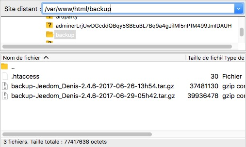

# Restaurar una copia de seguridad

El procedimiento le permitirá conectarse a su caja en SFTP para recuperar las copias de seguridad diarias realizadas por él.

> **Punta**
>
> Atención, para que este procedimiento funcione, es necesario que el servidor SSH de la caja siga funcionando.

## Instalación de Filezilla

Filezilla es un software gratuito y está disponible en todas las plataformas. Le permite transferir archivos a través de diferentes protocolos (FTP, FTPS, SFTP ...) Se puede descargar a través de este [Enlace](https://filezilla-project.org/download.php?type=client)

## Conexión a la caja

Para conectarse a su caja, simplemente complete los campos de información en la parte superior de la ventana de Filezilla :

-   Host : Dirección IP de Jeedom (``sftp://`` se agrega automáticamente)
-   Identificador : ``jeedom``
-   Contraseña : ``Mjeedom96``
-   Puerto : 22

Luego haga clic en "Conexión rápida"

## Navegación al directorio de respaldo

Una vez establecida la conexión, es necesario ir al directorio de respaldo de Jeedom.

2 escenarios :

-   Servidor Apache (Jeedom Smart Box) : ``/var/www/html/backup``
-   Servidor Nginx :  ``/usr/share/nginx/www/jeedom/backup``

La ruta se muestra en la sección del sitio remoto.

## Descarga de respaldo

En la lista de copias de seguridad, al hacer clic derecho, es posible comenzar su descarga.

