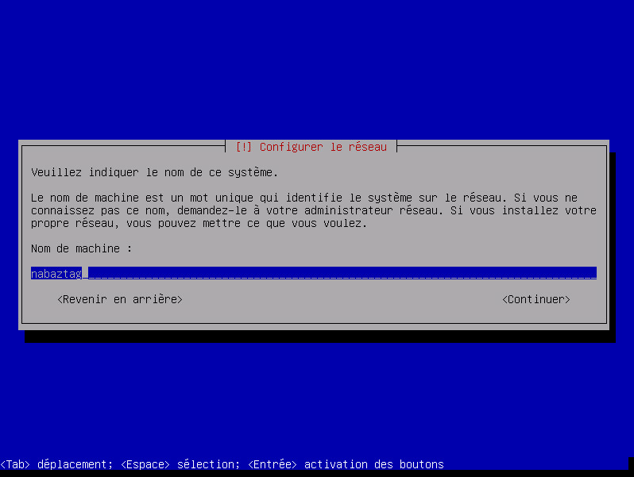
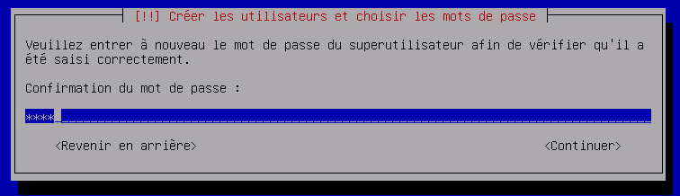
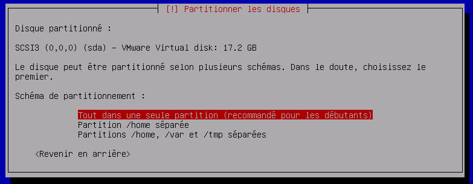
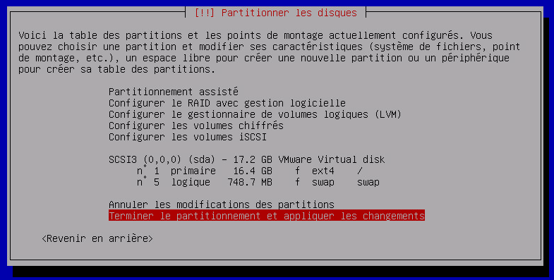
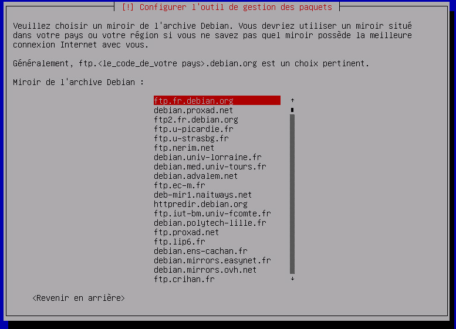

# Instalación de Debian

Veremos aquí cómo instalar un Debian, tanto como VM o en instalación directa en una máquina física

# Fuente de recuperación

Puede encontrar la última versión de Debian en netinstall (tamaño mínimo pero necesita internet para la instalación) [aquí](https://www.debian.org/CD/netinst) (toma la imagen en amd64) o haz clic directamente [aquí](http://cdimage.debian.org/debian-cd/10.4.0/amd64/iso-cd/debian-10.4.0-amd64-netinst.iso) para descargar el ISO.

# Lanzamiento de la instalación

## En una maquina fisica

Debe grabar el ISO en un CD y colocar el CD en la máquina (pero hoy en día los reproductores de CD son cada vez más raros) o bien crear una llave USB de arranque.

Para la llave USB de arranque, descargue rufus [el](http://rufus.akeo.ie/downloads/rufus-2.9.exe), ejecutarlo y configurarlo así :

> **Nota**
>
> Recuerde seleccionar el archivo ISO que descargó justo antes

Solo tiene que hacer clic en Inicio, luego poner la llave USB en la máquina y arrancarla.

## En una máquina virtual

La manipulación es bastante simple, crea una nueva máquina virtual, la conecta, coloca un reproductor de CD virtual que apunta a la ISO (recuerde conectarla) y ejecuta la máquina. Ver [aquí](https://doc.jeedom.com/es_ES/howto/doc-howto-vmware.creer_une_vm.html) para más detalles.

# Installation

Presione enter para comenzar la instalación :

Elija "Francés" y confirme con la tecla Intro

Aquí tienes que elegir "francés")

ídem :

Ingrese el nombre de su máquina (aquí nabaztag pero si es un jeedom ponga jeedom)

Solo presiona enter :

Pon una contraseña, recomiendo una simple aquí (como oooo), se puede cambiar más tarde (comando passwd) :

Ponlo de nuevo igual :

Dé el nombre del usuario principal (aquí nabaztag pero si es un jeedom ponga jeedom)

Poner de nuevo lo mismo :

Pon una contraseña, recomiendo una simple aquí (como oooo), se puede cambiar más tarde (comando passwd) :

Poner de nuevo lo mismo :

Confirme presionando enter :

ídem :

Nuevamente confirme presionando enter :

Todavía validamos :

Y todavia :

Elija "Francia" y valide :

Confirme presionando enter :

ídem :

Y de nuevo (sí, validamos mucho en una instalación de Debian) :

Ahora más complicado, debe anular la selección de "Entorno de escritorio Debian" presionando la tecla de espacio y seleccionar "Servidor SSH" presionando espacio (debe moverse con las teclas de flecha), luego validar presionando enter :

Validamos nuevamente :

Debe elegir / dev / sda y luego validar :

Allí solo tiene que quitar la llave USB, cdrom o cdrom virtual y presionar enter :

Aquí está su instalación de Debian terminada. Puede detener el tutorial allí si lo desea o seguir los siguientes pasos para algunas modificaciones del sistema (útil especialmente para jeedom).

# Optimización para Jeedom

Para preparar la instalación de Jeedom puedes hacer algunas optimizaciones :

## Añadir vim y sudo

``sudo apt-get install -y vim sudo``

## Añadir fail2ban

Fail2ban es un software que permite asegurar el acceso a su Debian, en caso de demasiados fallos de conexión, bloquea el acceso a la IP en cuestión (por lo tanto, no para todos, solo para 'atacante) por un tiempo.

``sudo apt-get install -y fail2ban``

## Agregue las herramientas abiertas de VMware

Abra los controladores de instalación de VMware Tools específicos para el sistema operativo instalado y proporcione optimizaciones para este sistema operativo alojado en un hipervisor ESXi.

``sudo apt-get install -y open-vm-tools``

Solo tienes que instalar Jeedom siguiendo [este](https://doc.jeedom.com/es_ES/installation/cli)
