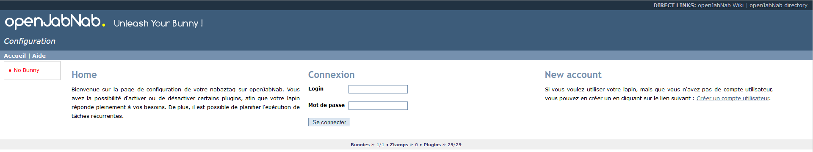
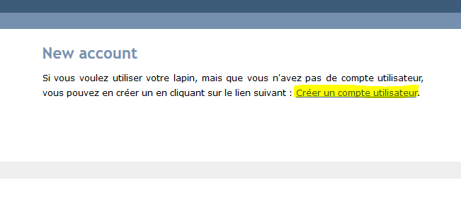
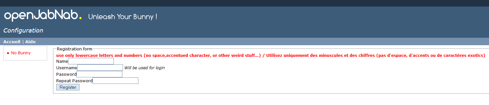

# Instalación de Openjabnab

Aquí hay un tutorial sobre cómo instalar openjabnab localmente (en un rpi o zumbido)

> **Nota**
>
> Este tutorial está inspirado en gran medida por [este](http://jetweb.free.fr/nabaztag_rpi/Tutoriel_OJN_RPi_v1-1.pdf)

# Instalación de dependencias

Una vez que el sistema instalado en SSH haya terminado :

````
apt-get update
apt-get dist-upgrade
apt-get install ssh
apt-get install apache2 php5 php5-mysql libapache2-mod-php5
a2enmod rewrite
apt-get install make
apt-get install build-essential
apt-get install libqt4-dev --fix-missing
apt-get install qt4-dev-tools
apt-get install bind9
apt-get install git
````

# Configuración de red

Luego debe recuperar la dirección IP del sistema :

``ifconfig``

El resultado es :

````
eth0      Link encap:Ethernet  HWaddr d0:63:b4:00:54:98
          inet addr:192.168.0.162  Bcast:192.168.0.255  Mask:255.255.255.0
          inet6 addr: fe80::d263:b4ff:fe00:5498/64 Scope:Link
          UP BROADCAST RUNNING MULTICAST  MTU:1500  Metric:1
          RX packets:10721 errors:0 dropped:0 overruns:0 frame:0
          TX packets:6477 errors:0 dropped:0 overruns:0 carrier:0
          collisions:0 txqueuelen:1000
          RX bytes:2032942 (1.9 MiB)  TX bytes:1230703 (1.1 MiB)
````

Aquí la dirección IP es 192.168.0.162.

> **Nota**
>
> Para el resto del tutorial usaré esta IP, por supuesto, se reemplazará de acuerdo con la que realmente tiene

Luego edite el archivo ``/etc/resolv.conf``

``vim  /etc/resolv.conf``

Y añadir :

``nameserver 192.168.0.162``

# Configuración DNS

Edite el archivo ``/etc/bind/named.conf.local``

````
cd /etc/bind/
vim named.conf.local
````

Y añadir :

````
zone "raspberry.pi"{
 type master;
 file "/etc/bind/db.raspberry.pi";
};
zone "0.168.192.in-addr.arpa"{
 type master;
 file "/etc/bind/db.192.168.0.inv";
};
````

Crea el archivo ``db.raspberry.pi``

``vim db.raspberry.pi ---``

Y poner en ello :

````
$TTL 604800
@ IN SOA ojn.raspberry.pi. root.raspberry.pi. (
 1 ; Serial
 604800 ; Refresh
 86400 ; Retry
 2419200 ; Expire
 604800 ) ; Negative Cache TTL
;
@ IN NS ojn.raspberry.pi.
ojn IN A 192.168.0.162
192.168.0.162 IN A 192.168.0.162
````

Luego crea este archivo ``db.192.168.0.inv``

``vim db.192.168.0.inv``

Y poner :

````
$TTL 604800
@ IN SOA ojn.raspberry.pi. root.localhost. (
 2 ; Serial
 604800 ; Refresh
 86400 ; Retry
 2419200 ; Expire
 604800 ) ; Negative Cache TTL
;
@ IN NS ojn.raspberry.pi.
162 IN PTR ojn.raspberry.pi.
````

> **Importante**
>
> Recuerde reemplazar el 162 en la última línea con la última parte de la ip de su sistema

Lanzar DNS :

``/etc/init.d/bind9 start``

Prueba si es bueno :

``ping ojn.raspberry.pi``

Deberías tener :

````
root@cubox-i:/home/ojn# ping ojn.raspberry.pi
PING ojn.raspberry.pi (192.168.0.162) 56(84) bytes of data.
64 bytes from ojn.raspberry.pi (192.168.0.162): icmp_seq=1 ttl=64 time=0.069 ms
64 bytes from ojn.raspberry.pi (192.168.0.162): icmp_seq=2 ttl=64 time=0.067 ms
64 bytes from ojn.raspberry.pi (192.168.0.162): icmp_seq=3 ttl=64 time=0.059 ms
64 bytes from ojn.raspberry.pi (192.168.0.162): icmp_seq=4 ttl=64 time=0.068 ms
^C
--- ojn.raspberry.pi ping statistics ---
4 packets transmitted, 4 received, 0% packet loss, time 3000ms
rtt min/avg/max/mdev = 0.059/0.065/0.069/0.010 ms
````

> **Nota**
>
> Tienes que hacer ctrl + c para salir del ping

Por seguridad también agregaremos la resolución en / etc / hosts, do :

``vim /etc/hosts``

Y añadir :

``192.168.0.162 ojn.raspberry.pi``

# Recuperación de Openjabnab

Primero crearemos el usuario :

````
adduser ojn
cd /home/ojn
````

Luego clone openjabnab :

````
git clone https://github.com/OpenJabNab/OpenJabNab.git
chown -R ojn:ojn /home/ojn/OpenJabNab/
chmod 0777 /home/ojn/OpenJabNab/http-wrapper/ojn_admin/include
````

# Configuración del servidor web

Hacer :

````
cd /etc/apache2/sites-available/
vim ojn.conf
````

Y añadir :

````
<VirtualHost *:80>
        DocumentRoot /home/ojn/OpenJabNab/http-wrapper/
        ServerName ojn.raspberry.pi
         <Directory />
                 Options FollowSymLinks
                AllowOverride None
         </Directory>
         <Directory /home/ojn/OpenJabNab/http-wrapper/>
                 Options Indexes FollowSymLinks MultiViews
                 AllowOverride all
                Order allow,deny
                 allow from all
         </Directory>
</VirtualHost>
````

Luego active el sitio :

``a2ensite ojn``

Luego debe autorizar el directorio del servidor openjabnab, hacer :

``vim /etc/apache2/apache2.conf``

Y añadir :

````
<Directory /home/ojn/>
        Options Indexes FollowSymLinks
        AllowOverride None
        Require all granted
</Directory>
````

Luego reiniciamos apache :

``service apache2 reload``

# Instalación de openjabnab

Hacer :

````
su ojn
cd /home/ojn/OpenJabNab/server
qmake -r
make
````

> **Nota**
>
> Este paso puede ser muy largo (hasta 45 minutos)

# Configuración de Openjabnab

Hacer :

````
cp openjabnab.ini-dist bin/openjabnab.ini
vim bin/openjabnab.ini
````

Y cambia las siguientes líneas :

````
StandAloneAuthBypass = true
AllowAnonymousRegistration = true
AllowUserManageBunny = true
AllowUserManageZtamp = true
````

Y reemplazar todo *my.domain.com* por *ojn.raspberry.pi*

# Configuración del servidor web Openjabnab

En tu publicación debes editar el archivo ``C:\Windows\System32\drivers\etc`` y añadir :

``192.168.0.162 ojn.raspberry.pi``

Entonces sigue :

``http://ojn.raspberry.pi/ojn_admin/install.php``

Validar todo

# Lanzamiento del servidor

Ahora todo está listo, todo lo que queda es iniciar el servidor :

````
su ojn
cd ~/OpenJabNab/server/bin
./openjabnab
````

Ahora ve a :

``http://ojn.raspberry.pi/ojn_admin/index.php``

> **Nota**
>
> Si todo está bien, debería tener las estadísticas que aparecen a continuación

# Configuración de conejo

Para configurar el conejo es bastante simple, tienes que desenchufarlo y volver a enchufarlo, sigue presionando su botón. Normalmente debería iluminarse de azul.

Luego, con su PC, debe tener una nueva red wifi nabaztagXX, conéctese escribiendo 192.168.0.1.

Una vez encendido ingrese su configuración wifi y la siguiente información :

````
DHCP enabled : no
Local Mask : 255.255.255.0
Local gateway : 192.168.0.1 ou 192.168.0.254 (en fonction de votre réseau)
DNS server : 192.168.0.162
````

# Supervisión del servidor Openjabnab e inicio automático

Como notará si cierra su sesión, el servidor openjabnab se detiene. Entonces, agregue un pequeño script para monitorear el servidor e iniciarlo automáticamente. Hacer :

````
cd /home/ojn
vim checkojn.sh
````

Y agrega :

````
if [ $(ps ax | grep openjabnab | grep -v grep | wc -l) -eq 0 ]; then
    su ojn; cd /home/ojn/OpenJabNab/server/bin;nohup ./openjabnab >> /dev/null 2>&1 &
fi
````

Entonces haz :

``chmod +x checkojn.sh``

Ahora debemos agregar el script al inicio y una verificación cada 15 minutos, por ejemplo :

``crontab -e``

Y añadir :

````
@reboot /home/ojn/checkojn.sh
*/15 * * * * /home/ojn/checkojn.sh
````

> **Importante**
>
> Es absolutamente necesario ponerlo en el crontab raíz, si todavía está con el usuario ojn do ctrl + D

# Configuración de tu conejo en openjabnab

Seguir :

``http://ojn.raspberry.pi/ojn_admin/index.php``

Usted debe tener :



Ahora debe crear una cuenta haciendo clic en crear usuario :



Complete la información solicitada e inicie sesión :



Una vez conectado, vaya al servidor :


Luego baje para encontrar la lista de conejos conectados y obtenga su dirección mac :


Luego vaya a la cuenta y complete el nombre y el campo mac del conejo y confirme :


Ahora encontrará su conejo en la página del conejo, haga clic en él para abrir su configuración :


Ahora debe activar la API púrpura y pasarla en público, también es aquí donde encontrará la clave API púrpura que se usará para Jeedom :


A continuación encontrará la lista de complementos, no olvide activarlos (tipo TTS o control auditivo) :


# Configuración de Jeedom

La configuración en Jeedom es bastante simple, primero debe conectarse en SSH a Jeedom (si tiene un cuadro Jeedom, los identificadores están en el documento de instalación). Luego edite el archivo / etc / hosts

``vim /etc/hosts``

Y agregue la siguiente línea :

``192.168.0.162 ojn.raspberry.pi``

Entonces todo sucede en Jeedom, después de crear tu conejo aquí está la configuración para poner:


Aquí está tu conejo ahora tiene su propia madriguera local !!!!!

# Poner el TTS localmente

Todo es local excepto el TTS que pasa por el sitio de Acapela, pero es posible modificando algunos archivos para pasarlo localmente

> **Nota**
>
> Consideraré que oenjabnab está instalado en / home / ojn / OpenJabNab y que ha iniciado sesión como usuario de openjabnab, aquí ojn

## Creación de tts jeedom

Necesita crear una carpeta jeedom en servver / tts :

``mkdir /home/ojn/OpenJabNab/server/tts/jeedom``

Entonces tienes que hacer 3 archivos :

-   ``jeedom.pro``

````
######################################################################
# Automatically generated by qmake (2.01a) sam. janv. 19 19:10:01 2008
######################################################################

TEMPLATE = lib
CONFIG -= debug
CONFIG += plugin qt release
QT += network xml
QT -= gui
INCLUDEPATH += . ../../server ../../lib
TARGET = tts_jeedom
DESTDIR = ../../bin/tts
DEPENDPATH += . ../../server ../../lib
LIBS += -L../../bin/ -lcommon
MOC_DIR = ./tmp/moc
OBJECTS_DIR = ./tmp/obj
win32 {
  QMAKE_CXXFLAGS_WARN_ON += -WX
}
unix {
  QMAKE_LFLAGS += -Wl,-rpath,\'\$$ORIGIN\'
  QMAKE_CXXFLAGS += -Werror
}

# Input
HEADERS += tts_jeedom.h
SOURCES += tts_jeedom.cpp
````

-   ``tts\jeedom.h``

````
#ifndef _TTSACAPELA_H_
#define _TTSACAPELA_H_

#include <QHttp>
#include <QMultiMap>
#include <QTextStream>
#include <QThread>
#include "ttsinterface.h"

class TTSJeedom : public TTSInterface
{
  Q_OBJECT
  Q_INTERFACES(TTSInterface)

public:
  TTSJeedom();
  virtual ~TTSJeedom();
  QByteArray CreateNewSound(QString, QString, bool);

private:
};

#endif
````

-   ``tts\jeedom.cpp``

````
#include <QDateTime>
#include <QUrl>
#include <QCryptographicHash>
#include <QMapIterator>
#include "tts_jeedom.h"
#include "log.h"
#include <QNetworkReply>
#include <QNetworkRequest>
#include <QNetworkAccessManager>

Q_EXPORT_PLUGIN2(tts_jeedom, TTSJeedom)

TTSJeedom::TTSJeedom():TTSInterface("jeedom", "Jeedom")
{
  voiceList.insert("fr", "fr");
}

TTSJeedom::~TTSJeedom()
{
}

QByteArray TTSJeedom::CreateNewSound(QString text, QString voice, bool forceOverwrite)
{
  QEventLoop loop;
  if(!voiceList.contains(voice))
    voice = "fr";
  // Check (and create if needed) output folder
  QDir outputFolder = ttsFolder;
  if(!outputFolder.exists(voice))
    outputFolder.mkdir(voice);

  if(!outputFolder.cd(voice))
  {
    LogError(QString("Cant create TTS Folder : %1").arg(ttsFolder.absoluteFilePath(voice)));
    return QByteArray();
  }

  // Compute fileName
  QString fileName = QCryptographicHash::hash(text.toAscii(), QCryptographicHash::Md5).toHex().append(".mp3");
  QString filePath = outputFolder.absoluteFilePath(fileName);

  if(!forceOverwrite && QFile::exists(filePath))
    return ttsHTTPUrl.arg(voice, fileName).toAscii();

  // Fetch MP3
  QHttp http("TODO_IP_JEEDOM");
  QObject::connect(&http, SIGNAL(done(bool)), &loop, SLOT(quit()));

  QByteArray ContentData;
  ContentData += "apikey=TODO_API_JEEDOM&text="+QUrl::toPercentEncoding(text);

  QHttpRequestHeader Header;
  Header.addValue("Host", "TODO_IP_JEEDOM");

  Header.setContentLength(ContentData.length());
  Header.setRequest("GET", "/core/api/tts.php?apikey=TODO_API_JEEDOM&text="+QUrl::toPercentEncoding(text), 1, 1);

  http.request(Header, ContentData);
  loop.exec();

  QFile file(filePath);
  if (!file.open(QIODevice::WriteOnly))
  {
    LogError("Cannot open sound file for writing : "+filePath);
    return QByteArray();
  }
  file.write(http.readAll());
  file.close();
  return ttsHTTPUrl.arg(voice, fileName).toAscii();
}
````

> **Nota**
>
> No olvides reemplazar los TODOs

Luego active el tts jeedom modificando el archivo ``/home/ojn/OpenJabNab/server/tts/tts.pro`` agregando libertad a ``SUBDIRS`` :

````
TEMPLATE = subdirs
SUBDIRS = acapela google jeedom
````

## Recompilation

````
cd /home/ojn/OpenJabNab/server
qmake -r
make
````

## Modificación del servicio tts

Edite el archivo ``/home/ojn/OpenJabNab/server/bin/openjabnab.ini`` y cambiar ``TTS=acapela`` por ``TTS=jeedom``

## Relanzamiento de openjabnab

La forma más fácil es reiniciar la máquina para reiniciar openjabnab
