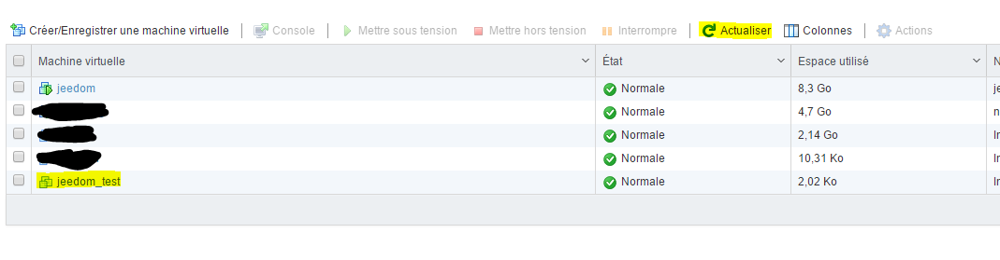

# Crear un vm bajo vmware

Veremos aquí cómo crear una VM en VMware.

Hay una pequeña cosa importante que debes saber sobre VMware, hay 2 formas de administrarlo :

-   la interfaz web (presente por defecto en 6.0 actualización 2, o mediante un vib para las otras versiones), se accede por IP\_ESXI / ui
-   El cliente pesado e histórico de VMware (cliente vSphere)

Aquí usaré principalmente la interfaz web porque creo que es el futuro de VMware el que está abandonando cada vez más el cliente pesado (de hecho, todas las características nuevas desde 5.1 no se puede usar con el cliente grueso).

También tenga en cuenta que la interfaz web todavía se está implementando en VMware; de hecho, seguramente encontrará algunos errores o ralentizaciones, pero una pequeña actualización de la página comenzará de nuevo sin problemas.

# Conexión a la interfaz web

Vaya a IP\_ESXI / ui con su navegador de Internet, debe tener :

> **Nota**
>
> Si no tienes nada te aconsejo que instales la interfaz web, toda la información [aquí](https://doc.jeedom.com/es_ES/howtoadvance/vmware.trucs_et_astuces)

Ingrese sus credenciales de inicio de sesión en ESXI :

Como puede ver, la interfaz es bastante agradable y le permite hacer muchas cosas, no entraré en detalles, pero ya puede hacerlo desde esta pantalla :

-   detener / reiniciar el ESXi
-   ver el uso de recursos (CPU, memoria y disco))
-   tener información sobre su sistema (tiempo de funcionamiento, versión de VMware, versión de la BIOS, visualización de almacenes de datos)
-   botón para crear una VM (la usaremos justo después)
-   un botón de acción que le permite cambiar al modo de mantenimiento (útil si tiene un clúster ESXi; de lo contrario, nunca lo usará), active / desactive el servicio SSH (se usa en el tutorial de configuración de respaldo)

# Envío de instalación ISO

Después de descargar su instalación ISO ([aquí](https://cdimage.debian.org/cdimage/archive/11.8.0/amd64/iso-cd/debian-11.8.0-amd64-netinst.iso) por ejemplo para debian 11.8 en netinstall), debes colocarlo en tu almacén de datos.

Para ese clic en el almacén de datos :

Seleccione su almacén de datos (generalmente se llama datastore1) :

Haga clic en "Navegador de base de datos" :

Haga clic en "Descargar" (el primero) :

Seleccione el ISO descargado previamente y valide :

Luego puede seguir el progreso del envío :

Una vez terminado, puede ver que su iso ha llegado al almacén de datos :

# Creación de tu primera VM

Haga clic en el botón "Crear / Guardar VM"" :

Haga clic en siguiente :

Luego asigne un nombre a su máquina y especifique su sistema operativo (aquí instalaremos un Debian) :

Indique el almacén de datos de destino :

Aquí podrás configurar los parámetros de tu máquina (disco duro, CPU, memoria, etc.)) :

> **Nota**
>
> Todos estos parámetros se pueden modificar posteriormente sin problemas, pero tenga en cuenta que realmente no es posible reducir el tamaño de un disco duro, se puede aumentar (pero hay que saber gestionar esto a nivel del disco duro). . 'OS next) pero no reducirlo.

En la unidad de CD / DVD, seleccione "Base de datos de archivos ISO" :

Luego seleccione la ubicación donde se almacena su ISO (consulte el capítulo anterior) y valide :

Entonces haz lo siguiente :

Luego tiene un resumen de su configuración, haga clic en "Finalizar" :

Un mensaje en la parte superior le dirá que es bueno, luego haga clic en "Máquinas virtuales" :

Debería ver su máquina virtual (si no es el caso, haga clic en "Actualizar"), haga clic en ella :

Debe tener una página de este tipo, haga clic en el botón de reproducción :

Su máquina se iniciará y podrá instalar su sistema operativo :

> **Importante**
>
> Una vez que su máquina está instalada, es ABSOLUTAMENTE necesario instalar las herramientas de VMware (le permite a VMware tener información sobre su VM y apagarla correctamente)). Bajo debian simplemente haga "sudo apt-get -y install open-vm-tools".

Para el resto de la instalación, los invito a leer esto [Tutorial](https://doc.jeedom.com/es_ES/howtoadvance/debian.installation)

# Montar dispositivos USB en la VM

> **Nota**
>
> Si no tiene las siguientes opciones, es necesario actualizar el ESXi Embedded Host Client, toda la información [aquí](https://doc.jeedom.com/es_ES/howto/doc-howto-vmware.trucs_et_astuces.html)

Es una necesidad bastante rara, pero tuve que usarla para Jeedom, de hecho tengo en mi ESXi las teclas Zwave, RFXcom, edisio, enOcean y GSM de conectado y tuve que conectarlas a mi VM Jeedom para poder usarlo.

> **Nota**
>
> Para Zwave, RFXcom, edisio y enOcean no hay problema, para las claves GSM debe seguir esto [Tutorial](https://doc.jeedom.com/es_ES/howtoadvance/gsm.huawei_mode_modem) antes de forzar la tecla en modo módem solo de lo contrario no se ve correctamente en el ESXi.

Vaya a su VM y luego haga "Cambiar configuración" :

Haga clic en "Agregar otro dispositivo" y luego en el controlador USB :

> **Nota**
>
> El siguiente paso deberá repetirse para cada dispositivo USB que desee conectar

Guardar, rehacer "Cambiar configuración", luego "Agregar otro dispositivo" y "Dispositivo USB" :

Elija su dispositivo USB de la lista desplegable :

Y ahora su dispositivo está conectado a su VM. En cada reinicio, se volverá a conectar automáticamente a la VM y si lo desconecta / conecta físicamente, se volverá a conectar a su VM. En otras palabras, el uso ahora es completamente transparente.
