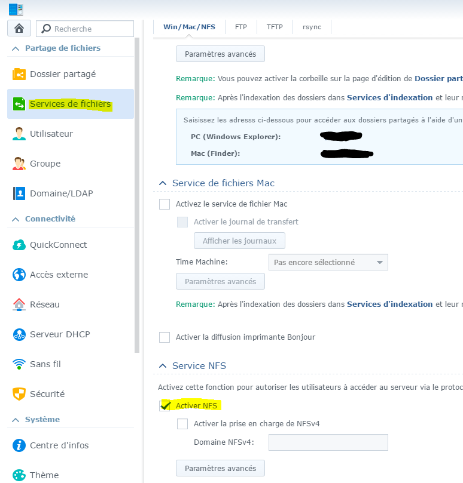
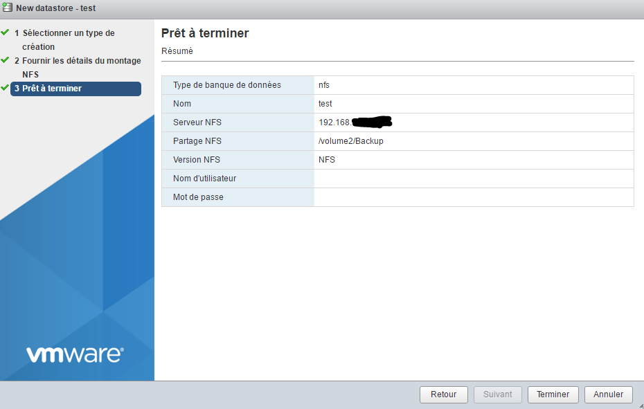
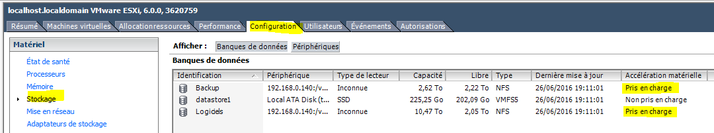

# Consejos y trucos de vmware

No es realmente un tutorial aquí, sino más bien una colección de consejos y trucos sobre VMware

# Agrega tu licencia

Una vez conectado en la interfaz web ``IP_ESXI/ui`` vaya a "Administrar" :

Luego en "Licencias" y haga clic en "Asignar una licencia"

E ingrese su clave de licencia

> **Nota**
>
> Como recordatorio, si no lo hace, es posible que su ESXi ya no funcione después de 60 días

# Montar un almacén de datos NFS con Synology

Veremos aquí cómo montar un recurso compartido NFS desde Synology en VMware. Esto permite, por ejemplo, colocar las máquinas virtuales en Synology (que puede tener más espacio que el ESXi) o enviar las copias de seguridad de las máquinas en Synology

## Configuración de Synology

Debe ir al panel de control, luego "Servicios de archivos" y marcar la casilla "Activar NFS" :

Luego debe hacer clic en "Carpeta compartida", luego elegir la carpeta para compartir (aquí Copia de seguridad), hacer clic en modificar y luego "Autorización NFS" y finalmente en crear (aquí ya tengo una, su lista debería estar vacía) :

Luego pones la IP de tu ESXi y en "Squash" pones "Mapping of all users on admin" y luego validas :

Luego debemos recuperar el camino compartido (aquí ``/volume2/Backup``) :

Aquí está terminado en el lado de Synology, ahora cambiaremos al lado de ESXi

## Configuración de ESXi

Vaya a "Almacenamiento" :

Luego haga clic en "Nueva base de datos" :

Allí selecciona "Montar una base de datos NFS" y luego hace lo siguiente :

Ingrese el nombre del almacén de datos para crear (tenga cuidado de evitar espacios y caracteres especiales), coloque la IP de nuestra Synology y coloque la ruta de uso compartido (ver arriba) y finalmente valide :

Haga clic en finalizar :

Y ahora debería aparecer su nuevo almacén de datos (de lo contrario, haga clic en "Actualizar"").

# Complemento VAAI Synology agregado para montaje NFS

Agregar este complemento habilita la aceleración de hardware en montajes NFS (para obtener una explicación, consulte [aquí](http://www.virtual-sddc.ovh/exploiter-les-vaai-nfs-avec-un-nas-synology/))

Para ver si lo tiene, debe conectarse con el cliente grueso (no encontré la información en el cliente web) e ir a configuración → almacenamiento :

La implementación es bastante simple, primero debe activar el servicio SSH del ESXi (en la interfaz web debe pasar a la acción ⇒ servicios ⇒ Activar Secure Shell), luego conectarse en SSH arriba (los identificadores son lo mismo que para acceder a la interfaz). Entonces solo tienes que hacer :

``esxcli software vib install -v https://global.download.synology.com/download/Tools/NFSVAAIPlugin/1.0-0001/VMware_ESXi/esx-nfsplugin.vib -f``

Usted debe tener :

Luego debe reiniciar ESXi, para verificar que esté bien, luego debe regresar con el cliente grueso a configuración → almacenamiento :

# Instalar / actualizar ESXi Embedded Host Client

ESXi Embedded Host Client es una interfaz web (en HTML5) de ESXi que permite en el 95% de los casos prescindir del cliente pesado. Está presente por defecto en la versión 6.0 actualización 2, pero en la versión 1.0, se recomienda actualizarlo.

Encontrarás toda la información
[aquí](https://labs.vmware.com/flings/esxi-embedded-host-client)

Para ver si tiene la interfaz web, simplemente vaya a su navegador con ``IP_ESXI/ui`` si no tiene nada, debe instalarlo, primero debe conectarse en SSH en el ESXI y luego hacerlo :

``esxcli software vib install -v http://download3.vmware.com/software/vmw-tools/esxui/esxui-signed-latest.vib``

Si ya lo tienes, para actualizarlo debes hacer :

``esxcli software vib update -v http://download3.vmware.com/software/vmw-tools/esxui/esxui-signed-latest.vib``

# Instalación del cliente grueso

Esta parte es opcional si no necesita administrar el USB.

Debe ir, con su navegador de Internet, a la IP del ESXi y luego hacer clic en el enlace ``Download vSphere Client for Windows`` :

Una vez descargado, solo tiene que iniciar la instalación (voluntariamente paso esta parte porque es suficiente para validar todo).

Luego, inicie VMware vSphere Client, debería tener :

Solo tiene que ingresar la IP de su ESXi, el nombre de usuario y la contraseña y estará conectado a ella :

# Actualización de ESXi

El procedimiento es bastante fácil, primero debe recuperar el parche yendo [aquí](https://my.vmware.com/group/vmware/patch#search) (probablemente tendrá que iniciar sesión con su cuenta de VMware). En la lista ``Select a Product`` poner ``ESXi (Embedded and Installable)``, enfrente de dejar la última versión de VMware y hacer ``Search``. Luego descargue el parche deseado (generalmente el último). El número de compilación (el primer número que no comienza con KB) le proporciona la versión del parche que puede comparar con su número de compilación.

Luego transfiere el zip a una de tus tiendas de datos y crea :

``esxcli software vib update -d /vmfs/volumes/576c8ab3-fdf64d2f-091b-b8aeedeb87fb/ESXi600-201605001.zip``

> **Nota**
>
> Reemplace la ruta y el nombre del zip de acuerdo con su configuración

> **Importante**
>
> Tenga cuidado de poner el camino completo al zip, de lo contrario no funcionará

El comando anterior solo actualiza las vibraciones que lo necesitan, pero puede forzar la instalación de todas las vibraciones en el paquete (así que tenga cuidado, esto se puede degradar) haciendo :

``esxcli software vib install -d /vmfs/volumes/576c8ab3-fdf64d2f-091b-b8aeedeb87fb/ESXi600-201605001.zip``

# Configuración NTP

Por defecto, ESXi no usa NTP, lo que significa que no está a tiempo y que las máquinas virtuales no están a tiempo, corregirlo es muy simple. Debe pasar de la versión web a Administrar → Sistema → Fecha y hora, allí hace clic en "Cambiar configuración" :

Y en el cuadro "Servidor NTP" tienes que poner : ``0.debian.pool.n, 1.debian.pool.n, 2.debian.pool.n, 3.debian.pool.n, time.nist.gov``

Luego, en Acciones → Servicio NTP → Estrategia, haga clic en "Iniciar y detener con el host" :

Aún en Acciones → Servicio NTP, haga clic en "Iniciar"

Este es tu ESXi ya debería tomarse el tiempo solo.

# Acceso externo a ESXi

Para acceder al ESXi desde el exterior, necesita :

-   abra el puerto 443 a ESXi 443
-   abra el puerto 902 a ESXi 902

Y eso es todo. Un pequeño consejo si tiene un Synology NAS que puede hacer (tenga cuidado de seguir) :

-   abra 443 a 5001 en Synology NAS
-   abra los 80 hacia los 80 del NAS (útil solo para generar los certificados, encriptemos)
-   abra el puerto 902 a ESXi 902

Luego, en el NAS en el panel de control, luego en el portal de la aplicación y el proxy inverso (atención, es absolutamente necesario DSM 6) :

Haga clic en crear y poner :

En "Nombre de host" (en el nivel de origen) debe poner el DNS deseado (por ejemplo, monesxi.mondsn.synology.yo) y en "Nombre de host" (en el destino) debe poner la IP del ESXi

> **Nota**
>
> También puede hacer lo mismo para acceder a jeedom pero esta vez colocando la IP de la libertad (de la vm si está virtualizado) y el puerto 80

> **Nota**
>
> Una vez que haya hecho esto y si su DNS apunta correctamente en el NAS, puede generar un certificado SSL válido de forma gratuita con el cifrado Let's, ingresando a Secruity ⇒ certificado y agregando. Entonces no olvide hacer clic en configurar para asignarlo a su proxy inverso

Luego, para acceder a su ESXi, solo tiene que ir a su DNS o IP externo con su navegador agregando / ui al final y está bien.

> **Importante**
>
> Si pasa por el proxy inverso de NAS, la consola en el modo web de VM no funciona (porque pasa por WebSocket), por otro lado, si pasa por VMware Remote Console, todo debería estar bien (pasa por el puerto 902)

> **Nota**
>
> También hay una aplicación Vmware Watchlist en Android para acceder a ESXi y a las consolas de las máquinas virtuales

# Certificado SSL

Es posible importar los certificados de vmware directamente en su PC para que ya no tenga la alerta.

Para que sea necesario :

-   tener una url (dns) para acceder a su esxi, aquí tomaremos ``esxi1.lan``
-   configura el nombre de tu esxi, en ssh arriba haz : ``esxcli system hostname set --host=esxi1``
-   configurar el fqdn : ``esxcli system hostname set --fqdn=esxi1.lan``
-   Recupere el certificado raíz de esxi, está en ``/etc/vmware/ssl/castore.pem``

Haga clic derecho en la computadora y luego instale el certificado, póngalo en "Autoridad de certificación raíz de confianza"
