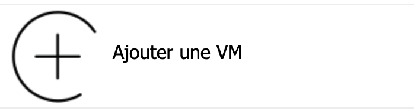
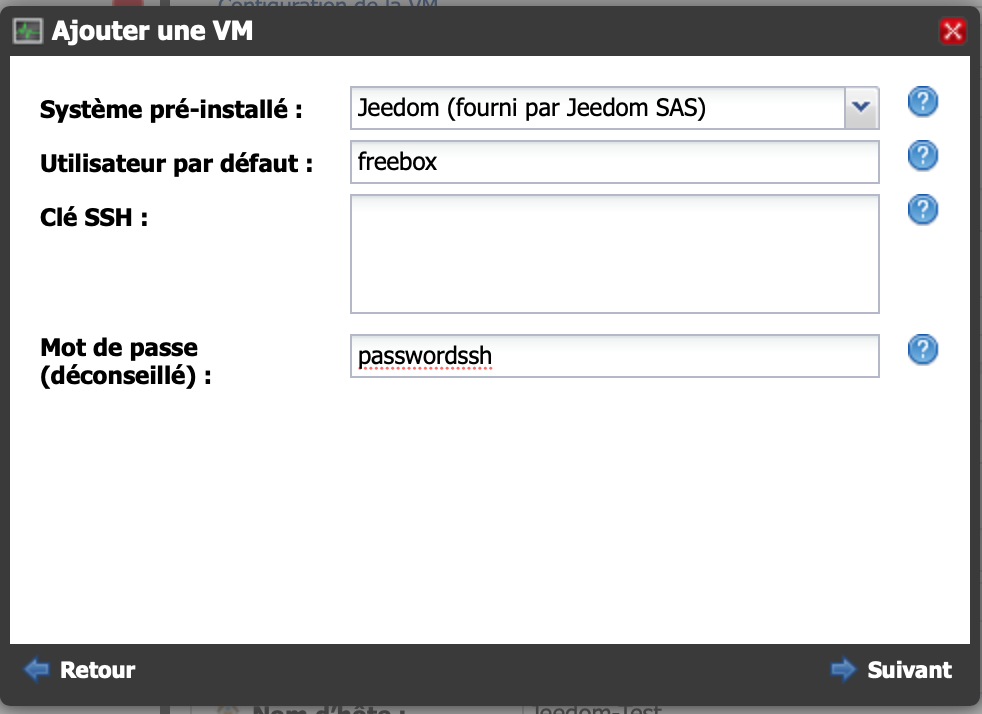
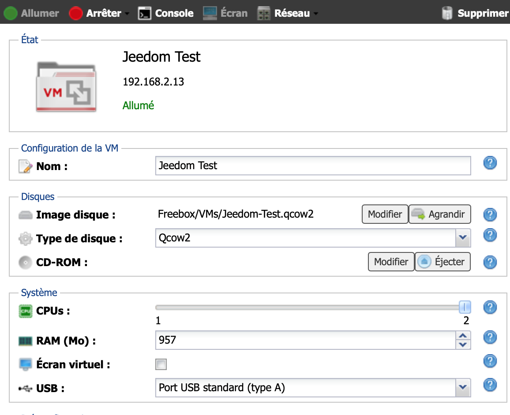

# Instalación en Freebox Delta

Es posible instalar en Freebox Delta Jeedom a través del sistema VM.

## Conexión al Delta

Debe ir a la interfaz de configuración de su Freebox Delta. Luego haga clic en VM.

## Establecer las diferentes opciones

Haga clic en "Agregar una VM"

Configurar funciones. Recomendamos que coloque 2 CPU y el máximo en RAM.

Configurar usuario y contraseña, **deben mantenerse en la memoria, se les pedirá durante una conexión SSH**:

## Instalación en curso

Espera mientras la imagen se descarga

## Conéctate a tu Jeedom

Puede conectarse usando la dirección indicada en la página:

Recuerde asignar el puerto USB de Delta a la VM si desea usar una antena.

No **no** marque "Pantalla", esto es inútil en la imagen de Jeedom (aparte del consumo excesivo).

La dirección IP de su Jeedom en Freebox Delta está escrita en la parte superior, debajo de su nombre.

El inicio de sesión y la contraseña predeterminados son admin / admin cuando accede a jeedom a través de su navegador.

Por lo demás, puedes seguir la documentación [Primer paso con Jeedom](https://doc.jeedom.com/es_ES/premiers-pas/index.html)
