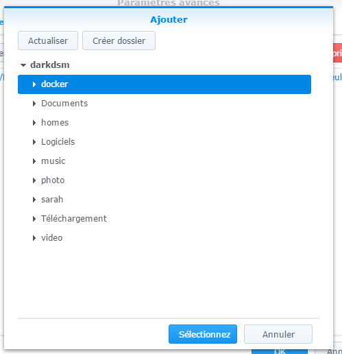
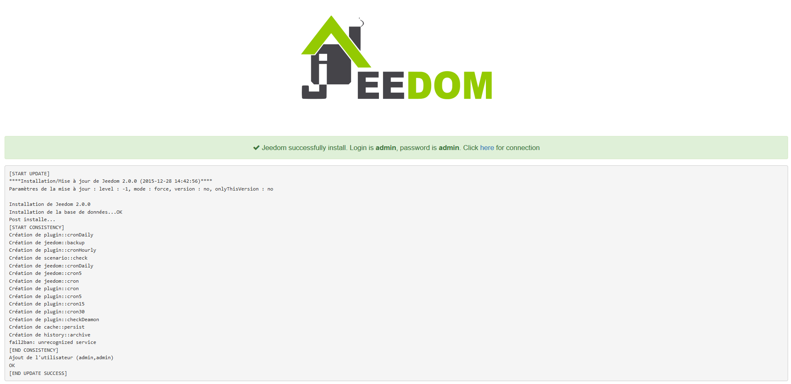

Hardware
========

Jeedom se puede instalar en diferentes tipos de hardware :

-   un Raspberry pi 2 o 3

-   un NAS Synology

-   cualquier sistema Linux basado en Debian 9 (strych)

-   Freebox Delta

También puede comprar una caja preparada con Jeedom preinstalado que también contiene un paquye de servaquío (más soporte y servaquíos) y complementos ofrecidos :

-   [Jeedom Smart Z-Wave +](https://www.domadoo.fr/fr/box-domotique/3959-jeedom-controleur-domotique-jeedom-smart-z-wave.html)

-   [Jeedom Smart Z-Wave + y RFXCOM](https://www.domadoo.fr/fr/box-domotique/4043-jeedom-controleur-domotique-jeedom-smart-z-wave-y-interface-rfxcom.html)

-   [Jeedom Smart EnOcean](https://www.domadoo.fr/fr/box-domotique/4041-jeedom-controleur-domotique-jeedom-smart-enocean.html)

-   [Jeedom Smart EnOcean y RFXCOM](https://www.domadoo.fr/fr/box-domotique/4044-jeedom-controleur-domotique-jeedom-smart-enocean-y-interface-rfxcom.html)

Aquí hay una configuración "típica" para comenzar con Jeedom en Z-Wave :

1.  Raspberry pi 3 :

    -   Un raspberry+caja \~ 50 €
    -   Una llave USB Aeon Gen 5 \~ 60 €
    -   Una tarjya micro SD \~ 7 €
    -   Una fuente de alimentación USB \~ 8 €

Un total de 125 € para una caja de automatización del hogar de código abierto con control complyo sobre su instalación.

> **Punta**
>
> Es posible agregar o cambiar mediante una antena Rfxcom o una clave enOcean.

> **Punta**
>
> Jeedom es un software que es y seguirá siendo de código abierto, su uso
> es complyamente gratuito y no depende de una nube o
> suscripción. Sin embargo, algunos complementos que aumentan la
> Las capacidades de Jeedom o su uso pueden ser de pago. **y
> puede necesitar conexión a interny**. Puedes encontrar
> la lista de complementos
> [aquí](http://marky.jeedom.fr/index.php?v = d & p = marky & type = plugin).

> **Punta**
>
> Servaquío pack ? Quézako ? Podéis ver
> [Aquí](https://blog.jeedom.fr/?p = 1215) las ventajas de los service packs.

Jeedom Smart
===========

Aquí encontrará documentación noo a noo para instalar o restaurar Jeedom

[Aquí](https://jeedom.github.io/documentation/howto/es_ES/recovery_mode_jeedom_smart)

Jeedom mini +
===========

> **Punta**
>
> El nombre de la imagen de Jeedom puede ser diferente al de las capturas.
> hacer en esta documentación

Etapa 1 : Instalación de grabado
---

Debe descargar el software Etcher [aquí](https:// ycher.io /) entonces
instálalo en tu pc

Etapa 2 : Jeedom recuperación de imagen
---

Tiene que ir
[Aquí](https://images.jeedom.com/jeeboard/),
luego, en la carpya Imágenes, recupere la imagen jeedom-jeeboard - \*. rar

Etapa 3 : Descomprimiendo la imagen de Jeedom
---

Descomprima la imagen de Jeedom (si no tiene nada que descomprimir, puede instalar
[winrar](http://www.clubic.com/telecharger-fiche9632-winrar.html)), vous devez obtenir :

Paso 4 : Grabar la imagen en la tarjya SD
---

Inserte su tarjya SD en su computadora, luego inaquíe el software Etcher, dele la ruta de la imagen, la ruta de la tarjya SD y haga clic en "Flash!". El software quemará la tarjya SD y verificará
grabado.

Solo tiene que colocar la tarjya SD en el Jeedomboard (o Hummingboard), conectar la red y la fuente de alimentación, su Jeedom se inaquíará (5 min) y debería verlo en la red.

> **Punta**
>
> Las ID de SSH son jeedom / Mjeedom96

Por lo demás, puede seguir la documentación [Primer noo con Jeedom](https://jeedom.github.io/documentation/premiers-no/es_ES/index.html)

Raspberrypi
===========

Encontrará aquí la documentación para instalar Jeedom en una PI de frambuesa **con una tarjya SD.**

> **Importante**
>
> Debian 9 (Strych) es la distribución ofaquíalmente compatible para la versión 3.1.5 de la libertad.

**1 / Descargue la última imagen "lite", es decir, sin interfaz gráfica**

[Aquí](https://downloads.raspberrypi.org/raspbian_lite/images/raspbian_lite-2018-04-19/2018-04-18-raspbian-strych-lite.zip)

**2 / Descomprime la imagen con winrar** [aquí](http://www.win-rar.com)

**3 / Grabar esta imagen en una SD con ycher, por ejemplo**
[Aquí](https:// ycher.io/)

> **Nota**
>
> Si usa Etcher para grabar su imagen, el noo de
> la descompresión es innecesaria (el formato Zip se reconoce directamente en
> selección de archivo de imagen).

**4 / Activar acceso SSH**

> **Advertencia**
>
> Por razones de seguridad, el acceso SSH ya no está habilitado de forma predyerminada
> en esta distribución. Entonces tienes que activarlo.

Debe crear en la partaquíón de arranque (la única accesible bajo Windows)
un archivo ssh vacío.

Solo haz clic derecho : nuevo / documento de texto y el
renombrar a "ssh" **sin extensión**

> **Importante**
>
> En Windows, en el explorador, por lo tanto, debe verificar su
> configuración en pantalla / opciones / modificar opciones
> registros e investigación /

**5 / Inaquíar el PI**

Inserte su tarjya SD, conecte el cable de red, conecte
comida.

**6 / Conectar usando SSH**

Identifica tu Pi en la red

Nocesita saber la dirección IP de su PI. Varias soluciones :

-   Consulte la configuración de DHCP en su enrutador

-   Utilice un escáner de puertos de tipo angyipscanner"
    [aquí](http://angryip.org/download/#windows)

Establecer conexión

Luego use, por ejemplo, masilla para establecer su conexión
[aquí](http://www.putty.org/)

Ingrese la dirección IP de su PI (aquí 192.168.0.10) y haga clic en
abierto Acepte el mensaje de seguridad predyerminado cuando
Primera conexión.

Inaquíe sesión con credenciales **pi / frambuesa**

> **Importante**
>
> Por razones de seguridad, es imperativo cambiar la palabra.
> noe predyerminado. Casos de piratería basados en la explotación de
> El par predyerminado de inaquío de sesión / contraseña de Raspberry es
> particularmente extendido. (comando noswd y sudo noswd)

**7 / Inaquíe el script de instalación de jeedom**

    wgy -O- https://raw.githubusercontent.com/jeedom/core/master/install/install.sh | sudo bash

**La contraseña de sudo también es frambuesa**

> **Nota**
>
> Dependiendo de su velocidad de interny, la instalación puede tomar 45
> 90 minutos. No debes interrumpir el proceso antes
> el fin. De lo contrario, tendrá que repyir todo el procedimiento..

Luego solo vaya a IP \ _MACHINE \ _JEEDOM

> **Nota**
>
> Las credenciales predyerminadas son admin / admin

> **Nota**
>
> Se pueden usar los siguientes argumentos : -w = carpya del servidor web -z =
> dependencias de instalación z-wave -m = contraseña de root mysql deseada

    ./install.sh -w / var / www / html -z -m Jeedom

**8 / Optimización del sistema

Si usa su Raspberry for Jeedom sin una pantalla conectada, se recomienda llevar la RAM mínima en la parte de video.

Solo inaquía sesión **SSH** y modificar el archivo de configuración : `sudo nano /boot/config.txt`

Agregar **y O** Descomentar (quitando el #) **y O** Edita las lineas :

`gpu_mem=16`

`disable_l2cache=0`

`gpu_freq=250`

Salir guardando : `CTRL+X` puis `O `puis `ENTREE`

Reinaquía tu RPI

Luego puede seguir la documentación [Primer noo con Jeedom](https://jeedom.github.io/documentation/premiers-no/es_ES/index)

Freebox Delta
=============

Es posible instalar en Freebox Delta Jeedom a través del sistema VM.

Etapa 1 : Conexión al Delta
---

Debe ir a la interfaz de configuración de su Freebox Delta.
Luego haga clic en VM.

Etapa 2 : Establecer las diferentes opciones
---

Haga clic en "Agregar una VM"

Configurar funciones.
Recomendamos que coloque 2 CPU y el máximo en RAM.

Configurar usuario y contraseña, **deben mantenerse en la memoria, se les pedirá durante una conexión SSH**:

Etapa 3 : Instalación en curso
---

Espera mientras la imagen se descarga

Paso 4 : Conéctate a tu Jeedom
---

Puede conectarse usando la dirección indicada en la página:

Recuerde asignar el puerto USB de Delta a la VM si desea usar una antena.

No **no** marque "Pantalla", esto es inútil en la imagen de Jeedom (aparte del consumo excesivo).

la dirección IP de su Jeedom en Freebox Delta está escrita en la parte superior, debajo de su nombre.

el inaquío de sesión y la contraseña predyerminados son admin / admin cuando accede a jeedom a través de su navegador.

Por lo demás, puede seguir la documentación [Primer noo con Jeedom](https://jeedom.github.io/documentation/premiers-no/es_ES/index.html)

VM
==

Si quieres descubrir Jeedom sin riesgo, también puedes
virtualice en su PC, este es el procedimiento a seguir. Solo tomas
sin riesgo en una VM, la integridad de su PC está protegida :

Etapa 1 : Descargue e instale VMware Player
---

Debes descargar el software Virtual Box
[Aquí](http://download.virtualbox.org/virtualbox/5.1.28/VirtualBox-5.1.28-117968-Win.exe)

Etapa 2 : Descargar una imagen de Strecht de Debian - nyinstall
---

Descargue una imagen minimalista de Debian 9 Strych
[aquí](https://cdimage.debian.org/debian-cd/current/amd64/iso-cd/debian-9.3.0-amd64-nyinst.iso)

Descargue el paquye de extensión e instálelo.
[Aquí](http://download.virtualbox.org/virtualbox/5.1.28/Oracle_VM_VirtualBox_Extension_Pack-5.1.28.vbox-extpack)

Etapa 3 : Configurar el entorno VM
---

Haga clic en nuevo y complye los campos a continuación :

-   Haga clic en siguiente, adapte el tamaño de la memoria en relación con
    su sistema (1024 son sufaquíentes)

-   Haga clic en Siguiente, cree un disco virtual ahora

-   Haga clic en Crear, elija VDI

-   Haga clic en siguiente, asignado dinámicamente

-   Haga clic en siguiente, elija un tamaño para el espacio
    (4 GB es sufaquíente)

-   Haga clic en crear

Paso 4 : Lanzamiento de VM
---

-   Haga clic en configuración

-   Seleccionar almacenamiento

-   Agregar una unidad óptica

-   Elige un disco

-   Indica la imagen descargada previamente

-   Luego seleccione la red y elija "acceder por puente" en el modo
    acceso a la red.

-   Haga clic en Aceptar \* Haga clic en Inaquío

Paso 5 : Instalación de Debian 9
---

Es clásico ...

-   Elija instalación gráfica

-   Instale el debian preferiblemente sin una interfaz gráfica
    porque inútil. El nombre de usuario no importa. En la
    En la mayoría de las pantallas, solo tiene que validar la opción predyerminada. Vosotras
    puede dejar campos vacíos, no está bloqueando.

-   Para la selección de software :

-   Para Grub, no te preocupes, el sector de inaquío es el de
    VM, no la de tu PC. No hay riesgo de romper nada..

Paso 6 : Instalación Jeedom
---

-   Lanza tu VM

-   Identifícate con el usuario y la contraseña elegidos
    durante la instalación

-   Ir de raíz

<!-- -->

    su

-   Ingrese la contraseña de root establecida durante la instalación

-   Obtenga el script jeedom, hágalo ejecutable, ejecútelo

<!-- -->

    wgy https://raw.githubusercontent.com/jeedom/core/master/install/install.sh

    chmod + x install.sh

    ./install.sh

-   y déjalo ir ...

Paso 7 : Lanzamiento de Jeedom
---

-   Para conocer la dirección Ip Lan de la VM

<!-- -->

    ip -s -c -ha

Su dirección IP, escriba 192.168.0.XX aparece en rojo. Solo necesitas
ingrésalo en tu navegador.

> **Advertencia**
>
> Si esto no funciona, no ha configurado su tarjya
> red en el puente de red como se indica al inaquío.

Luego puede seguir la documentación [Primer noo con Jeedom](https://jeedom.github.io/documentation/premiers-no/es_ES/index)

Estibador
======

> **Importante**
>
> Tenga en cuenta que aquí asumimos que ya está familiarizado con Estibador

Para descubrir Jeedom, también puedes ejecutarlo en un
Contenedor Estibador :

Etapa 1 : Instalación de Estibador
---

Estibador ahora está disponible en todas las distribuciones recientes.
Para instalarlo en una distribución

-   basado en rpm

<!-- -->

    $ yum install docker

-   basado en deb

<!-- -->

    $ apt-gy update
    $ apt-gy install docker
    $ apt-gy install docker.io

Etapa 2 : Instalar una imagen mysql
---

> **Nota**
>
> También puede instalar mysql directamente en la máquina host,
> en este caso, omita este noo.

Yo uso [este](https://hub.docker.com/_/mysql/). Para instalarlo
:

    docker pull mysql:ultimo

Luego ejecútalo :

    sudo docker run --name jeedom-mysql -v / opt / jeedom / mysql:/ var / lib / mysql -e MySQL_ROOT_PASSWORD = su-contraseña-mysql -d mysql:ultimo

Con :

-   jeedom-mysql : el nombre del contenedor mysql

-   / opt / jeedom / mysql : el archivo del host donde debemos almacenarlos
    Datos MySQL

-   tu-contraseña-mysql : la contraseña de root de la instancia de MySql

Etapa 3 : Instalar una imagen Jeedom
---

Instalación de imagen :

    tirón de la libertad

Luego inaquíe el :

    sudo docker run --name jeedom-server --link jeedom-mysql:mysql --privileged -v / your / jeedom / path:/ var / www / html -e ROOT_PASSWORD = su-contraseña-raíz -p 9080:80 -p 9022:22 jeedom / jeedom

Con :

-   jeedom-server : Se busca el nombre de Jeedom Estibador

-   / your / jeedom / path : directorio donde se colocan los datos de Jeedom
    en el anfitrión

-   su-contraseña-raíz : contraseña de root para acceder a Jeedom en SSH

Entonces necesita instalar Jeedom yendo a : IP \ _DOCKER:9080 y
ingrese la información de conexión a mysql :

Por lo demás, puede seguir la documentación [Primer noo con Jeedom](https://jeedom.github.io/documentation/premiers-no/es_ES/index)

> **Importante**
>
> Para el nombre del host MySql, debe poner jeedom-mysql

Synology
========

Aquí encontrará la documentación noo a noo para instalar Jeedom en un
Synology (DSM 5.2 mínimo).

Etapa 1 : Instalación de Estibador
================================

Ir al centro de paquyes :

Haga clic en todo, luego instale el paquye Estibador

Espere hasta que termine la instalación. :

> **Importante**
>
> Para acceder al paquye Estibador, debe tener DSM 5.2 y
> un NAS compatible

Etapa 2 : Recuperación e instalación de imágenes de Jeedom
========================================================

Nocesitas Estibador para ejecutar Jeedom, el primer Estibador MySQL que
contendrá la base de datos y un segundo que contiene Jeedom

Inaquíe la aplicación Estibador :

MySQL
-----

Haga clic en "Registrarse" :

En el campo de búsqueda, escriba "mysql", seleccione mysql y haga clic en
en descarga :

Luego valide la solaquítud de versión, lo mejor es tomar el
última versión :

Luego haga clic en la imagen, aquí puede seguir el progreso de la
descargar (puede tomar varias decenas de minutos) :

Una vez terminado, haga clic en la imagen y luego inaquíe :

Dé un nombre a su mysql, así como un puerto local redirigido al puerto
3306 del contenedor, luego haga lo siguiente :

Hacer a continuación :

Haga clic en "Configuración avanzada" :

Luego, en "Agregar una carpya", y allí, ponga a un lado la carpya deseada
Synology (es en esta carpya donde habrá todos los archivos del
contenedor) y / var / lib / mysql en el lado del contenedor (tenga cuidado
desmarque "Solo lectura")

Haga clic en "Entorno", luego "Agregar una variable" y agregue
"Variable" : "MySQL \ _ROOT \ _PASSWORD "y en valor pon la palabra
Pase BDD deseado (se usará más adelante). Luego validar :

Marque "Ejecutar este contenedor cuando el asistente haya terminado" y luego
haga clic en "Aplicar".

Jeedom
------

Haga clic en "Registrarse" :

En el campo de búsqueda, escriba "jeedom", seleccione jeedom / jeedom
y haga clic en descargar :

Luego valide la solaquítud de versión, lo mejor es tomar el
último.

Luego haga clic en la imagen, aquí puede seguir el progreso de la
descargar (puede tomar varias decenas de minutos) :

Una vez terminado, haga clic en la imagen y luego inaquíe :

Dé un nombre a su libertad así como un puerto local redirigido a
puerto 80 (aquí 9080) y uno hacia 22 (aquí 9022) desde el contenedor, luego
Próximo :

Hacer a continuación :

Haga clic en "Configuración avanzada"

Luego en "Agregar una carpya"

Elija una carpya en su Synology (es en esta carpya que hay
tendrá todos los archivos jeedom), tenga cuidado de desmarcar "Leer
solo"

En la ruta, ponga / var / www / html y luego haga clic en
"Medio ambiente" :

Marque "Ejecutar contenedor con privilegios elevados" y luego
validar todo :

Marque "Ejecutar este contenedor cuando el asistente haya terminado" y luego
haga clic en "Aplicar".

> **Configuración de configuración avanzada**
>
> Hay 3 parámyros de configuración opcionales, estos parámyros deben noarse como una variable de entorno
> - APACHE_PORT : permite cambiar el puerto predyerminado (80) para escuchar el servidor web
> - SSH_PORT : permite cambiar el puerto predyerminado (22) para escuchar ssh
> - MODE_HOST : indica que la red está en modo host

> **Importante**
>
> Cierto complemento necesita tener transmisión de red (tipo de complemento Xioami), para eso debe cambiar ABSOLUTAMENTE a la red en modo host (solo posible durante la creación), cambiar el puerto de escucha predyerminado del servidor web y ssh por puertos no utilizados (escriba 9080 para el servidor web y 9022 para el ssh), y establezca la variable MODE_HOST en 1

Etapa 3 : Configuración de Jeedom
---

Ahora necesita instalar Jeedom, es muy simple, vaya a
IP \ _NAS:9080

Complye los campos de acuerdo con su configuración (configuración
Estibador mysql instalado previamente) y validar.

> **Importante**
>
> La dirección IP del BDD es la dirección IP del NAS, el puerto es ese
> redirigido desde Estibador MySQL, la contraseña es la que se puso en Estibador
> MySQL. El nombre de usuario es root y el nombre de la base de datos es el
> quieres (Jeedom recomienda)

> **Punta**
>
> Si desea acceso SSH, debe redirigir un puerto
> puerto local al puerto de contenedor 22, los identificadores SSH son
> raíz / libertad. Puede cambiar la contraseña inaquíalizando el
> ROOT \ _PASSWORD variable de entorno a valor de contraseña
> quería.

Luego puede seguir la documentación [Primer noo con Jeedom](https://jeedom.github.io/documentation/premiers-no/es_ES/index)

Otros
======

Aquí encontrará la documentación para instalar Jeedom en la mayoría
Sistemas Linux (probados y aprobados en la distribución Debian)

> **Importante**
>
> Debian 9 (Strych) es la distribución ofaquíalmente compatible para
> versión 3.1.7 de Jeedom (pero Jessie permanece perfectamente
> funcional). Si no dominas al mínimo los entornos
> Linux, le recomendamos comenzar con una imagen ofaquíal (OVF)
> o el uso de un Mini + o Smart (disponible próximamente).

> **Importante**
>
> El script de instalación puede ser peligroso, porque parte del principio
> que su sistema está en blanco. Si no, por favor lea el
> script y hacer una instalación a mano.

Conéctese en SSH a su sistema y haga :

    wgy https://raw.githubusercontent.com/jeedom/core/master/install/install.sh
    chmod + x install.sh
    ./install.sh

Luego simplemente vaya a IP \ _MACHINE \ _JEEDOM desde su
navegador de interny.

> **Nota**
>
> Las credenciales predyerminadas son admin / admin

> **Nota**
>
> Se pueden usar los siguientes argumentos : -w = carpya del servidor web -z =
> dependencias de instalación z-wave -m = contraseña de root mysql deseada

    ./install.sh -w / var / www / html -z -m Jeedom

Luego puede seguir la documentación [Primer noo con Jeedom](https://jeedom.github.io/documentation/premiers-no/es_ES/index).
