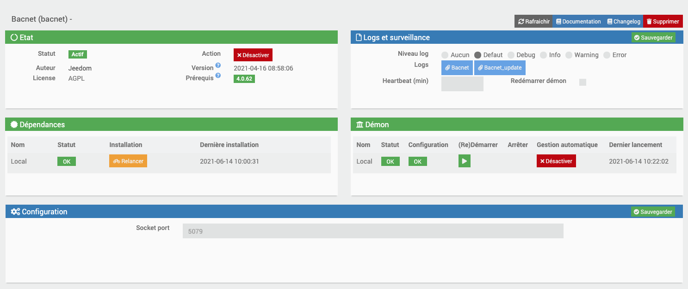
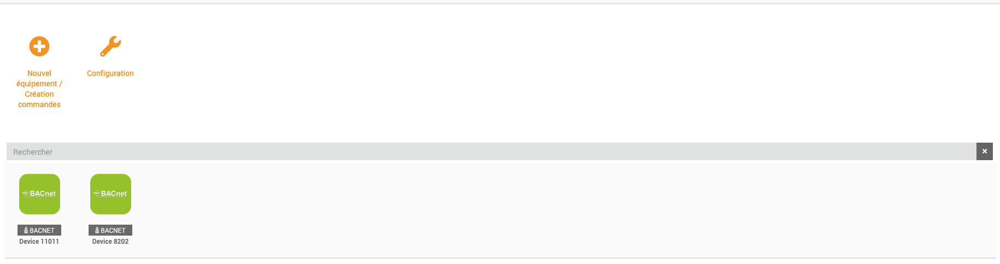

# Bacnet

#Description

El complemento Bacnet le permite recuperar información de su equipo Bacnet / Ip e interactuar con ella desde su Jeedom.

# Configuración del complemento

Después de descargar el complemento, primero debe activarlo, como cualquier complemento de Jeedom :

Luego, debe iniciar la instalación de las dependencias (incluso si aparecen bien) :

Finalmente, debemos iniciar el demonio :

Rien n'est à modifier dans le champ « Port socket interne » de la section « Configuration ».

En esta misma pestaña, debes elegir el valor Cron para actualizar tu equipo.

# Cómo declarar un nuevo dispositivo Bacnet en Jeedom

>**IMPORTANTE**
>
>Su equipo BACNET debe estar en la misma red que su Jeedom para ser detectado por él.

Rendez-vous dans le menu « Plugins → Energie → Bacnet » :

Llegas a la página siguiente:

Vous devez donc cliquer sur l'option « Nouvel équipement / Création commandes » :

Se iniciará un escaneo automático de su red para detectar los dispositivos Bacnet presentes en ella.
Puede tardar unos veinte segundos.

Después del escaneo, se mostrará una tabla con todas las entradas / salidas de su equipo.

El menú de la tabla donde puede buscar por columna :

Un ejemplo de detección de equipos Bacnet :

Dependiendo del fabricante del equipo, algunos valores no están disponibles;

Todo lo que tiene que hacer es seleccionar las órdenes que se crearán marcando una de las opciones según su elección (tipo de comando info o tipo acción):

Valida, actualiza la página, y se habrá creado el equipo correspondiente en tu Jeedom; de forma predeterminada, se le asignará el nombre del DeviceID de su equipo Bacnet proporcionado por el fabricante (puede cambiar el nombre )

 Cliquez ensuite sur votre équipement créé, puis cocher « Activer » et « Visible » pour le voir apparaitre sur votre dashboard.

Para agregar comandos posteriormente a un equipo existente, debe rehacer la operación anterior : « Nouvel équipement / Création commandes » , et sélectionnez les commandes que vous désirez.

# Las órdenes

Rendez-vous dans l'onglet « Commandes » de la page de configuration du nouvel équipement Bacnet.

Ici vous pouvez masquer et rendre visibles les différentes commandes de type « action » et « info » disponibles (les commandes de type « info » peuvent également être historisées) :

Todo el equipo creado tendrá 2 comandos por defecto : une commande info « Connexion Bacnet » et une commande action « Refresh » , qui serviront à voir l'état de la connexion Bacnet sur votre dashboard, et à rafraichir les valeurs de vos commandes.

>**IMPORTANTE**
>
>Respecto a la escritura: por seguridad, el protocolo Bacnet proporciona por defecto un sistema de escritura con niveles de prioridad en las entradas / salidas de sus equipos.
Hay 16 niveles de prioridad (el nivel más bajo tiene prioridad sobre todos los demás)). Su equipo puede estar programado de tal manera que la función de escritura desarrollada en este complemento no tenga prioridad sobre la programación lógica del equipo / sistema por defecto.
Para E / S de tipo de salida, el complemento se configura con escritura de prioridad 8 (Operador manual).
Más información sobre el tema :

https://store.chipkin.com/articles/bacnet-why-doesnt-the-present-value-change

Para una escritura en un dispositivo Bacnet, ampliamos el PresentValue de la entrada / salida correspondiente.
Debe saber que los PresentValues del tipo de entradas / salidas: La salida analógica, la salida binaria y la salida multiestado siempre se pueden controlar.
Las entradas / salidas AnalogValue, BinaryValue o MultistateValue se pueden pedir si el fabricante ha implementado esta función. Queda a criterio exclusivo del fabricante. Consulte la documentación de su equipo para obtener más información al respecto.

Al crear las órdenes de tipo de escritura elegidas, también se creará una orden de acción asociada, que por defecto no es visible en el tablero.
Al hacer clic en él, restablece la tabla de prioridad de escritura de una entrada / salida a los valores predeterminados.
Tendrá un nombre con << resetPrioritesEcriture >>
Para que este comando sea visible en su tablero, vaya a los comandos de su equipo y marque la casilla "Mostrar"

# Lista en acción de comando (para MultiStateValue)

Cuando haya creado un comando de escritura como de costumbre a partir de los resultados del escaneo, es básico en Control deslizante o en Apagado, según el tipo de punto Bacnet devuelto (analógico, binario) : ahora bien, si eliges un multiEstado, el comando será de tipo Slider por defecto, pero puedes listarlo en la lista de comandos del equipo; aparecerá un nuevo campo Lista de valores;
Puedes poner los valores que quieras, separados por un -, sin espacio : por ejemplo 1-4-5-8
Al guardar el equipo, este pondrá estos valores en la lista del pedido en el Dashboard
Al cambiar este valor, enviará el valor escrito en el punto parametrizado.

# Prioridad de escritura

    A Manejar con cuidado

    Un campo de prioridad de escritura está disponible en cada orden creada

    Según la documentación :

    En BACnet, el objeto en el que podemos escribir a menudo proporciona lo que se llama la matriz de prioridad. Esta matriz contiene 16 niveles en los que podemos escribir (siendo 1 la prioridad más alta).

    El uso típico de prioridad es :

    1 Manual-Seguridad humana 2 Automático-Seguridad humana 3 Disponible 4 Disponible 5 Control de equipos críticos 6 Mínimo encendido/apagado 7 Disponible 8 Operador manual (anulación) 9 Disponible 10 Disponible (control típico de un supervisor) 11 Disponible 12 Disponible 13 Disponible 14 Disponible 15 Disponible (Horario) 16 Disponible

    Puede elegir una prioridad de escritura en los comandos deseados, eligiendo un número entre 1 y 16

    Si no se ingresa ningún valor en un comando de escritura, el valor predeterminado se establecerá en 8.

# Cambiar nombres de comandos por descripción

Algunos dispositivos Bacnet tienen códigos de error contenidos en la Descripción del punto.
En este caso puede resultar útil querer cambiar el nombre de los comandos por su descripción para una mayor legibilidad

Para cambiar el nombre predeterminado de los pedidos creados, puede ir al modo Gestión de Puntos, para elegir los pedidos a cambiar de nombre a través de su Descripción

Abrimos el modo Gestión de Puntos Bacnet :

Vemos la lista de Eqlogics ya creados :

Damos clic en Configurar el equipo deseado, y vemos la lista de pedidos ya creados
Puede seleccionar los que desee a través de la casilla de verificación asociada y hacer clic en Validar selección para elegir si desea cambiar el nombre por la Descripción o volver al nombre original

