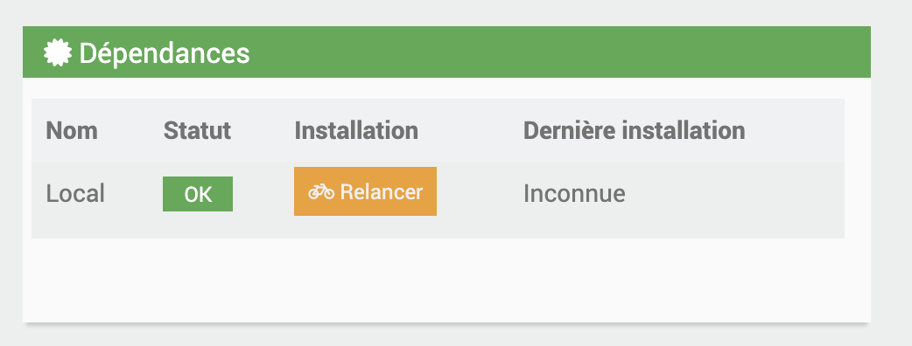

# Documentation du Plugin BacnetManager

>**IMPORTANTE**
>
>Le plugin BacnetManager n'est pas compatible avec le plugin officiel Jeedom Bacnet. Une seule instance Bacnet peut être créée sur une box Jeedom.

# Description

Le plugin BacnetManager permet de créer un équipement Bacnet sur votre Jeedom, ainsi que ses commandes d'information (« Infos Jeedom »), afin qu'il soit visible sur le réseau par un superviseur Bacnet. Il permet également d'associer des commandes d'action (« Actions Jeedom ») provenant d'autres plugins, pour piloter Jeedom via Bacnet lorsque des écritures sont détectées sur ces points Bacnet.

# Configuration du plugin

Après avoir téléchargé le plugin, commencez par l'activer depuis la gestion des plugins Jeedom.

Ensuite, lancez l'installation des dépendances, même si elles apparaissent comme « OK ».

Enfin, démarrez le démon depuis la page de configuration.

Port socket interne : Ne modifiez pas ce champ dans la section « Configuration ».

Cron : Configurez la fréquence du cron, qui permettra de lire les valeurs des points Bacnet pour détecter d'éventuelles écritures externes.

# Fonctionnement du plugin

>**Pré-requis**
>
>Réseau : Vos équipements Bacnet doivent être sur le même réseau que votre Jeedom pour être détectés.

#### <u>Création de l'équipement jeeBacnetManager</u>

Par défaut, un équipement nommé jeeBacnetManager est créé. Cet équipement représente le « serveur Bacnet » qui sera visible par votre superviseur Bacnet.

Puede configurar su deviceId en la configuración del complemento

#### <u>Ajout de commandes Jeedom au jeeBacnetManager</u>

Cliquez sur Ajouter Commandes au Serveur.

Une fenêtre modale s'ouvre, listant toutes les commandes de type « Infos » présentes dans les différents plugins de votre Jeedom.

>**IMPORTANTE**
>
>Les équipements doivent être actifs pour que leurs commandes soient détectées.
>Évitez d'utiliser des espaces dans les noms des commandes.

>**FACULTATIF**
>
>Remplissez le champ « Nom de point Bacnet » (facultatif). Si ce champ est vide, le nom de la commande Jeedom sera utilisé comme nom du point Bacnet.

Sélectionnez les commandes souhaitées, puis validez.

Après validation, quittez la fenêtre et cliquez sur Cmds Jeed Server pour afficher la liste des commandes ajoutées.

#### <u>Points Bacnet créés</u>
Cette modale va s'afficher :

Pour chaque commande ajoutée, deux points Bacnet sont créés :

- Commande « info » : Mise à jour via le cron pour le monitoring.

- Commande « Write » : Utilisée pour détecter les écritures depuis un équipement Bacnet. Si une écriture est détectée, la commande d'action associée est exécutée.

#### <u>Paramétrage des Commandes</u>
 

1. **Elección de acción de comando** : Seleccione un comando de acción según el complemento elegido.
2. **Valor inicial** : Establezca un valor inicial para inicializar el punto Bacnet por primera vez.
3. **Usar valor Bacnet** : Marque esta opción para utilizar el valor Bacnet. Si esta opción no está marcada deberás rellenar el campo "Valor a enviar a la acción"".

#### <u>Mise à jour des valeurs</u>

Configurez la fréquence du cron dans la configuration du plugin pour actualiser les valeurs.

Al ejecutar el cron, el sistema comprobará si ha habido un cambio de valor en el punto Bacnet (escribiendo). En ese momento, enviará este valor de Bacnet o el valor ingresado en "Enviar a acción" al comando de acción parametrizada.

Une fois toutes les commandes configurées, on envoie toutes ces commandes sur le device Bacnet, en cliquant sur Envoyer au Serveur

# Importar/Exportar jeeBacnetManager (próximamente)):

Para prevenir necesidades, se proporcionan 2 opciones : 

- Dispositivo de exportación :

Al hacer clic en este botón, descargará un archivo Json que contiene la configuración del dispositivo, así como sus comandos.

- Importar dispositivo :

Al hacer clic en este botón, puede importar el archivo json de configuración de jeeBacnetManager que habría descargado, para usar los comandos que se configuraron en este

# ANNEXE:

# Lista de unidades de ingeniería BACnet)

| Unidades de ingeniería               |
|---------------------------------|
| amperiossegundos                   |
| amperioCuadradoHoras               |
| amperiosMetros cuadrados              |
| amperios                         |
| amperios por metro                 |
| amperios por metro cuadrado           |
| verja                            |
| becquereles                      |
| btus                            |
| btusPorHora                     |
| btusPorLibra                    |
| tusPorLibraSecoAire               |
| candela                        |
| candelaspormetro cuadrado          |
| centímetros                     |
| centímetrosDeMercurio            |
| centímetrosDeAgua              |
| pies cúbicos                       |
| Pies cúbicos por día                 |
| pies cúbicos por hora                |
| pies cúbicos por minuto              |
| Pies cúbicos por segundo              |
| Metros cúbicos                     |
| Metros cúbicos por día               |
| Metros cúbicos por hora              |
| Metros cúbicos por minuto            |
| Metros cúbicos por segundo            |
| moneda1                       |
| moneda10                      |
| moneda2                       |
| moneda3                       |
| moneda4                       |
| moneda5                       |
| moneda6                       |
| moneda7                       |
| moneda8                       |
| moneda9                       |
| ciclosporhora                   |
| ciclospor minuto                 |
| días                            |
| decibeles                        |
| decibelesA                       |
| decibeliosMilivoltios               |
| decibelesVoltio                    |
| gradosDíasCelsius               |
| gradosDíasFahrenheit            |
| grados Angular                  |
| grados Celsius                  |
| grados Celsius por hora           |
| grados Celsius por minuto         |
| grados Fahrenheit               |
| grados Fahrenheit por hora        |
| grados Fahrenheit por minuto      |
| grados Kelvin                   |
| grados Kelvin por hora            |
| grados Kelvin por minuto          |
| gradosFase                    |
| deltaGradosFahrenheit          |
| deltaGradosKelvin              |
| faradios                          |
| pies                            |
| piesPorMinuto                   |
| pies por segundo                   |
| velas de pie                     |
| gramos                           |
| gramos de agua por kilo de aire seco   |
| gramos por centímetro cúbico         |
| gramos por metro cúbico              |
| gramos por gramo                    |
| gramos por kilogramo                |
| gramos por litro                   |
| gramos por mililitro              |
| gramos por minuto                  |
| gramos por segundo                  |
| gramos por metro cuadrado             |
| gris                            |
| hectopascales                    |
| henry                          |
| hercios                           |
| caballo de fuerza                      |
| horas                           |
| centésimasSegundos               |
| galones imperiales                 |
| imperialGalonesPorMinuto        |
| pulgadas                          |
| pulgadas de mercurio                 |
| pulgadas de agua                   |
| juliosSegundos                    |
| julios                          |
| julios por metro cúbico             |
| julios por grado Kelvin           |
| juliosporhoras                  |
| julios por kilogramo grados Kelvin   |
| julios por kilogramo aire seco         |
| kiloBtus                        |
| kiloBtusPorHora                 |
| kilobecquerelios                  |
| kilogramos                       |
| kilogramos por metro cúbico          |
| kilogramos por hora                |
| kilogramos por kilogramo            |
| kilogramos por minuto              |
| kilogramos por segundo              |
| kilohercio                       |
| kiloohmios                         |
| kilojulios                      |
| kilojulios por grado Kelvin       |
| kilojulios por kilogramo           |
| kilojulios por kilogramo aire seco     |
| kilómetros                      |
| kilómetrosporhora               |
| kilopascales                     |
| kilovoltiosAmperiosHoras             |
| kilovoltiosAmperiosHorasReactivo     |
| kilovoltiosAmperios                 |
| kilovoltiosAmperiosReactivo         |
| kilovoltios                       |
| kilovatioshoras                   |
| kilovatioshorasporpie cuadrado      |
| kilovatioshoraspormetro cuadrado     |
| kilovatioshorasreactivo           |
| kilovatios                       |
| litros                          |
| litrosporhora                   |
| litrospor minuto                 |
| litros por segundo                 |
| lúmenes                          |
| lujos                           |
| megaBtus                        |
| megabequerelios                  |
| megahercio                       |
| megajulios                      |
| megajulios por grado Kelvin       |
| megajulios por kilogramo aire seco     |
| megajulios por pie cuadrado         |
| megajulios por metro cuadrado        |
| megaAVoltAmpereHoras             |
| megaAVoltAmpereHorasReactivo     |
| megaAVoltioAmperios                 |
| megaAVoltioAmperiosReactivo         |
| megaAVoltios                       |
| megavatioshoras                   |
| megavatiosHorasReactivo           |
| megavatios                       |
| megaohmios                         |
| metros                          |
| metrosPorHora                   |
| metrosPorMinuto                 |
| metros por segundo                 |
| metros por segundo por segundo        |
| microSiemens                    |
| microgramos por metro cúbico         |
| microgramos por litro              |
| microgris                       |
| micrómetros                     |
| microsieverts                   |
| microsievertsporhora            |
| millas por hora                    |
| miliamperios                    |
| milibares                       |
| miligramos                      |
| miligramos por metro cúbico         |
| miligramos por gramo               |
| miligramos por kilogramo           |
| miligramos por litro              |
| miligray                       |
| mililitros                     |
| mililitros por segundo            |
| milímetros                     |
| milímetrosdemercurio            |
| milímetros de agua              |
| milímetros por minuto            |
| milímetros por segundo            |
| miliohmios                       |
| milisegundos                    |
| milisiemens                    |
| milisieverts                   |
| milivoltios                      |
| milivatios                      |
| minutos                         |
| minutos por grado Kelvin          |
| meses                          |
| nanogramos por metro cúbico          |
| Unidad de turbidez nefelométrica      |
| Newton                          |
| newtonMetros                    |
| newtonSegundos                   |
| Newtons por metro                 |
| noUnidadesohmMetroPorMetroCuadrado   |
| ohmiosMetros                       |
| ohmios                            |
| pH                              |
| partes por billón                 |
| acciones por millón                 |
| pascalSegundos                   |
| pascales                         |
| por hora                         |
| por Milla                        |
| por minuto                       |
| por segundo                       |
| por ciento                         |
| porcentaje de oscurecimiento por pie       |
| porcentaje de oscurecimiento por metro      |
| porcentaje por segundo                |
| porcentaje de humedad relativa         |
| librasFuerzaPorPulgadaCuadrada        |
| librasMasa                      |
| librasMasaPorHora               |
| librasMasaPorMinuto             |
| librasMasaPorSegundo             |
| factor de potencia                     |
| psiPorDegradoFahrenheit          |
| radianes                         |
| radianes por segundo                |
| revoluciones por minuto            |
| artículos de segunda clase                         |
| siemens                         |
| siemens por metro                 |
| sieverts                        |
| cuadradosCentímetros               |
| pies cuadrados                      |
| pulgadas cuadradas                    |
| Metros cuadrados                    |
| Metros cuadrados por Newton           |
| tesla                          |
| térmico                          |
| tushoras                        |
| tonos                            |
| tonos por hora                     |
| tonosRefrigeración               |
| nosotrosGalones                       |
| nosotros galones por hora                |
| nosotrosGalonesPorMinuto              |
| voltiosAmperiosHoras                 |
| voltiosAmperiosHorasReactivo         |
| voltiosAmperios                     |
| voltiosAmperiosReactivo             |
| voltios                           |
| voltios por grado Kelvin            |
| voltios por metro                   |
| voltiosCuadradoHoras                |
| vatioshoras                       |
| vatioshoraspor metro cúbico          |
| vatiosHorasReactivo               |
| vatios                           |
| vatios por metro por grado Kelvin    |
| vatios por pie cuadrado              |
| vatios por metro cuadrado             |
| vatios por metro cuadrado grados Kelvin |
| webers                          |
| semanas                           |
| años                           |

