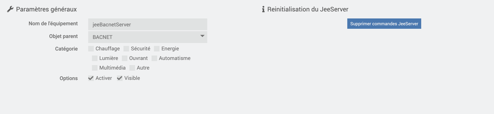

# BacnetManager

# Description

El complemento BacnetManager le permite crear equipos Bacnet para su Jeedom, así como sus comandos Jeedom, para que un supervisor Bacnet los vea en la red

# Configuración del complemento

Después de descargar el complemento, primero debe activarlo, como cualquier complemento Jeedom :

Luego, hay que iniciar la instalación de las dependencias (aunque aparezcan OK) :

Finalmente, inicie el demonio :

Rien n'est à modifier dans le champ « Port socket interne » de la section « Configuration ».

En esta misma pestaña, debes elegir el valor de Cron para actualizar tu equipo.

# Cómo funciona el complemento ?

>**IMPORTANTE**
>
>Su equipo BACNET debe estar en la misma red que su Jeedom para ser detectado por él.

De forma predeterminada, se crea un dispositivo jeeBacnetManager; Es este equipo 'bacnet' el que será visto por su supervisor Bacnet en la red

Puede configurar su deviceId en la configuración del complemento

Para agregar comandos Jeedom a su jeeBacnetManager, haga clic en Agregar comandos al servidor :

Se abrirá un modal, donde aparecerán todos los comandos de tipo Info presentes en los diferentes plugins de tu jeedom.

>**IMPORTANTE**
>
>Su equipo debe estar Activo para que los comandos sean detectados en este modal.

También debe nombrar el pedido, rellenando el campo previsto a tal efecto. 
No ponga espacios en el nombre del comando

Todo lo que tienes que hacer es buscar los que quieras y Validar.

Se creará el dispositivo bacnet con el ID de instancia que ha elegido y aparecerá en su red.

Para actualizar los valores necesitas configurar el cron en la configuración del plugin.

Para borrar comandos del Servidor, debe ir a los comandos del equipo, y simplemente Borrar los que desee y luego guardar.

También puede eliminar el dispositivo de la red, así como sus puntos bacnet, haciendo clic en Eliminar el jeeBacnetManager.

# Configuración de pedidos :

Para cambiar la unidad de los puntos bacnet, y verlos aparecer en la red, deberá elegir la unidad en el menú Seleccionar dispuesto a tal efecto en los mandos.
Los comandos Jeedom de tipo 'cadena' no tienen que seleccionar unidades.

En la red bacnet, las instancias de los puntos utilizarán los nombres de los comandos especificados en el campo del modal Adiciones de comandos.

También se proporciona una función de cálculo posterior : 
si elige completar este postCalcul, entonces el valor inyectado en el dispositivoBacnet habrá tomado el valor inicial para cargarse con el cálculo especificado

Puedes por ejemplo :

#value# * 10

Esto tomará el valor inicial del comando cargado, luego lo multiplicará por 10 antes de actualizarlo en la instancia de jeeServer

Ejemplo :

>**IMPORTANTE**
>
>Encontrará todos los comandos existentes en el jeeServer en la pantalla del complemento, haciendo clic en Cmds JeeServer

# Importar/Exportar jeeBacnetManager (próximamente)):

Para prevenir necesidades, se proporcionan 2 opciones : 

- Dispositivo de exportación :

Al hacer clic en este botón, descargará un archivo Json que contiene la configuración del dispositivo, así como sus comandos.

- Importar dispositivo :

Al hacer clic en este botón, puede importar el archivo json de configuración de jeeBacnetManager que habría descargado, para usar los comandos que se configuraron en este

# ANNEXE:

# Lista de unidades de ingeniería BACnet)

| Unidades de ingeniería               |
|---------------------------------|
| amperiossegundos                   |
| amperioCuadradoHoras               |
| amperiosMetros cuadrados              |
| amperios                         |
| amperios por metro                 |
| amperios por metro cuadrado           |
| verja                            |
| becquereles                      |
| btus                            |
| btusPorHora                     |
| btusPorLibra                    |
| tusPorLibraSecoAire               |
| candela                        |
| candelaspormetro cuadrado          |
| centímetros                     |
| centímetrosDeMercurio            |
| centímetrosDeAgua              |
| pies cúbicos                       |
| Pies cúbicos por día                 |
| pies cúbicos por hora                |
| pies cúbicos por minuto              |
| Pies cúbicos por segundo              |
| Metros cúbicos                     |
| Metros cúbicos por día               |
| Metros cúbicos por hora              |
| Metros cúbicos por minuto            |
| Metros cúbicos por segundo            |
| moneda1                       |
| moneda10                      |
| moneda2                       |
| moneda3                       |
| moneda4                       |
| moneda5                       |
| moneda6                       |
| moneda7                       |
| moneda8                       |
| moneda9                       |
| ciclosporhora                   |
| ciclospor minuto                 |
| días                            |
| decibeles                        |
| decibelesA                       |
| decibeliosMilivoltios               |
| decibelesVoltio                    |
| gradosDíasCelsius               |
| gradosDíasFahrenheit            |
| grados Angular                  |
| grados Celsius                  |
| grados Celsius por hora           |
| grados Celsius por minuto         |
| grados Fahrenheit               |
| grados Fahrenheit por hora        |
| grados Fahrenheit por minuto      |
| grados Kelvin                   |
| grados Kelvin por hora            |
| grados Kelvin por minuto          |
| gradosFase                    |
| deltaGradosFahrenheit          |
| deltaGradosKelvin              |
| faradios                          |
| pies                            |
| piesPorMinuto                   |
| pies por segundo                   |
| velas de pie                     |
| gramos                           |
| gramos de agua por kilo de aire seco   |
| gramos por centímetro cúbico         |
| gramos por metro cúbico              |
| gramos por gramo                    |
| gramos por kilogramo                |
| gramos por litro                   |
| gramos por mililitro              |
| gramos por minuto                  |
| gramos por segundo                  |
| gramos por metro cuadrado             |
| gris                            |
| hectopascales                    |
| henry                          |
| hercios                           |
| caballo de fuerza                      |
| horas                           |
| centésimasSegundos               |
| galones imperiales                 |
| imperialGalonesPorMinuto        |
| pulgadas                          |
| pulgadas de mercurio                 |
| pulgadas de agua                   |
| juliosSegundos                    |
| julios                          |
| julios por metro cúbico             |
| julios por grado Kelvin           |
| juliosporhoras                  |
| julios por kilogramo grados Kelvin   |
| julios por kilogramo aire seco         |
| kiloBtus                        |
| kiloBtusPorHora                 |
| kilobecquerelios                  |
| kilogramos                       |
| kilogramos por metro cúbico          |
| kilogramos por hora                |
| kilogramos por kilogramo            |
| kilogramos por minuto              |
| kilogramos por segundo              |
| kilohercio                       |
| kiloohmios                         |
| kilojulios                      |
| kilojulios por grado Kelvin       |
| kilojulios por kilogramo           |
| kilojulios por kilogramo aire seco     |
| kilómetros                      |
| kilómetrosporhora               |
| kilopascales                     |
| kilovoltiosAmperiosHoras             |
| kilovoltiosAmperiosHorasReactivo     |
| kilovoltiosAmperios                 |
| kilovoltiosAmperiosReactivo         |
| kilovoltios                       |
| kilovatioshoras                   |
| kilovatioshorasporpie cuadrado      |
| kilovatioshoraspormetro cuadrado     |
| kilovatioshorasreactivo           |
| kilovatios                       |
| litros                          |
| litrosporhora                   |
| litrospor minuto                 |
| litros por segundo                 |
| lúmenes                          |
| lujos                           |
| megaBtus                        |
| megabequerelios                  |
| megahercio                       |
| megajulios                      |
| megajulios por grado Kelvin       |
| megajulios por kilogramo aire seco     |
| megajulios por pie cuadrado         |
| megajulios por metro cuadrado        |
| megaAVoltAmpereHoras             |
| megaAVoltAmpereHorasReactivo     |
| megaAVoltioAmperios                 |
| megaAVoltioAmperiosReactivo         |
| megaAVoltios                       |
| megavatioshoras                   |
| megavatiosHorasReactivo           |
| megavatios                       |
| megaohmios                         |
| metros                          |
| metrosPorHora                   |
| metrosPorMinuto                 |
| metros por segundo                 |
| metros por segundo por segundo        |
| microSiemens                    |
| microgramos por metro cúbico         |
| microgramos por litro              |
| microgris                       |
| micrómetros                     |
| microsieverts                   |
| microsievertsporhora            |
| millas por hora                    |
| miliamperios                    |
| milibares                       |
| miligramos                      |
| miligramos por metro cúbico         |
| miligramos por gramo               |
| miligramos por kilogramo           |
| miligramos por litro              |
| miligray                       |
| mililitros                     |
| mililitros por segundo            |
| milímetros                     |
| milímetrosdemercurio            |
| milímetros de agua              |
| milímetros por minuto            |
| milímetros por segundo            |
| miliohmios                       |
| milisegundos                    |
| milisiemens                    |
| milisieverts                   |
| milivoltios                      |
| milivatios                      |
| minutos                         |
| minutos por grado Kelvin          |
| meses                          |
| nanogramos por metro cúbico          |
| Unidad de turbidez nefelométrica      |
| Newton                          |
| newtonMetros                    |
| newtonSegundos                   |
| Newtons por metro                 |
| noUnidadesohmMetroPorMetroCuadrado   |
| ohmiosMetros                       |
| ohmios                            |
| pH                              |
| partes por billón                 |
| acciones por millón                 |
| pascalSegundos                   |
| pascales                         |
| por hora                         |
| por Milla                        |
| por minuto                       |
| por segundo                       |
| por ciento                         |
| porcentaje de oscurecimiento por pie       |
| porcentaje de oscurecimiento por metro      |
| porcentaje por segundo                |
| porcentaje de humedad relativa         |
| librasFuerzaPorPulgadaCuadrada        |
| librasMasa                      |
| librasMasaPorHora               |
| librasMasaPorMinuto             |
| librasMasaPorSegundo             |
| factor de potencia                     |
| psiPorDegradoFahrenheit          |
| radianes                         |
| radianes por segundo                |
| revoluciones por minuto            |
| artículos de segunda clase                         |
| siemens                         |
| siemens por metro                 |
| sieverts                        |
| cuadradosCentímetros               |
| pies cuadrados                      |
| pulgadas cuadradas                    |
| Metros cuadrados                    |
| Metros cuadrados por Newton           |
| tesla                          |
| térmico                          |
| tushoras                        |
| tonos                            |
| tonos por hora                     |
| tonosRefrigeración               |
| nosotrosGalones                       |
| nosotros galones por hora                |
| nosotrosGalonesPorMinuto              |
| voltiosAmperiosHoras                 |
| voltiosAmperiosHorasReactivo         |
| voltiosAmperios                     |
| voltiosAmperiosReactivo             |
| voltios                           |
| voltios por grado Kelvin            |
| voltios por metro                   |
| voltiosCuadradoHoras                |
| vatioshoras                       |
| vatioshoraspor metro cúbico          |
| vatiosHorasReactivo               |
| vatios                           |
| vatios por metro por grado Kelvin    |
| vatios por pie cuadrado              |
| vatios por metro cuadrado             |
| vatios por metro cuadrado grados Kelvin |
| webers                          |
| semanas                           |
| años                           |

### Configuración del complemento

#### Modo avanzado

Al activar el **Modo avanzado**, el cron configurado ya no recuperará los valores de los comandos Jeedom para actualizarlos en el servidor. En su lugar, comprobará si se ha realizado una escritura en el servidor y ejecutará los comandos de Acciones de los diferentes complementos configurados con el valor escrito en el punto Bacnet o el valor proporcionado (consulte el modo CmdsJeeServer)).

#### Configuración de pedidos

Como es habitual, después de haber configurado los comandos de tipo Info, es necesario ir al modal **CmdsJeeServer** para configurar y enviar comandos al servidor.

1. **Elección de acción de comando** : Seleccione un comando de acción según el complemento elegido.
2. **Valor inicial** : Establezca un valor inicial para inicializar el punto Bacnet por primera vez.
3. **Usar valor Bacnet** : Marque esta opción para utilizar el valor Bacnet. Si esta opción no está marcada deberás rellenar el campo "Valor a enviar a la acción"".

Al ejecutar el cron, el sistema comprobará si ha habido un cambio de valor en el punto Bacnet (escribiendo). En ese momento, enviará este valor de Bacnet o el valor ingresado en "Enviar a acción" al comando de acción parametrizada.