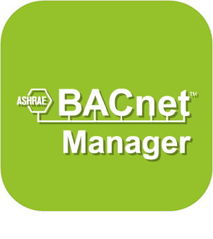
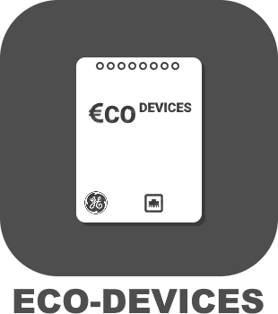
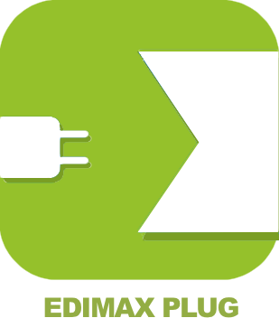
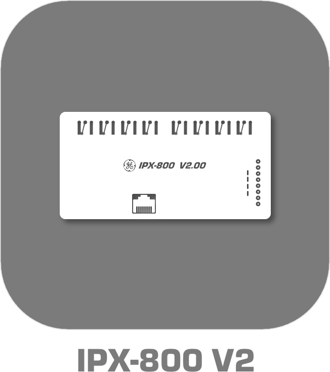
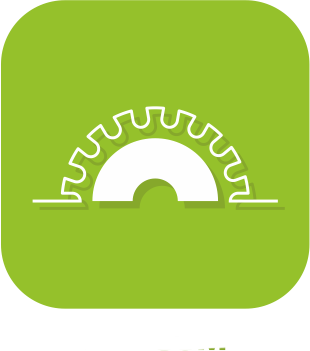

>**Importante**
>Solo los complementos oficiales tienen su documentación aquí. Puede consultar la documentación de los otros complementos directamente desde Jeedom Market. Una vez en el complemento en cuestión, haga clic en la documentación.
>Podéis ver [aquí](https://market.jeedom.com/index.php?v=d&p=market&type=plugin&categorie=automation+protocol) todos los complementos oficiales en esta categoría

| | | | |
|--- | --- | --- | ---|
||BACnet|Complemento para controlar equipos Bacnet / IP|[Documentación estable](bacnet/index.md) - [Documentación beta](bacnet/beta/index.md) [Mercado](https://market.jeedom.com/index.php?v=d&p=market_display&id=4161) [Registro de cambios estable](bacnet/changelog.md) - [Lista de cambios beta](bacnet/beta/changelog.md)|
||bacnetManager|Complemento que le permite crear un dispositivo Bacnet, agregarle comandos de información Jeedom en Bacnet Point y, por lo tanto, leer o escribir en este dispositivo Bacnet desde cualquier otro cliente Bacnet|[Documentación estable](bacnetManager/index.md) - [Documentación beta](bacnetManager/beta/index.md) [Mercado](https://market.jeedom.com/index.php?v=d&p=market_display&id=4551) [Registro de cambios estable](bacnetManager/changelog.md) - [Lista de cambios beta](bacnetManager/beta/changelog.md)|
||BACnetServer|El complemento ATENCIÓN está disponible solo en versión beta Complemento que permite crear un dispositivo Bacnet/Jeedom|[Documentación beta](bacnetServer/beta/index.md) [Mercado](https://market.jeedom.com/index.php?v=d&p=market_display&id=4323) [Lista de cambios beta](bacnetServer/beta/changelog.md)|
||Odace SFSP|Complemento que agrega soporte para la gama Odace SFSP (inalámbrica sin batería) Schneider a Jeedom. Permite obtener la información de los interruptores (persianas / escenas / individuales / dobles). Permite controlar los actuadores (obturador / dcl). También te permite usar escenas y grupos.|[Documentación estable](beagle/index.md) [Mercado](https://market.jeedom.com/index.php?v=d&p=market_display&id=3917) [Registro de cambios estable](beagle/changelog.md)|
||Anuncio de Bluetooth|Plugin para la gestión de determinados dispositivos que funcionan en publicidad bluetooth como el NIUS de Nodon Para el NIUS permite detectar los diferentes soportes. Para algunos otros dispositivos permite hacer presencia. También compatible con botones ticatag (con gestión de múltiples pulsaciones de temperatura y acción para que suene) Compatible Mi flora, Mi scale, awox smartplug, playbulb, miband1 y 1s|[Documentación estable](blea/index.md) - [Documentación beta](blea/beta/index.md) [Mercado](https://market.jeedom.com/index.php?v=d&p=market_display&id=2554) [Registro de cambios estable](blea/changelog.md) - [Lista de cambios beta](blea/beta/changelog.md)|
||Broadlink|Complemento que agrega soporte para ciertos productos Broadlink como (RM, A1, etc.cc)|[Documentación estable](broadlink/index.md) - [Documentación beta](broadlink/beta/index.md) [Mercado](https://market.jeedom.com/index.php?v=d&p=market_display&id=2699) [Registro de cambios estable](broadlink/changelog.md) - [Lista de cambios beta](broadlink/beta/changelog.md)|
||Dali|Este complemento permite la gestión del protocolo Dali, compatible solo con la puerta de enlace HASSEB DaliMaster v2|[Documentación estable](dali/index.md) - [Documentación beta](dali/beta/index.md) [Mercado](https://market.jeedom.com/index.php?v=d&p=market_display&id=4223) [Registro de cambios estable](dali/changelog.md) - [Lista de cambios beta](dali/beta/changelog.md)|
||Deconz|Este plugin te permitirá integrar multitud de módulos ZigBee (Ikea, Philips Hue, Xiaomi etc ...) sin tener que pasar por su puerta de enlace con la clave Conbee / Conbee II. IMPORTANTE : absolutamente necesitas una clave conbee para usar este complemento. Otro punto es leer la documentación y módulos compatibles.|[Documentación estable](deconz/index.md) - [Documentación beta](deconz/beta/index.md) [Mercado](https://market.jeedom.com/index.php?v=d&p=market_display&id=3610) [Registro de cambios estable](deconz/changelog.md) - [Lista de cambios beta](deconz/beta/changelog.md)|
||Eco-device||[Documentación estable](ecodevice/index.md) - [Documentación beta](ecodevice/beta/index.md) [Mercado](https://market.jeedom.com/index.php?v=d&p=market_display&id=342) [Registro de cambios estable](ecodevice/changelog.md) - [Lista de cambios beta](ecodevice/beta/changelog.md)|
||Enchufe Edimax||[Documentación estable](edimaxplug/index.md) [Mercado](https://market.jeedom.com/index.php?v=d&p=market_display&id=2455) [Registro de cambios estable](edimaxplug/changelog.md)|
||Edisio|Complemento Edisio para administrar el protocolo Edisio con la llave USB Edisio. Para que pueda comunicarse con los productos de la gama Edisio.|[Documentación estable](edisio/index.md) [Mercado](https://market.jeedom.com/index.php?v=d&p=market_display&id=1541) [Registro de cambios estable](edisio/changelog.md)|
||ipx800 V3||[Documentación estable](ipx800/index.md) - [Documentación beta](ipx800/beta/index.md) [Mercado](https://market.jeedom.com/index.php?v=d&p=market_display&id=344) [Registro de cambios estable](ipx800/changelog.md) - [Lista de cambios beta](ipx800/beta/changelog.md)|
||ipx800 V2|| [Mercado](https://market.jeedom.com/index.php?v=d&p=market_display&id=1194)|
||IPX 800 v4|Complemento para controlar el IPX 800|[Documentación estable](ipx800v4/index.md) - [Documentación beta](ipx800v4/beta/index.md) [Mercado](https://market.jeedom.com/index.php?v=d&p=market_display&id=2046) [Registro de cambios estable](ipx800v4/changelog.md) - [Lista de cambios beta](ipx800v4/beta/changelog.md)|
||IPX800 v5|El complemento ATENCIÓN está disponible solo en versión beta Complemento para ipx800v5.Tenga cuidado con la complejidad de la API proporcionada por el fabricante, este complemento no se recomienda para principiantes. Si puede usar un ipx800v4 mucho más simple en su lugar. Tenga en cuenta que el complemento pagará cuando se establezca|[Documentación beta](ipx800v5/beta/index.md) [Mercado](https://market.jeedom.com/index.php?v=d&p=market_display&id=4218) [Lista de cambios beta](ipx800v5/beta/changelog.md)|
||Carga útil de Lora|Complemento que permite decodificar Lora Payloads.|[Documentación estable](lorapayload/index.md) - [Documentación beta](lorapayload/beta/index.md) [Mercado](https://market.jeedom.com/index.php?v=d&p=market_display&id=4146) [Registro de cambios estable](lorapayload/changelog.md) - [Lista de cambios beta](lorapayload/beta/changelog.md)|
||Modbus|Complemento Modbus No compatible con Wago|[Documentación estable](modbus/index.md) - [Documentación beta](modbus/beta/index.md) [Mercado](https://market.jeedom.com/index.php?v=d&p=market_display&id=4267) [Registro de cambios estable](modbus/changelog.md) - [Lista de cambios beta](modbus/beta/changelog.md)|
||Servidor Modbus|El complemento ATENCIÓN está disponible solo en versión beta Complemento que permite crear un dispositivo Modbus/Jeedom|[Documentación beta](modbusServer/beta/index.md) [Mercado](https://market.jeedom.com/index.php?v=d&p=market_display&id=4357) [Lista de cambios beta](modbusServer/beta/changelog.md)|
||MyhomeSCS|Le permite administrar el protocolo MyHome Bus.|[Documentación estable](myhomescs/index.md) [Mercado](https://market.jeedom.com/index.php?v=d&p=market_display&id=3107) [Registro de cambios estable](myhomescs/changelog.md)|
||EnOcean|Plugin ajoutant le support du EnOcean à Jeedom https://compatibility.jeedom.com/index.php?v=d&p=home&search=&plugin=openenocean Se agregarán muchos módulos de forma rápida y continua Le recomendamos que migre con precaución|[Documentación estable](openenocean/index.md) - [Documentación beta](openenocean/beta/index.md) [Mercado](https://market.jeedom.com/index.php?v=d&p=market_display&id=2622) [Registro de cambios estable](openenocean/changelog.md) - [Lista de cambios beta](openenocean/beta/changelog.md)|
||Z-Wave|Complemento para controlar el equipo ZWave a través de una tecla ZWave compatible con openWave|[Documentación estable](openzwave/index.md) - [Documentación beta](openzwave/beta/index.md) [Mercado](https://market.jeedom.com/index.php?v=d&p=market_display&id=185) [Registro de cambios estable](openzwave/changelog.md) - [Lista de cambios beta](openzwave/beta/changelog.md)|
||RfPlayer2|Complemento que agrega soporte para la clave RfPlayer de Ziblue a Jeedom. Este complemento eventualmente reemplazará al primer complemento. Se pondrá a disposición de todos los propietarios del primer complemento. Esto permitirá que todos migren en silencio. Debido a que la filosofía del complemento ha cambiado y los identificadores también, deberá incluir sus dispositivos en este nuevo complemento.|[Documentación estable](rfplayer2/index.md) - [Documentación beta](rfplayer2/beta/index.md) [Mercado](https://market.jeedom.com/index.php?v=d&p=market_display&id=3349) [Registro de cambios estable](rfplayer2/changelog.md) - [Lista de cambios beta](rfplayer2/beta/changelog.md)|
||RFXcom|Plugin para usar el RFXcom USB. Le permite controlar equipos de automatización del hogar de 433Mhz (Chacon, Oregon, La Crosse, X10, DI-O, Blyss...)|[Documentación estable](rfxcom/index.md) - [Documentación beta](rfxcom/beta/index.md) [Mercado](https://market.jeedom.com/index.php?v=d&p=market_display&id=52) [Registro de cambios estable](rfxcom/changelog.md) - [Lista de cambios beta](rfxcom/beta/changelog.md)|
||Velux MQTT|El complemento ATENCIÓN está disponible solo en versión beta Este plugin permite el control de claraboyas y aperturas "io-homecontrol" compatibles con la interfaz VELUX KLF 200 (persianas Somfy por ejemplo). Los complementos oficiales de Docker Management y MQTT Manager deben estar instalados, configurados y funcionando.|[Documentación beta](vlx2mqtt/beta/index.md) [Mercado](https://market.jeedom.com/index.php?v=d&p=market_display&id=4275) [Lista de cambios beta](vlx2mqtt/beta/changelog.md)|
||Wattlet|Este complemento le permite controlar los módulos Wattcubes de Wattlet a través de la Web de Wattcube.|[Documentación estable](wattlet/index.md) [Mercado](https://market.jeedom.com/index.php?v=d&p=market_display&id=2600) [Registro de cambios estable](wattlet/changelog.md)|
||Wes|Este complemento le permitirá integrar un wes de CartElectronics|[Documentación estable](wes/index.md) [Mercado](https://market.jeedom.com/index.php?v=d&p=market_display&id=1336) [Registro de cambios estable](wes/changelog.md)|
||JeeZigbee|Complemento que permite usar zigbee, basado en zigbee2mqtt.|[Documentación estable](z2m/index.md) - [Documentación beta](z2m/beta/index.md) [Mercado](https://market.jeedom.com/index.php?v=d&p=market_display&id=4351) [Registro de cambios estable](z2m/changelog.md) - [Lista de cambios beta](z2m/beta/changelog.md)|
||Zigbee|IMPORTANTE Este complemento se reemplaza por Jeezigbee (documentación en progreso). Complemento que ofrece compatibilidad general con diferentes tipos de controladores Zigbee como deCONZ y EZSP (Silicon labs), y en soporte beta : Zigate, XBee y Texas Instruments.    Es importante leer detenidamente la documentación del complemento antes de realizar cualquier compra.|[Documentación estable](zigbee/index.md) - [Documentación beta](zigbee/beta/index.md) [Mercado](https://market.jeedom.com/index.php?v=d&p=market_display&id=4050) [Registro de cambios estable](zigbee/changelog.md) - [Lista de cambios beta](zigbee/beta/changelog.md)|
||Z-Wave JS|Plugin para controlar equipos Z-Wave|[Documentación estable](zwavejs/index.md) - [Documentación beta](zwavejs/beta/index.md) [Mercado](https://market.jeedom.com/index.php?v=d&p=market_display&id=4306) [Registro de cambios estable](zwavejs/changelog.md) - [Lista de cambios beta](zwavejs/beta/changelog.md)|
