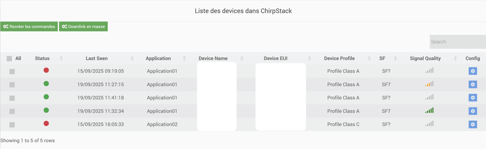

# Complemento LoraPayload

El complemento ****  **)**.
.
 :

- ).

- .

- .

- .

# Fonctionnalité
 :

- **** : .).
- **** .
- **** :
  -  **** ().
  -  **** ().
- **** : .
- **** .
- **** .
- **** .
- **** .

# Configuration
---
## Configuración del complemento

 :

- .  
- .).  

!alt text](../images/image_dependance.png)
---

## El complemento

 ****.  
.

 :

!alt text](../images/image.png)
- **** : .  
- **** : .  
- **** : . *(.)*

## Equipement

 :

!alt text](../images/accueil_config_equip.png)

- .  
- .  
- .  
- .  

 :

-  **** ().  
- .  

 :

-   )
!alt text](../images/equiplorawanconfig.png)
.  

### 

.  

 :  

1. ****  **.  
2. **** .  
3. **** .  

 **** :  :  
- ,  
- .  

**** :  **** .
   
-   Una pestaña de Órdenes (aquí es donde encontrará los controles correspondientes a su equipo; esta pestaña es estándar en Jeedom)
!alt text](../images/equipcommconfig.png)

## Agregar equipo
!alt text](../images/image-1.png)
.

.

Es importante en el lado derecho elegir el tipo de equipo. Esto es lo que permitirá saber cómo analizar el marco.

 :
!alt text](../images/equiplorawanconfig.png)
-    )
-   .
-   .

Una vez hecho esto, puedes guardar. A continuación, la próxima vez que reciba un marco, se actualizarán los comandos de su equipo

## 

.

 :

- )
- ). .
.  **.

---
## )

 **** .

---

### 1.  

1. **** :  
     
   Exemple:  
   -   
   - 

2. ****:  
   

3. ****.

---

### 2. 

Remplacer:
js
) {
    
}
 
) {
    
    
}

---

### 3. 

Remplacer:
js
) {

}
 
) {
    
}

### 4.  
:
js
 = {
    Decode,
    Encode
}

### 5. 

1. ****  ``/var/www/html/plugins/lorapayload/core/config/devices/ `` ``.js``).

:

- 

- : )

### 6.  
json
{
  "": {
    "name": " 
    "groupe": "
    "configuration": {
      "type": "",
      "language": ")
      "deviceProfile": ")
    },
    "commands": 
      {
        "name": " 
        "type": ")
        "subtype": "
        "isVisible": 
        "isHistorized": 
        "unite": "
        "logicalId": "parsed::)
      },
      {
        "name": "
        "type": "info",
        "subtype": "numeric",
        "isVisible": 0,
        "isHistorized": 0,
        "unite": "",
        "logicalId": "
      },
      {
        "name": "Reboot",
        "type": ")
        "subtype": "other",
        "isVisible": 1,
        "logicalId": "encoder::reboot::::<fonction>::<valeur>)
      },
      {
        "name": "",
        "type": ")
        "subtype": "other",
        "isVisible": 1,
        "logicalId": "action::::<valeur_en_hexadecimal>)
      },
      {
        "name": "",
        "type": "action",
        "subtype": "
        "isVisible": 1,
        "logicalId": "encoder::",
        "configuration": {
          "minValue": 1,
          "maxValue": 5000,
          "step": 1
        }
      },
      {
        "name": "",
        "type": "action",
        "subtype": "
        "isVisible": 1,
        "logicalId": "action::",
        "configuration": {
          "minValue": 1,
          "maxValue": 5000,
          "step": 1
        }
      },
      {
        "name": "",
        "type": "info",
        "subtype": "string",
        "isVisible": 0,
        "isHistorized": 0,
        "logicalId": "
      }
    ],
    "compatibility": 
      {
        "manufacturer": "Milesight",
        "name": "GS601",
        "doc": "",
        "type": "",
        "remark": "",
        "inclusion": "",
        "imglink": ""
      }
    ]
  }
}

### ?
.

#### 
- ****: .

- ****: : ).

- ****:

    - `type`: .

    - `language`: .

    - `deviceProfile`: ).

- ****: ).

    - ****:

        - `info`: ).

        - `action`: ).

- ****:

    - `numeric`: .

    - `string`: .

    - `binary`: .

    - : .

    - `other`: .

- ****: ).

- ****: ).
(")

- ****: ).

- ****:

    - : ``parsed::nom_de_la_variable`` (.)

    - : 
        json
        action::<valeur_en_hexadecimal>
        
        ou
        json
        encoder::<fonction>::<valeur>
        
        ou
         
        encoder::<fonction>
         
        (: slider)

    - : ``"logicalId": "payload"``

- ****: .

##### 
- : : ``decoded.temperature ⇒ "parsed::temperature"``).

- .

- .).

- .

### 

- : 

- : )
---
### ?
.

    - Regardez le tableau  la section “ downlink”  “ via payload”,

    - .

.

    - .

 | (.

4. (**): .

:

|                 |  |                     |
| -------------------- | ----------------- | ------------------------------ |
|                |               | 0: :       |
|  |            | 1: : ... |
|        |             |                           |
|        |             |                           |

json
{
  "": {
    "enable": 1,
    "": 2,
    "": 30,
    "": 40
  }
}

-  :
|2|30|

## Panel

###  ?

-  ****  ****.
-  :
  -  **** .

- .
!alt text](../images/image-3.png)

---
### 

-  :

  
  

---

#### 

 :

1. ****  
    :  
   - **** : .  
     -  **** : .  
     -  **** : .  
     -  **** : .  
   - **** : .  
   - **** : .  
   - **** :  ****,  ****  ****.  
     -  **** : ).  
     -  **** : ).  
     -  **** : ).  
   - **** : .
2. ****
  - .  
  -  ****.  
    **** .  
3. ****

    - ****
  .
    - ****
  .
    - ****
  .
  !alt text](../images/ongletintegrationmass.png)
  ** : ** :
  
  -  : **** ( **X)** .
  - .
  !alt text](../images/selectfortemplate.png)
  -  **""** .

  ** : ** :
   :
  - **** : ).
  - **** : , ****.
  - **** : , ****.
  - **** : :).
  - **** : :).
  - **** : ).
  - **** : ).

  ** : ** :
  - ).
  

    
  

  - .
  !alt text](../images/tableaupostanalyse.png)

  - ..">. .
  ** :** .
  - .">
  - .">. .

4. ****  
   .

---

#### 

 **** .  
 :  

.  
 ****.  
 **)**.  

 :  
- .  
- .  
- .  

.

---
### 

.  :
- ..

- ,

- ).

- ).

- .

- .

### 

1. ****
..  :
- 
- .

2. ****

!alt text](../images/image-11.png)

 :
- ),
-  : `Actualizar`, `Borrar todo`, `Eliminar` (entrada por entrada)),
- Visualización del tamaño actual de la cola.

3. ****
- **Demonio**
Ejecución programada de enlaces descendentes en función de su campo `ts` y reproducción dinámica de la cola para tener en cuenta las purgas.

- ****
Atributo de prioridad en cada dispositivo (0 = normal, 1 = prioridad)).
Cuando existe al menos un elemento prioritario, la cola se clasifica en dos bloques: prioridad entonces normal.

- **Tiempo de espera de envío (tiempo de actualización))**
`refreshTime` (en segundos) configurable en el complemento (predeterminado): 0s).
Garantiza un espacio mínimo entre dos enlaces descendentes del mismo equipo.

- **Recalculando la cola**
Si se detectan prioridades, toda la cola se reordena en consecuencia : prioridad (`1` > `0`) y orden de llegada (`received_at`)).
Luego se recalculan las marcas de tiempo `ts` para cada equipo, aplicando el `tempo` en modo FIFO.

- **Ligero retraso**
`usleep(200 ms)` antes del recálculo si hay prioridades, para agrupar adiciones simultáneas.

- **Gestión del tamaño**
queueSize define el número máximo de entradas. Más allá de esto, los más antiguos se purgan automáticamente.

4. ****
Configure el equipo prioritario yendo a la configuración del equipo y luego a `LoRaWAN > Enlace descendente`
!alt text](../images/image-13.png)
Si su equipo es una prioridad, marque la casilla de verificación “Prioridad” y luego guarde.
A continuación, vaya a la configuración del complemento Lorapayload y, en el campo de configuración, ajuste los parámetros globales según su aplicación.
!alt text](../images/image-12.png)
Reinicie el demonio si está detenido o en estado NOK.
Supervisar y administrar el estado de la cola en la pestaña Enlace descendente de QueueCache.

# Guía del usuario del probador RAK10701 con Jeedom (LoRaPayload))

## 1. Integración de equipos
- Una vez que el probador **** añadido al complemento ****, La generación de decodificaciones y codificaciones se realiza de forma automática.  
- No se requiere ninguna configuración adicional del lado del usuario.  
!alt text](../images/rak1.png)
---

## 2. Encendido y conexión
- Encienda el probador.  
- Espere a que finalice el procedimiento **** en la red ****.  
- Si el estado mostrado es **“Failed”**, Acerque el probador a una puerta de enlace y vuelva a encenderlo para reiniciar el intento.  

---

## 3. Recopilación de datos GPS
- Una vez que la unión sea exitosa, haga clic en **Presione el botón de encendido dos veces**.  
-  **** Luego enviará los datos recopilados (**RSSI, SNR, puerta de enlace, GPS, etc.**).  
 !alt text](../images/rak2.png)
 **** : Colóquese en un área abierta para permitir la captura precisa de las coordenadas del GPS.  

---

## 4. Ruta de la zona de pruebas
- Mueva el probador sobre la superficie que desea analizar.  
-  **Presione el botón de encendido dos veces** Para activar el envío de los datos.  
-  **** registra automáticamente los datos recibidos.  

---

## 5. Visualización y exportación de resultados
- Los datos se almacenan automáticamente :  
  -  **** para la explotación en ****,  
  -  **** para uso automatizado o scripts.  

 **Ruta de acceso** :  `html/plugins/lorapayload/recursos/lorapayload/cargas útiles`

→ archivos rak10701.csv y rak10701_history.json.
!alt text](../images/rak3.png)

Si no se concede permiso de escritura, restaure los permisos de carpeta y archivo en el campo SO/DB en la configuración.

## 6. Descargue el archivo y procese los datos
!alt text](../images/rak4.png)

# FAQ

-   Algunos comandos no se actualizan al mismo tiempo que otros : sí, de hecho, algunos módulos de Lorawan no envían necesariamente toda la información al mismo tiempo y con la misma frecuencia
