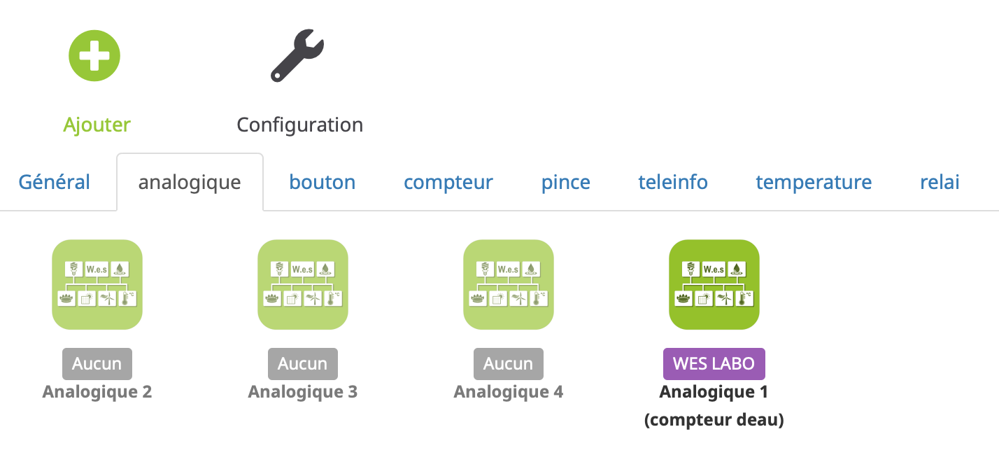

# Complemento Wes

Plugin que permite usar el servidor WES de CartElectronics, para seguir en particular su consumo de energía.

# Configuración del Wes

Después de instalar el complemento, solo necesita activarlo :

**Configuración**

Para configurar el complemento, primero debe agregar el WES.

Para agregar un wes : **Plugins** → **Protocolo de domótica** → **Wes** → **Añadir**

Aquí están los parámetros para ingresar :

-   **Nombre de tu WES** : Nombre del Wes que se mostrará
-   **Activar** : Activación de los wes
-   **Wes IP** : informar a la IP de acceso WES
-   **Wes File** : tienes que poner "general" si es una configuración wes.
-   **Puerto de wes** : déjelo en blanco si no ha cambiado esto en la configuración de WES.
-   **Cuenta Wes** : poner el inicio de sesión de la cuenta de Wes (originalmente es "Admin").
-   **Wes contraseña** : poner la contraseña de la cuenta de Wes (originalmente es "wes").

> **Punta**
>
> Si desea cambiar esta información, primero debe ir a la interfaz WES para modificarla.

Después de guardar, obtendrá una multitud de módulos: solo necesitas activar los que quieras.

> **Punta**
>
> Los módulos en gris no son monitoreados por el complemento, deben estar activados para eso.

# Configuración de relé WES

Después de inicializar el complemento WES, puede hacer clic en la tecla (ver más abajo)).

Al hacer clic en esta tecla, se muestra una ventana modal: seleccione los relés y botones deseados, luego valide. Los escenarios se crearán automáticamente en el WES para recibir comentarios en tiempo real de los botones y relés (para otros comentarios, vaya a la configuración general del complemento.)

