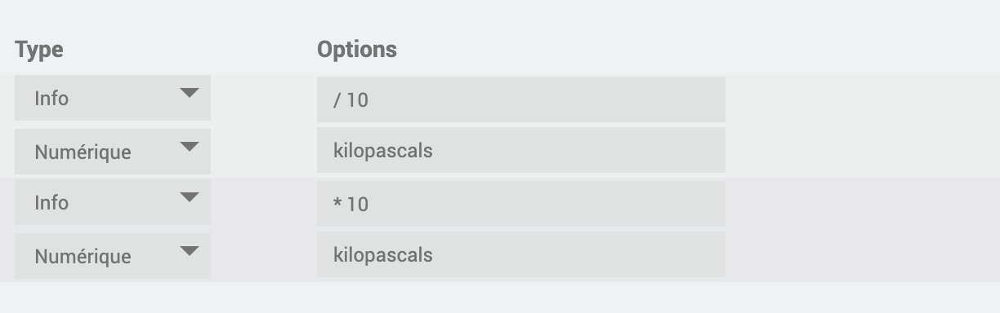

# BacnetServer

#Description

El complemento Bacnet le permite crear un equipo Bacnet de su Jeedom para que se vea en la red

# Configuración del complemento

Después de descargar el complemento, primero debe activarlo, como cualquier complemento Jeedom :

Luego, hay que iniciar la instalación de las dependencias (aunque aparezcan OK) :

Finalmente, inicie el demonio :

Rien n'est à modifier dans le champ « Port socket interne » de la section « Configuration ».

En esta misma pestaña, debes elegir el valor de Cron para actualizar tu equipo.

# Cómo funciona el complemento ?

>**IMPORTANTE**
>
>Su equipo BACNET debe estar en la misma red que su Jeedom para ser detectado por él.

De forma predeterminada, se crea un dispositivo jeeBacnetServer; es este dispositivo 'bacnet' el que verá su supervisor de Bacnet en la red

Puede configurar su deviceId en la configuración del complemento

Para agregar comandos Jeedom a su jeeBacnetServer, haga clic en Agregar comandos al servidor :

Se abrirá un modal, donde aparecerán todos los comandos de tipo Info presentes en los diferentes plugins de tu jeedom.

>**IMPORTANTE**
>
>Su equipo debe estar Activo para que los comandos sean detectados en este modal.

Todo lo que tienes que hacer es buscar los que quieras y Validar.

Se creará el dispositivo bacnet con el ID de instancia que ha elegido y aparecerá en su red.

Para actualizar los valores necesitas configurar el cron en la configuración del plugin.

Para borrar comandos del Servidor, debe ir a los comandos del equipo, y simplemente Borrar los que desee y luego guardar.

También puede eliminar el dispositivo de la red, así como sus puntos bacnet, haciendo clic en Eliminar el jeeBacnetServer.

# Configuración de pedidos :

Para cambiar la unidad de los puntos bacnet, y verlos aparecer en la red, debe introducir la unidad en el campo habilitado a tal efecto en los pedidos.

En la red bacnet, las instancias de los puntos se harán cargo de los identificadores de los pedidos originales

Si elige un comando que tiene la identificación 5320, se creará un alias para este comando en el jeeBacnetServer de tipo (Namecommand_jeeBacnet) : 
en su red, aparecerá en su dispositivo bacnet de la siguiente manera : NombreComandoInicial(Entrada_Analógica:5320)

También se proporciona una función de cálculo posterior : 
si elige completar este postCalcul, entonces el valor inyectado en el dispositivoBacnet habrá tomado el valor inicial para cargarse con el cálculo 

Las diferentes posibilidades : 

/, -, *, +

Ejemplo :

>**IMPORTANTE**
>
>Las unidades deben corresponder a los estándares de bacnet, de lo contrario aparecerá un error en el complemento.
Encontrará la lista de posibles unidades a configurar aquí :

https://store.chipkin.com/articles/bacnet-engineering-units-enumerations-

# Importar/Exportar el jeeBacnetServer :

Para prevenir necesidades, se proporcionan 2 opciones : 

- Dispositivo de exportación :

Al hacer clic en este botón, descargará un archivo Json que contiene la configuración del dispositivo, así como sus comandos.

- Importar dispositivo :

Al hacer clic en este botón, puede importar el archivo json de configuración de jeeBacnetServer que habría descargado, para usar los comandos que se configuraron en este