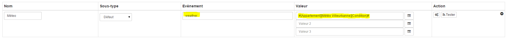
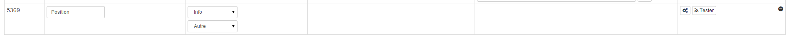

# Complemento IFTTT

Este complemento permite enviar un evento a IFTTT.

# Configuración del plugin

Luego de descargar el plugin solo necesitas activarlo, no requiere ninguna otra configuración.

# Configuración del equipo

Se puede acceder a la configuración del equipo IFTTT desde el menú de complementos :

Así es como se ve la página del complemento IFTTT (*ya con 1 equipo*) :

Una vez que haces clic en uno de ellos, obtienes :

Aquí encontrarás toda la configuración de tu equipo :

-   **Nombre del equipo** : nombre de su equipo IFTTT.
-   **Activar** : activa su equipo.
-   **Visible** : lo hace visible en el tablero.
-   **Clave** : Clave IFTTT que encontrará en la configuración del servicio Webhooks (que reemplaza al creador de canales).

A continuación encontrará la configuración de los comandos :

-   **Nombre** : Nombre de la orden.
-   **Tipo** : Tipo de orden.
-   **Evento** : nombre del evento configurado en IFTTT.
-   **Valor** : valor para enviar a IFTTT. 3 posibles distinciones según el subtipo, puede utilizar las etiquetas : ``#color#, #slider#, #message#, #title#``.
-   **Configuración avanzada** *(ruedas con muescas pequeñas)* : se utiliza para mostrar la configuración avanzada del comando (método de registro, widget, etc).
-   **Probar** : Se usa para probar el comando.
-   **Borrar** *(signo -)* : permite eliminar el comando.

# Creación de una cuenta IFTTT

Cree una cuenta IFTTT si aún no lo ha hecho, vaya a [IFTTT](https://ifttt.com) :

Ingrese su dirección de correo electrónico, luego su nombre de usuario y haga que se cree :

Una pequeña guía explicará las posibilidades, una vez finalizada, haga clic en la parte superior derecha de **Buscar** :

Luego, en el cuadro de búsqueda, escriba webhooks y haga clic en webhooks :

Luego en **Conectar** :

En esta caca tienes que conseguir tu llave :

Esta clave debe copiarse en el campo **Clave** de su equipo bajo Jeedom :

# Creación de tu primer "Applet"

Nada podría ser más simple, en IFTTT haga clic en **Mis applets** Luego en **Nuevo subprograma** :

Luego haga clic en **Crea una receta** :

Haga clic en **+ esto**  :

Luego busque "Webhooks" y haga clic en él :

Haga clic en **Hacer una solicitud web** :

Dale un nombre a tu "Evento". Tenga en cuenta que debe corresponder al nombre del evento en el comando Jeedom, por lo que debe memorizarse.    
Confirmar haciendo clic en **Crear disparador** :

Luego haga clic en **+ que** :

Entonces depende de usted, por ejemplo, enviaré una notificación a mi teléfono (primero debe haber instalado la aplicación IFTTT en él), así que hago clic en **Notificaciones** :

Confirmar haciendo clic en **Enviar una notificación** (puede ser diferente según los canales) :

Luego tienes que escribir el mensaje de la notificación, hay posibles etiquetas (ingredientes) :

-   **Nombre de evento** : nombre del evento, aquí el clima.
-   **Valor1** : valor 1 enviado en el canal, este se configura en el comando en Jeedom.
-   **Valor2** : valor 2 enviado en el canal, este se configura en el comando en Jeedom.
-   **Valor3** : valor 3 enviado en el canal, este se configura en el comando en Jeedom.
-   **Ocurrió** : fecha de ocurrencia.

Esto es lo que da aquí (quiero recibir la notificación del clima actual en casa), validar haciendo clic en **Crear acción** :

Dale un nombre a tu applet (receta) y valida haciendo clic en **Crear receta** :

Aquí ha creado su "applet" en el lado IFTTT :

Sigue siendo más que crear el pedido en el lado de Jeedom, es bastante simple :

Nada especial, tienes que volver a poner el nombre del evento IFTTT en Jeedom y luego poner los valores para pasar a IFTTT. En nuestro ejemplo, las condiciones climáticas en el ingrediente ``value1``.

> **CONSEJO**
>
> En el lado de Jeedom puede, si coloca un comando de subtipo de mensaje, por ejemplo, poner la etiqueta ``#message#`` en uno o más campos de "Valor"". Entonces, en su escenario, el valor del mensaje se pasará a IFTTT. Lo mismo es posible con ``#title#``, ``#color#`` o ``#slider#``.

# Envío de información de IFTTT a Jeedom

También es posible hacerlo en la otra dirección, es decir, enviando información de IFTTT a Jeedom.      
Aquí se explica cómo, por ejemplo, enviar información cuando el teléfono ingresa a un área determinada. Lo primero que debe hacer es crear un nuevo applet :

Luego haga clic en el **+ esto** :

Seleccione **Alquiler** :

Elija su disparador (aquí lo tomaré al ingresar a una zona) :

Marque su zona y luego hágalo **Crear disparador** :

Haga clic en **+ que** :

Busque "Webhooks" y haga clic en él :

Haga clic en **Hacer una solicitud web** :

En el lado de Jeedom, en su equipo IFTTT, cree un comando de información / otro tipo (o binario si solo quiere saber si está en el área), como este :

Muy importante : recuperar la identificación del pedido (aquí ``5369``).

Luego volvemos a IFTTT y en nuestros webhooks le daremos la url para llamar. Este es el paso más complicado, encontrar su URL de acceso externo :

-   Está utilizando jeedom DNS, así que esto es : ``https://XXXXX.dns.jeedom.com/core/api/jeeApi.php?apikey=\#APIKEY\#&type=ifttt&id=\#IDCMD\#&value=\#VALEUR\#``.   
Atención, si tiene una dirección en / jeedom, debe recordar agregarla antes de / core.
-   Tienes tu propio DNS, entonces la url tiene la forma ``http://\#VOTRE\_DNS\#/core/api/jeeApi.php?apikey=\#APIKEY\#&type=ifttt&id=\#IDCMD\#&value=\#VALEUR\#``.   
Atención, si tiene una dirección en / jeedom, debe recordar agregarla antes de / core

Recuerda reemplazar :

-   ``#APIKEY#`` : por su clave API JEEDOM (se puede encontrar en Configuración → Sistema → Configuración → API).
-   ``#IDCMD#`` : por la identificación de su pedido previamente creado.
-   ``#VALEUR#`` : por el valor que desea dar a su pedido. Tenga cuidado aquí, los espacios deben reemplazarse por% 20 (y es mejor evitar los caracteres especiales, ejemplo : ``Hors%20zone``).

Esto es lo que da :

Recuerde poner el método en Obtener, luego haga clic en **Crear acción**.

Asigne un título a su subprograma y luego haga clic en **Crear acción**. Y ahí lo tienes, tan pronto como ingreses al área, Jeedom será advertido.

> **Importante**
>
> También debe hacer una receta para abandonar el área, de lo contrario, Jeedom no
> no será advertido al salir del área.

> **Nota**
>
> Para recuperar la URL del webhook en ifttt, debe ir [aquí](https://ifttt.com/maker_webhooks) luego haga clic en la documentación
