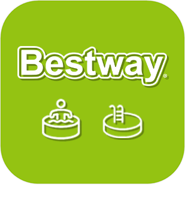
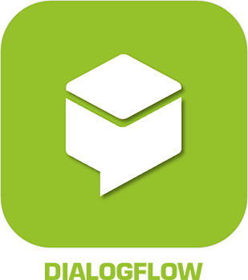
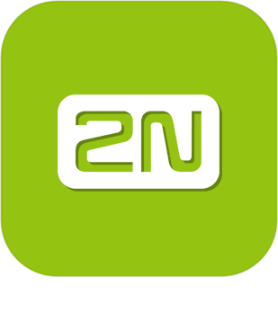
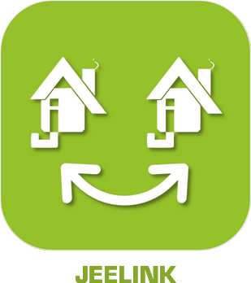
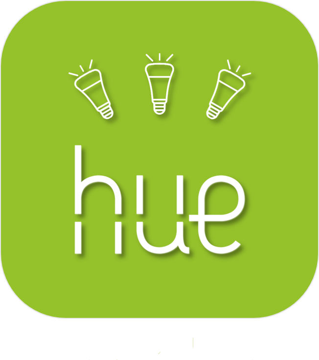

>**Importante**
>Solo los complementos oficiales tienen su documentación aquí. Puede consultar la documentación de los otros complementos directamente desde Jeedom Market. Una vez en el complemento en cuestión, haga clic en la documentación.
>Podéis ver [aquí](https://market.jeedom.com/index.php?v=d&p=market&type=plugin&categorie=communication) todos los complementos oficiales en esta categoría

| | | | |
|--- | --- | --- | ---|
||Aruba|El complemento ATENCIÓN está disponible solo en versión beta | [Mercado](https://market.jeedom.com/index.php?v=d&p=market_display&id=4108)|
||Alexa|Complemento para usar Amazon Alexa (echo, dot ...) para controlar su Jeedom. Importante : El complemento requiere una suscripción a los servicios de voz . Pour gérer cet abonnement : https://www.jeedom.com/market/index.php?v=d&p=profils#services|[Documentación estable](ash/index.md) - [Documentación beta](ash/beta/index.md) [Mercado](https://market.jeedom.com/index.php?v=d&p=market_display&id=3409) [Registro de cambios estable](ash/changelog.md) - [Lista de cambios beta](ash/beta/changelog.md)|
||Bestway|Complemento para controlar el equipo conectado Bestway. Por el momento, solo se ha probado el Milan SPA (el único spa conectado de la gama).|[Documentación estable](bestway/index.md) - [Documentación beta](bestway/beta/index.md) [Mercado](https://market.jeedom.com/index.php?v=d&p=market_display&id=4014) [Registro de cambios estable](bestway/changelog.md) - [Lista de cambios beta](bestway/beta/changelog.md)|
||Bolardo Tenda W301A|Autor del complemento : Thomas Guenneguez TENGA EN CUENTA que este no es un complemento oficial de Jeedom sino un complemento desarrollado por una tercera persona y cuyo desarrollo ha sido abandonado. El equipo técnico de Jeedom proporcionará asistencia con este complemento sin obligación de resultado. Complemento para administrar terminales Tenda W301A.|[Documentación estable](bornetenda/index.md) [Mercado](https://market.jeedom.com/index.php?v=d&p=market_display&id=1299) [Registro de cambios estable](bornetenda/changelog.md)|
||Flujo de diálogo|El complemento permite hablar con Google Home / Assistant a través de las interacciones de Jeedom|[Documentación estable](dialogflow/index.md) [Mercado](https://market.jeedom.com/index.php?v=d&p=market_display&id=3215) [Registro de cambios estable](dialogflow/changelog.md)|
||Dyson|Complemento para controlar el equipo Dyson Link (pure link, hot + cool, humidify + cool...). Por el momento la aspiradora no es compatible.|[Documentación estable](dyson/index.md) [Mercado](https://market.jeedom.com/index.php?v=d&p=market_display&id=4002) [Registro de cambios estable](dyson/changelog.md)|
||Gcast|Complemento que permite hablar a un dispositivo CAST. También te permite ajustar el volumen. Cuando se usa en combinación con una casa de Google, le permite unir interacciones y tener comentarios de voz, también le permite usar la función de preguntar.|[Documentación estable](gcast/index.md) - [Documentación beta](gcast/beta/index.md) [Mercado](https://market.jeedom.com/index.php?v=d&p=market_display&id=3057) [Registro de cambios estable](gcast/changelog.md) - [Lista de cambios beta](gcast/beta/changelog.md)|
||GL-iNet|Complemento de gestión GliNet (sms, conexión)|[Documentación estable](glinet/index.md) - [Documentación beta](glinet/beta/index.md) [Mercado](https://market.jeedom.com/index.php?v=d&p=market_display&id=4181) [Registro de cambios estable](glinet/changelog.md) - [Lista de cambios beta](glinet/beta/changelog.md)|
||Google Smarthome|Complemento para impulsar Jeedom con Google Home. Importante : el complemento requiere una suscripción a los servicios de voz (3 meses gratis al comprar el complemento) para una fácil configuración. Pour gérer cet abonnement : https://www.jeedom.com/market/index.php?v=d&p=profils#services Vous pouvez utiliser aussi le mode standalone mais sa configuration est plus complexe, nous vous conseillons vivement de lire la documentation avant tout achat si vous souhaitez utiliser ce mode.|[Documentación estable](gsh/index.md) - [Documentación beta](gsh/beta/index.md) [Mercado](https://market.jeedom.com/index.php?v=d&p=market_display&id=3412) [Registro de cambios estable](gsh/changelog.md) - [Lista de cambios beta](gsh/beta/changelog.md)|
||Punto de acceso de helio|Complemento para recuperar información de los puntos de acceso de Helium|[Documentación estable](heliumhotspot/index.md) - [Documentación beta](heliumhotspot/beta/index.md) [Mercado](https://market.jeedom.com/index.php?v=d&p=market_display&id=4315) [Registro de cambios estable](heliumhotspot/changelog.md) - [Lista de cambios beta](heliumhotspot/beta/changelog.md)|
||IFTTT|Gracias a este complemento, puede beneficiarse de las innumerables recetas disponibles en IFTT. Por lo tanto, un evento de Jeedom puede convertirse en un punto de entrada para una receta IFTT y desencadenar eventos de todo tipo.|[Documentación estable](ifttt/index.md) - [Documentación beta](ifttt/beta/index.md) [Mercado](https://market.jeedom.com/index.php?v=d&p=market_display&id=1705) [Registro de cambios estable](ifttt/changelog.md) - [Lista de cambios beta](ifttt/beta/changelog.md)|
||inter2N|El complemento ATENCIÓN está disponible solo en versión beta Complemento para gestionar los intercomunicadores inter2N|[Documentación beta](inter2N/beta/index.md) [Mercado](https://market.jeedom.com/index.php?v=d&p=market_display&id=4166) [Lista de cambios beta](inter2N/beta/changelog.md)|
||Jarvis|Complemento para administrar uno o más Jarvis|[Documentación estable](jarvis/index.md) - [Documentación beta](jarvis/beta/index.md) [Mercado](https://market.jeedom.com/index.php?v=d&p=market_display&id=2577) [Registro de cambios estable](jarvis/changelog.md) - [Lista de cambios beta](jarvis/beta/changelog.md)|
||Enlace de libertad|Este complemento le permitirá vincular varias instalaciones de Jeedom para transferir el equipo de uno o más "Jeedoms de origen" a uno o más "Jeedoms de destino"".|[Documentación estable](jeelink/index.md) - [Documentación beta](jeelink/beta/index.md) [Mercado](https://market.jeedom.com/index.php?v=d&p=market_display&id=2530) [Registro de cambios estable](jeelink/changelog.md) - [Lista de cambios beta](jeelink/beta/changelog.md)|
||LaMetric|Complemento para mostrar notificaciones en LaMetric Time.|[Documentación estable](lametric/index.md) [Mercado](https://market.jeedom.com/index.php?v=d&p=market_display&id=2818) [Registro de cambios estable](lametric/changelog.md)|
||Mail|Este complemento le permite enviar correos electrónicos desde Jeedom. Esto le permite notificarle directamente por correo electrónico durante una alerta o simplemente para un informe diario. Puede definir tantos destinatarios como desee, esto es útil para enviar informes personalizados o alertas de orientación para este o aquel destinatario.|[Documentación estable](mail/index.md) - [Documentación beta](mail/beta/index.md) [Mercado](https://market.jeedom.com/index.php?v=d&p=market_display&id=22) [Registro de cambios estable](mail/changelog.md) - [Lista de cambios beta](mail/beta/changelog.md)|
||Aplicación móvil|La aplicación oficial de Jeedom le permite controlar su sistema domótico Jeedom, ya sea en WiFi local o en la red 3G / 4G de su operador.  La aplicación se conecta automáticamente a su Jeedom con inicialización automática mediante QRcode, no es necesaria ninguna configuración. (posibilidad de hacerlo manualmente) Encontrarás todas las funcionalidades de tu Jeedom en tu móvil. Podrás personalizar tu aplicación con atajos y más...  Funciones actuales: - Gestionar sus escenarios. - Gestión de su domótica según sus piezas y equipos. - Cambio y retorno de estado automático - Compatibilidad con complementos, como termostato, alarma, cámara, etc... - Interfaz personalizable con atajos. - Resumen general de domótica y por habitación - Notificaciones (con soporte ASK) - Visualización de diseños   Otras funciones y compatibilidades vendrán en las próximas actualizaciones !  Respeto a la vida privada. No se almacenan ni guardan datos (domóticos o personales) en nuestros servidores.|[Documentación estable](mobile/index.md) - [Documentación beta](mobile/beta/index.md) [Mercado](https://market.jeedom.com/index.php?v=d&p=market_display&id=2030) [Registro de cambios estable](mobile/changelog.md) - [Lista de cambios beta](mobile/beta/changelog.md)|
||Netatmo|Complemento para recuperar equipos Netatmo (Clima, Energía, Seguridad). A través de la nube Jeedom. Atención por el momento no es posible tener el flujo de las cámaras.|[Documentación estable](netatmo/index.md) - [Documentación beta](netatmo/beta/index.md) [Mercado](https://market.jeedom.com/index.php?v=d&p=market_display&id=4062) [Registro de cambios estable](netatmo/changelog.md) - [Lista de cambios beta](netatmo/beta/changelog.md)|
||Network|Complemento que permite la gestión de equipos en red : ping (ip, arp, puerto) y despertar en lan|[Documentación estable](networks/index.md) - [Documentación beta](networks/beta/index.md) [Mercado](https://market.jeedom.com/index.php?v=d&p=market_display&id=1950) [Registro de cambios estable](networks/changelog.md) - [Lista de cambios beta](networks/beta/changelog.md)|
||Nimbus|Plugin para controlar tu Nimbus.  Puede controlar el texto mostrado, la posición de las manos. Todo a través del escenario o el tablero.  Una representación personalizable del nimbo en su tablero mejorará todo  El tablero de instrumentos es completamente personalizable  Puede cambiar la posición de cada aguja y cambiar el texto de cada pantalla de forma independiente (ya sea a través del tablero o a través de un escenario)  También hay un comando de demostración y un comando de todos (para actuar en todas las pantallas al mismo tiempo), así como un comando de frase para dividir una frase en las 4 pantallas.   Lee la documentación|[Documentación estable](nimbus/index.md) [Mercado](https://market.jeedom.com/index.php?v=d&p=market_display&id=1506) [Registro de cambios estable](nimbus/changelog.md)|
||Gerente de notificaciones|Este plugin se utiliza para gestionar notificaciones (recuperación en caso de error, generación de texto, etc...).|[Documentación estable](notificationmanager/index.md) - [Documentación beta](notificationmanager/beta/index.md) [Mercado](https://market.jeedom.com/index.php?v=d&p=market_display&id=3315) [Registro de cambios estable](notificationmanager/changelog.md) - [Lista de cambios beta](notificationmanager/beta/changelog.md)|
||Openvpn|Complemento para administrar la conexión a un servidor openvpn.|[Documentación estable](openvpn/index.md) - [Documentación beta](openvpn/beta/index.md) [Mercado](https://market.jeedom.com/index.php?v=d&p=market_display&id=1965) [Registro de cambios estable](openvpn/changelog.md) - [Lista de cambios beta](openvpn/beta/changelog.md)|
||Philips Hue|Complemento para integrar un ecosistema Philips Hue en Jeedom. El complemento puede administrar hasta 2 puentes simultáneamente.|[Documentación estable](philipsHue/index.md) - [Documentación beta](philipsHue/beta/index.md) [Mercado](https://market.jeedom.com/index.php?v=d&p=market_display&id=190) [Registro de cambios estable](philipsHue/changelog.md) - [Lista de cambios beta](philipsHue/beta/changelog.md)|
||Mercado telefónico|Complemento para usar el mercado como puerta de enlace de SMS y hacer llamadas|[Documentación estable](phonemarket/index.md) [Mercado](https://market.jeedom.com/index.php?v=d&p=market_display&id=1694) [Registro de cambios estable](phonemarket/changelog.md)|
||Sarah|Plugin pour utiliser Sarah (http://encausse.wordpress.com/s-a-r-a-h/)|[Documentación estable](sarah/index.md) [Mercado](https://market.jeedom.com/index.php?v=d&p=market_display&id=17) [Registro de cambios estable](sarah/changelog.md)|
||Slack|Complemento para vincular Jeedom a Slack|[Documentación estable](slack/index.md) [Mercado](https://market.jeedom.com/index.php?v=d&p=market_display&id=1689) [Registro de cambios estable](slack/changelog.md)|
||SMS|Complemento que agrega la gestión (envío / recepción) de SMS a Jeedom. Con este plugin puedes ser notificado por SMS, incluso hacer una pregunta o desencadenar una acción vía SMS gracias al motor de interacción. (Requiere una clave 3G y una tarjeta SIM ).|[Documentación estable](sms/index.md) - [Documentación beta](sms/beta/index.md) [Mercado](https://market.jeedom.com/index.php?v=d&p=market_display&id=16) [Registro de cambios estable](sms/changelog.md) - [Lista de cambios beta](sms/beta/changelog.md)|
||Wifip|Plugin para gestionar el wifi de tu caja así como arreglar la IP.|[Documentación estable](wifip/index.md) [Mercado](https://market.jeedom.com/index.php?v=d&p=market_display&id=2286) [Registro de cambios estable](wifip/changelog.md)|
||Wifipower|Complemento de gestión de equipos Wifipower|[Documentación estable](wifipower/index.md) [Mercado](https://market.jeedom.com/index.php?v=d&p=market_display&id=1046) [Registro de cambios estable](wifipower/changelog.md)|
||Wireguard|Complemento para administrar la conexión a un servidor wireguard. Solo compatible con Jeedom DNS por el momento|[Documentación estable](wireguard/index.md) - [Documentación beta](wireguard/beta/index.md) [Mercado](https://market.jeedom.com/index.php?v=d&p=market_display&id=4222) [Registro de cambios estable](wireguard/changelog.md) - [Lista de cambios beta](wireguard/beta/changelog.md)|
