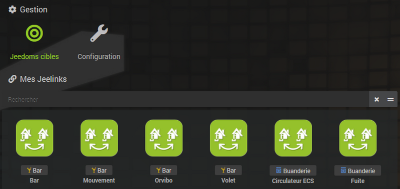
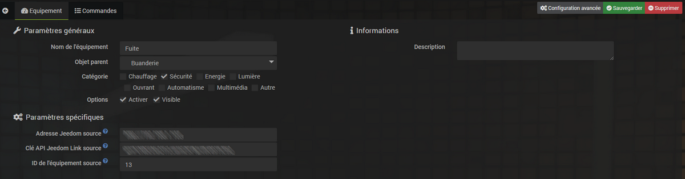

# Complemento Jeedom Link

El complemento **Enlace de libertad** *(también llamado jeelink)* permite que el equipo se cargue desde una o más instalaciones de Jeedom de "origen" a uno (o más) Jeedom de "objetivo"".

El complemento debe instalarse en cada Jeedom, ya sea de origen o de destino.

Antes de comenzar, asegurémonos de usar los mismos términos :
- **Fuente de la libertad** : Servidor Jeedom en el que se volverá a montar el equipo en el **Jeedom Target**.
- **Jeedom Target** : Servidor Jeedom que recibirá y centralizará el equipo traído por uno o más **Jeedoms fuentes**.
- **Cesión** : configuración realizada a nivel de la **Fuente de la libertad** para seleccionar el equipo que se va a cargar en el **Jeedom Target**.

>**INFORMACIÓN**
>
>Para una mejor lectura y comprensión de esta documentación, las capturas de pantalla sobre fondo blanco corresponden a las **Fuente de la libertad** y los que tienen fondo negro **Jeedom Target**.

# Configuration

## Configuración del plugin

Este complemento no requiere ninguna configuración especial y simplemente debe activarse después de la instalación.

>**Importante**
>
>Tenga en cuenta que la desactivación del complemento conduce a la eliminación de los problemas de destino del complemento sin ningún medio para recuperarlos (excepto restaurar una copia de seguridad)

>**Importante**
>
>Las configuraciones de red de todos los Jeedoms *(origen Destino)* DEBE estar bien, de lo contrario el complemento no funcionará.

>**Importante**
>
>Es importante no tener la misma clave API en varios objetivos. La clave de un equipo se basa en la clave api (por lo que no debe cambiarse después de la configuración) y la identificación de origen del equipo. Por lo tanto, tener la misma clave API en el objetivo causará problemas de sincronización con equipos que pueden no aparecer en el origen.

## Configuración de Target Jeedom

El primer paso será definir un **Jeedom Target** desde el **Fuente de la libertad** *(el que sostiene el equipo para ser reensamblado)*.

Para hacerlo, vaya al menú **Complementos → Comunicación → Jeedom Link** luego haga clic en el botón verde **Jeedoms objetivo**.

Se abrirá una ventana desde la que podrá añadir o modificar **Jeedom (s) Target (s))**. Para agregar un **Jeedom Target**, solo completa :

- El nombre de **Jeedom Target**.
- La dirección IP o el nombre DNS al que pertenece el **Jeedom Target** puede ser alcanzado.
- El **Clave API del complemento Jeedom Link** del **Jeedom Target**.
- El modo de acceso, interno o externo (usado para la retroalimentación del **Fuente de la libertad** hacia **Jeedom Target**).

>**TRUCO**
>
>Encontrarás el **Clave API de enlace de Jeedom**, específicos de cada instalación, en el menú **Ajustes → Sistema → Configuración → PLC**.

### Asignación de equipos

Después de realizar la configuración de la **Jeedom Target** sobre **Fuente de la libertad**, tienes que ir a la pestaña **Cesión** para seleccionar los dispositivos que se transmitirán al **Jeedom Target**. Todos los comandos para cada equipo se crearán y configurarán automáticamente en el **Jeedom Target**.

Añade el equipo que quieras subir a la **Jeedom Target** haciendo clic en **Agregar equipo** luego seleccione el objeto y el equipo :

>**INFORMACIÓN**
>
>Los complementos que usan un widget específico no lo encontrarán en el **Jeedom Target** *(Complemento Cámara, Redes, etc…​)*.

>**Importante**
>
>Como medida de seguridad, eliminar un dispositivo asignado a un **Jeedom Target** desde un **Fuente de la libertad** no lo borre en el **Jeedom Target**.

Solo queda por **Para salvaguardar** para que se realice el enlace y se transmita el equipo seleccionado desde el **Fuente de la libertad** a **Jeedom Target**.

## Configuración del equipo

Ahora vayamos al menú **Complementos → Comunicación → Jeedom Link** del **Jeedom Target** para ver la creación automática del equipo previamente seleccionado :

Como cualquier equipo Jeedom, accedes a su página de configuración haciendo clic en él :

En la pestaña **Comandos**, accede a todos los parámetros de los controles del equipo :

>**Importante**
>
>En cuanto a los equipos afectados en un **Fuente de la libertad**, borrar una pieza de equipo en un **Jeedom Target** no lo borre en el **Fuente de la libertad**.

### Modificando la fuente de Jeedom

Los siguientes 3 parámetros se utilizan para reemplazar un **Fuente de la libertad** sin pérdida de datos *(historia por ejemplo)* :

-   **Dirección de origen de Jeedom**
-   **Clave de API de origen de Jeedom Link**
-   **ID del dispositivo de origen** y **Identificación de la fuente** algunos pedidos.

Para hacer esto, simplemente ingrese la nueva dirección y la nueva clave API de Jeedom Link del Jeedom de origen y cambie los identificadores del equipo y los comandos.

# FAQ

>**Tengo errores :** `No está autorizado para realizar esta acción`
>
>Asegúrate que **Claves API de Jeedom Link** estar bien informado :
>- El **Clave API de enlace de Jeedom** del **Fuente de la libertad** en cada equipo Jeelink del **Jeedom Target**.
>- El **Clave API de enlace de Jeedom** del **Jeedom Target** en la página de configuración **Jeedoms objetivo** del **Fuente de la libertad**.
