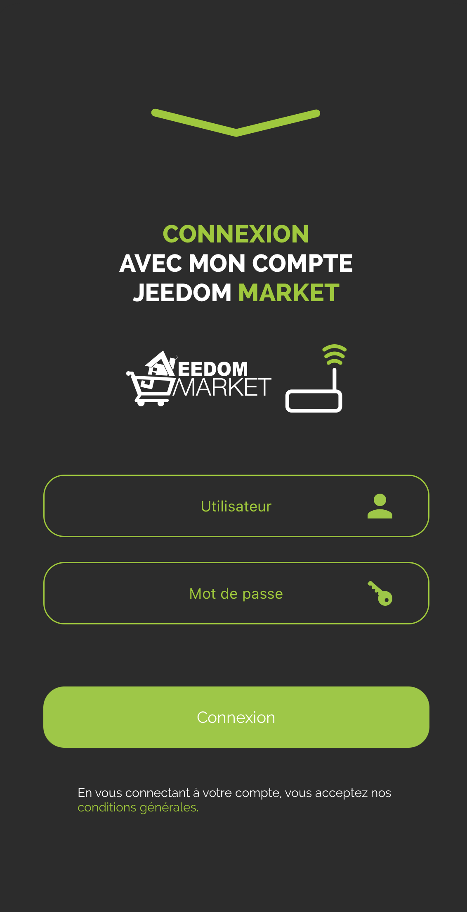

    # Complemento móvil

    Complemento para usar la aplicación Jeedom Mobile.

    La aplicación móvil Jeedom requiere la instalación de este complemento para que la caja pueda comunicarse con la aplicación móvil.

    # Configuración del complemento móvil para la aplicación V2

    Después de instalar el complemento, solo necesita activarlo :

    

    # Primera conexión a la aplicación V2

    Para conectar tu teléfono : hay 2 métodos posibles;
    En la primera pantalla de la aplicación, se le ofrece conectar su cuenta de mercado y así encontrar todas las casillas asociadas a esta cuenta, o simplemente agregar una casilla.

    

    > **IMPORTANTE**
    >
    > Para beneficiarse de las funcionalidades de la aplicación, el núcleo de su Jeedom debe estar en 4.4.0 mínimo

    #### **INICIAR SESIÓN A TRAVÉS DE LA CUENTA DE MERCADO** :

    

    Todo lo que tiene que hacer es ingresar su Market ID y contraseña.

    #### **CONEXIÓN MEDIANTE BOX ID** :

    

    Varias opciones en esta pantalla :

    - Ingresas la url de tu Jeedom (interna o externa), así como los identificadores de acceso a la misma y confirmas con el botón LOGIN

    - Haces clic en el código QR : aparece una nueva pantalla; puede escanear un código QR desde el complemento móvil del Box que desea agregar, a través de la pestaña Código QR del complemento.

    

    > Pestaña Código QR del complemento móvil

    > > 

    Una vez realizado este primer paso, ya estás registrado en la aplicación: Si tienes el complemento Móvil, tendrás acceso a través del menú a Notificaciones, Códigos QR, Personalización del menú ....

    En el menú, tendrá una pestaña Cajas, que agrupa todas las cajas presentes en esta cuenta de mercado

    

    

    Simplemente haga clic en el Box donde está instalado el complemento Móvil, luego identifíquese para acceder al Box.

    La casilla irá al principio de la lista, habiendo validado su autenticación.
    Puedes hacer esto para varias cajas.

    También puede hacer clic en el botón + en la parte inferior derecha para acceder a diferentes opciones;

    - Código QR para agregar un Box a la lista mediante el complemento Móvil,
    - Manual para agregar una caja manualmente
    - Detección Atlas y Luna (si estás en Wifi, detectará las cajas en la red)
    - Sincronización de Market para actualizar la información de la cuenta de Market configurada

    

    Para acceder a funciones como Notificaciones, Personalización de Menú o Geolocalización, primero debes haber seleccionado al menos una casilla actual'

    

    # Cómo funciona la geolocalización

    Añadimos una zona de Geolocalización pulsando en el icono +

    

    Escribimos la dirección que buscamos, validamos con Enter en su teléfono; el cursor se posicionará entonces en la dirección deseada.
    Luego podemos agregar un nombre y guardar la zona.

    Esto creará un nuevo comando en tu equipo móvil, de tipo binario, que corresponderá a las entradas y salidas de la zona si la geolocalización está activada en tu teléfono móvil.

    También podemos cambiar el radio de la zona, para ampliar la detección de la zona.

    

    # FAQ

    > **Tengo problemas con las notificaciones**
    >
    > Esta parte se está mejorando y optimizando actualmente en la aplicación beta.

    > **Tengo problemas para mostrar mi vista web**
    >
    > En tu Jeedom, en Preferencias, comprueba que la página de inicio móvil sea INICIO.
