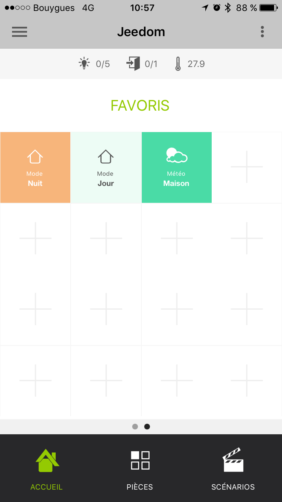

# Complemento móvil

Complemento para usar la aplicación Jeedom Mobile.

La aplicación móvil Jeedom requiere la instalación de este complemento para que la caja pueda comunicarse con la aplicación móvil.

# Configuración de complemento móvil

Después de instalar el complemento, solo necesita activarlo :

****

Para configurar el complemento, debe agregar los teléfonos que podrán acceder a Jeedom.

Para agregar un teléfono : ****  ****  **App
Mobile**  ****

Aquí están los parámetros para ingresar :

-   **Nombre del equipo móvil** : Nombre del teléfono
-   **** : Habilitar el acceso para este móvil
-   **Tipo de móvil** : Selección del sistema operativo del teléfono (iOS, Android)
-   **** : Usuario asociado con este acceso

> ****
>
> La elección del usuario es importante porque determina el equipo al que tendrá acceso de acuerdo con sus derechos.

Después de guardar, obtendrá un QRCode que permite que la aplicación se configure.

# Configuración de complementos y comandos recibidos por la aplicación

Después de la inicialización del complemento móvil, tiene la posibilidad de modificar los tipos genéricos de pedidos, complementos y piezas.

Al hacer clic en un complemento, puede autorizarlo o no a chatear con la aplicación móvil y configurar cada uno de los tipos genéricos asociados con sus comandos.

Al hacer clic en una parte, puede autorizarla o no para que esté presente en la aplicación móvil y configurar cada uno de los tipos genéricos asociados con sus pedidos.

# Configuración de la aplicación móvil

Encontrará las aplicaciones en las persianas móviles :

****

****

## Primer lanzamiento de la aplicación

Cuando inicie la aplicación móvil por primera vez, se le ofrecerá un tutorial para ayudarlo a configurarla.

Después de descargar e instalar su aplicación móvil Jeedom, inicie la aplicación en su teléfono inteligente.

Luego llega a un tutorial de configuración que le recomendamos que siga. Algunos pasos se han realizado previamente.

Luego podrá elegir entre una configuración manual o automática por QRcode. Si opta por la configuración de QRcode, simplemente muestre el QRcode presente en el complemento de la aplicación móvil en el equipo del teléfono inteligente creado previamente. En este caso, la aplicación recuperará automáticamente toda la configuración de su Jeedom y se conectará automáticamente. Cuando está conectado a su hogar a través de Wifi, la aplicación usará automáticamente la dirección Ethernet de Jeedom interna de su red. Cuando esté conectado en 4G o 3G, usará su dirección externa para conectarse a su Jeedom (por ejemplo, a través del servicio DNS de Jeedom si lo usa)). Si elige la configuración manual, en este caso deberá ingresar manualmente las direcciones IP internas y externas de su Jeedom. Esta opción está reservada para un público informado.

La aplicación se sincronizará y usted llegará a su página de inicio (precedida por una mini guía de presentación).

La aplicación móvil Jeedom ahora está lista para funcionar.

## Favoritos

En la aplicación puede tener Favoritos (accesos directos de comandos, complementos, escenarios).

Aquí está el procedimiento para crearlos :

Haga clic en uno de los + en la pantalla de inicio de la aplicación :

Llegará a la página de selección de tipo de acceso directo :

Por ejemplo, vamos a tomar medidas, por lo que nos ofrece monedas / objetos :

Luego, simplemente seleccione la acción que desea como acceso directo :

Entonces es posible personalizar el color de este (por el momento se proponen tres colores) :

Así como los dos textos asociados :

Aquí, ahora tiene un acceso directo de su pedido (en la versión 1.1 Se espera que los comandos de encendido / apagado aparezcan en la misma tecla).

# Cómo configurar correctamente los tipos genéricos

## Tipos genéricos en el complemento móvil

Mejor que las palabras, aquí hay un ejemplo de los créditos genéricos para una luz con todos sus controles (vea también la tabla de Luz a continuación)) :

## Tablas de plantillas de aplicación

### Las luces

                           | Tipo genérico               | Parte del complemento de desarrollo            |           |
:-----------------------------: | :--------------------------- | :--------------------------- | :------------------: |
 | `Lumière Bouton On` `Botón apagado luz` |  | presencia de dos botones "ON" y "Off" sin retroalimentación de estado. |
 | `Lumière Bouton On` `Botón apagado luz` `State Light` |    | Comentarios de estado presentes, el botón izquierdo alterna entre encendido y apagado |
 | `Lumière Bouton Toggle` `State Light` |   | Comentarios de estado presentes, el botón izquierdo alterna entre encendido y apagado |
 | `Lumière Bouton On` `Botón apagado luz` `State Light` `Light Slider` |     | Estado de retroalimentación presente, el botón izquierdo permite cambiar entre Encendido y Apagado y el control deslizante permite controlar la intensidad |
 | `Lumière Bouton On` `Botón apagado luz` `State Light` `Light Slider` `Color claro (información)` `Color claro (acción)` `Modo de luz` (opcional, se utiliza para tener modos de luz, por ejemplo, arco iris en Hue philips) |        | Estado de retroalimentación presente, el botón izquierdo permite cambiar entre Encendido y Apagado y el control deslizante permite controlar la intensidad. En el círculo, el color de la lámpara está presente y, al hacer clic en él, puede cambiar el color y activar un modo |

### Los enchufes

                           | Tipo genérico               | Parte del complemento de desarrollo            |           |
:-----------------------------: | :--------------------------- | :--------------------------- | :------------------: |
 | `Prise Bouton On` `Toma de botón apagado`|  | presencia de dos botones "ON" y "Off" sin retroalimentación de estado. |
 | `Prise Bouton On` `Toma de botón apagado` `Toma de estado` |    | Comentarios de estado presentes, el botón izquierdo alterna entre encendido y apagado |
 | `Prise Bouton On` `Toma de botón apagado` `Toma de estado` `Toma deslizante` |     | Estado de retroalimentación presente, el botón izquierdo permite cambiar entre Encendido y Apagado y el control deslizante permite controlar la intensidad |

### Los boletos

                           | Tipo genérico               | Parte del complemento de desarrollo            |           |
:-----------------------------: | :--------------------------- | :--------------------------- | :------------------: |
   | `Volet Bouton Monter` `Panel de botones hacia abajo` `Panel de botones de parada` `Panel de estado` (opcional) |    `FLAP_STATE` (opcional) | Presencia de tres botones "Arriba", "Abajo", "Detener", retroalimentación de estado opcional. |
   | `Volet Bouton Monter` `Panel de botones hacia abajo` `Panel de botones de parada` `Panel de estado` `Panel del botón deslizante` |      | Presencia de un control deslizante, con un botón Arriba / Abajo en Toggle (con icono de estado) |

### Inondation

                           | Tipo genérico               | Parte del complemento de desarrollo            |           |
:-----------------------------: | :--------------------------- | :--------------------------- | :------------------: |
   | `Innondation` `TEMPERATURA` (opcional) `Humedad` (opcional) `SABOTAGE` (opcional)|`FLOOD` `TEMPERATURA` (opcional) `HUMEDAD` (opcional) `HUMEDAD` (opcional) | Le permite tener su sensor de inundación completo en una sola línea.

### Serrure

                         | Tipo genérico               | Parte del complemento de desarrollo            |           |
:---------------------------: | :--------------------------- | :--------------------------- | :------------------: |
   | ` Etat` `Bloqueo de botón abierto` `Cerrar el botón de bloqueo` |    | Comentarios de estado presentes, el botón izquierdo alterna entre encendido y apagado |

### Sirena

                         | Tipo genérico               | Parte del complemento de desarrollo            |           |
:---------------------------: | :--------------------------- | :--------------------------- | :------------------: |
   | `Sirena Etat` `Siren Button On` `Siren Button Off` |    | Comentarios de estado presentes, el botón izquierdo alterna entre encendido y apagado |

### Humo

                           | Tipo genérico               | Parte del complemento de desarrollo            |           |
:-----------------------------: | :--------------------------- | :--------------------------- | :------------------: |
   | `Humo` `TEMPERATURA` (opcional)|`SMOKE` `TEMPERATURA` (opcional) | Le permite tener su sensor de humo completo en una sola línea.

### Temperatura

                                       | Tipo genérico               | Parte del complemento de desarrollo            |           |
:-----------------------------------------: | :--------------------------- | :--------------------------- | :------------------: |
   | `Temperatura` `Humedad` (opcional)|`TEMPERATURE` `HUMEDAD` (opcional) | Ver foto.

### Presencia

                                 | Tipo genérico               | Parte del complemento de desarrollo            |           |
:-----------------------------------: | :--------------------------- | :--------------------------- | :------------------: |
   | `Presencia` `TEMPERATURA` (opcional) `Brillo` (opcional) `Humedad` (opcional) `UV` (opcional) `SABOTAGE` (opcional)|`PRESENCE` `TEMPERATURA` (opcional) `BRILLO` (opcional) `HUMEDAD` (opcional) `UV` (opcional) `SABOTAGE` (opcional) | Ver foto.

### Ouvrant

                                       | Tipo genérico               | Parte del complemento de desarrollo            |           |
:-----------------------------------------: | :--------------------------- | :--------------------------- | :------------------: |
   | `Porte / Fenêtre` `TEMPERATURA` (opcional)| `TEMPERATURA` (opcional) | Ver imagen (es decir, puede elegir entre ventana y puerta).

### Cable piloto

                               | Tipo genérico               | Parte del complemento de desarrollo            |           |
:---------------------------------: | :--------------------------- | :--------------------------- | :------------------: |
   | `Chauffage fil pilote Bouton ON` `Botón de apagado del cable piloto de calentamiento` `Calentar el estado del cable piloto` `Botón de calentamiento del cable piloto` (opcional) |    |Los botones ON / OFF y Status le permiten crear el botón en el extremo izquierdo de la plantilla y el `botón de calentamiento del cable piloto 'está ahí para agregar botones (5 máx)

## Los bromistas

### Acción genérica

                             | Tipo genérico               | Parte del complemento de desarrollo            |           |
:-------------------------------: | :--------------------------- | :--------------------------- | :------------------: |
   | `Action Générique`           | `GENERIC_ACTION`             | Le bouton prend la forme du type de l'action. Par défaut c'est un toggle, si c'est un message alors vous avez une enveloppe, si slider vous avez un slider etc...

### Información genérica

                         | Tipo genérico               | Parte del complemento de desarrollo            |           |
:---------------------------: | :--------------------------- | :--------------------------- | :------------------: |
   | `Information Générique`           | `GENERIC_INFO`             | Le bouton prend la forme du type de l'info.

# Troubleshooting

**Estoy en la versión de Android de la aplicación (1.0.1 o 1.0.0) No puedo acceder a mis partes o incluso a la configuración de la aplicación.**

Recibió una ventana emergente que le advirtió que le preocupa la configuración de accesibilidad, por lo que solo tiene que ir a la configuración de accesibilidad de su dispositivo móvil y desmarcar las aplicaciones con esta opción. (Pronto se traerá una solución en la aplicación)

**Tengo un mensaje en una de las líneas de mis módulos que me dice que
falta un tipo genérico !**

Al leer este mensaje, le indica qué tipo genérico falta para crear una plantilla compatible. Solo aplícalo.Consulte el [doc capítulo Tipo genérico](https://www.jeedom.com/doc/documentation/plugins/mobile/es_ES/mobile#_configuration_des_plugins_et_commandes_que_reçoit_l_app).

**Tengo un problema con uno de los complementos llamado totalmente integrado (clima,
termostato, alarma, cámara) !**

No dude en acceder a su módulo y haga clic en Guardar nuevamente, esto volverá a incluir los tipos genéricos asociados con el módulo.

**No se puede poner una información sobre la bienvenida de la aplicación !**

Esto es normal, estará disponible en la versión 1.1.

**Tengo la aplicación que ocupa mucha memoria en mi
 !**

Hubo un error en las versiones 1.0.0 y 1.0.1 en la parte de la cámara. El problema no volverá a suceder con 1.0.2, para eliminar el caché sin sobrevalorar la aplicación, simplemente vaya a la configuración de su aplicación móvil y haga clic en "eliminar el caché".

**Me preocupa la primera sincronización en la aplicación o sql en el complemento móvil !**

Tienes que poner tipos genéricos y autorizar el complemento para enviar genéricos ver el documento un poco más alto.
