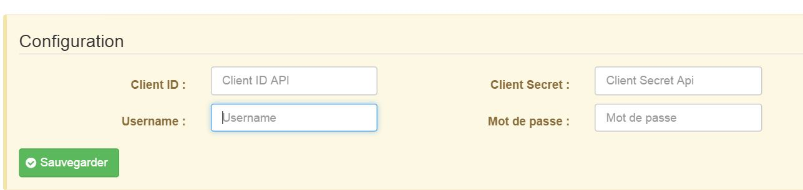
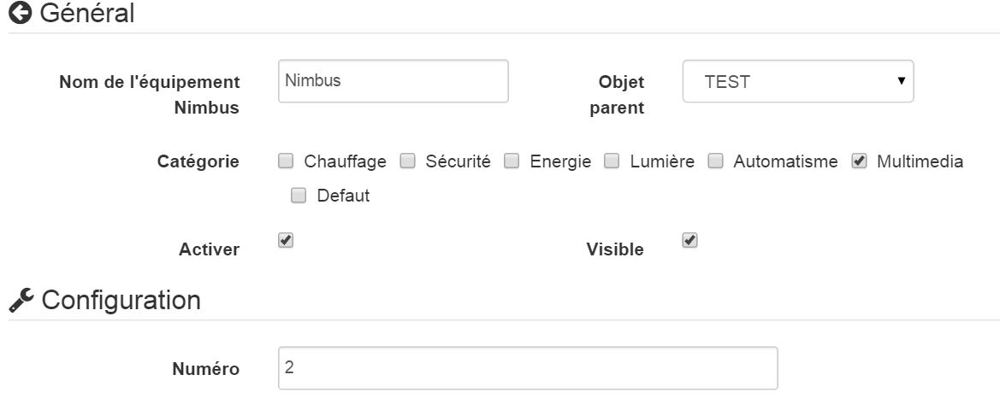

# Complemento de nimbus 

Este complemento le permite controlar y tener toda la información para su Nimbus.

 
 

# Configuración 

## Configuración del complemento Jeedom : 

Para usar el complemento, debe descargarlo, instalarlo y activarlo como cualquier complemento de Jeedom.

Después de esto, deberá ingresar sus credenciales (cuenta de guiño + API):

Vaya al menú de complementos / Comunicación, **allí encontrarás el complemento nimbus :**

Llegará a la página que enumerará su equipo (puede tener varios nimbus) y que le permitirá crear algunos

**Haga clic en el botón Agregar :**

Luego llegará a la página de configuración de su nimbus :

En esta página encontrarás varias secciones :

**Principal**

En esta sección encontrará todas las configuraciones de libertad. Es decir, el nombre de su equipo, el objeto al que desea asociarlo, la categoría (preferiblemente multimedia), si desea que el equipo esté activo o no, y finalmente si desea que sea visible en el tablero de instrumentos.

-   **Configuración**

Esta sección es útil si y solo si tiene varios nimbus. Deberá ingresar el número de equipo (1, 2 o 3, por ejemplo). Puede dejar este campo vacío si solo tiene un nimbo, que seguramente será su caso.

-   **Diseño**

Esta sección le permitirá personalizar la visualización de su nimbus en el tablero. Puedes elegir entre varios fondos. También puede elegir el color de la aguja y el color del texto.

-   **Información**

Esta sección se completará por sí sola cuando guarde su equipo. Allí encontrará información real sobre su nimbus (número de serie, dirección mac, nombre, id)

-   **Comandos**

No tienes nada que hacer en esta sección. Los pedidos se crearán automáticamente.

-   Rafraichir: botón para actualizar el widget si es necesario
-   Pantalla 1 : Información mostrada en la pantalla 1
-   Pantalla 2 : Información mostrada en la pantalla 2
-   Pantalla 3 : Información mostrada en la pantalla 3
-   Pantalla 4 : Información mostrada en la pantalla 4
-   Posición 1 : Información sobre la posición de la aguja de la pantalla 1
-   Posición 2 : Información sobre la posición de la aguja de la pantalla 2
-   Posición 3 : Información sobre la posición de la aguja en la pantalla 3
-   Posición 4 : Información sobre la posición de la aguja de la pantalla 4
-   Acción de pantalla 1 : Comando de acción que permite en un escenario elegir la posición y / o el texto de la pantalla 1
-   Acción de pantalla 2 : Comando de acción que permite en un escenario elegir la posición y / o el texto de la pantalla 2
-   Acción de pantalla 3 : Comando de acción que permite en un escenario elegir la posición y / o el texto de la pantalla 3
-   Acción de pantalla 4 : Comando de acción que permite en un escenario elegir la posición y / o el texto de la pantalla 1
-   Screen Action All : Comando de acción que permite en un escenario elegir la posición y / o el texto de todas las pantallas
-   Acción de pantalla de frase : Comando de acción que permite en un escenario elegir la posición y / o el texto de todas las pantallas (una oración de 4 palabras como máximo dividido en las 4 pantallas)
-   Demo : Acción para lanzar una demostración técnica en tu nimbus

# Las informaciones 

## Información en el tablero : 

El widget está dividido en 4 diales que representan los 4 diales de tu nimbus.

-   La aguja indica la posición de la aguja en la pantalla correspondiente de su nimbo
-   El texto es el texto que se muestra en tu nimbus. Se puede hacer clic en este texto para llegar a esta pantalla :

Esta pantalla le permite cambiar manualmente el texto, la posición de la aguja o ambos. Le permite ver cuándo cambia el valor que ya se muestra.

# Las acciones 

## Acciones accesibles a través del escenario : 

Se puede acceder a varias acciones a través del escenario :

La acción de demostración es independiente y lanza la demostración técnica.

Todas las demás acciones funcionan de la misma manera según el principio.

**Este es un comando de mensaje que le permite pasar dos parámetros:**

-   Título : un número entre 0 y 360 correspondiente a la posición de la aguja
-   Mensaje : el mensaje a mostrar

**Los dos son separables, lo que significa que puedes :**

-   Enviar una posición dejando el campo de mensaje vacío o dejando *Mensaje*
-   Enviar un mensaje dejando el campo de título en blanco o dejando *titulo*
-   Envíe una posición y un mensaje completando ambos

**Hay un pedido por pantalla, un pedido de todos, un pedido
Frase :**

-   Pantalla : permite actuar en la pantalla correspondiente
-   Todos : hagamos lo mismo en todas las pantallas
-   Frase : comando especial que cortará el mensaje en 4 palabras que se mostrarán en cada pantalla (si una palabra supera los 8 caracteres, se cortará si la oración tiene más de 4 palabras, se cortará)

**¿CÓMO PUEDO MOSTRAR PERMANENTEMENTE INFORMACIÓN SOBRE LA AUTOMATIZACIÓN DE MI HOGAR?**

Si desea mostrar continuamente información de su domótica.
Cree un escenario programado cada 5 minutos (por ejemplo).

En este ejemplo, solo necesita reemplazar lo que está en el gancho con sus comandos. Y cada 5 minutos sus pantallas se actualizarán con los valores correctos

# Preguntas frecuentes 

El sistema recupera información cada hora. Puede hacer clic en el comando Actualizar para actualizar manualmente.

Asegúrese de haber creado el archivo de configuración guardando su información en la configuración general del complemento.
