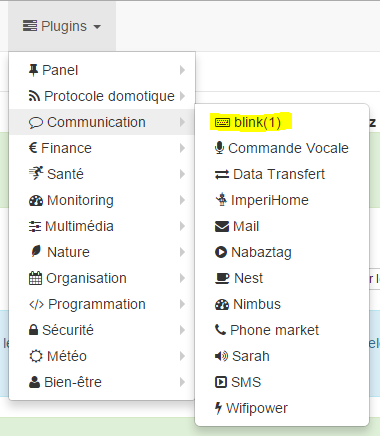
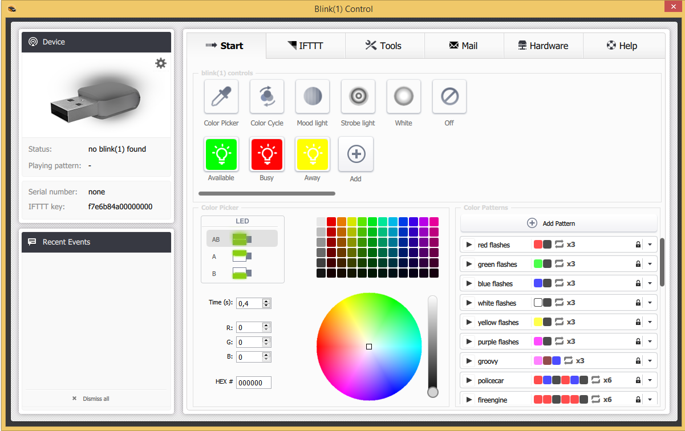

# Complemento de parpadeo (1)

Complemento utilizado para controlar una tecla de parpadeo (1).

# Configuración 

El complemento no requiere ninguna configuración, solo tiene que activarlo :

# Configuración del equipo 

Se puede acceder a la configuración de dispositivos de parpadeo (1) desde el menú Complementos :

Así es como se ve la página del complemento blink (1) (aquí ya con el equipo) :

Así es como se ve la página de configuración para un dispositivo de parpadeo (1) :

Aquí encontrarás toda la configuración de tu equipo :

-   **Nombre del equipo de parpadeo (1)** : nombre de su equipo de parpadeo (1)
-   **Objeto padre** : indica el objeto padre al que pertenece el equipo
-   **Activar** : activa su equipo
-   **Visible** : lo hace visible en el tablero
-   **Modo** : el modo en el que desea operar su parpadeo (1) (consulte la descripción a continuación)

A continuación encontrará la lista de pedidos :

-   el nombre que se muestra en el tablero
-   tipo y subtipo
-   el valor : permite dar el valor del comando de acuerdo con otro comando, una tecla (caso de un interruptor virtual), un cálculo.
-   Configuraciones : nombre del patrón para iniciar o del comando para iniciar
-   Mostrar : permite mostrar los datos en el tablero
-   configuración avanzada (ruedas con muescas pequeñas) : muestra la configuración avanzada del comando (método de registro, widget, etc.)

-   Probar : Se usa para probar el comando
-   eliminar (firmar -) : permite eliminar el comando

# Modo "Local"" 

Modo para usar si el parpadeo (1) está conectado a uno de los puertos USB de Jeedom. El único parámetro en este modo no es obligatorio y le permite seleccionar un parpadeo (1) en particular si tiene varios conectados.

# Modo de llamadas API parpadeante (1)" 

En este modo, Jeedom llamará directamente a la API blink1control, por lo que Jeedom debe poder unirse directamente al sistema en el que está instalada la tecla blink (1).

En este modo, los parámetros de configuración son :

-   **Dirección o IP** : dirección o ip donde está instalada la tecla de parpadeo (1)
-   **Puerto** : puerto en el que escucha la aplicación blink1control
-   **Patrón** : permite sincronizar los patrones con los de la aplicación blink1control

## Instalación de la aplicación blink1control 

La aplicación blink1control se puede encontrar [aquí](http://blink1.thingm.com/blink1control/), en la parte de descarga, está disponible para Windows y Mac. Una vez descargado, inicie la instalación de la aplicación.

## Configuración de la aplicación blink1control 

Una vez instalado y lanzado debe tener :

Esta aplicación ofrece muchas posibilidades. Rápidamente encontramos en la parte superior izquierda el estado de la tecla (aquí no conectado), en la parte inferior izquierda los eventos, en el centro superior de las acciones rápidas para controlar la tecla, justo debajo de un sistema avanzado de elección de modos y colores. y a la derecha los patrones.

Una vez allí, debe hacer clic en la pequeña rueda con muescas en el dispositivo para abrir el menú de configuración avanzada y activar la API del servidor, colocando serverHost en cualquier. También tenga en cuenta el puerto para informarlo en la configuración de Jeedom.

Valide y reinicie blink1control para que lo tenga en cuenta.

# "Modo de monitoreo de URL" 

En este modo, es la aplicación blink1control la que llama a esta URL cada X segundos y le dará sus instrucciones.

Para configurarlo, en la aplicación blink1control, vaya a herramientas, luego haga clic en el pequeño más (+) para agregar uno, luego cree la URL y copie la URL dada por Jeedom (campos de URL para ver) en la ruta. También puedes configurar la frecuencia de actualización.

> **Importante**
>
> Para que esto funcione es necesario que la PC en la que blink1control pueda acceder a Jeedom. Si está utilizando una computadora portátil fuera de su red con la clave en ella, debe poder acceder a Jeedom desde afuera. Si no sabes cómo, lo mejor es usar Jeedom DNS.

En este modo, también tiene la opción "No repetir comandos", esto le permite no repetir más el último comando una vez que blink1control haya tenido en cuenta la solicitud. Es recomendable dejarlo marcado.

# Modo "Ambos"" 

Este modo es una combinación de los 2 modos anteriores, la ventaja es que combina la velocidad de reacción del primero y la posibilidad de operarlo incluso fuera del segundo hogar. Por lo tanto, para la configuración es necesario seguir los procedimientos para el modo "Llamadas a la API de parpadeo (1)" y el modo "Monitoreo por URL".

# Modo SSH" 

Este modo debe usarse si ha colocado el parpadeo (1) en una máquina Linux distinta de la que está instalada Jeedom (Jeedom master porque el complemento no es compatible en modo remoto). La configuración es bastante simple :

-   **Número de dispositivo** : ID del dispositivo, para usar solo si tiene varias teclas parpadeantes (1) en su máquina
-   **Dirección o IP** : Dirección IP de la máquina donde está conectada la llave
-   **Nombre de usuario** : el nombre de usuario para iniciar sesión en la máquina donde está conectada la clave
-   **Ruta relativa del ejecutable blink1-tool** : ruta relativa al ejecutable blink1-tool

> **Punta**
>
> El ejecutable está disponible [aquí](https://github.com/todbot/blink1/releases), cuidado, Jeedom solo funciona con la versión de Linux que, por supuesto, solo es compatible con una máquina de tipo Linux (rpi, rpi2, jeedomboard, cubieboard, bananapi ...). Simplemente transfiera el ejecutable a la máquina donde está conectada la clave y hágalo ejecutable (chmod + x blink1-tool)

> **Importante**
>
> Para que esto funcione, debe haber configurado en el nivel SSH el intercambio de la clave RSA para que Jeedom pueda conectarse a la máquina donde está conectada la clave sin proporcionar una contraseña.
