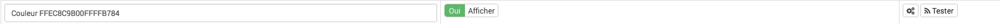

# Complemento Lifx

Plugin que permite interactuar con bombillas Lifx (Local)

# Instala el complemento

Después de instalar el complemento, solo necesita activarlo :

**Dependencias**

Normalmente las dependencias se inician automáticamente, de lo contrario tendrá que hacer clic en **Reiniciar**

# Configuración : Escanea tu red

**Configuración**

Para configurar el complemento, debe escanear su red automáticamente a través del complemento.

Para agregar Lifxes automáticamente : **Plugins** -→ **Comunicando objetos** -→ **Lifx** -→ **Escáner**

Una vez finalizado el escaneo, verá el Lifx detectado.

Luego puede activarlos, haga clic en uno de los Lifx (que tomó el nombre que le dio en la aplicación Lifx), luego actívelo y guárdelo para tener todos los comandos asociados con su Lifx.

**Sección del tablero** :

# Crear un nuevo modo de color

Si nos gusta un color que aplicamos con la aplicación Lifx, podemos recuperarlo fácilmente en el complemento Lifx.

Solo tienes que ir a **Plugins** -→ **Comunicando objetos** -→ **Lifx** -→ luego elija el lifx donde desea copiar el color

Luego haga clic en **Probar** en la orden **Crea un modo**

Simplemente vuelva a cargar la página para ver aparecer un nuevo comando que tiene la configuración de color Lifx actual. Puedes cambiar su nombre en cualquier momento.

