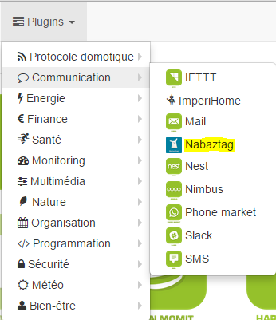

# Complemento Nabaztag

Plugin para ordenar el Nabaztag.

# Configuración del equipo 

Una vez que el complemento está instalado y activado desde Market, puede acceder a la página del complemento Nabaztag :

Aquí encontrarás todos tus equipos Nabaztag :

Una vez que se selecciona un equipo, obtienes :

Aquí encontrarás toda la configuración de tu equipo :

-   **Nombre del equipo Nabaztag** : nombre de su equipo Nabaztag
-   **Objeto padre** : indica el objeto padre al que pertenece el equipo
-   **Categoría** : categorías de equipos (puede pertenecer a varias categorías)
-   **Activar** : activa su equipo
-   **Visible** : lo hace visible en el tablero
-   **Dirección (openjabnab.fr o @IP)** : openjabnab o dirección IP (DNS) de su openjabnab si lo autohospeda
-   **Dirección MAC** : la dirección mac de tu conejo (ver más abajo)
-   **API Token Purple** : Token API (ver más abajo)

A continuación encontrará la lista de pedidos :

-   el nombre que se muestra en el tablero
-   Mostrar : permite mostrar los datos en el tablero
-   configuración avanzada (ruedas con muescas pequeñas) : muestra la configuración avanzada del comando (método de registro, widget, etc.)
-   Probar : Se usa para probar el comando

La lista de comandos es la siguiente :

-   **De pie** : Despierta el conejo
-   **Reiniciar** : Reinicia el conejo
-   **Hora de acostarse** : Vamos a decirle al conejo que se vaya a la cama
-   **Calidad del aire** : Proporciona calidad del aire (requiere la activación del complemento correspondiente en openjabnab)
-   **Efemérides** : Dar efemérides (requiere la activación del complemento correspondiente en openjabnab)
-   **Reloj parlante** : Dar el tiempo (requiere la activación del complemento correspondiente en openjabnab)
-   **Tiempo** : Da el clima (requiere la activación del complemento correspondiente en openjabnab)
-   **Diciendo** : Dar un dicho (requiere la activación del complemento correspondiente en openjabnab)
-   **Oreja izquierda** : Le permite elegir la posición del oído izquierdo (16 posiciones posibles)
-   **Oreja derecha** : Le permite elegir la posición del oído derecho (16 posiciones posibles)
-   **Hablar** : Digamos una oración al conejo

# Recuperar dirección máxima y token 

Ir al sitio [Openjabnab](http://openjabnab.fr/ojn_admin/index.php) luego inicie sesión en su cuenta :

Click en conejo :

Luego haga clic en API :

Aquí active la API púrpura y pública y obtenga la dirección MAC, así como la clave API púrpura para ponerla en la configuración de su conejo en Jeedom
