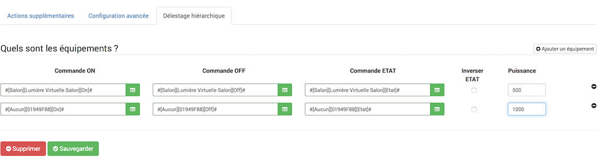

# Complemento de eliminación de carga 

# Descripción 

Plugin que permite gestionar el desprendimiento de carga eléctrica. El complemento gestiona 3 tipos de deslastre de carga :

-   Derramamiento inteligente".
-   Deslastre jerárquico de carga.
-   Deslastre de carga cíclica en cascada.

# Funcionando 

## Deslastre de carga inteligente. 

El deslastre de carga inteligente requiere el complemento Termostato para funcionar.

El complemento clasifica los termostatos de acuerdo con sus temperaturas reales de acuerdo con las temperaturas establecidas.

Por lo tanto, la eliminación tendrá prioridad sobre las partes con la menor desviación. El gen para los ocupantes será menos importante.

## Deslastre jerárquico de carga 

El deslastre de carga se realiza en modo jerárquico en los actuadores x.
El actuador 1 se relevará en prioridad y luego el 2, 3

Los actuadores se restablecerán en el orden inverso al desprendimiento de la carga

### Deslastre de carga cascíclica 

El desprendimiento de carga se realiza en modo rotativo en los actuadores definidos para el modo cíclico, luego, si la potencia es aún mayor que el umbral, en modo jerárquico en los demás.

# Configuración 

## Configuración general 

Aquí están los parámetros para configurar en el complemento :

-   Tipo de desprendimiento de carga : inteligente, jerárquico o cascadocíclico
-   Tipo de contador : Potencia instantánea o amperaje instantáneo
-   Contador : seleccione aquí el comando que devuelve la potencia o el amperaje (en este caso será necesario configurar el voltaje de red)
-   Umbral en vatios : Umbral desde el cual se activará la eliminación

### Acciones adicionales 

Es posible definir acciones adicionales además de las acciones de deslastre de carga.

Es posible, por ejemplo, enviar un sms para advertir el comienzo y el final del desprendimiento de carga.

### Configuración avanzada 

Se pueden configurar los siguientes parámetros:

-   Voltaje de red en voltios (220 V por defecto)
-   Tiempo antes de la reactivación en minutos (5 minutos por defecto) : tiempo antes de que el equipo no se reactive (para evitar el encendido / apagado excesivamente repetitivo)
-   Tiempo mínimo entre lecturas en s (10 s por defecto) : tiempo requerido entre 2 declaraciones

# Preguntas frecuentes 

Por ahora, solo el complemento oficial del termostato se gestiona mediante un desprendimiento de carga inteligente. Sin embargo, es posible usar los otros 2 modos de deslastre de carga con los otros termostatos.

# Solucionar problemas 

Tenga cuidado de activar el modo "Auto" en el widget para activar el desprendimiento de carga.
