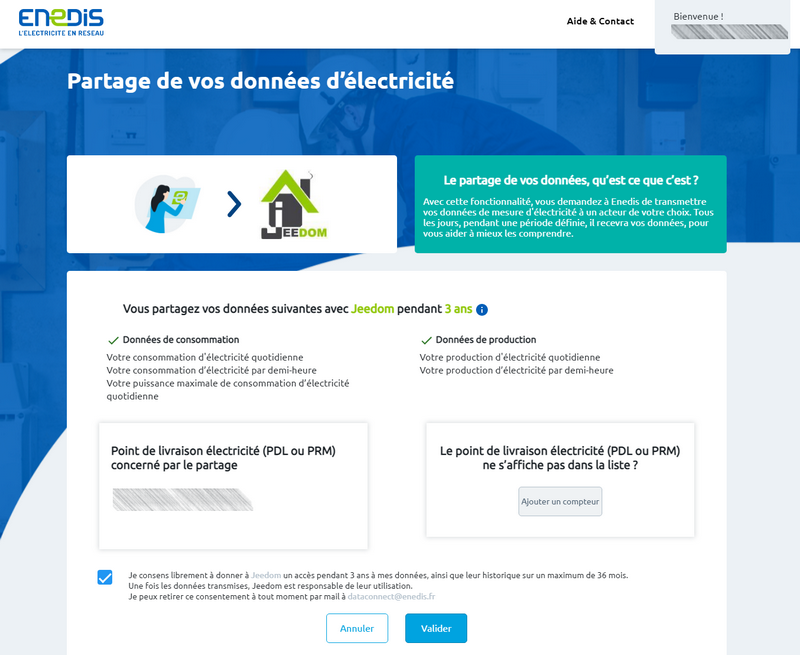

# Complemento de Enedis

Complemento que permite la recuperación de datos de consumo eléctrico de contadores inteligentes *(linky por ejemplo)* cuestionando el [cuenta cliente **Enedis**](https://mon-compte.enedis.fr/auth/XUI/#login/&realm=/enedis&forward=true){:target = "\_ en blanco"}.

>**Importante**
>
>El complemento se reescribió por completo en febrero de 2021 para usar **la API oficial de Enedis Data-Connect**. Si usó el complemento antes, lo invitamos a crear un nuevo equipo o eliminar todos los controles de un equipo anterior.

Es posible acceder a datos desde **consumo**, de **producción** oa los 2 tipos de medición directamente en un dispositivo.

Se reportan 5 datos para cada tipo de medición :
- el **consumo por hora** por media hora *(en kW)*.
- el **consumo diario** *(en kWh)*.
- el **consumo mensual** *(en kWh)*.
- el **consumo anual** *(en kWh)*.
- el **máximo poder** *(en kVA)*.

>**INFORMACIÓN**
>
>Como los datos no están disponibles en tiempo real, el complemento recupera los datos de consumo de electricidad del día anterior a cada día.

Mientras el complemento no haya recuperado todos los datos del día anterior, continúa consultando los servidores de Enedis cada 30 minutos, de lo contrario, las llamadas se suspenden hasta el día siguiente.

# Configuration

Como cualquier complemento de Jeedom, el complemento **Enedis** debe activarse después de la instalación.

## Configuración del plugin

Si aún no lo ha hecho, comience por autorizar el intercambio de datos de Enedis con Jeedom haciendo clic en el botón **Autorizar el acceso a los servidores de Enedis : Accedo a mi área de clientes de Enedis** desde la página de configuración del complemento :

A continuación, se le redirige a esta página en la que debe informar **sus datos de inicio de sesión para el mercado de Jeedom** luego haga clic en el botón **Validar** :

Redirección a la página de consentimiento de Enedis en la que es necesario **marcar la casilla** y haga clic en **Validar** :

Una vez que se valida el intercambio de datos, se muestra esta página :

>**Importante**
>
>Si no puede acceder a ninguna de estas páginas, desactive el bloqueador de anuncios del navegador.

## Configuración del equipo

Para acceder a los diferentes equipos **Enedis**, ir al menú **Complementos → Energía → Enedis**.

>**INFORMACIÓN**
>
>El botón **+ Agregar** le permite agregar un nuevo medidor / PDL.

Una vez que se haya autorizado el intercambio de datos desde la página de configuración del complemento, todo lo que tiene que hacer es ingresar **el número de identificación del Punto de Entrega** preocupado *(PDL)* y el **tipo de medida** volver.

Durante la primera copia de seguridad de un dispositivo activo y configurado, el complemento creará automáticamente los comandos necesarios e integrará los historiales disponibles en el sitio de Enedis desde el 1 de enero del año en curso. Es probable que este proceso tarde varios minutos, puede seguir el progreso desde el menú **Análisis → Registros** *(inicia sesión ``debug``)*.

>**INFORMACIÓN**
>
>Los datos de consumo por hora se recuperan durante los últimos 7 días como máximo.

Si no has activado **registrar y recopilar el consumo horario** en su cuenta Enedis, debe marcar la casilla **Datos horarios : Deshabilitar** para que no se creen los pedidos correspondientes.

# Agregar datos

Es posible integrar historias bajo demanda, hasta 3 años atrás, directamente desde el sitio de Enedis. Para hacerlo, simplemente haga clic en el botón azul **Adiciones históricas** desde la pestaña **Pedidos** de un equipo, en la columna **Acción** de la orden en cuestión :

Luego elija la fecha de inicio y haga clic en **Bueno** para iniciar el proceso.

Los datos de día, mes, año y potencia máxima se integrarán desde la fecha elegida hasta el 1 de enero del año en curso. Los datos horarios, cuando lo sean, se integrarán hasta 7 días después de la fecha elegida.

>**INFORMACIÓN**
>
>Estas limitaciones de tiempo las establece Enedis.

# Plantilla de widget

>**INFORMACIÓN**
>
>La plantilla del widget se mostrará en las versiones de escritorio y móvil.

El complemento ofrece la posibilidad de mostrar datos de consumo y / o producción en una plantilla de widget imitando la apariencia de un medidor *Linky*. El clic en el botón "**- \| +**" permite pasar del consumo a la producción para quienes tienen acceso a 2 tipos de medidas. Un indicador también le permite saber si los datos están actualizados o no *(verde = todos los datos están actualizados, naranja = algunos datos no están actualizados, rojo = no hay datos actualizados)*.

Para activar esta opción, simplemente marque la casilla **Habilitar** sección **Plantilla de widget** en la página general del equipo en cuestión. Una vez activada la plantilla del widget, vaya a la pestaña **Monitor** desde la configuración del equipo para elegir el color de fondo del widget `Plantilla' : color de fondo` *(163, 204, 40 por defecto)* y/o color de título `Plantilla : color de la barra de título` *(transparente por defecto)* dependiendo de la versión de acceso de Jeedom *(escritorio o móvil)*.

>**CONSEJO**
>
>En la versión de escritorio, la información que se muestra en el widget se adapta en tamaño al cambiar el tamaño del mosaico.

# FAQ

>**Tengo errores de `Error en enedis json return` en los registros, pero los datos son visibles en el sitio de Enedis**
>
>A veces sucede que tienes que ir directamente al sitio de Enedis para validar los últimos TyC para acceder a los datos nuevamente. A veces también es necesario reemplazar el enlace Jeedom / Enedis de la página de configuración del complemento.

>**No tengo datos de día / mes / año para el 31 de diciembre de 2021**
>
>Para recuperar estos datos simplemente haga clic en el botón **Adiciones históricas** De la orden **Día de consumo** y seleccione la fecha del 1 de enero de 2021 como fecha de salida.
